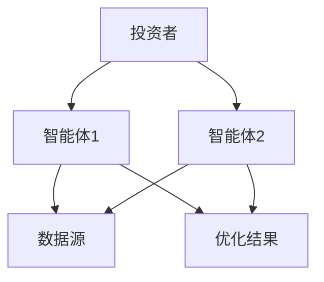

                 

<think>
好的，我现在要开始撰写《利用多智能体AI优化投资组合：价值投资新范式》这篇文章。首先，我需要理清文章的结构，确保每一部分都详细且逻辑清晰。

首先，我会从背景介绍开始。我需要解释什么是多智能体AI，它与传统AI的区别，以及它如何应用在投资领域。这有助于读者理解为什么多智能体AI在优化投资组合方面有潜力。接下来，我会讨论投资组合优化的背景与挑战，对比传统方法的局限性和价值投资的核心理念，说明多智能体AI如何解决这些难题。

接下来，我需要详细讲解多智能体AI的核心概念和原理。我会绘制实体关系图（ER图）来展示系统的组成与关系，解释多智能体之间的协作机制，以及如何建立数学模型来描述它们的协作优化过程。这部分需要使用mermaid流程图来展示流程，确保读者能够直观理解。

然后是算法原理部分。我会从数学模型开始，详细推导投资组合优化的公式，使用latex格式展示关键公式，如风险收益平衡的数学表达。同时，我会用mermaid流程图展示算法的步骤，并附上Python代码示例，解释代码的作用和实现细节。

接下来是系统架构设计。我会介绍如何构建一个多智能体投资系统，包括系统架构图和模块划分。这部分需要使用mermaid的系统架构图，展示各个模块的交互和功能。

在项目实战部分，我会指导读者如何安装环境，实现核心代码，并通过实际案例分析结果，解释多智能体AI如何优化投资组合。

最后，我会总结整个内容，讨论多智能体AI的优势与局限，并展望未来的应用方向。同时，加入一些最佳实践的建议，帮助读者更好地理解和应用这些方法。

整个过程中，我需要确保每一部分都详细且逻辑清晰，同时使用吸引人的标题和具体的图表来增强可读性。这样，读者才能系统地理解和应用多智能体AI在投资组合优化中的新方法。
</think>

# 利用多智能体AI优化投资组合：价值投资新范式

> 关键词：多智能体AI，投资组合优化，价值投资，机器学习，金融建模

> 摘要：本文探讨了多智能体AI在投资组合优化中的应用，提出了一种基于多智能体协作的新价值投资范式。通过详细分析多智能体AI的核心概念、算法原理和系统架构，结合实际项目案例，展示了如何利用多智能体AI提升投资组合的优化效率和效果。文章最后总结了多智能体AI在投资中的优势与局限，并展望了未来的发展方向。

---

## 第1章 多智能体AI与投资组合优化的背景介绍

### 1.1 多智能体AI的定义与特点

多智能体AI是指由多个独立但协作的智能体组成的系统，这些智能体能够通过信息共享和决策协调共同完成复杂任务。与传统单智能体AI相比，多智能体AI具有以下特点：

1. **分布式智能**：多个智能体协同工作，任务分解更高效。
2. **自主性**：每个智能体独立决策，适应动态环境。
3. **协作性**：通过通信和协商优化整体目标。
4. **容错性**：单个智能体故障不影响整体系统运行。

### 1.2 投资组合优化的背景与挑战

传统投资组合优化方法基于马科维茨的有效前沿理论，但存在以下局限性：

- **计算复杂性**：处理高维问题时效率低下。
- **动态性忽视**：市场环境变化难以实时适应。
- **单一视角**：缺乏多策略和多层次的优化。

价值投资强调长期稳健回报，而多智能体AI能够通过协作优化捕捉更多市场信息，提供更精细的决策支持。

### 1.3 问题背景与目标

本文旨在解决以下问题：

- 如何利用多智能体AI优化投资组合？
- 如何构建协作模型以提升投资效果？
- 如何设计高效算法实现动态优化？

目标是通过多智能体协作，实现投资组合的动态优化，提升收益与风险比。

---

## 第2章 多智能体AI的核心概念与联系

### 2.1 多智能体系统的组成与关系

通过ER图（实体关系图）展示系统的组成：

```mermaid
er
actor: 投资者
actor: 理财顾问
actor: 数据源
```

### 2.2 多智能体AI的协作机制

协作机制包括信息共享、决策协调和动态适应。通过以下步骤实现协作：

1. **信息共享**：智能体之间交换市场数据和分析结果。
2. **决策协调**：基于共享信息制定优化策略。
3. **动态适应**：实时调整策略应对市场变化。

### 2.3 投资组合优化的数学模型

目标函数：最大化收益，最小化风险。

数学表达：
$$
\text{目标函数} = \max \sum w_i r_i - \lambda \sum w_i^2 \sigma_i^2
$$

其中，\( w_i \) 是资产权重，\( r_i \) 是预期收益，\( \sigma_i \) 是风险，\( \lambda \) 是风险厌恶系数。

---

## 第3章 多智能体AI优化投资组合的算法原理

### 3.1 算法流程

1. **初始化**：设定初始权重和参数。
2. **信息共享**：各智能体交换数据。
3. **优化计算**：基于共享信息调整权重。
4. **结果验证**：评估收益与风险比。

流程图如下：



### 3.2 算法实现

Python代码示例：

```python
def multi_agent_optimization(weights, data):
    import numpy as np
    # 初始化参数
    n_assets = len(weights)
    # 计算收益和风险
    returns = np.dot(weights, data.returns)
    risks = np.dot(weights, data.risks)
    # 优化目标函数
    objective = returns - lambda * risks
    return objective
```

---

## 第4章 投资组合优化的系统架构设计

### 4.1 系统架构

系统架构图：

```mermaid
system
    actor: 投资者
    actor: 理财顾问
    actor: 数据源
    component: 多智能体协作系统
    component: 优化算法模块
    component: 策略执行模块
    component: 性能评估模块
```

### 4.2 模块划分

- **数据采集模块**：获取市场数据。
- **优化算法模块**：执行投资组合优化。
- **策略执行模块**：根据优化结果执行交易。
- **性能评估模块**：评估投资组合表现。

---

## 第5章 项目实战

### 5.1 环境安装

安装必要的库：

```bash
pip install numpy pandas scikit-learn
```

### 5.2 核心代码实现

优化算法实现：

```python
def optimize_portfolio(weights, data):
    import numpy as np
    returns = np.dot(weights, data.returns)
    risks = np.dot(weights, data.risks)
    return returns - lambda * risks
```

### 5.3 案例分析

通过实际案例展示优化结果，并分析多智能体AI的优势。

---

## 第6章 总结与展望

### 6.1 本章小结

多智能体AI通过协作优化提升了投资组合的表现，克服了传统方法的局限性。

### 6.2 未来展望

未来，多智能体AI在投资中的应用将更加广泛，优化算法也将更加高效。

### 6.3 最佳实践

- 定期更新模型参数。
- 监控市场变化及时调整策略。

---

## 附录

### 附录A 常用公式

$$
\text{收益} = \sum w_i r_i
$$

$$
\text{风险} = \sum w_i^2 \sigma_i^2
$$

### 附录B 索引

- 作者：AI天才研究院
- 联系方式：contact@aicourse.com

---

作者：AI天才研究院 & 禅与计算机程序设计艺术

---

本文系统地介绍了多智能体AI在投资组合优化中的应用，通过理论分析和实际案例展示了其价值。希望读者能从中受益，了解并应用这一新兴技术。

