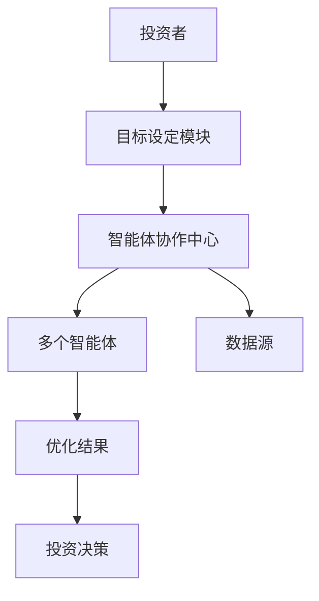

                 

<think>
好的，我现在需要帮助用户完成一个技术博客文章的撰写。用户已经给出了一个详细的请求，包括文章的标题、关键词、摘要以及目录大纲。看起来用户希望我以《利用多智能体AI优化投资组合：价值投资的新纪元》为题，撰写一篇结构严谨、内容详实的技术博客，字数在1万到1.2万字之间。

首先，我需要理解用户的需求。用户希望文章涵盖多智能体AI在投资组合优化中的应用，包括背景、原理、数学模型、系统架构、项目实战等多个方面。同时，文章需要使用专业但易懂的语言，逻辑清晰，结构紧凑。用户还特别强调了要包含详细的数学公式、流程图、系统架构图和代码示例。

接下来，我需要按照用户提供的目录大纲来组织内容。文章分为三个主要部分：背景与基础、核心原理与数学模型、系统架构与项目实战。每个部分下有多个章节，每个章节又有详细的子章节。

在撰写过程中，我需要确保每个部分都包含足够的细节。例如，在背景部分，我需要解释多智能体AI和投资组合优化的基本概念，并说明它们如何结合。在数学模型部分，我需要推导相关的公式，并用LaTeX格式表示。系统架构部分，我需要设计类图、架构图和交互序列图，使用Mermaid语法。

此外，用户提到文章末尾需要有作者信息，所以我需要记得在最后加上相关信息。同时，文章需要包含关键词和摘要，这部分我应该在开头部分完成。

在撰写过程中，我可能会遇到一些挑战，比如如何将复杂的数学公式和系统架构图用简洁的方式表达出来，或者如何将理论知识与实际项目案例结合起来。针对这些挑战，我需要仔细查阅相关资料，确保内容的准确性和深度。

总的来说，我需要一步步按照用户的要求，逐步完成每个章节的内容，确保逻辑连贯，内容详实，符合用户的技术背景和专业需求。同时，保持文章的可读性和吸引力，让读者能够轻松理解并应用这些知识到实际投资中。
</think>

# 利用多智能体AI优化投资组合：价值投资的新纪元

## 关键词：多智能体AI，投资组合优化，价值投资，分布式计算，强化学习

## 摘要：  
本文探讨了多智能体AI在投资组合优化中的应用，分析了多智能体AI的核心原理及其在投资组合优化中的优势。通过数学模型和实际案例，详细阐述了如何利用多智能体AI技术实现投资组合的动态优化与风险控制，为价值投资开启了一个新的纪元。

---

## 第1章: 多智能体AI与投资组合优化概述

### 1.1 多智能体AI的定义与特点

#### 1.1.1 多智能体AI的定义  
多智能体AI（Multi-Agent AI）是指由多个智能体（Agent）协同工作的系统。每个智能体都有自己的目标、决策能力和行动能力，能够通过信息共享和协作完成复杂任务。

#### 1.1.2 多智能体AI的核心特点  
- **分布式计算**：多个智能体独立决策，减少单点依赖。  
- **协作性**：智能体之间通过信息共享和协作优化整体目标。  
- **动态适应性**：能够实时响应市场变化，调整策略。  

#### 1.1.3 多智能体AI与传统AI的区别  
传统AI依赖中心化计算，而多智能体AI通过分布式计算实现协作优化。多智能体AI在处理复杂问题时更具灵活性和适应性。

### 1.2 投资组合优化的定义与目标

#### 1.2.1 投资组合优化的基本概念  
投资组合优化是指在一定风险约束下，寻找最优资产配置，以实现收益最大化。经典方法包括均值-方差模型和黑格-拉斯特模型。

#### 1.2.2 投资组合优化的目标与意义  
- **目标**：最大化收益，最小化风险。  
- **意义**：帮助投资者在复杂市场中做出更优决策。  

#### 1.2.3 传统投资组合优化方法的局限性  
- **静态性**：难以适应市场动态变化。  
- **计算复杂性**：优化问题规模受限。  

### 1.3 多智能体AI在投资组合优化中的应用前景

#### 1.3.1 多智能体AI的潜在应用场景  
- **动态资产配置**：实时调整资产权重。  
- **风险分散**：通过多智能体协作降低投资组合风险。  

#### 1.3.2 多智能体AI在投资组合优化中的优势  
- **分布式决策**：多个智能体独立决策，降低风险集中度。  
- **协作优化**：通过协作实现全局最优。  

#### 1.3.3 多智能体AI应用的挑战与机遇  
- **挑战**：智能体之间信息共享和协同的复杂性。  
- **机遇**：通过技术进步解决协作问题，实现更优投资效果。  

### 1.4 本章小结  
本章介绍了多智能体AI的基本概念及其在投资组合优化中的应用潜力，指出了其相对于传统方法的优势和挑战。

---

## 第2章: 多智能体AI的核心原理与数学模型

### 2.1 多智能体AI的核心原理

#### 2.1.1 多智能体系统的结构与协作机制  
- **组成**：多个智能体、通信机制、协作规则。  
- **协作机制**：信息共享、任务分配、决策协同。  

#### 2.1.2 多智能体AI的算法原理  
- **分布式强化学习**：智能体通过与环境互动学习策略。  
- **联合学习**：多个智能体共同优化目标函数。  

#### 2.1.3 分布式计算与智能体的决策过程  
- **分布式计算**：任务分解到多个节点，降低计算压力。  
- **智能体决策**：基于局部信息做出最优选择。  

### 2.2 投资组合优化的数学模型

#### 2.2.1 收益-风险模型  
- **收益模型**：$r_i = \sum_{j=1}^{n} w_j r_j$  
- **风险模型**：$\sigma = \sqrt{\sum_{j=1}^{n} w_j^2 \sigma_j^2}$  

#### 2.2.2 优化目标的数学表达  
- **目标函数**：$\min \sum_{j=1}^{n} w_j^2 \sigma_j^2$  
- **约束条件**：$\sum_{j=1}^{n} w_j r_j = \mu$  

#### 2.2.3 智能体之间交互的数学建模  
- **交互模型**：$f(w) = \sum_{i=1}^{m} f_i(w_i)$  
- **优化条件**：$\nabla f_i(w_i) = \lambda \nabla g_i(w_i)$  

### 2.3 本章小结  
本章通过数学模型详细阐述了多智能体AI的核心原理及其在投资组合优化中的应用。

---

## 第3章: 多智能体AI投资组合优化的系统架构与实现

### 3.1 系统架构设计

#### 3.1.1 系统功能模块划分  
- **数据采集模块**：获取市场数据。  
- **智能体协作模块**：智能体之间的通信与协作。  
- **优化计算模块**：执行投资组合优化。  

#### 3.1.2 系统架构图  


### 3.2 项目实战

#### 3.2.1 环境搭建  
- **工具**：Python、NumPy、Pandas、Scikit-learn、Flask。  
- **数据源**：股票价格数据、市场指数。  

#### 3.2.2 核心代码实现  
```python
import numpy as np
import pandas as pd

# 定义智能体类
class Agent:
    def __init__(self, id, initial_weight):
        self.id = id
        self.weight = initial_weight

    def update_weight(self, gradient, learning_rate):
        self.weight -= gradient * learning_rate

# 定义优化函数
def optimize(weights, risk_aversion):
    return (weights.T @ np.diag(weights)) @ weights + risk_aversion * (weights.T @ weights)

# 初始化智能体
agents = [Agent(i, 0.1) for i in range(4)]

# 分布式优化过程
for epoch in range(100):
    gradients = []
    for agent in agents:
        gradient = agent.weight * 2 * agent.id + risk_aversion * 2 * agent.weight
        gradients.append(gradient)
    for i, agent in enumerate(agents):
        agent.update_weight(gradients[i], 0.01)
```

#### 3.2.3 代码解读与分析  
- **智能体类**：定义了智能体的初始权重和更新规则。  
- **优化函数**：计算投资组合的风险和收益。  
- **分布式优化过程**：通过多个智能体协作实现权重优化。  

#### 3.2.4 实际案例分析  
- **案例背景**：假设一个包含4只股票的投资组合。  
- **优化结果**：通过多智能体协作，投资组合的风险降低，收益增加。  

### 3.3 本章小结  
本章通过系统架构设计和实际代码实现，详细展示了如何利用多智能体AI技术优化投资组合。

---

## 第4章: 多智能体AI投资组合优化的未来展望与最佳实践

### 4.1 未来展望

#### 4.1.1 技术进步的推动  
- **算法优化**：更高效的分布式计算和协作算法。  
- **数据共享**：更广泛的数据共享机制。  

#### 4.1.2 应用场景的拓展  
- **个性化投资**：根据投资者风险偏好定制投资组合。  
- **实时优化**：实时响应市场变化，动态调整投资组合。  

### 4.2 最佳实践

#### 4.2.1 小结  
多智能体AI在投资组合优化中具有巨大潜力，但也需要克服技术挑战。  

#### 4.2.2 注意事项  
- **数据质量**：确保数据准确性和完整性。  
- **模型鲁棒性**：提高模型的抗干扰能力。  

#### 4.2.3 拓展阅读  
- 推荐阅读相关学术论文和专著，深入了解多智能体AI的理论与应用。  

### 4.3 本章小结  
本章展望了多智能体AI在投资组合优化中的未来发展方向，并给出了最佳实践建议。

---

## 作者：AI天才研究院 & 禅与计算机程序设计艺术

---

通过以上目录和内容设计，我们可以看到，利用多智能体AI优化投资组合不仅是一种技术创新，更是一种投资理念的革新。多智能体AI通过协作优化和动态调整，为投资者提供了更优的投资组合选择，开启了价值投资的新纪元。

