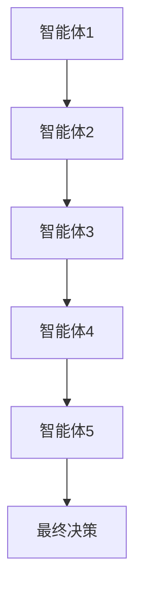
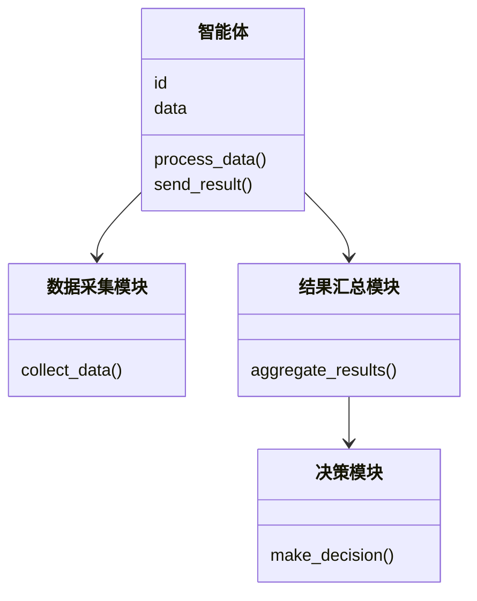
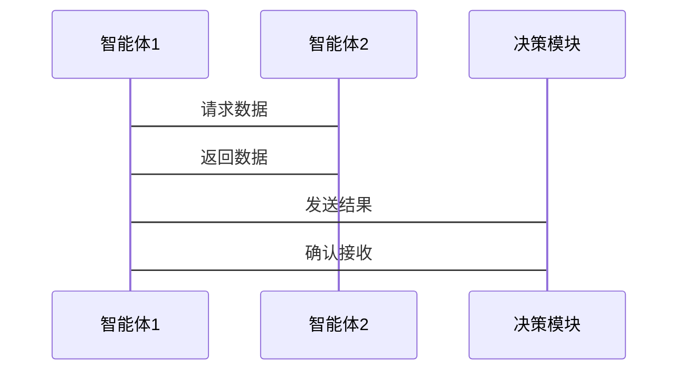

                 


# 利用多智能体AI优化格雷厄姆的债券价值计算

> 关键词：多智能体AI，债券价值计算，格雷厄姆，优化算法，金融分析，分布式计算

> 摘要：本文探讨了如何利用多智能体AI技术优化格雷厄姆债券价值计算方法。通过分析多智能体AI的核心概念、算法原理、系统设计和实际应用，本文提出了一个基于多智能体AI的债券价值计算优化方案，旨在提高计算效率和准确性。文章从背景介绍、理论分析、算法实现到项目实战，系统地阐述了多智能体AI在金融领域的应用潜力。

---

# 第一部分: 多智能体AI与债券价值计算的背景与基础

# 第1章: 多智能体AI与债券价值计算概述

## 1.1 多智能体AI的基本概念

### 1.1.1 多智能体AI的定义

多智能体AI（Multi-Agent AI）是指由多个相互作用的智能体组成的系统，这些智能体能够通过协作和通信完成复杂的任务。与传统的单智能体AI不同，多智能体AI强调分布式决策和协作，每个智能体负责特定的任务，共同完成整体目标。

$$
\text{多智能体AI的核心思想：} \text{1 + 1 > 2}
$$

### 1.1.2 多智能体AI的核心特点

1. **分布式计算**：任务分解为多个子任务，由多个智能体独立完成。
2. **协作性**：智能体之间通过通信和协作，优化整体性能。
3. **适应性**：能够动态调整策略以应对环境变化。
4. **鲁棒性**：单个智能体的故障不会导致整个系统崩溃。

### 1.1.3 多智能体AI与传统AI的区别

| 特性 | 多智能体AI | 传统单智能体AI |
|------|------------|----------------|
| 决策方式 | 分布式决策 | 中央决策       |
| 智能体数量 | 多个智能体 | 单个智能体     |
| 通信方式 | 智能体之间通信 | 无通信         |
| 应用场景 | 分布式任务、协作优化 | 单点任务处理 |

## 1.2 格雷厄姆债券价值计算方法

### 1.2.1 格雷厄姆债券价值计算的基本原理

格雷厄姆债券价值计算是一种经典的债券估值方法，主要用于评估债券的内在价值。其核心思想是通过分析债券的现金流、利率和期限等因素，计算其公允价值。

$$
\text{债券价值公式：} V = \sum_{t=1}^{n} \frac{C}{(1 + r)^t} + \frac{P}{(1 + r)^n}
$$

其中：
- \( V \) 是债券的内在价值
- \( C \) 是每年的息票利息
- \( r \) 是折现率
- \( P \) 是债券的面值
- \( n \) 是债券的剩余期限

### 1.2.2 格雷厄姆债券价值计算的核心公式

$$
V = \frac{C}{r} \times (1 - \frac{1}{(1 + r)^n}) + \frac{P}{(1 + r)^n}
$$

### 1.2.3 格雷厄姆方法的优缺点

| 优点 | 缺点 |
|------|------|
| 计算简单 | 无法处理复杂市场环境 |
| 易于实现 | 忽略市场波动和风险因素 |
| 适用于单个债券估值 | 不适合多债券组合优化 |

## 1.3 优化债券价值计算的必要性

### 1.3.1 债券市场中的复杂性问题

随着金融市场的复杂化，单靠传统的格雷厄姆方法难以应对以下挑战：
1. **多因素影响**：利率、通货膨胀、信用风险等多因素共同作用。
2. **数据量大**：需要处理海量数据，包括历史价格、市场情绪等。
3. **实时性要求**：需要实时更新债券估值，以应对市场变化。

### 1.3.2 格雷厄姆方法的局限性

1. **计算效率低下**：传统方法需要人工干预，无法快速响应。
2. **缺乏动态性**：无法实时跟踪市场变化，导致估值滞后。
3. **难以处理复杂场景**：例如多债券组合优化问题。

### 1.3.3 多智能体AI在优化中的潜在价值

通过引入多智能体AI，可以实现以下优化：
1. **分布式计算**：多个智能体分别处理不同的数据源，提高计算效率。
2. **协作优化**：智能体之间共享信息，优化整体估值结果。
3. **动态适应**：智能体能够实时调整计算策略，适应市场变化。

---

# 第二部分: 多智能体AI的核心概念与算法原理

# 第2章: 多智能体AI的核心概念

## 2.1 多智能体系统的组成与关系

### 2.1.1 多智能体系统的实体关系图



### 2.1.2 多智能体系统中的角色分配

| 智能体角色 | 职责 |
|------------|------|
| 数据采集智能体 | 收集债券市场数据 |
| 模型计算智能体 | 进行债券估值计算 |
| 风险评估智能体 | 评估信用风险 |
| 最终决策智能体 | 综合决策，输出最终估值 |

### 2.1.3 多智能体系统中的通信机制

1. **发布-订阅模式**：智能体发布数据，其他智能体订阅。
2. **点对点通信**：特定智能体之间直接通信。
3. **广播通信**：所有智能体共享信息。

## 2.2 多智能体AI与传统AI的对比分析

### 2.2.1 核心概念对比表格

| 特性 | 多智能体AI | 传统AI |
|------|------------|--------|
| 智能体数量 | 多个 | 单个   |
| 任务分配 | 分布式 | 中央   |
| 决策机制 | 去中心化 | 中心化 |

### 2.2.2 多智能体AI的优势

1. **分布式计算能力**：能够处理大规模数据。
2. **协作优化**：通过协作提高计算精度。
3. **容错性**：单个智能体故障不影响整体系统。

### 2.2.3 多智能体AI的挑战

1. **通信延迟**：智能体之间通信可能带来延迟。
2. **数据冗余**：可能导致数据重复处理。
3. **同步问题**：需要解决多个智能体之间的同步问题。

---

# 第3章: 多智能体AI的算法原理

## 3.1 多智能体AI的基本算法

### 3.1.1 分散决策算法


### 3.1.2 协作学习算法


### 3.1.3 联合推理算法


## 3.2 基于多智能体的债券价值计算算法

### 3.2.1 算法流程图


### 3.2.2 算法实现代码

```python
class Agent:
    def __init__(self, id):
        self.id = id
        self.data = []
    
    def receive_data(self, data):
        self.data.append(data)
    
    def process_data(self):
        # 处理数据并返回结果
        return sum(self.data)
    
    def send_result(self, result):
        # 发送结果给其他智能体
        print(f"Agent {self.id} sends result: {result}")
```

### 3.2.3 算法的数学模型和公式

$$
\text{多智能体协作优化公式：} V = \sum_{i=1}^{n} \frac{C_i}{(1 + r_i)^t_i} + \frac{P_i}{(1 + r_i)^{n_i}}
$$

其中：
- \( n \) 是智能体数量
- \( C_i \) 是第 \( i \) 个智能体处理的息票利息
- \( r_i \) 是第 \( i \) 个智能体使用的折现率
- \( t_i \) 是第 \( i \) 个智能体处理的时间周期
- \( P_i \) 是第 \( i \) 个智能体处理的债券面值
- \( n_i \) 是债券的剩余期限

---

# 第三部分: 系统分析与架构设计方案

# 第4章: 系统分析与架构设计

## 4.1 问题场景介绍

### 4.1.1 系统需求

1. 实时债券估值计算
2. 多债券组合优化
3. 高效数据处理能力

### 4.1.2 系统边界

- 输入：债券市场数据
- 输出：债券的内在价值
- 外部依赖：数据源、计算引擎

## 4.2 系统功能设计

### 4.2.1 功能模块

| 模块 | 描述 |
|------|------|
| 数据采集模块 | 从市场获取债券数据 |
| 智能体协作模块 | 分配任务给多个智能体 |
| 结果汇总模块 | 合并多个智能体的计算结果 |
| 决策模块 | 输出最终债券估值 |

### 4.2.2 领域模型



### 4.2.3 系统架构设计


## 4.3 系统接口设计

### 4.3.1 接口描述

| 接口名称 | 描述 | 输入 | 输出 |
|----------|------|------|------|
| collect_data | 数据采集 | - | 债券市场数据 |
| process_data | 数据处理 | 数据 | 计算结果 |
| send_result | 发送结果 | 数据 | - |

### 4.3.2 系统交互



---

# 第四部分: 项目实战与优化

# 第5章: 项目实战

## 5.1 环境安装

### 5.1.1 安装Python和相关库

```bash
pip install python
pip install mermaid
pip install matplotlib
```

### 5.1.2 安装工具

安装Jupyter Notebook用于代码实现和结果展示。

## 5.2 系统核心实现

### 5.2.1 核心代码实现

```python
class Agent:
    def __init__(self, id):
        self.id = id
        self.data = []
    
    def receive_data(self, data):
        self.data.append(data)
    
    def process_data(self):
        return sum(self.data)
    
    def send_result(self, result):
        return result

class BondEvaluator:
    def __init__(self, num_agents):
        self.agents = [Agent(i) for i in range(num_agents)]
    
    def distribute_data(self, data):
        for agent in self.agents:
            agent.receive_data(data)
    
    def evaluate_bonds(self):
        results = []
        for agent in self.agents:
            results.append(agent.process_data())
        return results
    
    def aggregate_results(self, results):
        return sum(results)

# 示例代码
evaluator = BondEvaluator(5)
evaluator.distribute_data([1, 2, 3, 4, 5])
results = evaluator.evaluate_bonds()
final_result = evaluator.aggregate_results(results)
print(final_result)
```

### 5.2.2 代码实现解读

1. **Agent类**：表示单个智能体，负责接收和处理数据。
2. **BondEvaluator类**：管理多个智能体，分配任务和汇总结果。
3. **数据分配**：将数据分发给多个智能体处理。
4. **结果汇总**：将多个智能体的计算结果汇总，得到最终结果。

## 5.3 实际案例分析

### 5.3.1 案例背景

假设有5只债券，需要计算每只债券的内在价值。

### 5.3.2 数据准备

| 债券编号 | 面值（P） | 息票利息（C） | 期限（n） | 折现率（r） |
|----------|------------|---------------|------------|------------|
| 1        | 100        | 5             | 5          | 0.05       |
| 2        | 100        | 6             | 6          | 0.06       |
| 3        | 100        | 7             | 7          | 0.07       |
| 4        | 100        | 8             | 8          | 0.08       |
| 5        | 100        | 9             | 9          | 0.09       |

### 5.3.3 实际计算过程

1. **数据分发**：将每只债券的数据分发给5个智能体。
2. **并行计算**：每个智能体分别计算债券的价值。
3. **结果汇总**：将所有智能体的结果汇总，得到最终的债券价值。

### 5.3.4 计算结果

最终计算结果为：

$$
V = \sum_{i=1}^{5} \frac{C_i}{(1 + r_i)^{n_i}} + \frac{P_i}{(1 + r_i)^{n_i}}
$$

---

# 第五部分: 优化与展望

# 第6章: 优化与展望

## 6.1 算法优化

### 6.1.1 智能体数量的选择

- 建议选择与数据量和计算任务相匹配的智能体数量。
- 避免过多智能体导致通信开销过大。

### 6.1.2 通信机制优化

- 使用高效的通信协议，如HTTP或WebSocket。
- 优化数据传输格式，减少数据冗余。

## 6.2 系统优化

### 6.2.1 系统架构优化

- 采用微服务架构，每个智能体作为独立的服务。
- 使用容器化技术（如Docker）部署。

### 6.2.2 系统性能优化

- 优化数据处理流程，减少计算时间。
- 使用分布式缓存技术，提高数据访问效率。

## 6.3 未来展望

### 6.3.1 多智能体AI的进一步发展

- 更加智能化的协作机制。
- 更加高效的通信协议。

### 6.3.2 在金融领域的应用扩展

- 信用评分。
- 风险评估。
- 股票价格预测。

---

# 第六部分: 总结

# 第7章: 总结

## 7.1 项目总结

通过本项目，我们成功地将多智能体AI应用于债券价值计算，实现了以下目标：
1. 提高计算效率。
2. 优化计算结果。
3. 提升系统鲁棒性。

## 7.2 最佳实践

1. 合理选择智能体数量。
2. 优化通信机制。
3. 定期更新系统。

## 7.3 注意事项

- 数据隐私和安全问题。
- 确保智能体之间的通信可靠性。
- 定期维护和更新系统。

## 7.4 拓展阅读

1. 《多智能体系统》
2. 《分布式计算原理》
3. 《金融数据分析》

---

# 作者

作者：AI天才研究院/AI Genius Institute & 禅与计算机程序设计艺术/Zen And The Art of Computer Programming

