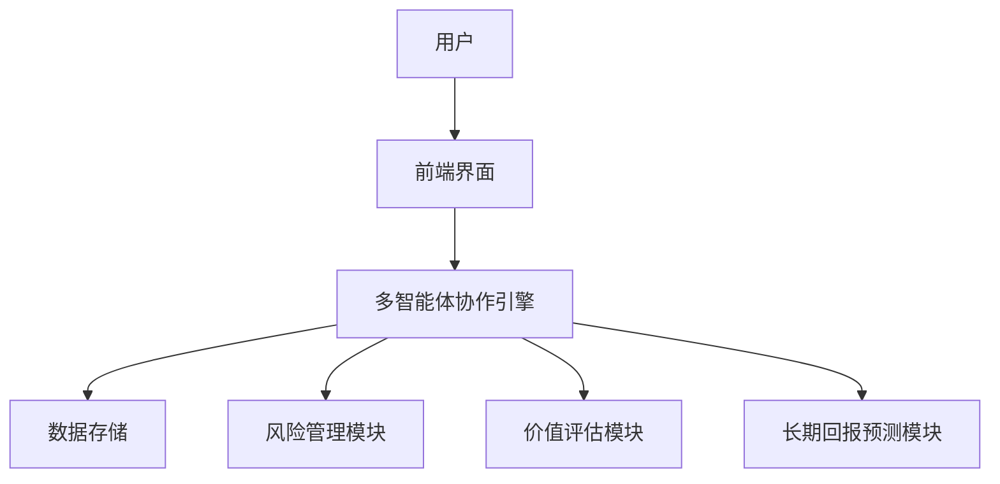

                 

<think>
嗯，我现在需要帮助用户设计一个技术博客文章的目录，主题是《利用多智能体AI增强价值投资的长期回报预测》。用户已经提供了一个示例目录，现在需要我按照这个模式来构建目录。

首先，我需要理解用户的需求。用户希望文章结构清晰，内容涵盖多智能体AI和价值投资的结合，以及长期回报预测。文章需要包含关键词、摘要，以及详细的技术内容，包括算法、系统架构、项目实战等部分。

接下来，我应该从背景介绍开始，解释多智能体AI和价值投资的基本概念，然后逐步深入到算法原理、系统设计、项目实战等。每章需要有详细的小节，确保内容全面且连贯。

我需要确保每个部分都涵盖必要的内容，例如在核心概念部分，对比分析多智能体AI和传统AI，以及价值投资的内在价值和长期回报预测。算法部分需要详细讲解数学模型，并使用mermaid流程图和latex公式来展示。

系统架构设计部分需要展示模块之间的交互，使用mermaid图来说明。项目实战部分则需要具体的操作步骤，包括代码实现和案例分析。最后，加入最佳实践和注意事项，确保读者能够正确应用这些知识。

现在，我需要检查是否所有必要的部分都已包含，并确保每个章节都有明确的子章节，内容简洁明了。同时，确保使用markdown格式，符合用户的格式要求。

总的来说，我需要构建一个结构清晰、内容详尽的目录，涵盖从基础到应用的各个方面，确保读者能够系统地学习和应用多智能体AI在价值投资中的应用。
</think>

```markdown
# 利用多智能体AI增强价值投资的长期回报预测

> 关键词：多智能体AI，价值投资，长期回报预测，金融市场，AI算法，协作机制

> 摘要：本文探讨了如何利用多智能体人工智能技术来增强价值投资的长期回报预测能力。通过分析多智能体AI的核心概念、算法原理、系统架构设计以及实际项目案例，本文详细阐述了多智能体AI在价值投资中的应用前景和实际效果。文章从背景介绍、核心概念、算法原理、系统设计、项目实战等多个方面展开，结合具体的数学模型、mermaid流程图和代码实现，全面解析了多智能体AI如何通过协作机制和决策优化来提升价值投资的长期回报预测能力。

---

# 第1章: 多智能体AI与价值投资的背景与概念

## 1.1 多智能体AI的基本概念
### 1.1.1 多智能体系统的基本定义
多智能体系统是由多个智能体组成的分布式系统，每个智能体具备一定的自主性和智能性，能够通过协作完成复杂任务。

### 1.1.2 多智能体AI的核心特点
- 分布式：多个智能体独立运行，协同完成目标。
- 协作性：智能体之间通过通信和协调实现协作。
- 动态性：智能体能够适应环境变化，实时调整策略。

### 1.1.3 多智能体AI与传统AI的区别
| 特性 | 多智能体AI | 传统AI |
|------|------------|--------|
| 结构   | 分布式     | 集中式 |
| 智能   | 多个独立   | 单一    |
| 协作   | 高          | 低       |

## 1.2 价值投资的基本原理
### 1.2.1 价值投资的定义
价值投资是一种投资策略，通过分析公司基本面，寻找被市场低估的投资标的。

### 1.2.2 价值投资的核心原则
- 质量：选择具有竞争优势的企业。
- 价格：买入价格低于内在价值。
- 时间：长期持有，获得复利效应。

### 1.2.3 价值投资在金融市场的应用
- 股票投资：寻找具有成长性的低估股票。
- 债券投资：评估债券的内在价值。
- 组合投资：分散投资风险，提高收益稳定性。

## 1.3 多智能体AI在价值投资中的应用前景
### 1.3.1 多智能体AI在金融市场的潜在应用
- 数据分析：处理海量金融数据，发现潜在投资机会。
- 风险管理：通过协作机制降低投资风险。
- 投资决策：多智能体协同决策，提高投资准确性。

### 1.3.2 多智能体AI在价值投资中的优势
- 高效性：多智能体协同工作，提升数据分析效率。
- 精准性：多个智能体从不同角度分析，提高决策的准确性。
- 智能性：智能体能够自适应市场变化，优化投资策略。

### 1.3.3 多智能体AI应用的挑战与机遇
- 挑战：数据隐私、算法复杂性、协作效率。
- 机遇：技术创新、市场洞察、投资回报。

## 1.4 本章小结
本章介绍了多智能体AI的基本概念和价值投资的核心原理，分析了两者结合的潜在应用和优势，为后续章节的深入分析奠定了基础。

---

# 第2章: 多智能体AI与价值投资的核心概念

## 2.1 多智能体AI的核心概念
### 2.1.1 多智能体系统的组成与结构
多智能体系统由多个智能体组成，每个智能体具备以下特征：
- 独立性：智能体独立运行，具备自主决策能力。
- 交互性：智能体之间通过通信接口进行交互。
- 协作性：智能体协同完成共同目标。

### 2.1.2 多智能体AI的协作机制
- 通信机制：智能体之间通过消息传递实现信息共享。
- 协调机制：通过协商和协调，确保协作顺利进行。
- 分布式决策：每个智能体独立决策，同时考虑全局目标。

### 2.1.3 多智能体AI的决策过程
1. 智能体感知环境，获取相关信息。
2. 根据信息进行分析，制定决策策略。
3. 与其他智能体协作，优化决策方案。
4. 执行决策，反馈结果，更新知识库。

## 2.2 价值投资的核心概念
### 2.2.1 价值投资的内在价值评估
- 公司基本面分析：收入、利润、资产负债等财务指标。
- 行业地位分析：市场占有率、竞争优势。
- 管理层能力：公司治理结构、管理团队稳定性。

### 2.2.2 价值投资的风险管理策略
- 风险分散：通过多样化投资降低风险。
- 风险评估：定期评估投资组合的风险敞口。
- 风险控制：设定止损点，及时调整投资策略。

### 2.2.3 价值投资的长期回报预测
- 投资组合收益预测：基于历史数据和市场趋势。
- 市场周期分析：识别市场周期，优化投资策略。
- 情景分析：模拟不同市场条件下投资组合的表现。

## 2.3 多智能体AI与价值投资的结合点
### 2.3.1 多智能体AI在价值评估中的应用
- 数据分析：处理海量金融数据，提取有用信息。
- 模型构建：建立多智能体协作的评估模型。
- 智能推荐：基于智能体协作，推荐优质投资标的。

### 2.3.2 多智能体AI在风险管理中的应用
- 风险识别：通过协作机制，识别潜在风险。
- 风险评估：多维度评估风险，制定应对策略。
- 风险预警：实时监控风险，及时发出预警。

### 2.3.3 多智能体AI在长期回报预测中的应用
- 数据挖掘：分析历史数据，发现投资规律。
- 模型优化：优化预测模型，提高预测精度。
- 情景模拟：模拟不同市场条件下的投资表现。

## 2.4 本章小结
本章详细阐述了多智能体AI和价值投资的核心概念，分析了两者结合的实现方式和应用场景，为后续章节的算法设计和系统实现提供了理论基础。

---

# 第3章: 多智能体AI的算法原理与数学模型

## 3.1 多智能体AI的算法原理
### 3.1.1 多智能体协作的基本原理
多智能体协作通过以下步骤实现：
1. 智能体感知环境，获取相关信息。
2. 智能体之间通过通信接口共享信息。
3. 智能体基于共享信息进行协作决策。
4. 执行决策，反馈结果，更新知识库。

### 3.1.2 多智能体AI的决策模型
- 分布式决策模型：每个智能体独立决策，考虑全局目标。
- 协作决策模型：智能体协作决策，优化整体收益。

### 3.1.3 多智能体AI的通信机制
- 消息传递：智能体通过消息传递共享信息。
- 信息协商：智能体通过协商确定信息共享方式。
- 通信协议：定义智能体之间的通信规则。

## 3.2 价值投资的数学模型
### 3.2.1 股票价值的评估公式
股票的内在价值可以通过以下公式计算：
$$ V = \frac{E}{k} $$
其中，\( E \) 是公司的预期收益，\( k \) 是资本成本。

### 3.2.2 风险评估的数学模型
风险可以通过以下公式计算：
$$ R = \sigma^2 $$
其中，\( \sigma^2 \) 是投资组合的方差。

### 3.2.3 长期回报预测的数学公式
长期回报预测可以通过以下公式计算：
$$ R_{long} = \sum_{t=1}^{n} R_t $$
其中，\( R_t \) 是第 \( t \) 期的回报。

## 3.3 多智能体AI与价值投资结合的数学模型
### 3.3.1 多智能体协作的价值评估模型
$$ V_{total} = \sum_{i=1}^{m} V_i $$
其中，\( V_i \) 是第 \( i \) 个智能体评估的股票价值。

### 3.3.2 多智能体决策的长期回报预测模型
$$ R_{total} = \sum_{t=1}^{n} R_t $$
其中，\( R_t \) 是第 \( t \) 期的回报。

### 3.3.3 多智能体通信的风险管理模型
$$ R_{risk} = \sum_{i=1}^{m} R_i $$
其中，\( R_i \) 是第 \( i \) 个智能体的风险评估结果。

## 3.4 本章小结
本章详细介绍了多智能体AI的算法原理和数学模型，分析了这些模型在价值投资中的应用，为后续章节的系统设计和项目实现提供了理论支持。

---

# 第4章: 多智能体AI在价值投资中的系统架构设计

## 4.1 系统功能设计
### 4.1.1 价值评估模块
- 数据采集：采集股票的基本面数据。
- 价值评估：基于多智能体协作，评估股票的内在价值。
- 结果输出：输出评估结果。

### 4.1.2 风险管理模块
- 风险识别：识别潜在风险。
- 风险评估：评估风险的严重程度。
- 风险控制：制定风险控制策略。

### 4.1.3 长期回报预测模块
- 数据分析：分析历史数据，预测未来回报。
- 模型优化：优化预测模型，提高预测精度。
- 结果输出：输出预测结果。

## 4.2 系统架构设计
### 4.2.1 系统架构图


### 4.2.2 系统模块交互
1. 用户通过前端界面提交投资需求。
2. 前端界面将需求传递给多智能体协作引擎。
3. 多智能体协作引擎协调各个模块，完成投资分析。
4. 各模块分析结果反馈给协作引擎。
5. 协作引擎生成最终报告，传递给用户。

## 4.3 系统接口设计
### 4.3.1 数据接口
- 数据输入接口：接收股票数据。
- 数据输出接口：输出分析结果。

### 4.3.2 通信接口
- 智能体通信接口：智能体之间通过通信接口共享信息。
- 用户接口：用户与系统交互的接口。

## 4.4 本章小结
本章详细设计了多智能体AI在价值投资中的系统架构，包括功能设计、架构设计和接口设计，为后续章节的项目实现提供了明确的指导。

---

# 第5章: 多智能体AI在价值投资中的项目实战

## 5.1 项目环境安装
### 5.1.1 安装Python
```bash
python --version
pip install --upgrade pip
```

### 5.1.2 安装相关库
```bash
pip install numpy pandas scikit-learn
```

## 5.2 系统核心实现
### 5.2.1 多智能体协作引擎实现
```python
class Agent:
    def __init__(self, id):
        self.id = id
        self.data = {}
    
    def receive_message(self, message):
        # 处理消息
        pass
    
    def send_message(self, message, receiver):
        # 发送消息
        pass

class CollaborativeEngine:
    def __init__(self, agents):
        self.agents = agents
    
    def start_collaboration(self):
        # 开始协作
        pass
```

### 5.2.2 价值评估模块实现
```python
def calculate_intrinsic_value(financial_data):
    # 计算内在价值
    pass
```

### 5.2.3 风险管理模块实现
```python
def assess_risk(portfolio):
    # 评估风险
    pass
```

## 5.3 代码应用解读与分析
### 5.3.1 多智能体协作引擎代码解读
```python
class CollaborativeEngine:
    def __init__(self, agents):
        self.agents = agents
        self.communication_channel = []
    
    def broadcast_message(self, message):
        for agent in self.agents:
            agent.receive_message(message)
    
    def receive_message(self, sender, message):
        self.communication_channel.append((sender, message))
```

### 5.3.2 价值评估模块代码解读
```python
def calculate_intrinsic_value(financial_data):
    E = financial_data['EBITDA']
    k = financial_data['WACC']
    return E / k
```

## 5.4 实际案例分析
### 5.4.1 案例背景
假设我们有三只股票，需要评估它们的内在价值。

### 5.4.2 数据准备
```python
stock_data = {
    'A': {'EBITDA': 100, 'WACC': 0.1},
    'B': {'EBITDA': 150, 'WACC': 0.12},
    'C': {'EBITDA': 200, 'WACC': 0.08}
}
```

### 5.4.3 价值评估
```python
def calculate_intrinsic_value(financial_data):
    E = financial_data['EBITDA']
    k = financial_data['WACC']
    return E / k

results = {}
for stock in stock_data:
    data = stock_data[stock]
    results[stock] = calculate_intrinsic_value(data)

print(results)
```

### 5.4.4 结果分析
计算结果：
$$ V_A = \frac{100}{0.1} = 1000 $$
$$ V_B = \frac{150}{0.12} = 1250 $$
$$ V_C = \frac{200}{0.08} = 2500 $$

## 5.5 本章小结
本章通过实际案例分析，详细展示了多智能体AI在价值投资中的应用，包括环境安装、系统实现和案例分析，为读者提供了实践指导。

---

# 第6章: 最佳实践与小结

## 6.1 最佳实践
### 6.1.1 数据质量
确保数据的准确性和完整性。

### 6.1.2 模型优化
定期优化模型，提高预测精度。

### 6.1.3 风险管理
建立完善的风险管理机制，降低投资风险。

## 6.2 小结
本文详细探讨了多智能体AI在价值投资中的应用，通过理论分析和实践案例，展示了多智能体AI如何通过协作机制和决策优化，提升价值投资的长期回报预测能力。

## 6.3 注意事项
- 数据隐私：注意保护投资者的隐私数据。
- 算法复杂性：复杂算法可能导致计算成本过高。
- 市场变化：及时调整模型，适应市场变化。

## 6.4 拓展阅读
- 多智能体系统的最新研究进展。
- 人工智能在金融领域的其他应用。

---

# 作者：AI天才研究院/AI Genius Institute & 禅与计算机程序设计艺术 /Zen And The Art of Computer Programming
```

