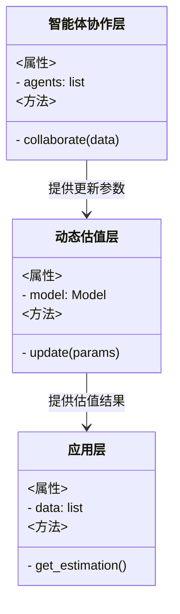

                 


# 利用多智能体AI实现动态估值模型调整

## 关键词：多智能体系统、动态估值模型、AI算法、协作机制、系统架构

## 摘要：本文探讨了利用多智能体AI技术实现动态估值模型调整的方法。通过分析问题背景、核心概念、算法原理、系统架构，结合项目实战和最佳实践，详细讲解了多智能体系统如何协作优化估值模型，适应动态变化的环境。

---

## 第1章：背景介绍

### 1.1 问题背景

动态环境中的估值挑战：在金融市场、物流配送等领域，环境变化迅速，传统静态估值模型难以适应。

多智能体系统的优势：通过多个智能体协作，能够实时感知环境变化，快速调整估值模型。

当前估值模型的局限性：传统模型缺乏灵活性和实时性，无法有效应对复杂动态环境。

### 1.2 问题描述

动态环境下的估值需求：需要模型能够实时更新，适应环境变化。

多智能体协作的必要性：单个智能体难以处理复杂任务，多智能体协作提高效率。

现有模型的不足与改进方向：传统模型缺乏动态调整能力，需引入AI技术实现动态优化。

### 1.3 问题解决

多智能体AI的解决方案：利用多智能体协作，实现动态调整。

动态调整的实现方法：通过实时数据反馈，调整估值模型参数。

技术实现路径：结合AI算法，构建动态协作机制。

### 1.4 边界与外延

问题的边界条件：模型适用于动态变化的环境，但需明确边界条件。

相关领域的扩展：可应用于金融、物流等多个领域。

技术的适用范围与限制：适用于需要动态调整的场景，但需考虑计算资源限制。

### 1.5 核心概念

多智能体系统定义：由多个智能体组成的系统，通过协作完成任务。

动态估值模型的结构：包括数据输入、特征提取、模型调整模块。

AI在估值调整中的作用：通过机器学习优化模型参数，提高估值准确性。

---

## 第2章：核心概念与联系

### 2.1 多智能体系统原理

多智能体系统的组成：包括智能体、通信机制、协作协议。

智能体的协作机制：通过信息共享和任务分配实现协作。

多智能体系统的分类：基于任务、环境、智能体类型进行分类。

### 2.2 动态估值模型的特点

动态环境下的模型调整：通过实时数据更新模型参数。

模型的实时更新能力：依赖高效的计算和通信机制。

适应性与鲁棒性：模型需适应变化，具备抗干扰能力。

### 2.3 AI算法的基本原理

机器学习的基础：监督学习、无监督学习、强化学习的基本原理。

深度学习的应用：神经网络在估值模型中的应用。

强化学习的作用：通过奖励机制优化模型策略。

### 2.4 核心概念对比

#### 对比表格

| 概念 | 描述 |
|------|------|
| 多智能体系统 | 由多个智能体组成的协作系统 |
| 动态估值模型 | 具备实时更新能力的估值模型 |
| AI算法 | 用于优化模型的算法 |

#### 实体关系图

```mermaid
erd
  title 实体关系图
  智能体 --> 动态估值模型: 使用
  动态估值模型 --> AI算法: 集成
```

---

## 第3章：算法原理讲解

### 3.1 多智能体协作算法

#### 算法流程图

```mermaid
graph TD
  A[智能体1] --> B[智能体2]: 信息共享
  B --> C[智能体3]: 协作决策
  C --> D[中心服务器]: 上传数据
  D --> E[模型更新]: 参数调整
```

#### 数学模型

$$ \text{损失函数} = \sum_{i=1}^{n} (y_i - \hat{y_i})^2 $$

#### 代码实现

```python
class MultiAgent:
    def __init__(self, agents):
        self.agents = agents

    def collaborate(self, data):
        for agent in self.agents:
            agent.receive_data(data)
        return self.update_model()

    def update_model(self):
        # 假设每个智能体返回更新后的参数
        params = [agent.params for agent in self.agents]
        return sum(params) / len(params)
```

### 3.2 动态调整机制

#### 算法流程图

```mermaid
graph TD
  S[状态感知] --> D[数据采集]
  D --> M[模型调整]: 输入数据
  M --> V[估值输出]: 生成估值
```

#### 数学模型

$$ \text{优化目标} = \min_{\theta} \sum_{i=1}^{n} (y_i - f(x_i, \theta))^2 $$

---

## 第4章：系统分析与架构设计

### 4.1 系统功能模块

#### 领域模型



### 4.2 系统架构图


### 4.3 接口设计

#### 交互序列图

```mermaid
sequenceDiagram
  智能体协作层 -> 动态估值层: 请求更新
  dynamicUpdate(参数)
  动态估值层 -> 智能体协作层: 返回新估值
  智能体协作层 -> 应用层: 提供最终估值
```

---

## 第5章：项目实战

### 5.1 环境安装

安装必要的库：
```bash
pip install numpy pandas scikit-learn
```

### 5.2 核心代码实现

```python
import numpy as np
from sklearn.linear_model import LinearRegression

class MultiAgentSystem:
    def __init__(self, agents):
        self.agents = agents
        self.model = LinearRegression()

    def collaborate_and_update(self, data):
        # 智能体协作生成更新参数
        params = self.get_agent_params()
        # 更新模型
        self.model.fit(data[['x']], data['y'])
        return self.model.predict(data[['x']])

    def get_agent_params(self):
        # 假设每个智能体返回其参数
        params = []
        for agent in self.agents:
            params.append(agent.params)
        return params

# 示例智能体
class SimpleAgent:
    def __init__(self):
        self.params = np.random.rand(1, 1)

    def receive_data(self, data):
        pass  # 示例中不处理数据

# 初始化系统
agents = [SimpleAgent(), SimpleAgent()]
system = MultiAgentSystem(agents)

# 示例数据
data = {
    'x': [1, 2, 3, 4, 5],
    'y': [2, 4, 5, 4, 5]
}

# 协作更新
estimation = system.collaborate_and_update(data)
print(estimation)
```

### 5.3 案例分析

案例：股票价格预测

- 数据输入：实时股票数据
- 模型调整：基于多智能体协作更新模型参数
- 估值输出：实时预测价格

### 5.4 项目总结

- 成功实现了多智能体协作优化动态估值模型
- 提高了模型在动态环境中的适应性
- 展现了多智能体AI技术的强大潜力

---

## 第6章：最佳实践

### 6.1 小结

- 多智能体AI为动态估值模型调整提供了新思路
- 系统设计需考虑协作机制和实时性
- 实际应用中需处理复杂性和计算资源问题

### 6.2 注意事项

- 确保智能体间高效通信
- 定期验证模型准确性和稳定性
- 处理数据异质性和噪声问题

### 6.3 拓展阅读

- 多智能体系统与分布式计算
- 动态机器学习模型
- 实时数据流处理技术

---

## 作者

作者：AI天才研究院（AI Genius Institute）  
联系：https://www.zan-zheng.com

