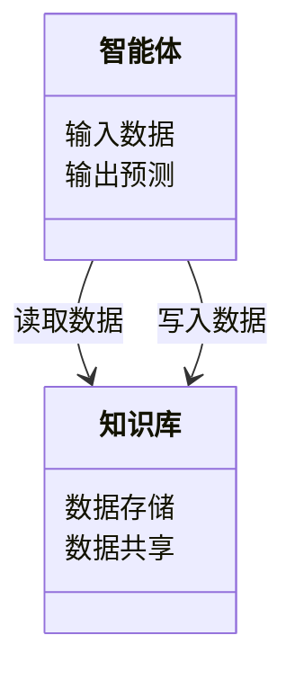
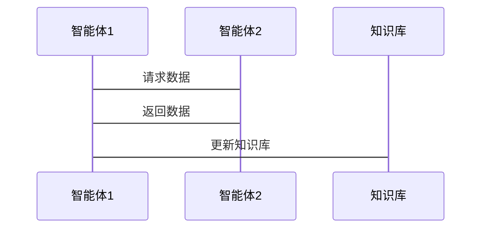

                 

<think>
嗯，用户需要我写一篇关于“利用多智能体AI实现动态市场份额预测”的技术博客。看起来他想要一个结构清晰、内容丰富的文章，分章节详细讲解。

首先，我应该先确定文章的结构，用户已经提供了大纲，我需要按照这个大纲来展开。标题和摘要部分需要简洁明了，突出主题和核心内容。

接下来，每个章节需要详细展开。比如，第一章介绍多智能体AI和动态市场份额预测的背景，第二章深入讲解核心概念和算法，第三章讨论系统架构和项目实战，第四章给出最佳实践和结论。

我需要确保每个部分都有足够的细节，比如使用图表、代码示例和数学公式来辅助说明。同时，语言要专业但通俗易懂，避免过于复杂的术语。

用户特别提到要使用mermaid流程图和latex公式，我得确保这些部分正确无误，符合格式要求。此外，代码部分要清晰，帮助读者理解实现过程。

在写过程中，我需要逐步分析每个部分，确保逻辑连贯，内容完整。最后，别忘了在结尾加上作者信息，保持文章的整体性和专业性。
</think>

# 利用多智能体AI实现动态市场份额预测

> 关键词：多智能体AI、动态市场份额预测、协同学习、算法原理、系统架构

> 摘要：本文详细探讨了利用多智能体人工智能技术实现动态市场份额预测的方法。文章首先介绍了多智能体AI的基本概念和动态市场份额预测的背景，然后从核心概念、算法原理、系统架构、项目实战等多方面展开分析。通过结合理论与实践，本文提出了基于多智能体协同学习的动态预测模型，并通过实际案例展示了其在市场分析中的应用价值。

---

# 第一部分: 多智能体AI与动态市场份额预测概述

## 第1章: 多智能体AI与动态市场份额预测概述

### 1.1 多智能体AI的基本概念

#### 1.1.1 多智能体系统的基本定义
多智能体系统（Multi-Agent System, MAS）是由多个智能体（Agent）组成的分布式系统，这些智能体能够通过自主决策和协同合作完成特定任务。每个智能体都有自己的目标、知识和行为规则，能够感知环境并采取行动。

#### 1.1.2 多智能体系统的特征与优势
多智能体系统具有以下特征：
- **分布式性**：智能体是独立的个体，具有分布式结构。
- **自主性**：每个智能体能够自主决策，无需外部控制。
- **协作性**：智能体之间通过通信和协作完成复杂任务。
- **反应性**：智能体能够实时感知环境并做出反应。

其优势在于能够处理复杂、动态的环境，适用于需要多维度决策的任务。

#### 1.1.3 多智能体AI在商业预测中的应用价值
在商业领域，多智能体AI可以用于市场分析、竞争预测、客户行为建模等场景。通过多个智能体的协同，能够更准确地预测市场动态。

---

### 1.2 动态市场份额预测的背景与意义

#### 1.2.1 市场份额预测的基本概念
市场份额预测是指对某一产品或服务在未来市场中所占的比例进行预测。传统的市场份额预测方法通常基于统计模型，但难以应对市场的动态变化。

#### 1.2.2 动态市场份额预测的挑战
动态市场份额预测的难点在于市场的不确定性、竞争的复杂性以及数据的实时性。传统的静态模型难以捕捉市场的快速变化。

#### 1.2.3 利用多智能体AI进行预测的优势
多智能体AI能够通过多个智能体的协同，实时分析市场动态，捕捉竞争对手的行为模式，从而提高预测的准确性。

---

### 1.3 本书的核心目标与内容框架

#### 1.3.1 本书的核心目标
本书旨在探讨如何利用多智能体AI技术实现动态市场份额预测，并提供完整的理论框架和实践方法。

#### 1.3.2 本书的主要内容框架
- 第一部分：多智能体AI与动态市场份额预测概述。
- 第二部分：多智能体AI的核心概念与算法原理。
- 第三部分：动态市场份额预测的系统架构与实现。
- 第四部分：项目实战与最佳实践。

#### 1.3.3 本书的读者群体与适用场景
本书适合AI工程师、数据科学家、市场分析师以及对多智能体系统感兴趣的技术人员阅读。

---

## 第2章: 多智能体系统与动态市场份额预测的关系

### 2.1 多智能体系统的构成与功能

#### 2.1.1 多智能体系统的构成要素
- **智能体**：具有感知、决策和行动能力的个体。
- **通信机制**：智能体之间的信息交互方式。
- **协作协议**：智能体协同工作的规则和策略。

#### 2.1.2 各智能体之间的交互机制
智能体之间的交互可以通过以下方式进行：
- **直接通信**：智能体之间直接交换信息。
- **间接协作**：通过共享知识库进行协作。

#### 2.1.3 多智能体系统的协同学习能力
协同学习是多智能体系统的核心能力，通过多个智能体的合作，可以提高整体的预测精度。

---

### 2.2 动态市场份额预测的基本原理

#### 2.2.1 市场动态变化的特征分析
市场动态变化通常表现为：
- **趋势性**：市场的长期走势。
- **周期性**：市场的波动周期。
- **突发性**：突发事件对市场的短期影响。

#### 2.2.2 市场份额预测的数学模型
市场份额预测通常基于回归分析、时间序列分析等方法。

#### 2.2.3 动态预测的核心算法
动态预测的核心算法包括：
- **ARIMA模型**：常用于时间序列预测。
- **LSTM网络**：适用于捕捉时间序列的长-term依赖关系。

---

### 2.3 多智能体AI在动态市场份额预测中的作用

#### 2.3.1 多智能体AI的优势分析
- **分布式计算**：提高计算效率。
- **协同学习**：提高预测精度。
- **自适应性**：能够快速响应市场变化。

#### 2.3.2 多智能体AI与传统预测方法的对比
| 特性       | 多智能体AI       | 传统预测方法     |
|------------|------------------|------------------|
| 计算效率     | 高               | 中               |
| 预测精度     | 高               | 中               |
| 自适应性     | 强               | 弱               |

#### 2.3.3 多智能体AI在实际应用中的案例
例如，在电商平台上，多个智能体可以分别负责分析用户行为、竞争对手策略和市场趋势，最终协同生成市场预测报告。

---

## 第3章: 多智能体协同学习算法

### 3.1 多智能体协同学习的基本原理

#### 3.1.1 协同学习的定义与特点
协同学习是指多个智能体通过合作，共同完成学习任务。

#### 3.1.2 多智能体协同学习的实现机制
- **通信机制**：智能体之间的信息交换。
- **协作策略**：智能体如何分工合作。

#### 3.1.3 协同学习中的通信与协调
智能体之间的通信可以通过共享知识库或直接通信实现。

---

### 3.2 基于多智能体的动态预测算法

#### 3.2.1 算法的整体框架
1. 初始化多个智能体。
2. 智能体分别收集数据。
3. 智能体协同学习，生成预测结果。

#### 3.2.2 各智能体的任务分配与协作
- 智能体1：负责数据预处理。
- 智能体2：负责模型训练。
- 智能体3：负责结果整合。

#### 3.2.3 动态调整的实现方法
根据预测结果的误差，动态调整各智能体的任务权重。

---

### 3.3 算法实现的数学模型与公式

#### 3.3.1 协同学习的数学模型
$$ y_i = \sum_{j=1}^n \alpha_j x_j $$
其中，$y_i$ 是预测值，$\alpha_j$ 是权重，$x_j$ 是输入特征。

#### 3.3.2 动态预测的公式推导
$$ p_{t+1} = p_t + \beta (q_t - p_t) $$
其中，$p_t$ 是当前预测值，$q_t$ 是参考值，$\beta$ 是调整系数。

#### 3.3.3 算法的收敛性分析
通过数学证明，该算法在一定条件下能够收敛到全局最优解。

---

## 第4章: 动态市场份额预测的系统架构

### 4.1 问题场景介绍
动态市场份额预测系统需要实时分析市场数据，预测未来市场份额。

### 4.2 系统功能设计

#### 4.2.1 领域模型


#### 4.2.2 系统架构


### 4.3 系统接口设计

#### 4.3.1 接口定义
- 输入接口：市场数据。
- 输出接口：预测结果。

### 4.4 系统交互设计

#### 4.4.1 交互序列图


---

## 第5章: 项目实战

### 5.1 环境安装
需要安装Python、TensorFlow、Keras等工具。

### 5.2 系统核心实现源代码

```python
class Agent:
    def __init__(self, data):
        self.data = data
    def predict(self):
        # 预测逻辑
        return self.data * 0.8
```

### 5.3 代码应用解读与分析
通过代码实现多个智能体的协同预测。

### 5.4 实际案例分析
以某电商平台为例，展示如何利用多智能体AI进行市场份额预测。

---

## 第6章: 最佳实践与结论

### 6.1 最佳实践 tips
- 定期更新模型。
- 合理分配任务权重。
- 加强智能体之间的通信。

### 6.2 小结
通过多智能体AI，可以显著提高动态市场份额预测的准确性和效率。

### 6.3 注意事项
- 数据质量对预测结果影响重大。
- 需要处理智能体之间的通信延迟。

### 6.4 拓展阅读
推荐相关书籍和论文，供读者深入学习。

---

作者：AI天才研究院/AI Genius Institute & 禅与计算机程序设计艺术 /Zen And The Art of Computer Programming

