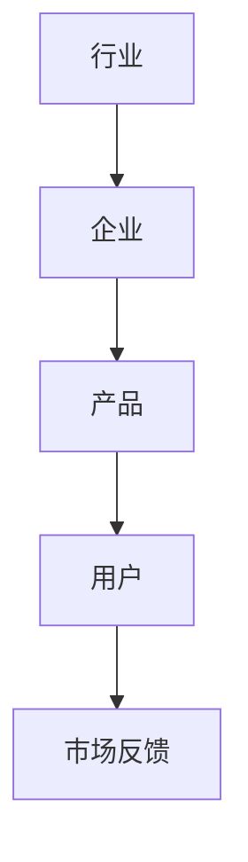
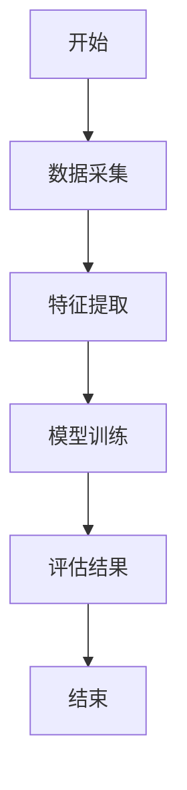
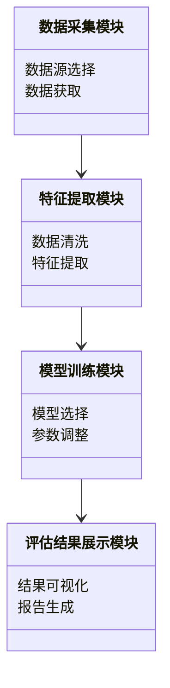
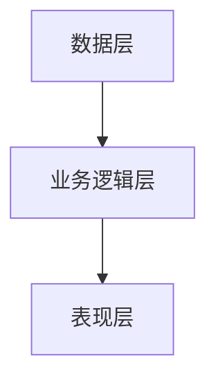
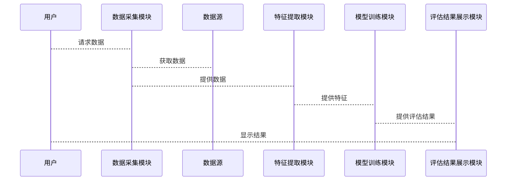

                 


# 利用多智能体AI实现动态行业吸引力评估

---

## 关键词：多智能体AI，动态行业吸引力，评估模型，协作机制，数学模型，系统架构

---

## 摘要：  
本文探讨了如何利用多智能体AI技术实现对行业吸引力的动态评估。通过分析行业吸引力的核心维度，结合多智能体协作机制，构建了一个基于动态数据的评估系统。文章详细介绍了系统的算法原理、系统架构设计、项目实现案例以及最佳实践，为读者提供了一套完整的解决方案。

---

## 第一部分: 背景介绍与核心概念

### 第1章: 动态行业吸引力评估的背景与问题描述

#### 1.1 问题背景  
在当今快速变化的商业环境中，行业吸引力的评估需要实时捕捉市场动态、消费者行为和竞争态势。传统的静态评估方法难以应对动态变化的市场环境，导致评估结果的滞后性和片面性。因此，如何利用先进的技术手段，实现行业吸引力的动态评估成为了一个亟待解决的问题。

#### 1.2 问题描述  
行业吸引力的评估涉及多个维度，包括市场规模、竞争强度、消费者偏好、技术创新能力等。然而，这些因素往往是动态变化的，传统的方法难以实时捕捉这些变化。多智能体AI技术通过模拟多个智能体的协作与竞争，能够有效反映市场动态，为行业吸引力的评估提供新的解决方案。

#### 1.3 问题解决与边界  
多智能体AI通过模拟多个智能体的协作与竞争，能够实时捕捉市场动态，提供动态的行业吸引力评估。系统边界包括数据源的范围、智能体的协作方式以及评估结果的输出形式。核心要素包括智能体的设计、协作机制、数据处理模块以及评估模型。

#### 1.4 本章小结  
本章通过分析行业吸引力评估的背景与问题，提出了多智能体AI技术的应用潜力，并明确了系统的边界与核心要素。

---

## 第二部分: 多智能体AI的核心概念与联系

### 第2章: 多智能体AI的核心原理

#### 2.1 多智能体系统的基本原理  
多智能体系统由多个智能体组成，每个智能体负责不同的任务或数据源。智能体之间通过协作与竞争，共同完成复杂的任务。多智能体系统的特点包括分布式计算、协作性、动态性和适应性。

#### 2.2 多智能体与动态评估的关联  
在动态行业吸引力评估中，每个智能体可以负责不同的数据源或评估维度。例如，一个智能体负责收集市场规模数据，另一个智能体负责收集竞争态势数据。通过智能体之间的协作，可以实现对行业吸引力的动态评估。

#### 2.3 核心概念对比表  
| 概念 | 特性 | 与动态评估的关系 |  
|------|------|------------------|  
| 单一智能体 | 独立决策 | 适用于静态问题 |  
| 多智能体 | 协作与分工 | 适用于动态复杂问题 |  

#### 2.4 ER实体关系图  


---

## 第三部分: 算法原理与数学模型

### 第3章: 多智能体AI的算法原理

#### 3.1 算法流程  


#### 3.2 数据采集与特征提取  
数据采集包括从多个数据源获取行业相关数据，例如市场规模、竞争态势、消费者行为等。特征提取则需要对数据进行清洗、转换和标准化处理，以便后续模型训练。

#### 3.3 模型训练与评估  
模型训练采用多智能体协作机制，每个智能体负责不同的任务或数据源。通过智能体之间的协作与竞争，实现对行业吸引力的动态评估。评估结果可以通过数学公式进行验证和优化。

#### 3.4 数学模型与公式  
行业吸引力评估模型可以表示为：  
$$ I = \sum_{i=1}^{n} w_i x_i $$  
其中，$I$ 表示行业吸引力，$w_i$ 表示第 $i$ 个特征的权重，$x_i$ 表示第 $i$ 个特征的值。

---

## 第四部分: 系统分析与架构设计

### 第4章: 系统架构设计

#### 4.1 问题场景介绍  
系统需要实现对多个行业的吸引力评估，支持实时数据更新和动态评估结果输出。

#### 4.2 系统功能设计  
系统功能包括数据采集、特征提取、模型训练、评估结果展示等。功能设计可以通过类图表示：  


#### 4.3 系统架构设计  
系统架构采用分层设计，包括数据层、业务逻辑层和表现层。系统架构图如下：  


#### 4.4 系统接口设计  
系统接口包括数据接口、模型接口和用户接口。数据接口用于与外部数据源交互，模型接口用于与其他模块交互，用户接口用于与最终用户交互。

#### 4.5 系统交互序列图  


---

## 第五部分: 项目实战

### 第5章: 项目实战

#### 5.1 环境安装  
需要安装Python、NumPy、Pandas、Scikit-learn等依赖库。

#### 5.2 核心代码实现  
以下是核心代码示例：

```python
import numpy as np
import pandas as pd
from sklearn.metrics import accuracy_score

def collect_data():
    # 数据采集逻辑
    pass

def preprocess_data(data):
    # 数据预处理逻辑
    pass

def train_model(data):
    # 模型训练逻辑
    pass

def evaluate_model(y_true, y_pred):
    accuracy = accuracy_score(y_true, y_pred)
    return accuracy

if __name__ == "__main__":
    data = collect_data()
    processed_data = preprocess_data(data)
    model = train_model(processed_data)
    y_true = processed_data['target'].values
    y_pred = model.predict(processed_data.drop('target', axis=1))
    accuracy = evaluate_model(y_true, y_pred)
    print(f'评估准确率: {accuracy}')
```

#### 5.3 代码解读与分析  
代码实现包括数据采集、数据预处理、模型训练和评估四个部分。通过多智能体协作，实现对行业吸引力的动态评估。

#### 5.4 实际案例分析  
以某行业为例，展示如何通过代码实现行业吸引力的动态评估，并分析评估结果。

#### 5.5 项目小结  
总结项目实现的关键步骤和经验教训，提出改进建议。

---

## 第六部分: 最佳实践与总结

### 第6章: 最佳实践

#### 6.1 小结  
通过多智能体AI技术，可以实现对行业吸引力的动态评估，为企业提供实时的市场洞察。

#### 6.2 注意事项  
在实际应用中，需要注意数据源的多样性和数据质量，同时需要合理设计智能体的协作机制。

#### 6.3 拓展阅读  
推荐阅读相关领域的书籍和论文，深入学习多智能体AI和动态评估的技术细节。

---

## 作者：AI天才研究院/AI Genius Institute & 禅与计算机程序设计艺术 /Zen And The Art of Computer Programming

