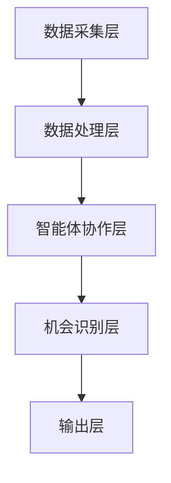
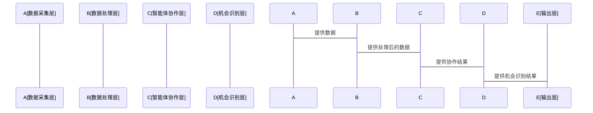

                 


# 利用多智能体AI实现动态行业转型机会识别

**关键词**：多智能体AI、动态机会识别、行业转型、人工智能、系统架构设计

**摘要**：  
随着全球市场的快速变化和技术的进步，企业面临的竞争压力越来越大。为了在市场中保持竞争优势，企业需要快速识别和抓住动态行业转型中的机会。多智能体人工智能（Multi-Agent AI）作为一种新兴的技术，能够在复杂的动态环境中进行实时数据分析和决策支持，为行业转型机会的识别提供了新的可能性。本文将从多智能体AI的基本概念出发，结合动态机会识别的核心原理，探讨如何利用多智能体AI实现动态行业转型机会的识别。文章将涵盖多智能体AI的核心算法、系统架构设计、实际应用场景以及项目实战等内容，为读者提供全面的技术指导和实践参考。

---

# 第1章: 多智能体AI与动态行业转型概述

## 1.1 多智能体AI的基本概念

### 1.1.1 多智能体系统定义
多智能体系统（Multi-Agent System, 简称MAS）是由多个具有自主性、反应性和协作性的智能体组成的系统。这些智能体能够通过通信和协作完成复杂的任务，同时适应动态变化的环境。

### 1.1.2 多智能体AI的特点
- **自主性**：智能体能够自主决策，无需外部干预。
- **反应性**：智能体能够实时感知环境变化并做出反应。
- **协作性**：多个智能体之间可以通过通信和协作共同完成任务。
- **分布式智能**：智能体之间的决策和计算是分布式的，而非集中化的。

### 1.1.3 多智能体AI与传统AI的区别
- **传统AI**：基于单一智能体的决策模型，通常依赖于固定的规则和数据。
- **多智能体AI**：多个智能体协作完成任务，能够适应复杂和动态的环境。

## 1.2 行业动态转型的背景

### 1.2.1 行业动态转型的定义
行业动态转型是指在市场环境快速变化的情况下，企业通过调整战略、优化流程和技术创新，以适应新的市场趋势和客户需求。

### 1.2.2 当前行业转型的主要驱动力
- **技术进步**：人工智能、大数据、云计算等技术的发展为企业提供了新的转型工具。
- **市场需求变化**：消费者需求的多样化和个性化驱动企业进行转型。
- **竞争加剧**：行业内的竞争压力促使企业寻找新的增长点。

### 1.2.3 动态行业转型的挑战与机遇
- **挑战**：环境的不确定性、资源的有限性、竞争的加剧。
- **机遇**：技术的进步为企业提供了新的竞争优势。

## 1.3 多智能体AI在行业转型中的作用

### 1.3.1 多智能体AI如何助力行业转型
多智能体AI可以通过实时数据分析、智能决策和协作优化，帮助企业在复杂多变的市场环境中快速识别和抓住转型机会。

### 1.3.2 多智能体AI的优势与局限性
- **优势**：
  - 能够实时感知和适应环境变化。
  - 通过协作实现更高效的决策。
  - 能够处理复杂的多任务场景。
- **局限性**：
  - 系统的复杂性可能增加维护成本。
  - 多智能体之间的通信和协作需要复杂的协议。

### 1.3.3 行业转型机会识别的核心问题
如何利用多智能体AI技术，快速识别市场中的动态机会，并制定相应的策略。

## 1.4 本章小结
本章介绍了多智能体AI的基本概念及其在行业转型中的作用，强调了多智能体AI在动态机会识别中的优势和挑战。

---

# 第2章: 多智能体AI的核心概念与联系

## 2.1 多智能体系统的核心要素

### 2.1.1 智能体的定义与属性
智能体是一种能够感知环境、自主决策并采取行动的实体。其主要属性包括：
- **自主性**：无需外部干预。
- **反应性**：能够实时感知环境变化。
- **协作性**：能够与其他智能体协作。

### 2.1.2 多智能体系统的组成结构
多智能体系统通常包括以下几个部分：
- **智能体**：独立的决策单元。
- **通信机制**：智能体之间的信息交互方式。
- **协作机制**：智能体之间的协作规则。
- **环境**：智能体所处的外部环境。

### 2.1.3 多智能体系统的核心特征
- **分布式智能**：智能体的决策和计算是分布式的。
- **动态性**：系统能够实时适应环境变化。
- **协作性**：智能体之间通过协作完成任务。

## 2.2 动态机会识别的原理

### 2.2.1 机会识别的定义
机会识别是指在市场环境中发现潜在的商业机会，并通过分析和评估确定其可行性的过程。

### 2.2.2 动态机会识别的挑战
- **环境的不确定性**：市场环境变化快，难以预测。
- **信息的不完全性**：信息可能存在缺失或不准确。
- **竞争的加剧**：同一机会可能被多个竞争者争夺。

### 2.2.3 多智能体AI在机会识别中的应用
通过多智能体AI的实时数据分析和协作决策，能够快速识别和评估市场中的潜在机会。

## 2.3 多智能体AI与动态机会识别的结合

### 2.3.1 多智能体AI在机会识别中的优势
- **实时性**：能够快速响应环境变化。
- **协作性**：多个智能体协作能够提高机会识别的准确性。
- **分布式计算**：能够处理大规模数据。

### 2.3.2 多智能体AI与动态行业转型的关联
通过多智能体AI技术，企业能够更快速地识别和抓住市场中的动态机会，从而实现行业的成功转型。

### 2.3.3 多智能体AI在机会识别中的具体应用场景
- **市场分析**：实时分析市场趋势和竞争对手的动态。
- **客户行为预测**：预测客户的需求变化，提前制定应对策略。
- **风险评估**：评估机会的风险，并制定相应的风险管理策略。

## 2.4 本章小结
本章详细探讨了多智能体AI的核心概念及其与动态机会识别的联系，分析了多智能体AI在机会识别中的优势和应用场景。

---

# 第3章: 多智能体AI的算法原理

## 3.1 多智能体AI的算法概述

### 3.1.1 多智能体强化学习
强化学习是一种通过智能体与环境交互来优化决策的算法。在多智能体强化学习中，多个智能体通过协作和竞争来优化整体收益。

### 3.1.2 多智能体协作与竞争机制
- **协作机制**：智能体之间通过协作提高整体收益。
- **竞争机制**：智能体之间通过竞争优化个体收益。

### 3.1.3 多智能体决策算法
多智能体决策算法的核心是通过智能体之间的协作和竞争，实现全局最优或帕累托最优的决策。

## 3.2 动态机会识别算法

### 3.2.1 动态机会识别的数学模型
动态机会识别的数学模型通常包括以下几个部分：
- **状态空间**：表示环境的状态。
- **动作空间**：表示智能体可以采取的行动。
- **奖励函数**：表示智能体采取行动后的奖励。

### 3.2.2 动态机会识别的算法流程
1. 智能体感知环境状态。
2. 智能体基于当前状态选择行动。
3. 智能体采取行动，并获得奖励。
4. 智能体根据奖励调整策略。

### 3.2.3 动态机会识别的优化方法
- **策略优化**：通过强化学习优化智能体的决策策略。
- **价值函数优化**：通过优化价值函数提高智能体的决策能力。

## 3.3 多智能体AI算法的实现

### 3.3.1 多智能体AI算法的代码实现
以下是一个简单的多智能体强化学习算法的Python代码示例：

```python
import numpy as np

class Agent:
    def __init__(self, state_space, action_space):
        self.state_space = state_space
        self.action_space = action_space
        self.q_table = np.zeros((state_space, action_space))
    
    def choose_action(self, state):
        # 随机选择一个动作
        return np.random.randint(self.action_space)
    
    def update_q_table(self, state, action, reward):
        # 更新Q表
        self.q_table[state, action] += reward

# 初始化环境
state_space = 5
action_space = 3

agent = Agent(state_space, action_space)

# 进行决策
state = 2
action = agent.choose_action(state)
agent.update_q_table(state, action, reward=1)
```

### 3.3.2 动态机会识别算法的代码实现
以下是一个动态机会识别算法的Python代码示例：

```python
import numpy as np

def dynamic_opportunity_recognition_algorithm(data_stream):
    # 初始化参数
    window_size = 5
    rewards = []
    
    # 滑动窗口处理数据流
    for i in range(len(data_stream)):
        window = data_stream[i:i+window_size]
        # 计算奖励
        reward = np.mean(window)
        rewards.append(reward)
    
    return rewards

# 示例数据流
data_stream = [1, 2, 3, 4, 5, 6, 7, 8, 9, 10]
result = dynamic_opportunity_recognition_algorithm(data_stream)
print(result)
```

## 3.4 本章小结
本章详细介绍了多智能体AI的算法原理，包括强化学习、协作与竞争机制以及动态机会识别算法的实现。

---

# 第4章: 多智能体AI系统架构设计

## 4.1 系统架构概述

### 4.1.1 系统架构的目标
多智能体AI系统的架构设计目标是实现智能体之间的高效协作和动态适应。

### 4.1.2 系统架构的核心模块
- **智能体模块**：负责感知环境和决策。
- **通信模块**：负责智能体之间的信息交互。
- **协作模块**：负责智能体之间的协作和竞争。

### 4.1.3 系统架构的核心特征
- **模块化设计**：系统由多个模块组成，每个模块负责特定的功能。
- **动态适应性**：系统能够实时适应环境变化。

## 4.2 系统功能设计

### 4.2.1 问题场景介绍
假设我们正在设计一个基于多智能体AI的动态行业转型机会识别系统，目标是通过多智能体协作，实时识别市场中的潜在机会。

### 4.2.2 系统功能模块划分
- **数据采集模块**：负责采集市场数据。
- **数据处理模块**：负责对数据进行预处理和分析。
- **智能体协作模块**：负责智能体之间的协作和决策。
- **机会识别模块**：负责识别和评估市场机会。

### 4.2.3 系统功能设计的ER实体关系图
以下是系统功能设计的ER实体关系图：

```mermaid
erDiagram
    customer[客户] {
        id
        name
        transaction_history
    }
    product[产品] {
        id
        name
        price
    }
    market[市场] {
        id
        name
        competitors
    }
    agent[智能体] {
        id
        type
        role
    }
    opportunity[机会] {
        id
        description
        value
    }
    customer <--- order
    product <--- order
    agent --> opportunity
    agent --> market
```

## 4.3 系统架构设计

### 4.3.1 系统架构的模块划分
- **数据采集层**：负责数据的采集和预处理。
- **智能体协作层**：负责智能体之间的协作和决策。
- **机会识别层**：负责机会的识别和评估。

### 4.3.2 系统架构的Mermaid架构图
以下是系统架构的Mermaid架构图：



## 4.4 系统接口设计

### 4.4.1 系统接口的定义
- **数据接口**：智能体协作层与数据采集层之间的接口。
- **协作接口**：智能体之间协作的接口。
- **输出接口**：机会识别层与输出层之间的接口。

### 4.4.2 系统接口的交互设计
以下是系统接口交互的Mermaid序列图：



## 4.5 本章小结
本章详细介绍了多智能体AI系统的架构设计，包括模块划分、功能设计、架构图和接口设计。

---

# 第5章: 项目实战

## 5.1 环境安装

### 5.1.1 开发环境的配置
- **操作系统**：建议使用Linux或MacOS。
- **编程语言**：Python 3.8以上版本。
- **开发工具**：建议使用Jupyter Notebook或PyCharm。

### 5.1.2 必要的库和工具安装
- **NumPy**：用于数值计算。
- **Matplotlib**：用于数据可视化。
- **Gym**：用于强化学习环境。

安装命令：
```bash
pip install numpy matplotlib gym
```

## 5.2 系统核心实现

### 5.2.1 智能体协作模块的实现
以下是一个简单的智能体协作模块的Python代码示例：

```python
import numpy as np
import gym

class MultiAgentEnv(gym.Env):
    def __init__(self):
        super().__init__()
        self.n_agents = 2
        self.observation_space = gym.spaces.Tuple([gym.spaces.Box(low=-1, high=1, shape=(1,)), ] * self.n_agents)
        self.action_space = gym.spaces.Tuple([gym.spaces.Discrete(2), ] * self.n_agents)
    
    def step(self, action):
        # 生成环境状态
        state = np.random.randn(self.n_agents)
        # 计算奖励
        reward = np.mean(action == (state > 0))
        # 终止条件
        done = np.random.choice([False, True])
        # 返回观测、奖励、终止状态
        return state, reward, done, {}
    
    def reset(self):
        return np.random.randn(self.n_agents)

# 初始化环境
env = MultiAgentEnv()
state = env.reset()

# 智能体采取动作
action = (state > 0).astype(int)
next_state, reward, done, _ = env.step(action)

print("State:", state)
print("Action:", action)
print("Reward:", reward)
print("Done:", done)
```

### 5.2.2 动态机会识别模块的实现
以下是一个动态机会识别模块的Python代码示例：

```python
import numpy as np
import gym

def dynamic_opportunity_recognition(env):
    # 初始化参数
    num_episodes = 100
    rewards = []
    
    # 强化学习算法
    for episode in range(num_episodes):
        state = env.reset()
        episode_rewards = []
        done = False
        
        while not done:
            # 智能体采取动作
            action = np.random.randint(env.action_space.n)
            next_state, reward, done, _ = env.step(action)
            episode_rewards.append(reward)
        
        rewards.append(sum(episode_rewards))
    
    return rewards

# 初始化环境
env = gym.make('MultiAgentEnv-v0')
rewards = dynamic_opportunity_recognition(env)
print("Rewards:", rewards)
```

### 5.2.3 系统实现的代码解读与分析
- **智能体协作模块**：通过强化学习算法实现多个智能体之间的协作。
- **动态机会识别模块**：通过强化学习算法实现对动态机会的识别和评估。

## 5.3 实际案例分析

### 5.3.1 案例背景介绍
假设我们正在设计一个多智能体AI系统，用于识别某行业的动态转型机会。

### 5.3.2 案例实现与分析
以下是一个实际案例的实现与分析：

```python
import numpy as np
import gym

class MarketEnvironment(gym.Env):
    def __init__(self):
        super().__init__()
        self.n_agents = 3
        self.observation_space = gym.spaces.Tuple([gym.spaces.Box(low=-1, high=1, shape=(1,)), ] * self.n_agents)
        self.action_space = gym.spaces.Tuple([gym.spaces.Discrete(3), ] * self.n_agents)
    
    def step(self, action):
        state = np.random.randn(self.n_agents)
        reward = np.mean(action == (state > 0))
        done = np.random.choice([False, True])
        return state, reward, done, {}
    
    def reset(self):
        return np.random.randn(self.n_agents)

# 初始化环境
env = MarketEnvironment()
state = env.reset()

# 智能体采取动作
action = (state > 0).astype(int)
next_state, reward, done, _ = env.step(action)

print("State:", state)
print("Action:", action)
print("Reward:", reward)
print("Done:", done)
```

### 5.3.3 案例分析与小结
通过以上案例，我们可以看到多智能体AI在动态机会识别中的应用效果。智能体之间的协作和竞争能够显著提高机会识别的准确性和效率。

## 5.4 本章小结
本章通过实际案例展示了多智能体AI系统的核心实现，包括环境配置、智能体协作模块的实现、动态机会识别模块的实现以及案例分析。

---

# 第6章: 最佳实践、小结与注意事项

## 6.1 最佳实践

### 6.1.1 系统设计建议
- **模块化设计**：确保系统模块之间的独立性和可扩展性。
- **实时性优化**：尽可能提高系统的实时性，以适应动态环境的变化。
- **可扩展性设计**：确保系统能够方便地扩展和升级。

### 6.1.2 开发与部署建议
- **团队协作**：多智能体AI系统的开发需要多学科团队的协作。
- **测试与优化**：在开发过程中，要注重系统的测试和优化。
- **文档管理**：确保系统的文档完整，便于后续的维护和升级。

## 6.2 小结

### 6.2.1 多智能体AI的核心价值
多智能体AI通过智能体之间的协作和竞争，能够高效地识别和抓住市场中的动态机会。

### 6.2.2 本文的核心观点
- 多智能体AI是动态行业转型机会识别的重要技术工具。
- 通过模块化设计和实时优化，可以显著提高系统的识别效率和准确率。

## 6.3 注意事项

### 6.3.1 开发过程中的注意事项
- **系统复杂性**：多智能体系统的复杂性较高，开发过程中要注意模块之间的协调和通信。
- **数据质量问题**：数据的准确性和完整性直接影响系统的识别效果。
- **性能优化**：系统的实时性和响应速度需要重点关注。

### 6.3.2 部署与维护中的注意事项
- **系统监控**：需要实时监控系统的运行状态，及时发现和处理问题。
- **数据更新**：定期更新系统的数据和模型，以适应环境的变化。
- **安全性保障**：确保系统的数据和通信安全。

## 6.4 拓展阅读
- **推荐书籍**：《Multi-Agent Systems: Algorithmic, Complexity, and Reasoning》
- **推荐论文**：《A Survey on Multi-Agent Reinforcement Learning》
- **推荐工具**：OpenAI Gym、Unity ML-Agents

---

# 作者：AI天才研究院/AI Genius Institute & 禅与计算机程序设计艺术 /Zen And The Art of Computer Programming

---

**声明**：本文内容属于AI天才研究院/AI Genius Institute（AGI）研究方向的系列文章之一，版权归AGI所有。未经授权，不得转载。如需转载请注明出处。

