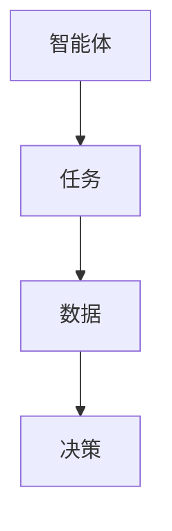
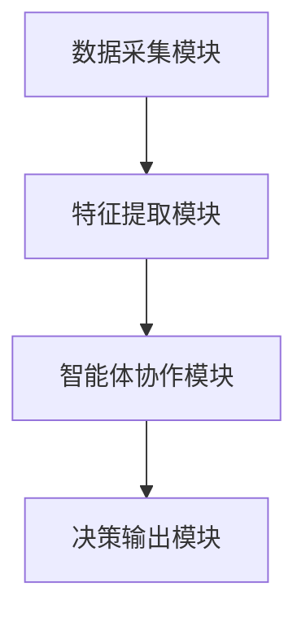

                 


# 利用多智能体AI实现巴菲特式的行业领导者识别

## 关键词
多智能体AI，巴菲特投资策略，行业领导者识别，算法原理，系统架构，项目实战

## 摘要
本文探讨如何利用多智能体AI技术来模拟巴菲特的投资策略，实现对行业领导者的识别。通过分析多智能体AI的核心概念、算法原理和系统架构，结合实际案例，展示如何利用多智能体AI在金融领域的应用，帮助投资者做出更明智的决策。

---

# 第一部分：利用多智能体AI实现行业领导者识别的背景与基础

## 第1章：多智能体AI与巴菲特投资策略概述

### 1.1 多智能体AI的定义与特点
#### 1.1.1 多智能体AI的定义
多智能体AI（Multi-Agent AI）是指由多个智能体（Agent）协同工作的系统，每个智能体都有独立的目标和决策能力，能够通过通信和协作完成复杂任务。

#### 1.1.2 多智能体AI的核心特点
- **分布式计算**：多个智能体独立运行，分布式处理数据。
- **协作性**：智能体之间通过通信和协作完成共同目标。
- **适应性**：能够根据环境变化动态调整策略。
- **可扩展性**：支持大规模数据处理和复杂任务。

#### 1.1.3 多智能体AI与传统AI的区别
| 属性 | 多智能体AI | 传统AI |
|------|-----------|--------|
| 结构 | 分布式系统 | 单点系统 | 
| 决策 | 协作决策 | 中央控制 | 
| 灵活性 | 高 | 低 | 

### 1.2 巴菲特投资策略的核心要素
#### 1.2.1 巴菲特投资理念概述
巴菲特的投资策略以长期价值投资为核心，注重企业的基本面分析，寻找具有持续竞争优势和良好管理的公司。

#### 1.2.2 巴菲特选股的关键指标
- **ROE（净资产收益率）**：衡量企业的盈利能力。
- **ROA（资产净利率）**：衡量资产的使用效率。
- **股息率**：衡量企业的分红能力。
- **市盈率（P/E）**：衡量股票的估值水平。

#### 1.2.3 巴菲特投资策略的长期视角
巴菲特注重长期投资，避免短期市场波动的干扰，寻找能够持续增长的企业。

### 1.3 多智能体AI在投资领域的应用前景
#### 1.3.1 多智能体AI在金融领域的潜在应用
- **股票分析**：通过多个智能体分析不同维度的数据，提供全面的股票评估。
- **风险控制**：智能体协同工作，实时监控市场风险。
- **投资组合优化**：通过协作优化投资组合，降低风险，提高收益。

#### 1.3.2 利用多智能体AI模仿巴菲特策略的优势
- **数据处理能力**：多智能体AI能够处理海量数据，提供全面的分析。
- **协作能力**：多个智能体可以分别负责不同的分析任务，协同工作。
- **动态适应**：能够根据市场变化实时调整策略。

#### 1.3.3 当前应用的挑战与机遇
- **挑战**：多智能体AI的复杂性可能导致系统设计和维护难度大；数据质量和隐私问题也是需要考虑的因素。
- **机遇**：通过多智能体AI的应用，可以提高投资决策的准确性和效率。

## 1.4 本章小结
本章介绍了多智能体AI的定义、特点以及其在投资领域的应用前景，重点分析了巴菲特投资策略的核心要素，为后续章节的深入探讨奠定了基础。

---

## 第2章：多智能体AI的核心概念与联系

### 2.1 多智能体系统的定义与架构
#### 2.1.1 多智能体系统的定义
多智能体系统是由多个智能体组成的分布式系统，智能体之间通过通信和协作完成任务。

#### 2.1.2 多智能体系统的架构类型
- **反应式架构**：基于当前感知做出反应。
- **认知式架构**：具有目标、规划和推理能力。
- **混合式架构**：结合反应式和认知式架构。

#### 2.1.3 多智能体系统的核心要素
- **智能体**：独立的决策单元。
- **通信机制**：智能体之间的信息交换方式。
- **协作机制**：智能体协同工作的规则。

### 2.2 多智能体AI与巴菲特策略的关联
#### 2.2.1 多智能体AI在选股中的角色
多智能体AI可以分别负责数据分析、风险评估、趋势预测等任务，提供全面的股票评估。

#### 2.2.2 巴菲特策略中的数据特征
- **财务数据**：如ROE、ROA等。
- **市场数据**：如市盈率、股息率等。
- **行业数据**：如行业趋势、竞争格局等。

#### 2.2.3 多智能体AI如何模拟巴菲特决策
多智能体AI可以通过协作分析企业的财务数据、市场表现和行业趋势，模拟巴菲特的投资决策过程。

### 2.3 核心概念原理
#### 2.3.1 多智能体协作机制
智能体之间通过通信模块交换信息，协同完成任务。例如，一个智能体负责分析财务数据，另一个负责分析市场趋势，共同得出股票的综合评估。

#### 2.3.2 数据特征提取方法
通过自然语言处理（NLP）和机器学习技术，从文本数据中提取关键词和情感倾向，辅助分析。

#### 2.3.3 系统决策模型
基于多智能体的协作，构建一个综合评估模型，对股票进行评分，评分高于阈值的股票作为潜在投资目标。

### 2.4 ER实体关系图


### 2.5 本章小结
本章详细介绍了多智能体AI的核心概念和其与巴菲特投资策略的关联，分析了多智能体AI在投资决策中的作用和优势。

---

## 第3章：多智能体AI的算法原理

### 3.1 算法概述
#### 3.1.1 算法目标
通过多智能体协作，实现对行业领导者的识别。

#### 3.1.2 算法输入
- **财务数据**：如ROE、ROA等。
- **市场数据**：如股价、成交量等。
- **行业数据**：如行业趋势、竞争格局等。

#### 3.1.3 算法输出
- **股票评分**：综合评估股票的投资价值。
- **投资建议**：基于评分给出买入、持有或卖出的建议。

### 3.2 算法流程
#### 3.2.1 数据预处理
对输入数据进行清洗、归一化处理，确保数据质量。

#### 3.2.2 特征提取
通过机器学习技术提取关键特征，如财务指标、市场指标等。

#### 3.2.3 智能体协作
智能体之间通过通信模块交换信息，协同完成任务。

#### 3.2.4 决策输出
基于协作结果，生成股票评分和投资建议。

### 3.3 算法实现
#### 3.3.1 环境搭建
安装必要的库，如TensorFlow、Keras、自然语言处理库等。

#### 3.3.2 代码实现
```python
import numpy as np
import tensorflow as tf
from tensorflow.keras import layers

# 定义智能体类
class Agent:
    def __init__(self):
        self.model = self.build_model()
    
    def build_model(self):
        model = tf.keras.Sequential()
        model.add(layers.Dense(64, activation='relu'))
        model.add(layers.Dense(1, activation='sigmoid'))
        return model
    
    def call(self, inputs):
        return self.model(inputs)
```

#### 3.3.3 代码解读
智能体通过深度学习模型对输入数据进行处理，生成输出结果。多个智能体协同工作，完成对股票的综合评估。

### 3.4 数学模型与公式
#### 3.4.1 智能体的决策模型
智能体的决策可以表示为：
$$ y = f(x) $$
其中，$x$ 是输入数据，$y$ 是输出结果。

#### 3.4.2 协作机制
多个智能体协同工作的决策结果可以表示为：
$$ y_{total} = g(y_1, y_2, ..., y_n) $$
其中，$y_i$ 是第i个智能体的输出结果，$g$ 是协作函数。

### 3.5 本章小结
本章详细介绍了多智能体AI的算法原理，包括算法目标、流程和实现方法，为后续章节的系统设计和项目实战奠定了基础。

---

## 第4章：多智能体AI的系统架构与实现

### 4.1 系统架构设计
#### 4.1.1 系统功能模块
- **数据采集模块**：获取股票的财务数据、市场数据等。
- **特征提取模块**：对数据进行特征提取和处理。
- **智能体协作模块**：多个智能体协同工作，完成任务。
- **决策输出模块**：生成股票评分和投资建议。

#### 4.1.2 系统架构图


### 4.2 系统交互流程
#### 4.2.1 数据采集
通过API获取股票的财务数据、市场数据等。

#### 4.2.2 特征提取
对数据进行清洗、归一化处理，提取关键特征。

#### 4.2.3 智能体协作
智能体之间通过通信模块交换信息，协同完成任务。

#### 4.2.4 决策输出
基于协作结果，生成股票评分和投资建议。

### 4.3 项目实战
#### 4.3.1 环境搭建
安装必要的库，如TensorFlow、Keras、自然语言处理库等。

#### 4.3.2 核心实现
```python
import numpy as np
import tensorflow as tf
from tensorflow.keras import layers

# 定义智能体类
class Agent:
    def __init__(self):
        self.model = self.build_model()
    
    def build_model(self):
        model = tf.keras.Sequential()
        model.add(layers.Dense(64, activation='relu'))
        model.add(layers.Dense(1, activation='sigmoid'))
        return model
    
    def call(self, inputs):
        return self.model(inputs)
```

#### 4.3.3 实际案例分析
以某个行业为例，展示如何利用多智能体AI识别行业领导者。

### 4.4 本章小结
本章详细介绍了多智能体AI的系统架构和实现方法，通过实际案例展示了如何利用多智能体AI识别行业领导者。

---

## 第5章：总结与展望

### 5.1 当前方法的优缺点
- **优点**：多智能体AI能够处理海量数据，提供全面的分析。
- **缺点**：系统设计复杂，维护成本高。

### 5.2 改进建议
- **优化协作机制**：通过改进协作算法，提高系统的效率。
- **增强数据处理能力**：引入更多数据源，提高分析的准确性。

### 5.3 未来研究方向
- **多智能体协作算法的优化**
- **多智能体系统的可扩展性研究**
- **多智能体AI在金融领域的深度应用**

### 5.4 注意事项
- 数据质量是关键，需要确保数据的准确性和完整性。
- 算法选择需要根据具体需求进行调整。

### 5.5 拓展阅读
建议读者进一步阅读多智能体AI的经典论文和相关书籍，深入了解其理论和应用。

### 5.6 本章小结
本章总结了当前方法的优缺点，提出了改进建议，并展望了未来的研究方向。

---

## 作者
作者：AI天才研究院 & 禅与计算机程序设计艺术

---

通过以上目录大纲，我们可以看到，文章详细探讨了多智能体AI在识别行业领导者中的应用，从理论到实践，从算法到系统设计，为读者提供了全面的指导。

