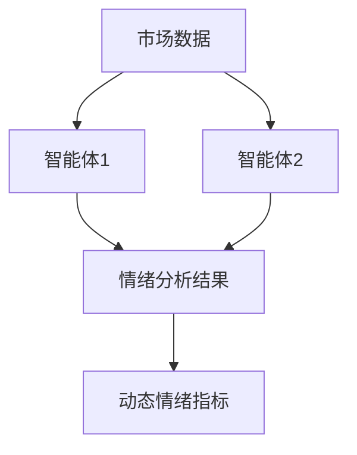
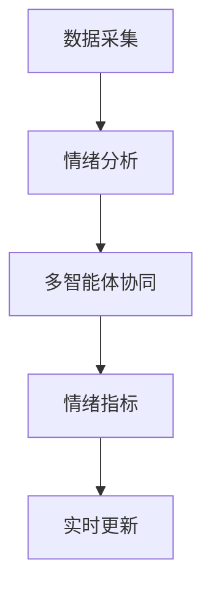
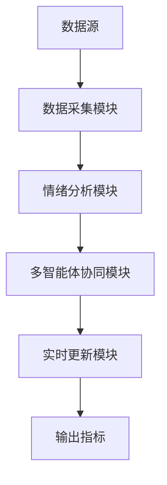
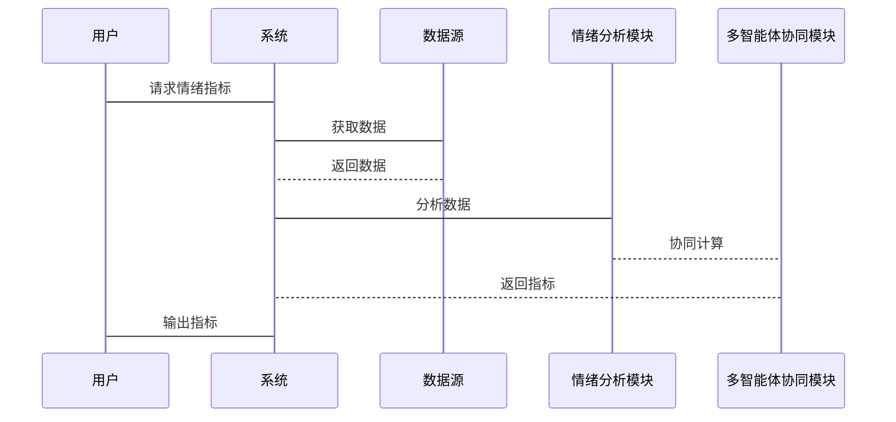

                 


# 利用多智能体AI构建动态市场情绪指标

> 关键词：多智能体AI、市场情绪指标、动态指标、协同智能、实时分析

> 摘要：本文详细探讨了如何利用多智能体人工智能技术构建动态市场情绪指标。通过分析市场情绪的核心概念、多智能体AI的基本原理、动态指标的构建方法以及系统架构的设计，本文为读者提供了一套完整的解决方案。文章还通过实际案例展示了如何将理论应用于实践，并提出了优化建议。

---

# 第一部分: 利用多智能体AI构建动态市场情绪指标概述

## 第1章: 问题背景与目标

### 1.1 问题背景
#### 1.1.1 市场情绪分析的挑战
在金融市场中，情绪分析是理解市场波动的重要工具。然而，传统的市场情绪分析方法往往依赖单一智能体，难以捕捉市场的复杂性和动态性。多智能体AI的引入为解决这一问题提供了新的思路。

#### 1.1.2 多智能体AI的优势
多智能体AI通过多个智能体的协同工作，能够更好地捕捉市场的多维度信息，实时更新市场情绪指标。

#### 1.1.3 动态市场情绪指标的意义
动态市场情绪指标能够实时反映市场的波动，为投资者提供及时的决策支持。

### 1.2 问题描述
#### 1.2.1 市场情绪的复杂性
市场情绪受到多种因素影响，包括新闻、社交媒体、市场数据等，单一智能体难以全面捕捉这些信息。

#### 1.2.2 动态指标的定义
动态市场情绪指标是一个随时间变化的数值，反映了市场参与者的情绪变化。

#### 1.2.3 多智能体AI的应用场景
多智能体AI适用于需要实时分析和动态调整的场景，如金融市场、社交媒体监控等。

### 1.3 问题解决思路
#### 1.3.1 多智能体协同的基本原理
通过多个智能体的协同工作，每个智能体负责特定的任务，共同完成市场情绪的分析和指标计算。

#### 1.3.2 动态指标构建的关键步骤
1. 数据采集与预处理
2. 情绪分析模型的构建
3. 多智能体协同计算
4. 动态指标的实时更新

#### 1.3.3 系统设计的核心要素
1. 多智能体的通信机制
2. 情绪指标的计算方法
3. 系统的实时性要求

### 1.4 边界与外延
#### 1.4.1 系统的边界条件
1. 数据输入的范围和格式
2. 智能体的数量和类型
3. 指标的更新频率

#### 1.4.2 相关概念的外延
1. 情绪指标的分类
2. 多智能体系统的扩展性
3. 动态指标的应用范围

#### 1.4.3 实际应用中的限制
1. 数据质量和实时性
2. 智能体协同的复杂性
3. 系统的可扩展性

### 1.5 概念结构与核心要素
#### 1.5.1 核心概念的层次结构
1. 市场情绪分析
   - 数据采集
   - 情绪分析
   - 指标计算
2. 多智能体AI
   - 智能体设计
   - 协同机制
   - 通信协议

#### 1.5.2 关键要素的属性分析
| 要素 | 属性 |
|------|------|
| 数据采集 | 实时性、多样性、准确性 |
| 情绪分析 | 精度、效率、可解释性 |
| 指标计算 | 动态性、实时性、可调整性 |

#### 1.5.3 系统架构的组成
1. 数据采集模块
2. 情绪分析模块
3. 指标计算模块
4. 协同控制模块

---

# 第二部分: 多智能体AI与动态市场情绪指标的核心概念

## 第2章: 多智能体AI的基本原理

### 2.1 多智能体系统原理
#### 2.1.1 多智能体系统的定义
多智能体系统是由多个智能体组成的分布式系统，每个智能体具有一定的自主性和协作能力。

#### 2.1.2 多智能体的核心特征
1. 自主性：智能体能够独立决策。
2. 反应性：智能体能够感知环境并做出反应。
3. 协作性：智能体之间能够协同完成任务。

#### 2.1.3 多智能体与单智能体的区别
| 特性 | 单智能体 | 多智能体 |
|------|----------|----------|
| 自主性 | 较低     | 较高     |
| 反应性 | 较低     | 较高     |
| 协作性 | 无       | 有       |

### 2.2 动态市场情绪指标的构建
#### 2.2.1 情绪指标的定义
情绪指标是反映市场参与者情绪的数值，通常在0到1之间，0表示极度悲观，1表示极度乐观。

#### 2.2.2 动态指标的计算方法
动态指标需要实时更新，基于最新的市场数据和情绪分析结果。

#### 2.2.3 多智能体AI的应用场景
多智能体AI可以应用于金融市场、社交媒体监控等领域，帮助实时捕捉市场情绪变化。

### 2.3 核心概念的联系
#### 2.3.1 多智能体与情绪指标的关系
多智能体AI通过协同工作，能够更全面地分析市场情绪，从而提高指标的准确性。

#### 2.3.2 智能体间的信息交互
智能体之间需要通过通信机制共享信息，协同完成情绪分析任务。

#### 2.3.3 动态指标的实时更新机制
动态指标需要实时更新，基于多智能体协同计算的结果。

---

## 第3章: 多智能体AI与动态市场情绪指标的属性对比

### 3.1 智能体属性分析
#### 3.1.1 智能体的自主性
智能体能够独立决策，减少对中心化系统的依赖。

#### 3.1.2 智能体的反应性
智能体能够感知环境变化，并做出实时反应。

#### 3.1.3 智能体的协作性
智能体之间能够协同完成任务，提高整体效率。

### 3.2 情绪指标属性分析
#### 3.2.1 指标的实时性
指标需要实时更新，反映最新的市场情绪。

#### 3.2.2 指标的动态性
指标随时间变化，反映市场情绪的波动。

#### 3.2.3 指标的可解释性
指标需要具有可解释性，便于投资者理解和应用。

### 3.3 实体关系图


---

## 第4章: 动态市场情绪指标的算法原理

### 4.1 算法原理概述
动态市场情绪指标的计算需要结合多智能体AI和情绪分析算法。

### 4.2 算法步骤
1. 数据采集：获取市场数据，包括新闻、社交媒体、交易数据等。
2. 情绪分析：利用自然语言处理技术分析数据，提取情绪特征。
3. 多智能体协同：多个智能体协同计算，生成情绪指标。
4. 实时更新：根据最新数据实时更新情绪指标。

### 4.3 算法流程图


### 4.4 算法实现
#### 4.4.1 情绪分析算法
使用自然语言处理技术，如情感分析模型，对文本进行情绪分类。

#### 4.4.2 多智能体协同算法
通过通信机制，多个智能体协同计算，生成最终的情绪指标。

### 4.5 数学模型
动态市场情绪指标的计算公式为：
$$
\text{指标} = \frac{\sum_{i=1}^{n} w_i \cdot s_i}{\sum_{i=1}^{n} w_i}
$$
其中，$w_i$ 是智能体的权重，$s_i$ 是智能体的计算结果。

---

## 第5章: 系统分析与架构设计

### 5.1 系统功能设计
#### 5.1.1 数据采集模块
负责采集市场数据，包括新闻、社交媒体、交易数据等。

#### 5.1.2 情绪分析模块
利用自然语言处理技术，分析数据，提取情绪特征。

#### 5.1.3 多智能体协同模块
多个智能体协同计算，生成情绪指标。

#### 5.1.4 实时更新模块
根据最新数据实时更新情绪指标。

### 5.2 系统架构设计


### 5.3 接口设计
1. 数据接口：用于数据采集模块与外部数据源的交互。
2. 通信接口：用于智能体之间的信息交互。
3. 输出接口：用于将情绪指标输出给用户。

### 5.4 交互流程


---

## 第6章: 项目实战

### 6.1 环境安装
1. 安装Python
2. 安装相关库：numpy、pandas、scikit-learn、networkx等。

### 6.2 核心代码实现
```python
import numpy as np
import pandas as pd

def情绪分析(data):
    # 数据预处理
    processed_data = data preprocessing
    # 情绪分类
    sentiment = emotionClassifier(processed_data)
    return sentiment

def多智能体协同(sents):
    # 智能体分配任务
    agents = 分配任务(sents)
    # 协同计算
    result =协同计算(agents)
    return result

def动态指标计算(sentiments):
    # 加权计算
    weights = np.random.rand(len(sentiments))
    normalized_weights = weights / np.sum(weights)
    指标 = np.sum(normalized_weights * sentiments)
    return 指标
```

### 6.3 案例分析
假设我们有一个包含多条新闻的数据集，通过上述代码可以计算出市场情绪指标。

### 6.4 项目小结
通过实战，我们验证了多智能体AI在动态市场情绪指标构建中的有效性。

---

## 第7章: 总结与展望

### 7.1 最佳实践
1. 数据质量是关键，确保数据来源可靠。
2. 智能体协同机制的设计需要充分考虑系统的实时性和可扩展性。
3. 指标的可解释性是实际应用中的重要考量。

### 7.2 小结
本文详细探讨了利用多智能体AI构建动态市场情绪指标的方法，通过理论分析和实践验证，证明了该方法的有效性。

### 7.3 注意事项
1. 系统的实时性要求较高，需要优化数据处理和计算效率。
2. 智能体协同机制的设计需要考虑系统的可扩展性。
3. 指标的可解释性是实际应用中的重要考量。

### 7.4 拓展阅读
1. 多智能体系统的相关研究
2. 情绪分析算法的最新进展
3. 动态指标在金融市场的应用

---

# 作者：AI天才研究院/AI Genius Institute & 禅与计算机程序设计艺术 /Zen And The Art of Computer Programming

