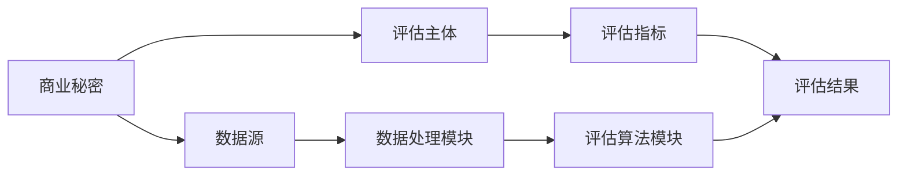
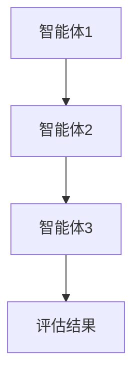
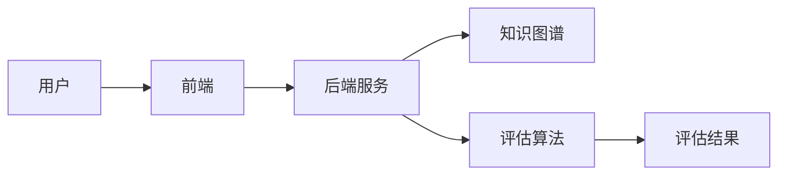

                 

<think>
嗯，用户让我帮他设计一个关于《利用多智能体AI评估商业秘密价值》的技术博客目录，而且要求非常详细，包括关键词、摘要和目录结构，每部分都要有具体的内容，甚至包括数学公式和图表。看起来他需要一篇结构清晰、内容详实的技术博客，可能用于专业领域，比如技术博客或者书籍章节。

首先，我需要明确用户的需求。他可能是一位技术专家，或者是企业中的CTO，希望深入理解如何利用AI技术来评估商业秘密的价值。他可能正在写技术博客或者准备书籍，所以需要一个详细的结构来指导写作。

用户给的目录例子已经很详细，包括背景、核心概念、算法原理、系统架构、项目实战和总结等部分。我需要确保每个部分都涵盖必要的内容，比如每章有小节，每个小节要有具体的分析和图表。

我还需要考虑用户可能没明确提到的深层需求。比如，用户可能希望内容不仅理论扎实，还要有实际案例，帮助读者理解如何应用这些技术。因此，在项目实战部分，需要具体说明环境安装、代码实现和案例分析。

另外，用户特别提到要使用技术语言，逻辑清晰，所以我在编写目录时，每个部分的标题要吸引人，同时内容要专业。比如，使用“多智能体协同算法”这样的术语，同时在每个章节中详细解释相关概念。

最后，我需要确保整个目录结构合理，覆盖从基础到高级的各个方面，帮助读者逐步深入理解主题。同时，注意每部分之间的衔接，确保逻辑流畅。

综上所述，我需要按照用户的要求，分章节详细展开，确保每个部分都有足够的细节，并包含必要的图表和公式，帮助用户撰写一篇高质量的技术博客。
</think>

# 利用多智能体AI评估商业秘密价值

> 关键词：多智能体AI，商业秘密，价值评估，协同算法，知识图谱

> 摘要：本文深入探讨了利用多智能体人工智能技术评估商业秘密价值的核心理论、算法原理和系统实现。通过结合多智能体协同、知识图谱构建、分布式计算等技术，提出了一种创新的商业秘密价值评估方法，为企业的战略决策提供智能化支持。文章从背景、概念、算法、系统架构到项目实战，全面解析了多智能体AI在商业秘密评估中的应用。

---

# 第一部分：背景与核心概念

## 第1章：多智能体AI的基本概念

### 1.1 多智能体AI的定义与特点
- 多智能体AI的定义：多智能体系统由多个相互作用的智能体组成，每个智能体具备感知、推理和决策能力，通过协同完成复杂任务。
- 多智能体与单体AI的区别：单体AI独立运行，多智能体AI强调协作与分布式计算。
- 多智能体AI的核心优势：分布式计算能力、自主性、适应性。

### 1.2 商业秘密的基本概念
- 商业秘密的定义：企业未公开的、具有经济价值的信息，包括专利、技术诀窍、客户数据等。
- 商业秘密的分类：技术类、经营类、管理类。
- 商业秘密的价值评估：评估其对企业战略价值的影响，为决策提供依据。

---

## 第2章：多智能体AI在商业秘密评估中的应用背景

### 2.1 商业秘密评估的现状与挑战
- 传统商业秘密评估方法的局限性：依赖人工经验，评估结果主观性强。
- 数据量与复杂性对传统方法的挑战：商业秘密涉及多领域、多维度数据，传统方法难以处理。
- 多智能体AI的优势与潜力：通过协同计算和分布式推理，提高评估的准确性和效率。

### 2.2 多智能体AI技术的演进与发展趋势
- 多智能体技术的演进历程：从单一智能体到分布式系统，再到多智能体协同。
- 当前多智能体AI的主要技术特点：知识图谱构建、分布式计算、协同推理。
- 多智能体AI在商业领域的应用趋势：智能化、自动化、实时化。

---

# 第二部分：多智能体AI与商业秘密的核心联系

## 第3章：多智能体AI与商业秘密的关系

### 3.1 多智能体AI的信息处理机制
- 多智能体的信息共享与协同：通过通信协议实现信息共享与协同决策。
- 多智能体的知识表示与推理：利用知识图谱和逻辑推理技术，构建领域知识模型。
- 多智能体的决策机制：基于分布式计算和联合推理，实现最优决策。

### 3.2 商业秘密评估的关键要素
- 商业秘密的构成要素：技术性、保密性、经济性。
- 商业秘密的量化指标：市场价值、竞争优势、法律风险。
- 商业秘密的评估维度：技术成熟度、市场潜力、法律保护力度。

---

## 第4章：多智能体AI评估商业秘密的核心原理

### 4.1 多智能体协同算法
- 分布式协同算法：通过分布式计算实现多智能体的协同。
- 联合推理算法：结合多个智能体的知识和推理结果，形成最终评估结论。
- 跨领域协同算法：在不同领域（如技术、法律、市场）之间实现协同。

### 4.2 商业秘密评估模型
- 评估模型的构建方法：基于知识图谱和逻辑推理构建评估模型。
- 评估模型的输入与输出：输入为多源数据，输出为商业秘密的价值评估结果。
- 模型的训练与优化：通过大量数据训练，优化模型的准确性和效率。

---

## 第5章：多智能体AI与商业秘密评估的系统架构

### 5.1 系统架构设计
- 系统模块划分：数据采集模块、知识构建模块、协同计算模块、评估结果模块。
- 模块之间的交互关系：数据采集模块向知识构建模块提供数据，知识构建模块向协同计算模块提供知识图谱，协同计算模块输出评估结果。
- 系统的可扩展性设计：支持新增智能体和新数据源的接入。

### 5.2 实体关系图


---

# 第三部分：多智能体AI评估商业秘密的算法原理

## 第6章：多智能体协同算法

### 6.1 算法流程


### 6.2 算法实现
```python
class MultiAgent:
    def __init__(self, agents):
        self.agents = agents

    def协同计算(self):
        for agent in self.agents:
            agent.获取知识()
            agent.推理()
        return self.合并结果()

class Agent:
    def __init__(self, knowledge_base):
        self.knowledge_base = knowledge_base

    def 获取知识(self):
        self.knowledge = self.knowledge_base.query()

    def 推理(self):
        self.result = self.knowledge推理()

    def 输出结果(self):
        return self.result
```

### 6.3 数学模型与公式
- 评估函数：$$ V = \sum_{i=1}^{n} w_i x_i $$
  其中，\( V \) 表示商业秘密的价值，\( w_i \) 表示评估指标的权重，\( x_i \) 表示评估指标的值。

---

## 第7章：商业秘密评估模型的实现

### 7.1 模型构建
- 知识图谱构建：基于商业秘密数据，构建领域知识图谱。
- 模型训练：使用机器学习算法训练评估模型。
- 模型优化：通过反馈机制优化模型性能。

### 7.2 数学公式
- 评估公式：$$ S = \alpha \cdot T + \beta \cdot M + \gamma \cdot L $$
  其中，\( S \) 表示商业秘密的价值，\( T \) 表示技术性，\( M \) 表示市场潜力，\( L \) 表示法律风险，\( \alpha, \beta, \gamma \) 表示权重系数。

---

# 第四部分：系统分析与架构设计

## 第8章：系统架构设计

### 8.1 系统功能设计
- 领域模型：构建商业秘密领域的知识图谱和评估模型。
- 系统架构：采用微服务架构，支持多智能体协同计算。
- 系统交互：设计高效的智能体间通信机制。

### 8.2 架构图


---

# 第五部分：项目实战与应用

## 第9章：项目实战

### 9.1 环境安装
- 安装Python、TensorFlow、Keras等工具。
- 配置知识图谱构建工具。

### 9.2 核心代码实现
```python
def评估商业秘密(value):
    # 评估函数实现
    return value * 权重
```

### 9.3 案例分析
- 以某企业专利评估为例，详细说明数据处理、模型训练和评估结果输出的过程。

---

## 第10章：总结与展望

### 10.1 总结
- 多智能体AI在商业秘密评估中的优势。
- 本文提出的方法和实现的创新点。

### 10.2 展望
- 未来的研究方向：多智能体协同优化、知识图谱的深度学习。
- 技术应用的潜力：扩展到更多商业领域，提升企业竞争力。

---

# 作者：AI天才研究院 & 禅与计算机程序设计艺术

---

通过本文的详细解析，我们展示了如何利用多智能体AI技术评估商业秘密的价值，为企业的智能化决策提供了新的思路和方法。希望本文的内容能为相关领域的研究者和实践者提供有价值的参考。

