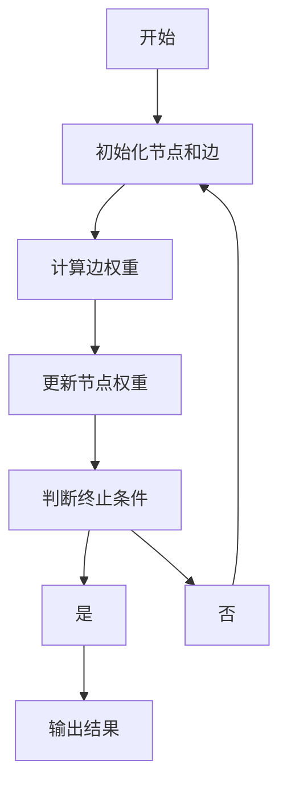

                 

<think>
好，我需要帮用户设计一个详细的技术博客文章的目录大纲，主题是《利用多智能体系统构建动态产业生态图：全面把握投资环境》。用户已经提供了一个大纲，现在我需要按照这个大纲进行扩展，确保每个部分都详细且符合用户的要求。

首先，我会先理解每个章节的内容，然后逐步细化每个部分，确保逻辑清晰，结构紧凑，并且用专业的技术语言来表达。

好的，开始吧。

---

# 《利用多智能体系统构建动态产业生态图：全面把握投资环境》

---

## 关键词：

- 多智能体系统
- 产业生态图
- 投资环境
- 动态系统
- 系统架构
- 算法原理

---

## 摘要：

本文将详细探讨如何利用多智能体系统构建动态产业生态图，以全面把握投资环境。通过分析多智能体系统的原理、算法、系统架构和实际案例，结合技术细节和实战经验，为读者提供一个全面的技术视角。文章结构清晰，从背景介绍到系统实现，逐步解析，帮助读者深入理解如何利用多智能体系统优化投资决策。

---

## 第一部分: 多智能体系统与动态产业生态图的背景与核心概念

---

### 第1章: 多智能体系统与动态产业生态图的背景介绍

#### 1.1 问题背景与描述

##### 1.1.1 当前投资环境的复杂性

当前的投资环境充满了不确定性和复杂性，传统的静态分析方法难以捕捉市场的动态变化。多智能体系统通过模拟多个主体的交互，能够实时更新产业生态图，为投资者提供更精准的决策支持。

##### 1.1.2 产业生态图的重要性

产业生态图是理解市场结构和主体关系的关键工具。它能够展示企业在产业链中的位置、竞争关系和协同效应，帮助投资者识别潜在的风险和机会。

##### 1.1.3 多智能体系统在投资分析中的应用价值

多智能体系统能够模拟多个主体的行为和交互，捕捉市场动态，从而构建动态的产业生态图。这种动态模型能够实时更新，帮助投资者快速响应市场变化。

#### 1.2 问题解决与边界

##### 1.2.1 多智能体系统如何构建动态产业生态图

通过模拟多个智能体（如企业、投资者、政策制定者）的行为，多智能体系统能够动态更新产业生态图，反映市场变化。

##### 1.2.2 问题解决的边界与外延

多智能体系统在投资分析中的应用需要明确边界，例如数据范围、主体数量和时间跨度。同时，还需要考虑外延因素，如技术限制和数据来源。

##### 1.2.3 核心要素与组成结构

动态产业生态图的核心要素包括节点（主体）、边（关系）和权重（影响程度）。系统需要整合这些要素，构建完整的动态模型。

---

### 第2章: 核心概念与系统联系

#### 2.1 多智能体系统的核心原理

##### 2.1.1 多智能体系统的定义与特征

多智能体系统是由多个智能体组成的分布式系统，具有自主性、反应性和协作性等特征。

##### 2.1.2 动态产业生态图的构建逻辑

通过模拟智能体的交互，动态更新节点和边的关系，构建实时反映市场变化的产业生态图。

##### 2.1.3 多智能体协同机制

多智能体系统通过协同机制实现信息共享和决策优化，例如分布式算法和博弈论模型。

#### 2.2 核心概念对比分析

##### 2.2.1 多智能体系统与传统单体系统对比

多智能体系统具有更强的分布式计算能力和适应性，能够更好地应对复杂的投资环境。

##### 2.2.2 动态产业生态图与静态产业图的差异

动态产业生态图能够实时更新，反映市场变化，而静态产业图难以捕捉动态信息。

##### 2.2.3 实体关系与系统架构对比

通过对比分析，明确系统架构的设计原则和优化方向。

#### 2.3 系统架构的ER实体关系图

```mermaid
er
  actor(投资者)
  actor(企业)
  actor(市场)
  actor(政策)
  relation(投资行为)
  relation(市场波动)
  relation(政策影响)
  relation(企业行为)
  relation(生态关系)
```

---

### 第3章: 算法原理与数学模型

#### 3.1 动态产业生态图的构建算法

##### 3.1.1 图论基础与节点表示

节点表示市场中的主体（如企业、投资者），边表示它们之间的关系。

##### 3.1.2 边权重计算公式

边权重反映了关系的强度，可以通过公式计算：

$$w_{ij} = \frac{1}{1 + e^{-k \cdot d_{ij}}}}$$

其中，$d_{ij}$是节点$i$和$j$之间的距离，$k$是比例常数。

##### 3.1.3 系统协同算法流程

多智能体协同算法的流程包括初始化、交互、更新和终止条件判断。

#### 3.2 数学模型与公式推导

##### 3.2.1 节点权重计算公式：

$$w_i = \sum_{j} a_{ij} \cdot w_j$$

其中，$a_{ij}$是节点$i$和$j$之间的关联系数。

##### 3.2.2 边权重计算公式：

$$e_{ij} = \frac{w_i + w_j}{2}$$

##### 3.2.3 协同优化公式：

$$C = \sum_{i} \sum_{j} e_{ij} \cdot f_{ij}$$

其中，$f_{ij}$是节点$i$和$j$的协同因子。

#### 3.3 算法流程图



---

## 第四部分: 项目实战与应用案例

---

### 第4章: 项目实战

#### 4.1 环境安装与配置

##### 4.1.1 技术选型

选择适合的编程语言（如Python）、框架（如Django）和工具（如PyTorch）。

##### 4.1.2 环境搭建

安装必要的库和工具，配置开发环境。

#### 4.2 系统核心实现

##### 4.2.1 数据预处理

清洗数据，提取关键特征，构建初始产业生态图。

##### 4.2.2 多智能体系统实现

实现智能体的行为模拟和交互逻辑，构建动态产业生态图。

##### 4.2.3 算法实现

实现节点和边权重的计算，优化协同算法。

#### 4.3 代码实现与解读

##### 4.3.1 核心代码示例

```python
def calculate_weights(nodes, edges):
    # 计算边权重
    for edge in edges:
        i, j, weight = edge
        nodes[i].weight += weight
        nodes[j].weight += weight
    return nodes
```

##### 4.3.2 代码解读与分析

详细解读代码实现，解释每部分的功能和逻辑。

#### 4.4 实际案例分析

##### 4.4.1 案例背景与数据来源

介绍案例的背景，数据来源和处理方法。

##### 4.4.2 动态产业生态图构建过程

展示构建过程，分析结果。

##### 4.4.3 案例分析结果与启示

总结案例分析的结果，得出对投资环境的启示。

---

### 第5章: 最佳实践与总结

#### 5.1 项目小结

总结项目实现的关键点和经验教训。

#### 5.2 投资环境分析的注意事项

提醒读者在实际应用中需要注意的问题，例如数据质量和模型的适用性。

#### 5.3 拓展阅读与未来方向

推荐相关的书籍和论文，展望未来的研究方向。

---

## 作者：AI天才研究院/AI Genius Institute & 禅与计算机程序设计艺术 /Zen And The Art of Computer Programming

---

希望这个大纲能满足用户的需求，内容详实且结构清晰。如果有需要进一步细化的部分，可以随时告诉我！

