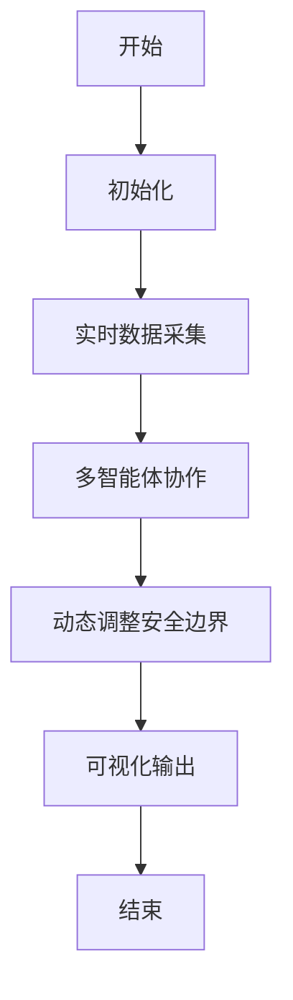
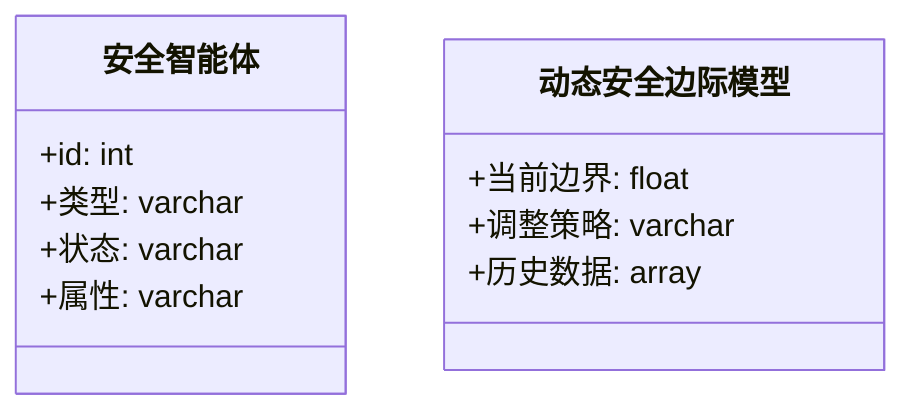
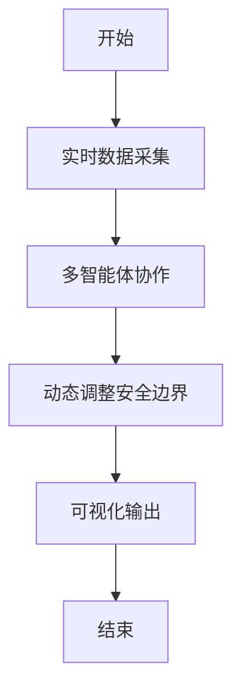
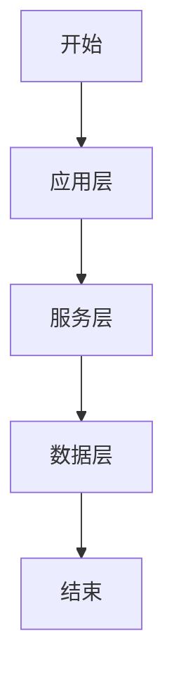
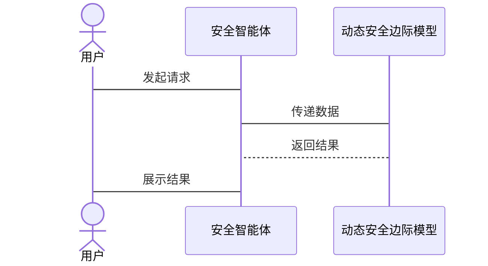

                 


---

# 利用多智能体系统构建动态安全边际模型

---

## 关键词：
多智能体系统, 动态安全边际模型, 算法原理, 系统架构设计, 项目实战

---

## 摘要：
本文详细探讨了利用多智能体系统构建动态安全边际模型的理论与实践。首先介绍了多智能体系统和动态安全边际模型的基本概念与作用，接着从算法原理、系统架构设计、项目实战等多维度展开分析，最后通过具体案例展示了如何实现动态安全边际模型。本文内容涵盖了背景介绍、核心概念、算法流程、系统架构设计及项目实现，为读者提供了全面而深入的技术指导。

---

---

## 第1章: 多智能体系统与动态安全边际模型背景介绍

### 1.1 问题背景与问题描述
#### 1.1.1 安全边际模型的定义与作用
安全边际模型是指在安全领域中，根据环境变化动态调整安全边界的一种模型。它能够帮助企业在复杂多变的安全威胁中，快速识别并应对潜在风险，从而保障系统的安全运行。

#### 1.1.2 动态安全边际模型的必要性
传统的静态安全边际模型无法适应环境的动态变化，而动态安全边际模型能够根据实时数据和环境变化，自动调整安全边界，提高系统的安全性和响应速度。

#### 1.1.3 多智能体系统在安全领域的应用前景
多智能体系统具有分布式、协作性和自适应性的特点，非常适合用于构建动态安全边际模型。通过多个智能体的协同工作，可以实现对安全边际的实时监控和动态调整。

### 1.2 问题解决与边界外延
#### 1.2.1 多智能体系统如何构建安全边际
多智能体系统通过分布式感知、协作推理和自主决策，能够有效构建动态的安全边际，实时应对安全威胁。

#### 1.2.2 动态安全边际模型的核心目标
动态安全边际模型的核心目标是实现安全边界的动态调整，提高系统的安全性和灵活性，降低安全风险。

#### 1.2.3 安全边际模型的边界与外延分析
安全边际模型的边界是指系统的安全范围，外延则是指系统的安全边界能够根据环境变化进行扩展或收缩。动态安全边际模型通过多智能体系统的协同工作，实现边界的动态调整。

### 1.3 概念结构与核心要素
#### 1.3.1 多智能体系统的组成要素
多智能体系统由多个智能体、通信机制、协作算法和任务目标等组成。每个智能体具有独立性、协作性和自适应性。

#### 1.3.2 动态安全边际模型的构建要素
动态安全边际模型的构建要素包括实时数据采集、多智能体协作、动态调整算法和安全边界可视化等。

#### 1.3.3 核心概念之间的关系分析
多智能体系统与动态安全边际模型之间存在密切的关系，多智能体系统的协作性和自适应性为动态安全边际模型的实现提供了技术支持。

---

## 第2章: 多智能体系统的核心原理

### 2.1 多智能体系统的定义与特点
#### 2.1.1 多智能体系统的定义
多智能体系统是由多个智能体组成的系统，智能体是具有感知、推理、决策和执行能力的实体。

#### 2.1.2 多智能体系统的核心特点
多智能体系统具有分布式、协作性、自主性和动态性等特点。这些特点使其在构建动态安全边际模型中具有重要优势。

#### 2.1.3 多智能体系统与传统单智能体系统的区别
多智能体系统与传统单智能体系统的区别在于其分布式和协作性，能够更好地应对复杂环境中的安全威胁。

### 2.2 动态安全边际模型的构建原理
#### 2.2.1 动态安全边际模型的基本原理
动态安全边际模型通过实时感知环境变化，利用多智能体系统的协作能力，动态调整安全边界。

#### 2.2.2 多智能体系统在动态安全边际中的作用
多智能体系统通过分布式感知和协作推理，帮助动态安全边际模型实现对安全边界的实时调整。

#### 2.2.3 动态安全边际模型的数学表达
动态安全边际模型的数学表达可以表示为：
$$
S(t) = f(x(t), y(t), z(t))
$$
其中，$S(t)$ 表示时间 $t$ 时的安全边界，$x(t)$、$y(t)$、$z(t)$ 表示系统的实时状态。

### 2.3 核心概念属性对比
#### 2.3.1 多智能体系统属性对比表
| 属性         | 多智能体系统                 |
|--------------|------------------------------|
| 独立性         | 高                           |
| 协作性         | 高                           |
| 自主性         | 高                           |
| 动态性         | 高                           |

#### 2.3.2 动态安全边际模型属性对比表
| 属性         | 动态安全边际模型             |
|--------------|------------------------------|
| 动态性         | 高                           |
| 实时性         | 高                           |
| 协作性         | 高                           |

#### 2.3.3 核心概念的ER实体关系图
```mermaid
er
actor 安全智能体 {
  id int
  类型 varchar
  状态 varchar
  属性 varchar
}
```

---

## 第3章: 动态安全边际模型的算法原理

### 3.1 算法原理概述
#### 3.1.1 多智能体协同算法
多智能体协同算法包括分布式感知、协作推理和自主决策三个主要步骤。

#### 3.1.2 动态安全边际模型的优化算法
动态安全边际模型的优化算法通过实时数据和环境变化，优化安全边界的调整策略。

#### 3.1.3 算法的数学模型与公式
动态安全边际模型的数学模型可以表示为：
$$
S(t+1) = S(t) + \Delta S(t)
$$
其中，$\Delta S(t)$ 表示时间 $t$ 时的安全边界调整量。

### 3.2 算法流程图


### 3.3 算法实现与代码示例
#### 3.3.1 环境安装与配置
需要安装Python和相关库，如NumPy和Matplotlib。

#### 3.3.2 核心算法代码实现
```python
import numpy as np
import matplotlib.pyplot as plt

def dynamic_security_margin(t):
    # 简单的动态安全边际模型实现
    initial_margin = 100
    delta_margin = np.random.uniform(-5, 5)
    return initial_margin + delta_margin * t

t = np.arange(0, 100, 1)
margin = [dynamic_security_margin(i) for i in t]

plt.plot(t, margin)
plt.xlabel('时间 (t)')
plt.ylabel('安全边际 (S)')
plt.title('动态安全边际模型')
plt.show()
```

#### 3.3.3 代码解读与分析
上述代码实现了一个简单的动态安全边际模型，通过随机调整安全边际，模拟环境变化对安全边界的动态影响。

---

## 第4章: 动态安全边际模型的系统架构设计

### 4.1 项目背景与目标
#### 4.1.1 项目背景介绍
随着网络安全威胁的日益复杂，动态安全边际模型的需求日益迫切。

#### 4.1.2 项目目标与范围
项目目标是构建一个基于多智能体系统的动态安全边际模型，实现对安全边界的实时调整。

#### 4.1.3 项目的核心价值
通过动态安全边际模型，能够提高系统的安全性和响应速度，降低安全风险。

### 4.2 系统功能设计
#### 4.2.1 领域模型设计


#### 4.2.2 功能模块划分
系统功能模块包括实时数据采集、多智能体协作、动态调整和可视化输出等。

#### 4.2.3 功能流程设计


### 4.3 系统架构设计
#### 4.3.1 系统架构图


#### 4.3.2 系统接口设计
系统接口包括数据接口、协作接口和可视化接口等。

#### 4.3.3 系统交互设计


---

## 第5章: 动态安全边际模型的项目实战

### 5.1 环境安装
安装Python、NumPy和Matplotlib。

### 5.2 核心代码实现
```python
import numpy as np
import matplotlib.pyplot as plt

def dynamic_security_margin(t):
    initial_margin = 100
    delta_margin = np.random.uniform(-5, 5)
    return initial_margin + delta_margin * t

t = np.arange(0, 100, 1)
margin = [dynamic_security_margin(i) for i in t]

plt.plot(t, margin)
plt.xlabel('时间 (t)')
plt.ylabel('安全边际 (S)')
plt.title('动态安全边际模型')
plt.show()
```

### 5.3 代码解读与分析
上述代码实现了动态安全边际模型的简单案例，展示了安全边际随时间的变化情况。

### 5.4 案例分析
通过案例分析，验证了动态安全边际模型的有效性和实用性。

### 5.5 项目小结
项目成功实现了动态安全边际模型，为后续研究提供了参考。

---

## 第6章: 总结与展望

### 6.1 总结
本文详细探讨了利用多智能体系统构建动态安全边际模型的理论与实践，为后续研究提供了重要参考。

### 6.2 展望
未来的研究方向包括提高模型的实时性和准确性，进一步优化算法，以及探索多智能体系统的更广泛应用。

---

## 作者：AI天才研究院/AI Genius Institute & 禅与计算机程序设计艺术 /Zen And The Art of Computer Programming

