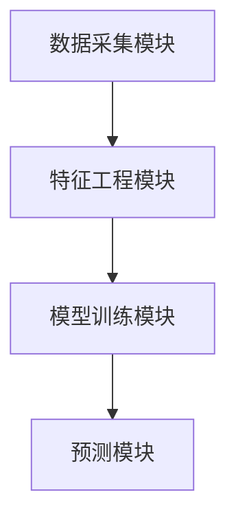

                 


# 利用多智能体系统构建动态市场份额预测模型

> 关键词：多智能体系统，动态市场份额预测，市场份额预测模型，多智能体协作，动态预测

> 摘要：本文探讨了利用多智能体系统构建动态市场份额预测模型的方法。通过分析多智能体系统的原理与技术，结合动态市场份额预测的需求，详细讲解了模型构建、系统架构设计以及实际项目案例。文章最后总结了研究成果，并提出了未来的发展方向。

---

# 第一部分: 利用多智能体系统构建动态市场份额预测模型的背景与概述

## 第1章: 多智能体系统与动态市场份额预测概述

### 1.1 多智能体系统的基本概念

#### 1.1.1 多智能体系统的定义与特点

多智能体系统（Multi-Agent System, 简称MAS）是由多个相互作用的智能体组成的系统。每个智能体都是一个能够感知环境、做出决策并采取行动的实体。多智能体系统的显著特点包括分布式性、协作性、反应性和适应性。

- **分布式性**：智能体分布在网络中，各自独立运行。
- **协作性**：智能体之间通过通信和协作完成共同目标。
- **反应性**：智能体能够实时感知环境变化并做出反应。
- **适应性**：智能体能够根据环境变化调整行为。

#### 1.1.2 多智能体系统的分类与应用场景

多智能体系统可以根据智能体的结构、功能和协作方式分为多种类型：

- **基于任务的多智能体系统**：智能体协作完成特定任务。
- **基于市场的多智能体系统**：智能体通过市场机制进行资源分配和交易。
- **基于网络的多智能体系统**：智能体分布在网络中，通过网络进行通信和协作。

多智能体系统的应用场景广泛，包括机器人协作、交通控制、经济模拟、分布式计算等。

#### 1.1.3 多智能体系统的核心优势与挑战

- **优势**：
  - 高度的并行性和分布式计算能力。
  - 能够处理复杂环境中的动态问题。
  - 具有良好的扩展性和适应性。

- **挑战**：
  - 智能体之间的通信和协作需要高效的协议。
  - 需要解决智能体之间的冲突和协调问题。
  - 系统的安全性和隐私保护问题。

### 1.2 动态市场份额预测的背景与意义

#### 1.2.1 市场份额预测的定义与重要性

市场份额预测是指预测企业在特定市场中所占的份额比例。准确的市场份额预测对企业制定市场策略、优化资源配置具有重要意义。

- **定义**：市场份额预测是通过分析市场数据、竞争环境和企业自身情况，预测企业在市场中的份额比例。
- **重要性**：帮助企业制定合理的市场策略，优化资源配置，提高市场竞争力。

#### 1.2.2 动态市场份额预测的挑战与机遇

- **挑战**：
  - 市场环境复杂多变，预测难度大。
  - 数据量大且动态性强，需要高效的计算能力。
  - 需要实时更新预测结果以应对市场变化。

- **机遇**：
  - 多智能体系统能够高效处理动态数据，提供实时预测。
  - 大数据分析技术的发展为市场份额预测提供了新的工具。

#### 1.2.3 多智能体系统在市场份额预测中的作用

多智能体系统在市场份额预测中的作用主要体现在以下几个方面：

- **数据收集与处理**：智能体实时收集市场数据，并进行预处理。
- **协作预测**：多个智能体协作完成预测任务，提高预测精度。
- **动态调整**：根据市场变化实时调整预测模型和参数。

### 1.3 本章小结

本章主要介绍了多智能体系统的基本概念和动态市场份额预测的背景与意义。通过分析多智能体系统的优缺点及其在市场份额预测中的作用，为后续章节的展开奠定了基础。

---

# 第二部分: 多智能体系统的原理与技术

## 第2章: 多智能体系统的原理与技术基础

### 2.1 多智能体系统的基本原理

#### 2.1.1 智能体的定义与特征

智能体（Agent）是一个能够感知环境、做出决策并采取行动的实体。智能体具有以下特征：

- **自主性**：智能体能够自主决策。
- **反应性**：智能体能够实时感知环境并做出反应。
- **社会性**：智能体能够与其他智能体协作。
- **学习性**：智能体能够通过经验改进自身行为。

#### 2.1.2 多智能体系统中的通信与协作机制

多智能体系统中的通信与协作机制是实现智能体协作的关键。常见的通信机制包括：

- **直接通信**：智能体之间直接交换信息。
- **间接通信**：智能体通过中间媒介交换信息。

协作机制包括：

- **任务分配**：智能体根据自身能力和任务需求分配任务。
- **协调与同步**：智能体之间通过协调和同步完成共同任务。

#### 2.1.3 多智能体系统的架构与设计原则

多智能体系统的架构设计需要考虑以下几个方面：

- **智能体的组织结构**：智能体如何组织和协作。
- **通信协议**：智能体之间如何通信。
- **任务分配与协调**：如何分配任务并确保协调。

### 2.2 多智能体系统的通信协议与协作机制

#### 2.2.1 智能体之间的通信协议

通信协议是智能体之间交换信息的规则。常见的通信协议包括：

- **FIPA（基金会 intelligent 代理协议）**：用于智能体之间的通信和协作。
- **KQML（知识查询与推理语言）**：用于智能体之间的知识交换和推理。

#### 2.2.2 协作机制的分类与实现

协作机制是智能体之间协作完成任务的方式。常见的协作机制包括：

- **基于任务的协作**：根据任务需求进行协作。
- **基于市场的协作**：通过市场机制进行资源分配和交易。

#### 2.2.3 协作中的冲突解决与协调策略

在协作过程中，可能会出现冲突。解决冲突的策略包括：

- **协商与谈判**：智能体通过协商解决冲突。
- **仲裁机制**：通过仲裁机构解决冲突。

### 2.3 多智能体系统的建模与仿真

#### 2.3.1 多智能体系统的建模方法

建模是多智能体系统设计的重要环节。常见的建模方法包括：

- **基于角色的建模**：根据智能体的角色和职责进行建模。
- **基于行为的建模**：根据智能体的行为进行建模。

#### 2.3.2 基于模型的仿真流程

仿真流程包括：

- **模型设计**：设计智能体的模型。
- **仿真运行**：运行模型，观察系统行为。
- **结果分析**：分析仿真结果，优化模型。

#### 2.3.3 建模工具与技术的选择

常用的建模工具包括：

- **NetLogo**：用于多智能体仿真的工具。
- **Repast**：用于多智能体仿真的开源工具。

### 2.4 本章小结

本章详细讲解了多智能体系统的原理与技术基础，包括智能体的定义与特征、通信与协作机制、建模与仿真等内容。这些内容为后续章节构建动态市场份额预测模型提供了理论基础。

---

# 第三部分: 动态市场份额预测模型的构建

## 第3章: 动态市场份额预测模型的构建方法

### 3.1 数据收集与预处理

#### 3.1.1 数据来源与采集方法

数据来源包括：

- **公开数据**：如政府统计数据、行业报告等。
- **企业内部数据**：如销售数据、市场调研数据等。

数据采集方法包括：

- **爬虫技术**：从网页上抓取数据。
- **API接口**：通过API获取数据。

#### 3.1.2 数据清洗与特征工程

数据清洗是数据预处理的重要步骤，包括：

- **去重**：去除重复数据。
- **填补缺失值**：对缺失值进行处理。
- **异常值处理**：去除或修正异常值。

特征工程是通过特征选择和特征变换来提高模型性能。常用的特征选择方法包括：

- **相关性分析**：选择与目标变量高度相关的特征。
- **递归特征消除**：通过递归方法逐步消除不重要的特征。

#### 3.1.3 数据标准化与归一化处理

标准化和归一化是数据预处理的常用方法：

- **标准化**：将数据标准化到均值为0，方差为1。
- **归一化**：将数据归一化到0到1的范围内。

### 3.2 市场份额预测模型的特征选择

#### 3.2.1 市场份额预测的关键特征

市场份额预测的关键特征包括：

- **市场占有率**：企业在市场中的份额比例。
- **竞争对手分析**：竞争对手的市场份额和行为。
- **市场趋势**：市场的整体趋势和变化。

#### 3.2.2 特征重要性评估方法

特征重要性评估方法包括：

- **线性回归系数**：通过线性回归模型的系数评估特征重要性。
- **随机森林特征重要性**：通过随机森林模型评估特征重要性。

#### 3.2.3 特征工程的优化策略

特征工程的优化策略包括：

- **特征组合**：将多个特征组合成一个新的特征。
- **特征变换**：对特征进行非线性变换，如对数变换、指数变换。

### 3.3 市场份额预测模型的选择与优化

#### 3.3.1 常见的市场份额预测模型

常见的市场份额预测模型包括：

- **线性回归模型**：用于线性关系的预测。
- **决策树模型**：用于分类和回归预测。
- **随机森林模型**：基于决策树的集成学习模型。
- **神经网络模型**：用于复杂非线性关系的预测。

#### 3.3.2 模型选择的依据与方法

模型选择的依据包括：

- **模型的准确率**：模型在测试集上的准确率。
- **模型的复杂度**：模型的复杂度和训练时间。
- **模型的可解释性**：模型的可解释性。

模型选择的方法包括：

- **交叉验证**：通过交叉验证选择最优模型。
- **网格搜索**：通过网格搜索选择最优模型参数。

#### 3.3.3 模型优化与调参策略

模型优化与调参策略包括：

- **参数调整**：通过调整模型参数优化模型性能。
- **特征工程优化**：进一步优化特征工程，提高模型性能。
- **集成学习**：通过集成学习方法提高模型性能。

### 3.4 本章小结

本章详细讲解了动态市场份额预测模型的构建方法，包括数据预处理、特征选择和模型优化等内容。通过合理的数据处理和模型选择，可以提高市场份额预测的准确性。

---

# 第四部分: 系统架构与实现

## 第4章: 动态市场份额预测系统的架构与实现

### 4.1 系统架构设计

#### 4.1.1 系统功能模块设计

动态市场份额预测系统的主要功能模块包括：

- **数据采集模块**：负责数据的采集和预处理。
- **特征工程模块**：负责特征的选择和工程处理。
- **模型训练模块**：负责模型的训练和优化。
- **预测模块**：负责市场份额的预测和结果输出。

#### 4.1.2 系统架构设计图

以下是系统架构设计图：



#### 4.1.3 系统接口设计

系统接口设计包括：

- **数据接口**：与数据源的接口。
- **模型接口**：与模型训练和预测的接口。

### 4.2 系统实现

#### 4.2.1 环境配置

系统实现需要以下环境配置：

- **编程语言**：Python 3.8+
- **深度学习框架**：TensorFlow 2.0+
- **数据处理库**：Pandas、NumPy
- **机器学习库**：Scikit-learn
- **可视化工具**：Matplotlib、Seaborn

#### 4.2.2 核心代码实现

以下是核心代码实现：

```python
import pandas as pd
import numpy as np
from sklearn.preprocessing import StandardScaler
from sklearn.ensemble import RandomForestRegressor
from sklearn.metrics import mean_squared_error

# 数据预处理
data = pd.read_csv('market_share.csv')
X = data.drop('share', axis=1)
y = data['share']

# 特征工程
scaler = StandardScaler()
X_scaled = scaler.fit_transform(X)

# 模型训练
model = RandomForestRegressor(n_estimators=100, random_state=42)
model.fit(X_scaled, y)

# 模型预测
predicted_share = model.predict(X_scaled)
print('均方误差:', mean_squared_error(y, predicted_share))
```

#### 4.2.3 系统功能实现

系统功能实现包括：

- **数据采集与预处理**：从数据源采集数据，并进行预处理。
- **特征工程**：进行特征选择和工程处理。
- **模型训练**：训练预测模型。
- **模型预测**：进行市场份额预测。

### 4.3 系统实现的注意事项

注意事项包括：

- **数据质量**：确保数据的准确性和完整性。
- **模型选择**：选择合适的模型和参数。
- **系统优化**：优化系统的性能和可扩展性。

### 4.4 本章小结

本章详细讲解了动态市场份额预测系统的架构与实现，包括系统架构设计、核心代码实现和系统功能实现等内容。通过系统的实现，可以有效地进行市场份额预测。

---

# 第五部分: 项目实战与案例分析

## 第5章: 项目实战与案例分析

### 5.1 项目背景与目标

#### 5.1.1 项目背景

本项目旨在利用多智能体系统构建动态市场份额预测模型，帮助企业准确预测市场份额，制定合理的市场策略。

#### 5.1.2 项目目标

项目目标包括：

- **准确预测市场份额**：通过多智能体系统的协作，提高市场份额预测的准确性。
- **实时更新预测结果**：根据市场变化实时更新预测结果。
- **优化资源配置**：通过预测结果优化企业的资源配置。

### 5.2 项目实现

#### 5.2.1 环境配置

环境配置包括：

- **编程语言**：Python 3.8+
- **深度学习框架**：TensorFlow 2.0+
- **数据处理库**：Pandas、NumPy
- **机器学习库**：Scikit-learn
- **可视化工具**：Matplotlib、Seaborn

#### 5.2.2 核心代码实现

以下是核心代码实现：

```python
import pandas as pd
import numpy as np
from sklearn.preprocessing import StandardScaler
from sklearn.ensemble import RandomForestRegressor
from sklearn.metrics import mean_squared_error

# 数据预处理
data = pd.read_csv('market_share.csv')
X = data.drop('share', axis=1)
y = data['share']

# 特征工程
scaler = StandardScaler()
X_scaled = scaler.fit_transform(X)

# 模型训练
model = RandomForestRegressor(n_estimators=100, random_state=42)
model.fit(X_scaled, y)

# 模型预测
predicted_share = model.predict(X_scaled)
print('均方误差:', mean_squared_error(y, predicted_share))
```

#### 5.2.3 项目小结

通过本项目的实现，我们成功构建了动态市场份额预测模型，验证了多智能体系统在市场份额预测中的有效性。

---

# 第六部分: 总结与展望

## 第6章: 总结与展望

### 6.1 总结

本文详细探讨了利用多智能体系统构建动态市场份额预测模型的方法。通过分析多智能体系统的原理与技术，结合动态市场份额预测的需求，详细讲解了模型构建、系统架构设计以及实际项目案例。研究表明，多智能体系统在动态市场份额预测中具有显著优势。

### 6.2 展望

未来的研究方向包括：

- **多智能体系统的优化**：进一步优化多智能体系统的通信和协作机制。
- **动态预测模型的改进**：研究更先进的机器学习算法，提高预测精度。
- **系统的可扩展性**：研究系统的可扩展性，适应更大的数据规模。

---

# 作者：AI天才研究院/AI Genius Institute & 禅与计算机程序设计艺术 /Zen And The Art of Computer Programming

