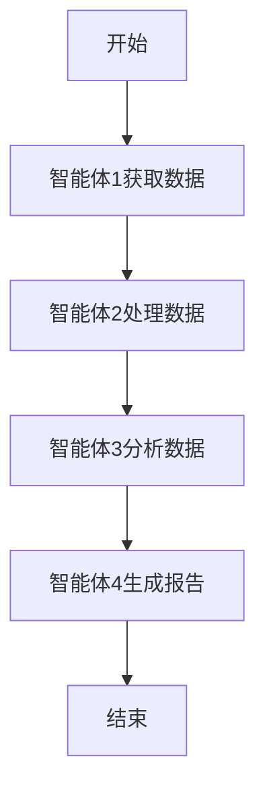
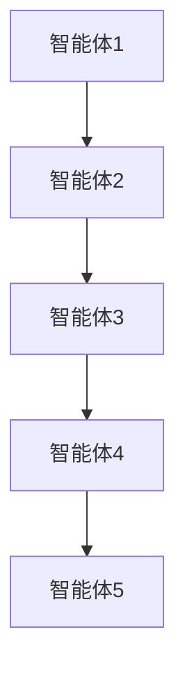
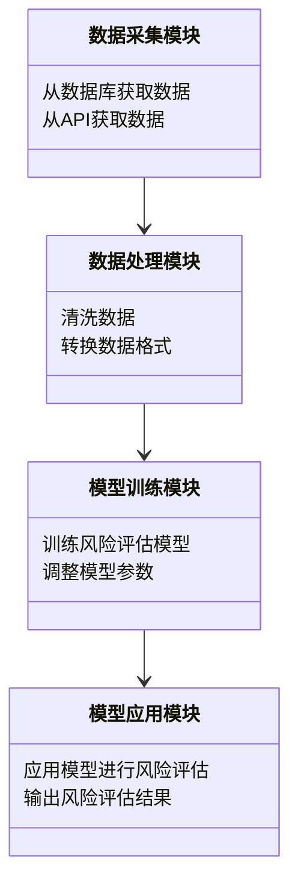
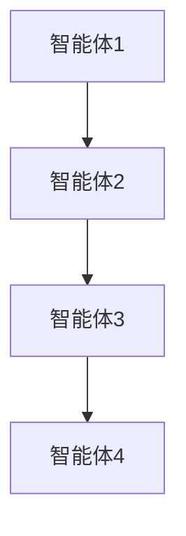

                 

<think>
嗯，用户让我详细描述一个思考过程，看起来是想让我模拟一个专家在撰写技术博客时的思考过程。根据之前的对话，用户已经提供了详细的目录结构，现在用户希望我按照这个结构，逐步分析和撰写文章的各个部分。

首先，我需要理解用户的需求。用户希望文章结构清晰，逻辑严谨，涵盖从基础到实际应用的各个方面。这意味着我需要从多智能体系统的概述开始，逐步深入到算法原理、系统架构设计，最后通过项目实战来巩固知识。

在撰写过程中，我需要确保每个章节都有足够的细节，比如在“多智能体系统概述”部分，我需要解释基本概念，公司治理风险评估的重要性，以及两者结合的应用前景。这部分需要通俗易懂，同时具备专业性。

接下来，核心概念与联系部分，我需要用图表来辅助理解，比如ER图和Mermaid流程图。这需要我明确各个实体之间的关系，并通过图表展示它们如何协作。

算法原理部分，我需要详细讲解数学模型和公式，确保读者能够理解如何构建动态风险评估模型。这包括解释公式背后的逻辑，以及如何通过代码实现这些算法。

系统架构设计是关键，我需要从问题场景出发，设计功能模块，并用类图和序列图展示系统的结构和交互过程。这有助于读者理解系统的整体布局和各部分如何协同工作。

项目实战部分，我需要提供具体的代码示例，指导读者如何安装环境、编写代码，并通过实际案例分析应用。这部分要确保步骤清晰，代码可运行，帮助读者实际操作。

最后，总结部分需要回顾整个内容，给出最佳实践的建议，并提醒读者在实施过程中可能遇到的问题。同时，推荐进一步阅读的资料，帮助读者深入学习。

在撰写过程中，我需要确保语言简洁、专业，同时保持逻辑的连贯性。每个章节的小结要简明扼要，帮助读者梳理要点。此外，注意使用适当的格式，如数学公式用Latex表示，图表用Mermaid语法，确保文章格式美观。

总之，整个思考过程需要从整体结构到具体细节，逐步深入，确保文章内容全面、逻辑清晰，能够有效传达多智能体系统在公司治理风险评估中的应用。
</think>

# 利用多智能体系统构建动态的公司治理风险评估模型

> 关键词：多智能体系统、公司治理、风险评估、动态模型、分布式计算

> 摘要：随着企业规模的不断扩大和全球化进程的加速，公司治理中的风险评估需求日益增加。传统的静态风险评估方法已经难以应对复杂多变的商业环境。本文介绍了一种基于多智能体系统的动态公司治理风险评估模型，通过多智能体的协作与实时数据更新，实现对公司治理风险的动态监控和评估。本文首先阐述了多智能体系统的概念与原理，接着详细分析了动态风险评估模型的构建过程，最后通过具体案例展示了该模型的实际应用效果。本文内容适合公司治理领域的技术人员和研究人员阅读。

---

# 第一部分: 多智能体系统与公司治理风险评估基础

## 第1章: 多智能体系统概述

### 1.1 多智能体系统的基本概念

#### 1.1.1 多智能体系统的定义
多智能体系统（Multi-Agent System, MAS）是由多个智能体（Agent）组成的分布式系统，这些智能体通过协作完成特定任务。每个智能体都是一个具有计算能力的实体，能够感知环境、自主决策并与其他智能体进行交互。

#### 1.1.2 多智能体系统的特征
- **分布式性**：智能体独立运行，不存在中心化的控制节点。
- **协作性**：智能体之间通过通信和协作完成共同目标。
- **动态性**：智能体能够根据环境变化实时调整行为。
- **反应性**：智能体能够实时感知环境并做出反应。

#### 1.1.3 多智能体系统的分类
- **基于任务的MAS**：智能体协作完成特定任务。
- **基于市场的MAS**：智能体通过市场机制进行资源分配。
- **基于知识的MAS**：智能体通过共享知识实现协作。

### 1.2 公司治理风险评估的背景

#### 1.2.1 公司治理的基本概念
公司治理是指通过合理的制度安排，确保公司董事会、管理层和其他利益相关者之间的权利和责任分配合理，以实现公司长期价值最大化。

#### 1.2.2 风险评估在公司治理中的重要性
- **识别潜在风险**：及时发现公司运营中的潜在问题。
- **优化决策**：通过风险评估为管理层提供决策支持。
- **提高透明度**：向股东和其他利益相关者提供透明的信息。

#### 1.2.3 动态风险评估的需求
- **环境变化**：市场环境、政策法规等的变化需要实时调整风险评估。
- **数据动态更新**：公司运营数据的实时更新要求风险评估模型能够动态调整。

### 1.3 多智能体系统在公司治理中的应用前景

#### 1.3.1 多智能体系统的优势
- **分布式计算能力**：能够处理大规模、复杂的数据。
- **实时协作**：智能体之间可以快速响应环境变化。
- **灵活性**：可以根据具体需求定制智能体的行为。

#### 1.3.2 多智能体系统在风险评估中的潜在应用
- **实时监控**：通过智能体实时监控公司运营数据。
- **动态调整**：根据环境变化动态调整风险评估模型。
- **多维度分析**：从多个维度（如财务、市场、法律等）进行综合风险评估。

#### 1.3.3 多智能体系统与公司治理结合的必要性
- **复杂性**：现代公司治理涉及多个利益相关者，需要多方协作。
- **动态性**：公司运营环境复杂多变，需要实时调整风险评估策略。

## 1.4 本章小结

---

## 第2章: 多智能体系统的核心概念与联系

### 2.1 多智能体系统的原理

#### 2.1.1 智能体的基本结构
智能体由以下部分组成：
- **感知器**：感知环境信息。
- **推理器**：对感知信息进行处理和推理。
- **行动器**：根据推理结果采取行动。

#### 2.1.2 智能体的协作机制
智能体之间的协作机制包括：
- **任务分配**：智能体根据自身能力分配任务。
- **信息共享**：智能体之间共享信息以提高整体效率。
- **冲突解决**：智能体之间通过协商解决冲突。

#### 2.1.3 智能体的通信协议
智能体之间的通信需要遵循特定的协议，包括：
- **消息格式**：定义消息的结构和内容。
- **通信方式**：包括同步通信和异步通信。
- **安全机制**：确保通信的安全性和隐私性。

### 2.2 公司治理风险评估模型的构建

#### 2.2.1 风险评估模型的基本框架
风险评估模型包括以下部分：
- **数据采集**：从多个来源获取数据。
- **数据处理**：对数据进行清洗和预处理。
- **模型训练**：基于数据训练风险评估模型。
- **模型应用**：将模型应用于实际风险评估。

#### 2.2.2 动态风险评估的核心要素
动态风险评估的核心要素包括：
- **实时数据更新**：模型能够实时更新数据。
- **动态调整参数**：根据环境变化调整模型参数。
- **多维度分析**：从多个维度进行综合评估。

#### 2.2.3 多智能体系统与风险评估模型的结合
通过多智能体系统，可以将公司治理风险评估模型分解为多个智能体的任务，每个智能体负责一部分数据的采集、处理和分析。

### 2.3 多智能体系统与公司治理模型的关系

#### 2.3.1 实体关系图（ER图）分析
以下是一个简单的ER图示例：

```mermaid
erdDiagram
    公司治理风险评估模型
        公司
        风险因素
        智能体
    智能体 --> 公司: 属于
    公司 --> 风险因素: 包含
    风险因素 --> 公司治理风险评估模型: 输入
```

#### 2.3.2 智能体协作流程图（Mermaid）



#### 2.3.3 系统架构图（Mermaid）



## 2.4 本章小结

---

## 第3章: 多智能体系统构建动态风险评估模型的算法原理

### 3.1 动态风险评估模型的构建

#### 3.1.1 模型的基本假设
- 数据实时更新。
- 智能体能够自主决策。

#### 3.1.2 模型的输入输出
- 输入：公司运营数据、市场数据等。
- 输出：风险评估结果。

#### 3.1.3 模型的训练与优化
- 使用历史数据训练模型。
- 通过优化算法（如梯度下降）优化模型参数。

### 3.2 多智能体协作算法

#### 3.2.1 分布式计算原理
分布式计算通过将任务分配给多个智能体完成，每个智能体负责一部分计算。

#### 3.2.2 智能体间的通信机制
- 消息传递：智能体之间通过消息传递信息。
- 通信协议：确保消息格式和传输方式一致。

#### 3.2.3 协作任务的分配策略
- 基于智能体能力的任务分配。
- 基于负载均衡的任务分配。

### 3.3 动态更新算法

#### 3.3.1 动态数据的获取与处理
- 数据采集：从多个数据源获取数据。
- 数据预处理：清洗、转换数据。

#### 3.3.2 模型参数的实时更新
- 使用在线学习算法实时更新模型参数。

#### 3.3.3 更新效果的评估方法
- 通过验证集评估模型性能。

### 3.4 本章小结

---

## 第4章: 多智能体系统构建动态风险评估模型的数学模型与公式

### 4.1 动态风险评估的基本公式

#### 4.1.1 风险值计算公式
$$
风险值 = \sum_{i=1}^{n} w_i \cdot f_i
$$
其中，$w_i$ 是风险因素 $i$ 的权重，$f_i$ 是风险因素 $i$ 的影响程度。

#### 4.1.2 权重系数的确定方法
权重系数可以通过历史数据训练得到，常用方法包括线性回归和机器学习算法。

#### 4.1.3 动态更新公式
$$
w_i(t+1) = w_i(t) + \Delta w_i
$$
其中，$\Delta w_i$ 是权重系数的调整量，根据模型训练结果确定。

### 4.2 多智能体协作的数学模型

#### 4.2.1 智能体间的信息传递模型
智能体之间的信息传递可以通过消息队列实现，消息格式包括发送方、接收方、消息内容等。

#### 4.2.2 协作任务分配的优化模型
$$
\text{目标函数：} \min \sum_{i=1}^{m} c_i
$$
其中，$c_i$ 是任务 $i$ 的成本，目标是最小化总成本。

#### 4.2.3 智能体协作的通信协议
通信协议包括握手协议、数据传输协议等，确保智能体之间的通信安全可靠。

---

## 第5章: 多智能体系统构建动态风险评估模型的系统架构设计

### 5.1 问题场景介绍

#### 5.1.1 问题背景
公司治理风险评估需要实时监控公司运营中的各种风险因素，包括财务风险、市场风险、法律风险等。

#### 5.1.2 问题描述
传统风险评估方法存在以下问题：
- 数据更新不及时。
- 风险评估模型静态，无法动态调整。

#### 5.1.3 问题解决
通过多智能体系统构建动态风险评估模型，可以实现数据的实时更新和模型的动态调整。

### 5.2 项目介绍

#### 5.2.1 项目目标
构建一个基于多智能体系统的动态公司治理风险评估模型。

#### 5.2.2 项目范围
包括数据采集、数据处理、模型训练、模型应用等环节。

### 5.3 系统功能设计

#### 5.3.1 功能模块划分
- 数据采集模块：从多个数据源采集数据。
- 数据处理模块：清洗和预处理数据。
- 模型训练模块：训练风险评估模型。
- 模型应用模块：将模型应用于实际风险评估。

#### 5.3.2 领域模型（Mermaid 类图）



### 5.4 系统架构设计

#### 5.4.1 系统架构图（Mermaid）



#### 5.4.2 系统接口设计
智能体之间通过API进行通信，接口包括：
- 获取数据接口。
- 发送消息接口。
- 接收消息接口。

#### 5.4.3 系统交互流程图（Mermaid）


### 5.5 本章小结

---

## 第6章: 多智能体系统构建动态风险评估模型的项目实战

### 6.1 环境安装

#### 6.1.1 安装Python
安装Python 3.8及以上版本。

#### 6.1.2 安装依赖库
安装以下依赖库：
```
pip install numpy
pip install pandas
pip install scikit-learn
```

### 6.2 系统核心实现源代码

#### 6.2.1 数据采集模块
```python
import pandas as pd

def get_data():
    # 从数据库获取数据
    data = pd.read_sql("SELECT * FROM risk_factors", "数据库连接字符串")
    return data
```

#### 6.2.2 数据处理模块
```python
def preprocess_data(data):
    # 清洗数据
    data = data.dropna()
    # 转换数据格式
    data = data.astype("float32")
    return data
```

#### 6.2.3 模型训练模块
```python
from sklearn.linear_model import LinearRegression

def train_model(data):
    # 训练线性回归模型
    model = LinearRegression()
    model.fit(data[['财务指标', '市场指标']], data['风险值'])
    return model
```

#### 6.2.4 模型应用模块
```python
def assess_risk(model):
    # 应用模型进行风险评估
    new_data = preprocess_data(get_data())
    predicted_risk = model.predict(new_data[['财务指标', '市场指标']])
    return predicted_risk
```

### 6.3 代码应用解读与分析

#### 6.3.1 数据采集模块
从数据库获取公司运营数据，包括财务指标、市场指标等。

#### 6.3.2 数据处理模块
对获取的数据进行清洗和格式转换，确保数据适合模型训练。

#### 6.3.3 模型训练模块
使用线性回归算法训练风险评估模型，得到模型参数。

#### 6.3.4 模型应用模块
将新数据输入模型，生成风险评估结果。

### 6.4 实际案例分析

#### 6.4.1 案例背景
某公司最近财务数据异常，需要进行风险评估。

#### 6.4.2 数据采集与处理
获取最近的财务数据和市场数据，清洗后得到干净数据。

#### 6.4.3 模型应用
将数据输入训练好的模型，生成风险评估结果。

### 6.5 本章小结

---

## 第7章: 多智能体系统构建动态风险评估模型的总结与展望

### 7.1 本章总结
本文介绍了如何利用多智能体系统构建动态的公司治理风险评估模型，通过多智能体的协作和实时数据更新，实现对公司治理风险的动态监控和评估。

### 7.2 最佳实践 tips
- 数据采集要全面，确保模型输入数据的准确性。
- 模型训练要充分，确保模型具有较高的预测精度。
- 模型应用要实时，确保风险评估结果能够及时反馈。

### 7.3 注意事项
- 智能体之间的通信需要确保安全性和可靠性。
- 模型的动态更新需要考虑计算资源的限制。
- 风险评估结果需要结合具体业务场景进行解释。

### 7.4 拓展阅读
- 推荐阅读《Multi-Agent Systems: Algorithmic Foundations》。
- 推荐阅读《Dynamic Risk Assessment in Corporate Governance》。

---

# 作者：AI天才研究院/AI Genius Institute & 禅与计算机程序设计艺术 /Zen And The Art of Computer Programming

