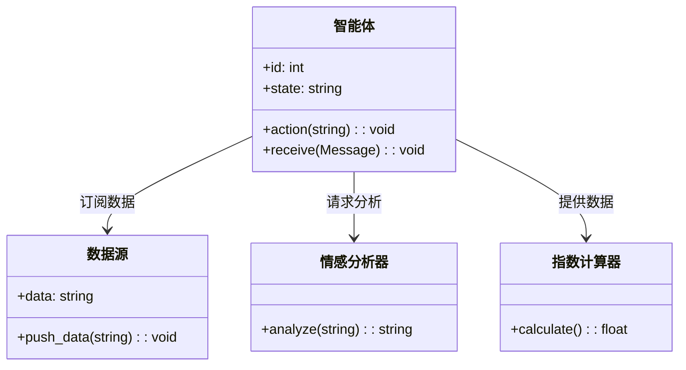
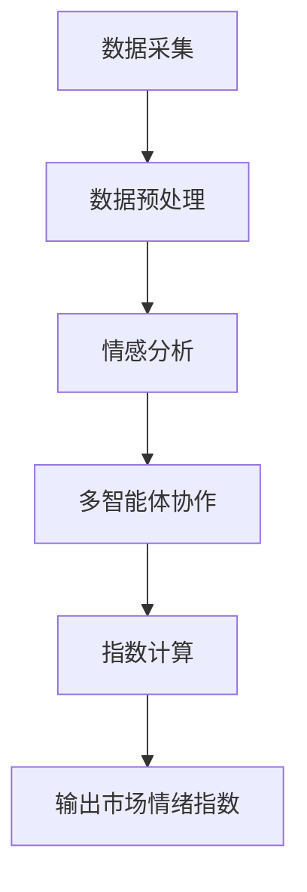
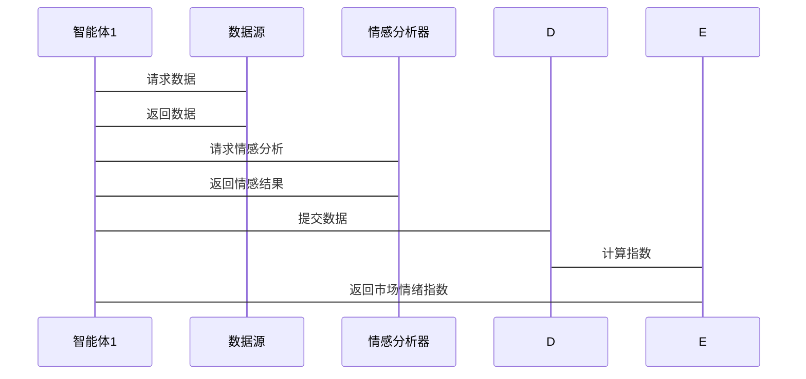

                 


# 利用多智能体系统构建动态的市场情绪指数

---

## 关键词：
多智能体系统、市场情绪指数、情感分析、动态指数、协作算法

---

## 摘要：
本文详细探讨了如何利用多智能体系统构建动态的市场情绪指数。通过分析市场情绪指数的核心概念、多智能体系统的协作机制以及相关算法原理，本文提出了一个基于多智能体系统的市场情绪指数构建框架。该框架包括数据采集、情感分析、多智能体协作和指数计算四个主要模块，并通过实际案例展示了系统的实现与应用。本文还讨论了系统架构设计、接口设计以及最佳实践，为读者提供了一个全面的技术指导。

---

## 第一部分: 多智能体系统与市场情绪指数概述

### 第1章: 多智能体系统与市场情绪指数的背景介绍

#### 1.1 市场情绪指数的定义与重要性

##### 1.1.1 市场情绪指数的定义
市场情绪指数是用来量化市场参与者情绪状态的指标，通常通过分析新闻、社交媒体、交易数据等信息来计算。

##### 1.1.2 市场情绪指数的重要性
市场情绪指数能够反映市场的乐观或悲观情绪，帮助投资者做出更明智的决策，同时也是金融研究的重要工具。

##### 1.1.3 市场情绪指数的动态特性
市场情绪指数具有动态变化的特点，能够实时反映市场的波动情况。

#### 1.2 多智能体系统的定义与特点

##### 1.2.1 多智能体系统的定义
多智能体系统是由多个智能体组成的分布式系统，每个智能体能够独立决策并协作完成复杂任务。

##### 1.2.2 多智能体系统的特性
- 分布式：多个智能体独立运行，协同完成任务。
- 协作性：智能体之间通过协作实现目标。
- 自适应性：能够根据环境变化调整行为。

##### 1.2.3 多智能体系统的优势
多智能体系统能够处理复杂任务，具有高容错性和可扩展性。

#### 1.3 多智能体系统与市场情绪指数的结合

##### 1.3.1 多智能体系统在金融领域的应用
多智能体系统在金融领域中的应用包括股票交易、风险评估和市场情绪分析。

##### 1.3.2 市场情绪指数的动态构建需求
市场情绪指数需要实时更新，反映市场的最新动态。

##### 1.3.3 多智能体系统在动态市场情绪指数构建中的作用
多智能体系统能够高效地处理海量数据，实时更新市场情绪指数。

---

### 第2章: 多智能体系统与市场情绪指数的核心概念

#### 2.1 多智能体系统的组成与功能

##### 2.1.1 多智能体系统的组成
- 智能体：独立决策的个体。
- 通信模块：智能体之间的通信机制。
- 协作机制：智能体协作完成任务的规则。

##### 2.1.2 多智能体系统的功能模块
- 数据采集：获取市场数据。
- 情感分析：分析数据中的情绪信息。
- 协作决策：智能体协作生成市场情绪指数。

#### 2.2 市场情绪指数的构建过程

##### 2.2.1 数据采集与预处理
- 数据来源：新闻、社交媒体、交易数据。
- 数据清洗：去除噪声数据。

##### 2.2.2 情感分析与情绪强度计算
- 情感分析：判断文本的情感倾向。
- 情绪强度：量化情绪的强弱程度。

##### 2.2.3 市场情绪指数的动态更新
- 动态计算：根据实时数据更新指数。
- 平滑处理：减少指数波动。

#### 2.3 多智能体系统与市场情绪指数的关系

##### 2.3.1 多智能体系统在市场情绪指数中的角色
- 数据处理：智能体负责数据的采集和预处理。
- 情感分析：智能体分析数据中的情绪信息。
- 协作决策：智能体协作生成市场情绪指数。

##### 2.3.2 多智能体系统的协作机制
- 分布式协作：智能体独立工作，通过通信模块协作。
- 博弈论机制：智能体之间通过博弈论规则进行决策。

##### 2.3.3 多智能体系统对市场情绪指数的影响
- 提高计算效率：多智能体系统能够高效处理大量数据。
- 增强准确性：通过协作机制，提高情感分析的准确性。

---

### 第3章: 多智能体系统与市场情绪指数的算法原理

#### 3.1 情感分析算法

##### 3.1.1 基于规则的情感分析
- 规则设定：预定义情感词典，根据关键词判断情感倾向。

##### 3.1.2 基于机器学习的情感分析
- 特征提取：提取文本特征，训练分类器。
- 分类器选择：常用支持向量机（SVM）或随机森林（Random Forest）。

##### 3.1.3 基于深度学习的情感分析
- 模型选择：使用LSTM或Transformer进行情感分析。
- 训练数据：需要大量标注数据进行训练。

#### 3.2 多智能体协作算法

##### 3.2.1 分布式协作算法
- 通信协议：智能体之间通过特定协议进行通信。
- 协作规则：定义协作任务的规则和流程。

##### 3.2.2 基于博弈论的协作机制
- 博弈规则：智能体之间通过博弈论规则进行协作决策。
- 优化目标：最大化整体收益。

##### 3.2.3 基于强化学习的协作优化
- 状态空间：定义智能体的状态空间。
- 动作空间：定义智能体可执行的动作。
- 奖励机制：定义奖励函数，优化智能体的决策。

#### 3.3 市场情绪指数的计算算法

##### 3.3.1 情绪强度的加权计算
- 权重分配：根据数据来源和重要性分配权重。
- 综合计算：加权求和，得到情绪强度。

##### 3.3.2 市场情绪指数的动态更新公式
- 动态更新：根据最新数据实时更新指数。
- 平滑处理：使用移动平均或其他平滑方法减少波动。

##### 3.3.3 市场情绪指数的平滑处理
- 方法选择：常用指数平滑法（Exponential Smoothing）。
- 参数调整：根据实际需求调整平滑参数。

---

### 第4章: 多智能体系统与市场情绪指数的系统架构设计

#### 4.1 系统功能模块设计

##### 4.1.1 数据采集模块
- 数据源：新闻网站、社交媒体、交易数据。
- 数据采集：实时采集市场数据。

##### 4.1.2 情感分析模块
- 文本处理：分词、去停用词。
- 情感分析：判断文本情感倾向。

##### 4.1.3 多智能体协作模块
- 智能体通信：智能体之间通过通信模块协作。
- 协作决策：智能体协作生成市场情绪指数。

##### 4.1.4 指数计算模块
- 数据整合：整合各智能体的分析结果。
- 指数计算：计算市场情绪指数。

#### 4.2 系统架构设计

##### 4.2.1 领域模型类图


##### 4.2.2 系统架构图


##### 4.2.3 系统接口设计
- 数据采集接口：提供数据采集功能。
- 情感分析接口：提供文本情感分析功能。
- 指数计算接口：提供市场情绪指数计算功能。

##### 4.2.4 系统交互序列图


---

## 第五章: 项目实战

### 5.1 环境安装与配置

#### 5.1.1 系统环境
- 操作系统：Linux/Windows/MacOS
- 开发工具：Python、Jupyter Notebook
- 依赖库：numpy、pandas、scikit-learn、transformers

#### 5.1.2 安装依赖
```bash
pip install numpy pandas scikit-learn transformers
```

### 5.2 核心代码实现

#### 5.2.1 数据采集模块

##### 5.2.1.1 数据采集代码
```python
import requests

def fetch_data(url):
    response = requests.get(url)
    return response.text
```

#### 5.2.2 情感分析模块

##### 5.2.2.1 情感分析代码
```python
from transformers import pipeline

sentiment_pipeline = pipeline("sentiment-analysis")
def analyze_sentiment(text):
    return sentiment_pipeline(text)
```

#### 5.2.3 多智能体协作模块

##### 5.2.3.1 智能体通信代码
```python
import threading

class Agent:
    def __init__(self, id):
        self.id = id
        self.data = None
        self.results = []
    
    def receive(self, message):
        self.data = message
        self.process_data()
    
    def process_data(self):
        # 情感分析
        sentiment = analyze_sentiment(self.data)
        self.results.append(sentiment)
        # 通知协作模块
        collaboration_layer.notify(self.id, sentiment)
```

##### 5.2.3.2 协作层代码
```python
class CollaborationLayer:
    def __init__(self):
        self.agents = []
    
    def register_agent(self, agent):
        self.agents.append(agent)
    
    def notify(self, sender_id, data):
        for agent in self.agents:
            if agent.id != sender_id:
                agent.receive(data)
```

#### 5.2.4 指数计算模块

##### 5.2.4.1 指数计算代码
```python
import numpy as np

class MarketSentimentIndex:
    def __init__(self, window_size=30):
        self.window_size = window_size
        self.window = []
    
    def update(self, sentiment_score):
        self.window.append(sentiment_score)
        if len(self.window) > self.window_size:
            self.window.pop(0)
    
    def calculate_index(self):
        if not self.window:
            return 0
        return np.mean(self.window)
```

### 5.3 案例分析与实现

#### 5.3.1 数据来源
- 新闻数据：从新闻网站获取。
- 社交媒体数据：从社交媒体API获取。

#### 5.3.2 数据预处理
- 清洗数据：去除噪声和无关信息。
- 分词处理：将文本分成词语。

#### 5.3.3 情感分析
- 使用预训练模型对文本进行情感分析，得到情感倾向和强度。

#### 5.3.4 多智能体协作
- 每个智能体负责分析部分数据，协作生成整体市场情绪指数。

#### 5.3.5 指数计算
- 根据智能体的分析结果，计算市场情绪指数。

### 5.4 最佳实践

#### 5.4.1 环境配置建议
- 确保系统环境兼容，避免依赖冲突。

#### 5.4.2 代码实现技巧
- 使用多线程或分布式技术提高效率。
- 定期更新模型，保持情感分析的准确性。

#### 5.4.3 注意事项
- 数据隐私问题：确保数据采集和处理符合隐私保护法规。
- 系统稳定性：保证系统的高可用性和容错性。

---

## 第六章: 总结与展望

### 6.1 小结
本文详细介绍了利用多智能体系统构建动态市场情绪指数的方法，包括系统架构设计、算法原理和项目实战。通过多智能体系统的协作，能够高效地处理海量数据，实时更新市场情绪指数。

### 6.2 展望
未来，随着人工智能和大数据技术的发展，市场情绪指数的构建将更加智能化和精确化。多智能体系统将在金融领域发挥更大的作用，为投资者提供更有力的决策支持。

---

## 作者：AI天才研究院/AI Genius Institute & 禅与计算机程序设计艺术 /Zen And The Art of Computer Programming

