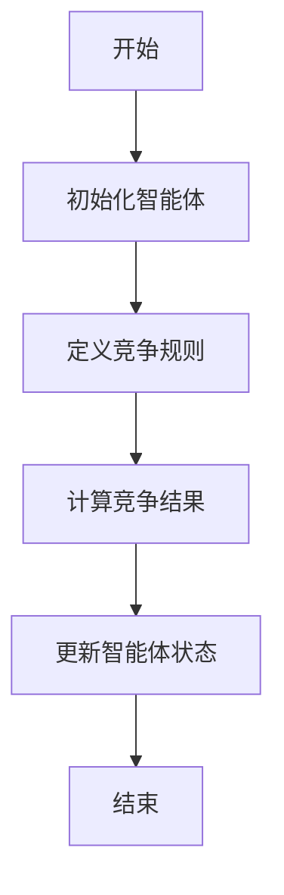
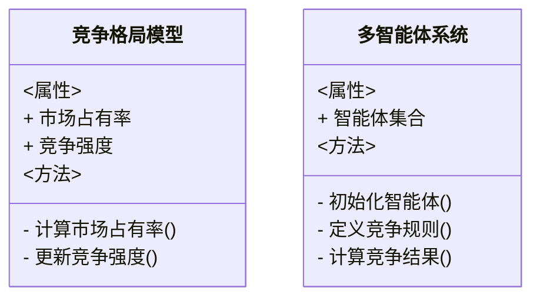
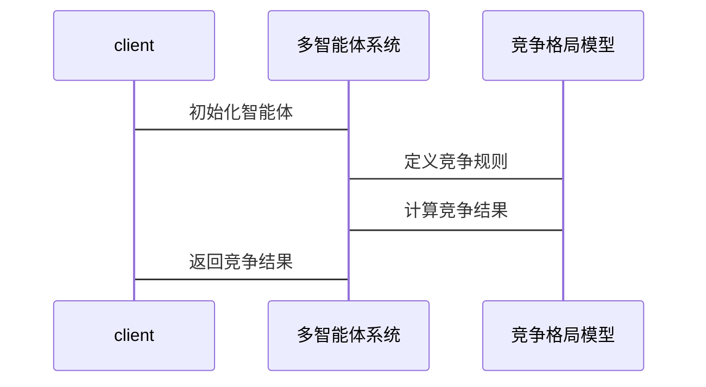

                 


# 利用多智能体系统构建动态竞争格局模型：把握行业变迁

**关键词：** 多智能体系统，动态竞争格局，行业变迁，竞争模型，协作与竞争机制

**摘要：** 本文探讨了利用多智能体系统构建动态竞争格局模型的方法，旨在分析行业变迁中的竞争态势。通过详细阐述多智能体系统的核心概念、算法原理、系统架构以及实际案例，本文为技术专家和企业管理者提供了深入的理论支持和实践指导，帮助其在复杂多变的市场环境中制定有效的竞争策略。

---

## 第一部分: 多智能体系统与动态竞争格局模型基础

### 第1章: 动态竞争格局模型的背景与问题描述

#### 1.1 问题背景
- **行业竞争格局的动态变化**：现代市场竞争日益复杂，企业间的竞争关系不断演变，传统的静态竞争模型已无法适应动态变化的需求。
- **传统竞争模型的局限性**：传统模型通常基于固定的战略假设，难以应对市场环境的快速变化。
- **多智能体系统的优势**：多智能体系统通过模拟多个智能体的交互，能够捕捉到竞争格局中的动态变化，提供实时反馈和策略调整。

#### 1.2 问题描述
- **动态竞争格局的核心要素**：包括市场占有率、竞争强度、企业行为模式等关键因素。
- **行业变迁的复杂性**：行业变迁涉及技术进步、政策变化、消费者偏好等多种因素，这些因素相互作用，导致竞争格局的复杂变化。
- **多智能体系统在竞争分析中的应用前景**：通过模拟多个企业的竞争行为，多智能体系统能够预测行业趋势，为企业制定动态竞争策略提供支持。

#### 1.3 问题解决与边界
- **多智能体系统如何解决动态竞争问题**：通过模拟多个企业的竞争行为，多智能体系统能够实时更新竞争模型，提供动态反馈。
- **竞争格局模型的边界与外延**：模型的边界包括企业的战略选择、市场环境的变化等，外延则包括技术、政策、消费者行为等多个方面。
- **多智能体系统与动态竞争模型的结合方式**：通过定义智能体的行为规则和交互方式，将多智能体系统与动态竞争模型结合，实现对行业变迁的动态模拟。

### 第2章: 多智能体系统的核心概念与联系

#### 2.1 多智能体系统的核心原理
- **多智能体系统的定义与特点**：多智能体系统由多个智能体组成，每个智能体能够自主决策并与其他智能体交互。
- **多智能体系统的组成与交互**：包括智能体的定义、行为规则、交互方式等。
- **多智能体系统与动态竞争模型的关系**：动态竞争模型通过多智能体系统模拟企业的竞争行为，实现对行业变迁的动态分析。

#### 2.2 多智能体系统与动态竞争模型的对比分析
- **多智能体系统的属性特征**：包括自主性、反应性、协作性等。
- **动态竞争模型的属性特征**：包括动态性、复杂性、不确定性等。
- **两者的核心差异与联系**：多智能体系统的自主性和协作性与动态竞争模型的动态性和复杂性相互补充，共同实现对行业变迁的模拟。

#### 2.3 多智能体系统与动态竞争模型的ER实体关系图
```mermaid
er
actor: 多智能体系统
actor -[1..n]-> entity: 竞争格局模型
entity -[1..n]-> attribute: 核心要素（如市场占有率、竞争强度等）
```

### 第3章: 多智能体系统的算法原理与数学模型

#### 3.1 多智能体系统的协作与竞争机制
- **协作机制的数学模型**：通过加权和公式表示，例如：
  $$ C = \sum_{i=1}^{n} w_i x_i $$
- **竞争机制的数学模型**：通过加权和公式表示，例如：
  $$ R = \sum_{i=1}^{n} v_i y_i $$

#### 3.2 动态竞争格局模型的算法实现
- **算法流程图**：


#### 3.3 算法实现的数学公式与举例
- **竞争结果计算公式**：
  $$ S = \alpha \cdot C + \beta \cdot R $$
- **示例：假设市场占有率计算**：
  $$ M_i = \frac{S_i}{\sum_{j=1}^{n} S_j} $$

---

## 第二部分: 系统分析与架构设计

### 第4章: 系统分析与架构设计方案

#### 4.1 问题场景介绍
- **行业变迁中的竞争格局分析**：通过多智能体系统模拟企业的竞争行为，预测行业趋势。

#### 4.2 系统功能设计
- **领域模型Mermaid类图**：


#### 4.3 系统架构设计
- **系统架构Mermaid架构图**：


#### 4.4 系统接口设计
- **系统接口设计**：包括智能体接口、竞争规则接口、结果反馈接口等。

#### 4.5 系统交互设计
- **系统交互Mermaid序列图**：


---

## 第三部分: 项目实战与案例分析

### 第5章: 项目实战

#### 5.1 环境安装
- **安装Python和相关库**：如NumPy、Matplotlib、Scipy等。

#### 5.2 系统核心实现源代码
```python
class Competitor:
    def __init__(self, id, market_share):
        self.id = id
        self.market_share = market_share

    def update_share(self, new_share):
        self.market_share = new_share

def main():
    competitors = [
        Competitor(1, 0.3),
        Competitor(2, 0.2),
        Competitor(3, 0.15)
    ]
    
    # 计算竞争结果
    total = sum(c.market_share for c in competitors)
    for c in competitors:
        c.update_share(c.market_share / total)

if __name__ == "__main__":
    main()
```

#### 5.3 代码应用解读与分析
- **代码解读**：定义了Competitor类，模拟多个竞争者的行为，通过计算市场占有率更新竞争结果。
- **代码分析**：展示了如何通过多智能体系统模拟竞争格局的变化。

#### 5.4 实际案例分析
- **案例分析**：假设一个市场中有三个竞争者，初始市场占有率分别为0.3、0.2和0.15。通过代码计算新的市场占有率，分析竞争格局的变化。

#### 5.5 项目小结
- **项目总结**：通过实际案例分析，验证了多智能体系统在动态竞争格局模型中的应用效果。

---

## 第四部分: 总结与展望

### 第6章: 总结与展望

#### 6.1 最佳实践
- **小结**：多智能体系统能够有效模拟行业变迁中的竞争格局，为企业制定动态竞争策略提供支持。
- **注意事项**：在实际应用中，需要考虑数据的实时更新和模型的可扩展性。
- **拓展阅读**：建议读者进一步学习多智能体系统在其他领域的应用，如博弈论、分布式计算等。

#### 6.2 未来展望
- **技术发展**：随着人工智能和大数据技术的进步，多智能体系统在动态竞争格局模型中的应用将更加广泛和深入。
- **研究方向**：未来的研究可以集中在模型的实时性、可解释性和可扩展性方面。

---

## 作者信息

**作者：AI天才研究院/AI Genius Institute & 禅与计算机程序设计艺术 /Zen And The Art of Computer Programming**

---

以上是完整的技术博客文章内容，涵盖了从理论到实践的各个方面，确保读者能够全面理解多智能体系统在动态竞争格局模型中的应用。

