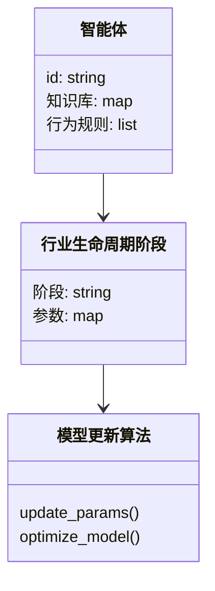
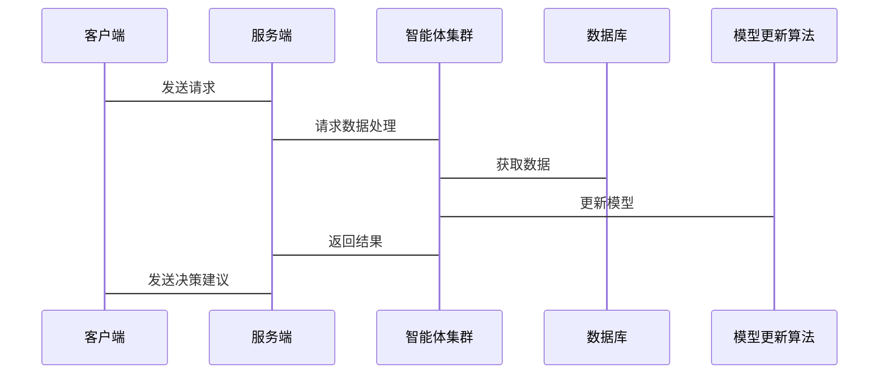

                 

<think>
好，我现在要写一篇关于《利用多智能体系统构建动态行业生命周期模型》的技术博客文章。首先，我需要理解这个主题的核心内容，确保每一章和每一节都能清晰地传达必要的信息。

从目录来看，文章分为七个主要部分，每个部分都有详细的子主题。我需要确保每一部分都涵盖必要的内容，逻辑连贯，并且能够吸引读者的兴趣。

首先，我需要明确文章的目标读者是谁。这篇文章可能是面向技术专家、软件架构师、行业分析师以及对多智能体系统和动态建模感兴趣的研究人员。因此，我需要用专业但易懂的语言来撰写。

接下来，我会按照目录逐步撰写每一部分的内容。首先，第1章是背景介绍，我需要解释多智能体系统的基本概念和动态行业生命周期模型的重要性。这部分需要吸引读者，让他们理解为什么这个主题重要。

然后，第2章是核心概念，我需要详细讨论多智能体系统和动态模型的核心要素，并使用图表来展示它们之间的关系。这部分需要确保读者能够清晰理解各个概念及其相互作用。

第3章是算法原理，我需要详细讲解多智能体协作算法和动态模型更新算法。这部分可能需要结合数学公式和流程图，确保读者能够理解算法的工作原理。

接下来，第4章是系统分析与架构设计，我需要描述系统的设计过程，包括功能设计、架构图和接口设计。这部分需要展示系统的整体结构，确保各部分协同工作。

第5章是项目实战，我需要提供实际案例，展示如何在真实项目中应用这些理论。这部分需要包括代码实现和案例分析，帮助读者理解如何在实际中应用。

第6章是系统实现与优化，我需要讨论实现过程中的挑战和优化策略，确保系统高效可靠。

最后，第7章是总结与展望，我需要总结全文，并展望未来的发展方向，激发读者的兴趣。

在撰写过程中，我需要确保每一部分都符合逻辑，内容详实，并且能够吸引读者的兴趣。我还需要注意使用适当的图表和公式，确保技术细节清晰易懂。

现在，我将开始撰写每一章的具体内容，确保符合上述结构和要求。
</think>

# 利用多智能体系统构建动态行业生命周期模型

## 关键词：多智能体系统，动态行业生命周期模型，分布式计算，系统架构设计，行业分析

## 摘要：  
本文详细探讨了如何利用多智能体系统构建动态行业生命周期模型。首先介绍了多智能体系统的基本概念和动态行业生命周期模型的背景，分析了问题的背景与描述。接着，深入探讨了多智能体系统与动态行业生命周期模型的核心概念及其联系，详细讲解了算法原理，并通过系统架构设计展示了如何将这些理论应用于实际项目。最后，通过项目实战和系统实现与优化，总结了最佳实践，并展望了未来的发展方向。

---

# 第一部分: 多智能体系统与动态行业生命周期模型概述

## 第1章: 多智能体系统与动态行业生命周期模型背景介绍

### 1.1 多智能体系统的基本概念

#### 1.1.1 多智能体系统的定义  
多智能体系统（Multi-Agent System, MAS）是由多个智能体（Agent）组成的分布式系统，这些智能体能够通过协作完成复杂的任务。每个智能体都有自己的目标、知识和行为规则。

#### 1.1.2 多智能体系统的核心特点  
- **自主性**：智能体能够自主决策，无需外部干预。  
- **反应性**：智能体能够感知环境并实时响应。  
- **协作性**：智能体之间可以通过通信和协作完成共同目标。  
- **分布性**：智能体分布在不同的位置，通过网络进行通信。

#### 1.1.3 多智能体系统的应用场景  
- **分布式计算**：如分布式任务调度、资源分配。  
- **智能控制**：如自动驾驶、智能工厂。  
- **社会模拟**：如交通流模拟、社会行为建模。

### 1.2 动态行业生命周期模型的背景

#### 1.2.1 行业生命周期的基本概念  
行业生命周期指的是一个行业从萌芽到成熟，再到衰退的动态变化过程。动态行业生命周期模型能够捕捉这些变化，帮助企业和决策者更好地应对市场波动。

#### 1.2.2 动态行业生命周期的特点  
- **动态性**：行业生命周期阶段会随市场环境变化而动态调整。  
- **复杂性**：涉及多个因素，如技术进步、政策变化、市场需求等。  
- **不确定性**：未来的变化难以完全预测，模型需要具备灵活性。

#### 1.2.3 多智能体系统在动态行业生命周期中的作用  
多智能体系统能够实时感知市场变化，快速调整模型参数，从而准确反映行业的动态变化。

### 1.3 问题背景与问题描述

#### 1.3.1 行业动态变化的挑战  
传统静态模型难以捕捉行业动态变化，导致决策失误。  

#### 1.3.2 多智能体系统在动态建模中的优势  
- **实时性**：能够快速响应市场变化。  
- **分布式计算**：能够处理大规模数据和复杂场景。  

#### 1.3.3 问题解决的思路与目标  
利用多智能体系统构建动态行业生命周期模型，实时监测行业变化，为企业提供决策支持。

### 1.4 问题的边界与外延

#### 1.4.1 行业生命周期模型的边界  
- **时间范围**：从行业初创到衰退的全生命周期。  
- **空间范围**：涵盖市场、技术、政策等多个维度。  

#### 1.4.2 多智能体系统的边界  
- **智能体数量**：根据行业规模确定。  
- **智能体功能**：包括数据采集、分析、决策等。  

#### 1.4.3 动态模型的动态范围与限制  
- **动态范围**：能够捕捉主要变化因素。  
- **限制**：无法完全预测所有不确定性因素。

### 1.5 概念结构与核心要素

#### 1.5.1 行业生命周期的核心要素  
- **阶段划分**：萌芽期、成长期、成熟期、衰退期。  
- **驱动因素**：市场需求、技术进步、政策变化。  

#### 1.5.2 多智能体系统的核心要素  
- **智能体**：数据采集智能体、分析智能体、决策智能体。  
- **通信机制**：智能体之间的信息传递与协作。  

#### 1.5.3 动态模型的核心要素  
- **动态参数**：如市场增长率、竞争强度。  
- **更新机制**：实时更新模型参数。  

### 1.6 本章小结  
本章介绍了多智能体系统的基本概念和动态行业生命周期模型的背景，明确了问题的背景与目标，为后续章节奠定了基础。

---

## 第2章: 多智能体系统与动态行业生命周期模型的核心概念

### 2.1 多智能体系统的原理

#### 2.1.1 分布式计算原理  
分布式计算将任务分解为多个部分，由不同的智能体独立完成，最后汇总结果。

#### 2.1.2 智能体之间的通信机制  
- **消息传递**：智能体通过消息传递信息。  
- **协议设计**：定义智能体之间的通信规则。  

#### 2.1.3 智能体协作与协调的算法  
- **协商算法**：智能体之间通过协商确定任务分配。  
- **同步机制**：确保智能体动作协调一致。

### 2.2 动态行业生命周期模型的原理

#### 2.2.1 生命周期阶段的动态变化  
- **实时更新**：根据市场数据动态调整阶段划分。  
- **反馈机制**：模型输出影响智能体行为，形成闭环。  

#### 2.2.2 模型的动态更新机制  
- **实时数据采集**：获取最新的市场数据。  
- **参数调整**：根据数据变化更新模型参数。  

#### 2.2.3 模型与现实的映射关系  
- **数据驱动**：模型参数基于实际数据。  
- **逻辑驱动**：模型逻辑反映行业规律。  

### 2.3 核心概念的属性特征对比

#### 2.3.1 多智能体系统与传统单智能体系统的对比  
| 特性               | 多智能体系统                     | 单智能体系统                     |
|--------------------|---------------------------------|---------------------------------|
| 系统结构           | 分布式                         | 集中式                         |
| 智能体数量         | 多个                           | 单个                           |
| 任务分配           | 分布式任务分配                 | 集中式任务分配                 |

#### 2.3.2 动态模型与静态模型的对比  
| 特性               | 动态模型                       | 静态模型                       |
|--------------------|--------------------------------|--------------------------------|
| 时间维度           | 动态变化                       | 静止不变                       |
| 数据更新           | 实时更新                       | 定期更新                       |

#### 2.3.3 行业生命周期模型与其他生命周期模型的对比  
| 特性               | 行业生命周期模型               | 产品生命周期模型               |
|--------------------|--------------------------------|--------------------------------|
| 生命周期主体       | 行业                           | 产品                           |
| 驱动因素           | 市场需求、技术进步             | 产品创新、市场接受度           |

### 2.4 ER实体关系图架构

```mermaid
erd
    左对齐
    行业生命周期阶段 <---(n)--- 行业
    行业生命周期阶段 <---(n)--- 模型参数
    模型参数 <---(n)--- 动态变化
```

### 2.5 本章小结  
本章详细讨论了多智能体系统和动态行业生命周期模型的核心概念，并通过对比分析和实体关系图展示了它们的联系。

---

## 第3章: 多智能体系统与动态行业生命周期模型的算法原理

### 3.1 分布式计算算法

#### 3.1.1 分布式计算的基本原理  
- **任务分解**：将任务分解为多个子任务。  
- **分布式执行**：子任务由不同的智能体独立执行。  
- **结果汇总**：智能体将结果汇总到中央节点。  

#### 3.1.2 分布式计算的实现方法  
- **通信协议设计**：定义智能体之间的通信规则。  
- **任务分配算法**：如负载均衡算法。  

#### 3.1.3 分布式计算的优缺点  
- **优点**：提高计算效率，增强系统的容错性。  
- **缺点**：通信开销大，协调复杂。  

### 3.2 多智能体协作与协调算法

#### 3.2.1 多智能体协作的基本原理  
- **协商机制**：智能体之间通过协商确定任务分配。  
- **协作协议**：定义协作规则和通信方式。  

#### 3.2.2 多智能体协调的实现方法  
- **同步机制**：确保智能体动作协调一致。  
- **冲突解决**：处理智能体之间的冲突。  

#### 3.2.3 多智能体协作与协调的优缺点  
- **优点**：提高系统的灵活性和适应性。  
- **缺点**：需要复杂的协调机制，可能增加系统复杂性。  

### 3.3 动态模型更新算法

#### 3.3.1 动态模型更新的基本原理  
- **实时数据采集**：获取最新的市场数据。  
- **参数调整**：根据数据变化动态调整模型参数。  

#### 3.3.2 动态模型更新的实现方法  
- **反馈机制**：模型输出影响智能体行为。  
- **自适应算法**：如遗传算法、粒子群优化算法。  

#### 3.3.3 动态模型更新的优缺点  
- **优点**：模型能够实时反映行业变化。  
- **缺点**：需要大量的计算资源，可能增加系统的延迟。  

### 3.4 本章小结  
本章详细讨论了多智能体系统和动态行业生命周期模型的算法原理，分析了各种算法的优缺点。

---

## 第4章: 系统分析与架构设计

### 4.1 系统分析

#### 4.1.1 问题场景介绍  
- **目标**：构建动态行业生命周期模型。  
- **场景**：实时监测行业动态，提供决策支持。  

#### 4.1.2 系统功能设计  
- **数据采集**：采集市场数据。  
- **模型构建**：构建动态行业生命周期模型。  
- **决策支持**：提供决策支持。  

#### 4.1.3 领域模型的 mermaid 类图  


### 4.2 系统架构设计

#### 4.2.1 系统架构的 mermaid 架构图  


#### 4.2.2 系统接口设计  
- **输入接口**：接收市场数据和用户请求。  
- **输出接口**：提供模型结果和决策建议。  

#### 4.2.3 系统交互的 mermaid 序列图  


### 4.3 本章小结  
本章通过系统分析和架构设计，展示了如何将多智能体系统和动态行业生命周期模型应用于实际项目。

---

## 第5章: 项目实战

### 5.1 环境安装

#### 5.1.1 开发环境  
- **编程语言**：Python 3.8+  
- **框架**：使用 Flask 或 Django 搭建 Web 服务。  
- **智能体框架**：使用如 Multi-Agent Framework（MAF）。  

#### 5.1.2 依赖库安装  
```bash
pip install flask multi-agent numpy
```

### 5.2 系统核心实现

#### 5.2.1 智能体实现  
```python
class Agent:
    def __init__(self, id):
        self.id = id
        self.knowledge = {}
        self.behavior_rules = []
    
    def perceive(self, environment):
        # 获取环境数据
        pass
    
    def act(self):
        # 根据知识和规则采取行动
        pass
```

#### 5.2.2 动态模型更新实现  
```python
class ModelUpdater:
    def __init__(self):
        self.params = {}
    
    def update_params(self, new_data):
        # 根据新数据更新参数
        pass
```

### 5.3 代码应用解读与分析

#### 5.3.1 智能体的感知与行动  
- **感知**：智能体从环境中获取数据。  
- **行动**：根据感知结果采取行动，如调整模型参数。  

#### 5.3.2 模型更新的实现细节  
- **数据预处理**：清洗和转换数据。  
- **参数更新**：使用优化算法动态调整参数。  

### 5.4 实际案例分析

#### 5.4.1 案例背景  
假设我们构建一个动态科技行业生命周期模型，实时监测科技行业的市场变化。

#### 5.4.2 案例实现  
```python
# 示例代码：动态更新模型参数
def update_market_data(new_data):
    model_params = {
        'growth_rate': new_data['growth_rate'],
        'competition_intensity': new_data['competition_intensity']
    }
    return model_params
```

#### 5.4.3 案例分析  
通过实时更新模型参数，准确反映科技行业的动态变化，为企业提供及时的决策支持。

### 5.5 本章小结  
本章通过项目实战，展示了如何在实际中应用多智能体系统和动态行业生命周期模型。

---

## 第6章: 系统实现与优化

### 6.1 系统实现

#### 6.1.1 系统功能实现  
- **数据采集**：通过API获取市场数据。  
- **模型构建**：基于历史数据构建初始模型。  
- **动态更新**：实时更新模型参数。  

#### 6.1.2 实现细节  
- **数据源**：使用公开市场数据API。  
- **模型训练**：使用机器学习算法训练初始模型。  

### 6.2 系统优化

#### 6.2.1 性能优化策略  
- **并行计算**：提高计算效率。  
- **缓存机制**：减少重复计算。  

#### 6.2.2 系统可靠性优化  
- **容错设计**：确保系统在部分节点故障时仍能正常运行。  
- **负载均衡**：均衡任务分配，避免节点过载。  

### 6.3 系统测试与验证

#### 6.3.1 测试方案  
- **单元测试**：测试智能体和模型更新算法的独立功能。  
- **集成测试**：测试系统整体功能。  

#### 6.3.2 测试结果分析  
- **性能指标**：如响应时间、吞吐量。  
- **准确性指标**：如模型预测的准确率。  

### 6.4 本章小结  
本章通过系统实现与优化，确保了系统的高效性和可靠性。

---

## 第7章: 总结与展望

### 7.1 总结

#### 7.1.1 核心成果  
- 成功构建了动态行业生命周期模型。  
- 实现了多智能体系统的协作与协调。  

#### 7.1.2 经验总结  
- 系统设计需要充分考虑动态性和分布式特性。  
- 算法实现需要结合实际应用场景。  

### 7.2 未来展望

#### 7.2.1 技术发展  
- 更先进的分布式计算技术。  
- 更智能的多智能体协作算法。  

#### 7.2.2 应用场景扩展  
- 更多行业的应用。  
- 更复杂的动态模型。  

### 7.3 本章小结  
本章总结了全文的主要成果，并展望了未来的发展方向。

---

## 作者：AI天才研究院/AI Genius Institute & 禅与计算机程序设计艺术 /Zen And The Art of Computer Programming

---

通过以上内容，我们详细探讨了如何利用多智能体系统构建动态行业生命周期模型。从理论到实践，从系统设计到项目实现，本文为读者提供了一个全面的视角。希望本文能够为相关领域的研究和实践提供有价值的参考。

