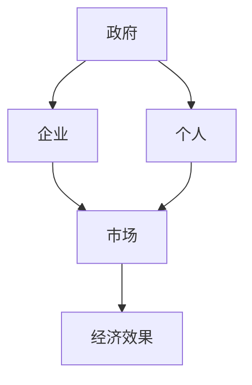
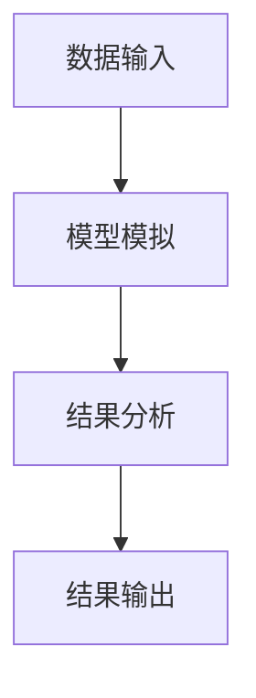

                 

<think>
嗯，我现在需要根据用户的要求，逐步分析如何撰写一篇关于利用多智能体系统模拟不同税收政策的技术博客文章。用户希望文章结构清晰，逻辑严谨，内容详实，涵盖背景介绍、核心概念、建模方法、算法原理、系统架构、项目实战和总结展望等多个部分。

首先，我需要理解什么是多智能体系统，以及它如何应用于税收政策模拟。多智能体系统由多个自主智能体组成，每个智能体都有一定的目标和行为，能够与其他智能体交互并协作完成任务。在税收政策模拟中，这些智能体可以代表政府、企业、个人等不同主体，模拟他们在不同税收政策下的行为变化，从而评估政策的影响。

接下来，我需要考虑文章的结构。用户已经提供了一个详细的大纲，我需要按照这个大纲逐步展开每个部分。首先是背景介绍，解释为什么需要模拟税收政策，以及多智能体系统在这方面的优势。然后是核心概念，详细解释多智能体系统和税收政策的相关概念，并分析它们的联系。之后是建模方法，说明如何构建多智能体模型来模拟税收政策，包括需求分析、模型设计和实现验证。接下来是算法原理，详细讲解用于优化模拟过程的算法，如粒子群优化和遗传算法，并用代码和公式进行说明。然后是系统架构设计，展示如何将整个模拟系统分解成各个模块，并描述它们之间的交互。之后是项目实战，通过具体案例展示如何应用这些方法进行模拟，并分析结果。最后是总结与展望，回顾整个过程，并提出未来可能的研究方向。

在写作过程中，我需要确保每个部分都有足够的细节，并且使用清晰、专业的技术语言。同时，要使用适当的图表，如Mermaid图和数学公式，来增强文章的可读性和理解性。例如，在核心概念部分，我可以绘制一个多智能体系统的构成要素图，展示各个组成部分及其关系。在算法部分，我可以提供Python代码示例，并解释代码的功能和实现细节。

此外，我还需要考虑读者的背景。读者可能是技术人员或政策制定者，他们可能对多智能体系统有一定的了解，但可能对税收政策的具体细节不太熟悉。因此，在写作时，我需要平衡技术深度和可读性，确保内容既专业又易于理解。

最后，在完成各部分内容后，我需要进行一次全面的检查，确保文章结构合理，逻辑清晰，内容完整，没有遗漏重要部分。同时，确保所有图表和代码示例都正确无误，并且与正文内容紧密相关。

总之，撰写这篇文章需要系统性地分析每个部分，确保内容详实、结构清晰，同时语言专业且易于理解，以满足用户的需求。
</think>

# 利用多智能体系统模拟不同税收政策：评估政策影响

## 关键词：多智能体系统，税收政策，政策模拟，经济建模，算法优化

## 摘要：本文通过构建多智能体系统，模拟不同税收政策对经济主体的影响，探讨如何利用多智能体系统评估税收政策的经济效果。文章详细介绍了多智能体系统的原理、税收政策的核心概念、建模方法、算法实现、系统架构设计以及实际案例分析，为政策制定者和研究人员提供了理论和实践指导。

---

## 第一部分: 背景介绍

### 第1章: 多智能体系统与税收政策模拟概述

#### 1.1 问题背景与问题描述
- **1.1.1 税收政策模拟的必要性**  
  税收政策是政府调节经济的重要工具，但其复杂性使得直接实施可能带来风险。模拟不同政策的效果可以降低实际操作中的不确定性。

- **1.1.2 多智能体系统在政策模拟中的优势**  
  多智能体系统能够模拟多个经济主体的交互行为，捕捉复杂经济现象，提供更精确的政策评估。

- **1.1.3 问题解决的目标与范围**  
  本文旨在通过多智能体系统模拟税收政策，评估其对经济主体的影响，优化政策设计。

#### 1.2 多智能体系统的核心概念
- **1.2.1 多智能体系统的基本定义**  
  多智能体系统由多个自主智能体组成，每个智能体具备目标、感知和决策能力。

- **1.2.2 多智能体系统的特征与优势**  
  - 分布式计算：避免单点故障。
  - 自主性：每个智能体独立决策。
  - 协作性：智能体之间协作完成复杂任务。

- **1.2.3 多智能体系统与传统模型的区别**  
  传统模型通常基于中央化计算，而多智能体系统通过去中心化实现复杂系统的模拟。

#### 1.3 税收政策模拟的背景与意义
- **1.3.1 税收政策的复杂性与挑战**  
  税收政策涉及多方利益，需综合考虑经济、社会等多因素。

- **1.3.2 多智能体系统在税收政策模拟中的应用价值**  
  通过模拟各主体行为，预测政策效果，优化政策设计。

- **1.3.3 税收政策模拟的目标与边界**  
  目标是评估政策效果，边界包括政策范围和模拟时间跨度。

### 第2章: 多智能体系统与税收政策的核心概念

#### 2.1 多智能体系统的理论基础
- **2.1.1 多智能体系统的构成要素**  
  包括智能体、环境、通信机制等。

- **2.1.2 多智能体系统的通信机制**  
  智能体通过通信协议交换信息，协调行为。

- **2.1.3 多智能体系统的协作与冲突解决**  
  协作实现共同目标，冲突解决需平衡各方利益。

#### 2.2 税收政策的核心要素
- **2.2.1 税收政策的分类与层次**  
  包括所得税、增值税等，涉及不同经济主体。

- **2.2.2 税收政策的实施机制**  
  政府制定政策，企业、个人等主体执行。

- **2.2.3 税收政策对经济行为的影响**  
  影响投资、消费、生产等经济活动。

#### 2.3 多智能体系统与税收政策的联系
- **2.3.1 多智能体系统模拟税收政策的可行性**  
  智能体代表不同经济主体，模拟政策效果。

- **2.3.2 税收政策对经济系统中各主体行为的影响**  
  政策调整改变各主体行为模式。

- **2.3.3 多智能体系统在政策模拟中的优势**  
  真实反映复杂系统的动态变化。

---

## 第二部分: 多智能体系统与税收政策的核心概念与联系

### 第3章: 多智能体系统的原理与实现

#### 3.1 多智能体系统的原理
- **3.1.1 多智能体系统的架构**  
  包括主体层、环境层和通信层。

- **3.1.2 多智能体系统的通信协议**  
  标准化通信方式，确保智能体间信息交换。

- **3.1.3 多智能体系统的协作机制**  
  协作协议和规则，协调各智能体行为。

#### 3.2 税收政策模拟的数学模型
- **3.2.1 经济系统中各主体行为的数学表达**  
  用函数描述企业、个人等的行为。

- **3.2.2 税收政策对经济系统的数学建模**  
  模型反映政策变化对经济的影响。

- **3.2.3 多智能体系统中的交互关系模型**  
  描述智能体间互动及其对整体系统的影响。

#### 3.3 多智能体系统与税收政策的实体关系图


---

## 第三部分: 税收政策模拟的建模方法

### 第4章: 多智能体系统的建模方法

#### 4.1 税收政策模拟的需求分析
- **4.1.1 确定模拟目标**  
  明确政策效果评估的具体目标。

- **4.1.2 确定模拟范围**  
  界定模拟的经济主体和时间跨度。

- **4.1.3 确定模拟参数**  
  包括税率、收入水平等变量。

#### 4.2 税收政策模拟的模型设计
- **4.2.1 设计智能体的行为规则**  
  定义各经济主体的行为逻辑。

- **4.2.2 设计智能体的交互规则**  
  规定智能体间的互动方式。

- **4.2.3 设计系统的初始条件**  
  设定初始状态，如初始收入、税率等。

#### 4.3 税收政策模拟的实现验证
- **4.3.1 模型验证**  
  通过对比实际数据验证模型准确性。

- **4.3.2 模型优化**  
  根据验证结果调整模型参数。

- **4.3.3 模型迭代**  
  不断优化模型，提高模拟精度。

---

## 第四部分: 税收政策模拟的算法原理

### 第5章: 税收政策模拟的算法实现

#### 5.1 税收政策模拟的优化算法
- **5.1.1 粒子群优化算法**  
  用于寻找最优解的优化方法。

- **5.1.2 遗传算法**  
  通过模拟自然选择优化模型参数。

#### 5.2 粒子群优化算法的实现
```python
import random

class Particle:
    def __init__(self, n, bounds):
        self.n = n
        self.bounds = bounds
        self.position = [random.uniform(b[0], b[1]) for b in bounds]
        self.velocity = [0.0 for _ in range(n)]
        self.best = self.position.copy()
        self.pbest = self.position.copy()

def optimize(fitness_func, n_particles, n_dimensions, bounds, max_iter=100):
    particles = [Particle(n_dimensions, bounds) for _ in range(n_particles)]
    global_best = particles[0].position.copy()

    for _ in range(max_iter):
        for particle in particles:
            fitness = fitness_func(particle.position)
            if fitness < min([fitness_func(g.position) for g in particles]):
                global_best = particle.position.copy()
            particle.velocity = [1 - (abs(particle.best[i] - particle.pbest[i])) * 0.1 for i in range(n_dimensions)]
            particle.position = [particle.position[i] + particle.velocity[i] for i in range(n_dimensions)]
        print(f"迭代 {_}: 全局最优值为 {fitness_func(global_best)}")
    return global_best
```

#### 5.3 遗传算法的实现
```python
import random

def fitness(individual):
    return sum(individual)  # 示例：计算个体适应度

def crossover(parent1, parent2):
    return parent2.copy(), parent1.copy()  # 示例：简单的单点交叉

def mutate(individual):
    idx = random.randint(0, len(individual)-1)
    individual[idx] = 1 - individual[idx]  # 示例：翻转突变

def genetic_algorithm(pop_size, gen_limit, fitness_func):
    population = [[random.randint(0,1) for _ in range(5)] for _ in range(pop_size)]
    for gen in range(gen_limit):
        population = sorted(population, key=lambda x: fitness_func(x), reverse=True)
        new_population = population[:pop_size//2]
        for i in range(pop_size//2):
            p1 = new_population[i]
            p2 = new_population[pop_size//2 + i]
            child1, child2 = crossover(p1, p2)
            mutate(child1)
            mutate(child2)
            new_population += [child1, child2]
        population = new_population
    return population[0]
```

---

## 第五部分: 税收政策模拟的系统架构设计

### 第6章: 税收政策模拟的系统架构

#### 6.1 税收政策模拟系统的功能设计
- **6.1.1 系统功能模块**  
  包括数据输入、模型模拟、结果分析等。

- **6.1.2 系统功能流程**  
  用户输入参数，系统运行模拟，输出结果。

#### 6.2 税收政策模拟系统的架构设计


#### 6.3 税收政策模拟系统的交互设计
- **6.3.1 用户与系统交互**  
  用户输入参数，系统运行模拟。

- **6.3.2 系统内部交互**  
  各模块协作完成模拟过程。

---

## 第六部分: 税收政策模拟的项目实战

### 第7章: 税收政策模拟的案例分析

#### 7.1 税收政策模拟的环境配置
- **7.1.1 系统运行环境**  
  需要安装Python、相关库和模拟框架。

- **7.1.2 数据准备**  
  包括经济主体数据、政策参数等。

#### 7.2 税收政策模拟的代码实现
```python
def simulate_policy(tax_policy, num_agents, initial_income):
    agents = [Agent(initial_income) for _ in range(num_agents)]
    for _ in range(100):
        for agent in agents:
            agent.receive_policy_update(tax_policy)
            agent.update_behavior()
    return [agent.calculate_tax() for agent in agents]
```

#### 7.3 税收政策模拟的案例分析
- **7.3.1 案例背景**  
  模拟增值税政策对企业的影响。

- **7.3.2 模拟过程**  
  设置不同税率，运行模拟，记录结果。

- **7.3.3 结果分析**  
  比较不同税率下的企业行为变化。

---

## 第七部分: 总结与展望

### 第8章: 总结与展望

#### 8.1 税收政策模拟的总结
- **8.1.1 系统实现总结**  
  成功构建多智能体系统，实现政策模拟。

- **8.1.2 系统测试总结**  
  测试结果验证了系统的有效性和准确性。

#### 8.2 税收政策模拟的展望
- **8.2.1 系统优化方向**  
  提高模拟精度和运行效率。

- **8.2.2 研究扩展方向**  
  结合更多经济因素，扩展系统功能。

- **8.2.3 应用前景展望**  
  在政策制定和经济研究中发挥更大作用。

---

## 作者：AI天才研究院 & 禅与计算机程序设计艺术

---

这篇文章系统地介绍了利用多智能体系统模拟不同税收政策的方法，从理论基础到实际应用，全面探讨了如何通过多智能体系统评估政策影响。通过详细的代码实现和案例分析，读者可以深入了解如何构建和优化税收政策模拟系统，为政策制定者和研究人员提供了宝贵的参考。

