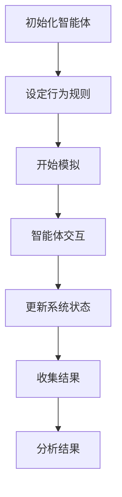
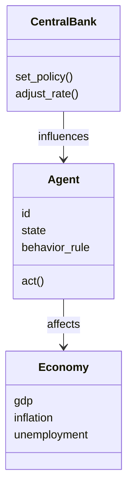
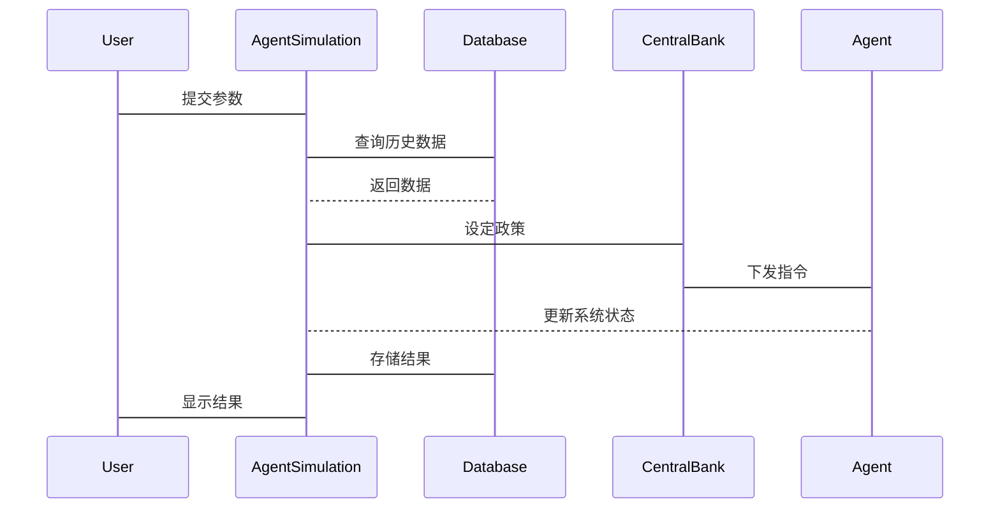

                 


# 利用多智能体系统模拟不同货币政策情景：评估宏观风险

## 关键词：
货币政策、多智能体系统、宏观风险管理、经济模拟、系统建模

## 摘要：
本文探讨了利用多智能体系统（Multi-Agent System, MAS）模拟不同货币政策情景，以评估宏观风险的方法。通过构建多智能体模型，分析货币政策对宏观经济变量的影响，评估潜在风险，并提出风险管理策略。本文结合理论分析与实践应用，详细介绍建模过程、算法实现及案例分析，为政策制定者和研究人员提供参考。

---

## 第1章：货币政策与宏观风险管理

### 1.1 货币政策的背景与重要性

#### 1.1.1 货币政策的基本概念
货币政策是国家或地区通过调节货币供应量、利率等手段，影响经济运行的宏观政策工具。其主要目标包括控制通货膨胀、促进就业、维持经济增长和维护金融稳定。

#### 1.1.2 货币政策的目标与工具
- **目标**：稳定物价、促进就业、维持经济增长、平衡国际收支。
- **工具**：调整基准利率、存款准备金率、公开市场操作、再贴现率等。

#### 1.1.3 宏观风险管理的重要性
宏观风险管理是评估和应对经济系统中潜在风险的过程。通过模拟不同政策情景，可以提前识别和规避风险，为政策制定提供科学依据。

---

### 1.2 多智能体系统的概念与应用

#### 1.2.1 多智能体系统的定义与特点
多智能体系统是由多个相互作用的智能体组成的系统，智能体具有自主性、反应性、社会性和协作性。MAS在经济模拟中的应用优势在于能够模拟个体行为及其对整体系统的影响。

#### 1.2.2 多智能体系统在经济模拟中的应用
MAS广泛应用于金融市场模拟、供应链管理、交通流模拟等领域。在货币政策模拟中，MAS可以模拟企业和家庭的行为，分析政策对经济的多维度影响。

#### 1.2.3 多智能体系统的优缺点
- **优点**：能够模拟复杂系统的动态行为，捕捉非线性关系。
- **缺点**：模型复杂度高，参数设定和数据获取较难。

---

### 1.3 问题背景与研究意义

#### 1.3.1 货币政策模拟的复杂性
货币政策的实施效果受多种因素影响，包括市场主体行为、经济结构、政策滞后效应等。传统计量经济模型难以捕捉复杂动态关系。

#### 1.3.2 多智能体系统在货币政策模拟中的优势
MAS能够模拟个体行为的异质性，反映政策实施过程中的动态变化，为政策效果评估提供更全面的视角。

#### 1.3.3 研究的现实意义与创新点
通过MAS模拟货币政策情景，可以为政策制定者提供决策支持，同时为学术研究提供新的方法和工具。

---

## 第2章：多智能体系统与货币政策模型

### 2.1 多智能体系统的原理

#### 2.1.1 多智能体系统的组成要素
- **智能体**：具有自主性、反应性和社会性的主体，如企业、家庭、银行等。
- **环境**：智能体所处的经济环境，包括市场、政策、资源等。
- **交互规则**：智能体之间的交互规则，如交易规则、信息传递规则。

#### 2.1.2 多智能体系统的动态演化
MAS的动态演化过程包括智能体的初始化、交互、状态更新等步骤，系统通过局部互动形成整体行为。

#### 2.1.3 多智能体系统的建模方法
- **基于规则的建模**：定义智能体的行为规则，模拟其决策过程。
- **基于模型的建模**：使用数学模型描述智能体行为及其相互作用。

---

### 2.2 货币政策模型的核心要素

#### 2.2.1 货币政策工具的选择
- **利率政策**：调整基准利率影响借贷成本。
- **货币供应政策**：通过公开市场操作调节货币供应量。
- **信贷政策**：通过窗口指导或信贷配额影响信贷供给。

#### 2.2.2 宏观经济变量的相互关系
- **主要变量**：GDP增长率、通货膨胀率、失业率、利率、货币供应量。
- **相互关系**：利率影响投资和消费，货币供应量影响物价水平，失业率与经济增长呈负相关。

#### 2.2.3 模型的假设与限制条件
- **假设**：市场主体理性决策，信息对称。
- **限制**：模型简化现实，忽略某些复杂因素。

---

### 2.3 多智能体系统与货币政策模型的结合

#### 2.3.1 智能体的角色分配
- **中央银行**：制定和执行货币政策。
- **商业银行**：根据政策调整信贷行为。
- **企业和家庭**：根据利率和经济状况调整投资和消费。

#### 2.3.2 智能体行为对宏观经济变量的影响
- **利率政策**：降低利率会刺激投资和消费，提高GDP增长率。
- **货币供应政策**：增加货币供应量可能导致通货膨胀，提高物价水平。

#### 2.3.3 系统整体行为的宏观表现
通过MAS模拟，可以观察宏观经济变量的动态变化，评估政策效果。

---

## 第3章：多智能体系统的算法实现

### 3.1 基于ABM的货币政策模拟算法

#### 3.1.1 ABM的基本步骤
1. 初始化智能体及其属性。
2. 设定智能体的交互规则和行为策略。
3. 模拟智能体的交互过程，更新系统状态。
4. 收集和分析模拟结果。

#### 3.1.2 算法实现的流程图


#### 3.1.3 算法实现的Python代码
```python
# 初始化智能体
agents = [Agent(i) for i in range(n_agents)]

# 设定行为规则
for agent in agents:
    agent.set_behavior_rule(rule)

# 开始模拟
for step in range(n_steps):
    for agent in agents:
        agent.act()  # 智能体根据规则行动
    update_system_state()  # 更新系统状态

# 收集结果
results = collect_data()
```

---

### 3.2 算法的数学模型与公式

#### 3.2.1 智能体的行为模型
智能体的行为可以通过以下公式表示：
$$
a_i(t) = f(s_i(t), s_j(t), \ldots)
$$
其中，$a_i(t)$ 表示智能体i在时间t的行为，$s_i(t)$ 和 $s_j(t)$ 分别表示智能体i和j的状态。

#### 3.2.2 宏观经济变量的动态模型
宏观经济变量的动态变化可以用以下微分方程表示：
$$
\frac{dGDP}{dt} = \alpha \cdot InterestRate - \beta \cdot InflationRate
$$
其中，$\alpha$ 和 $\beta$ 是系数，表示利率和通货膨胀率对GDP增长率的影响。

---

## 第4章：系统分析与架构设计

### 4.1 系统功能设计

#### 4.1.1 系统模块划分
- **数据输入模块**：读取初始数据和参数。
- **模型模拟模块**：实现智能体的交互和系统的动态演化。
- **结果分析模块**：收集和分析模拟结果。

#### 4.1.2 功能设计的领域模型图


---

### 4.2 系统架构设计

#### 4.2.1 系统架构图


---

### 4.3 接口设计与交互序列图

#### 4.3.1 系统接口设计
- **输入接口**：接收用户输入的参数和初始条件。
- **输出接口**：展示模拟结果和分析报告。

#### 4.3.2 交互序列图


---

## 第5章：项目实战

### 5.1 环境安装与配置

#### 5.1.1 安装必要的库
安装NumPy、Matplotlib、NetworkX等库：
```bash
pip install numpy matplotlib networkx
```

#### 5.1.2 安装MAS框架
安装 Mesa 框架：
```bash
pip install mesa
```

---

### 5.2 系统核心实现源代码

#### 5.2.1 智能体类的实现
```python
class Agent:
    def __init__(self, id):
        self.id = id
        self.state = 0

    def set_behavior_rule(self, rule):
        self.rule = rule

    def act(self):
        if self.state > 0:
            # 执行某种行为
            pass
```

#### 5.2.2 中央银行模块
```python
class CentralBank:
    def set_policy(self, policy):
        self.policy = policy

    def adjust_rate(self):
        # 根据政策调整利率
        pass
```

---

### 5.3 代码应用解读与分析

#### 5.3.1 模拟过程
```python
from mesa import Model, Agent, Grid

class EconomicAgent(Agent):
    def __init__(self, ...):
        super().__init__(...)
        self.money = initial_money

    def act(self):
        # 根据行为规则行动
        pass

class EconomicModel(Model):
    def setup(self):
        self.grid = Grid(...)
        self.agents = [EconomicAgent(...) for _ in range(n_agents)]
```

---

### 5.4 实际案例分析

#### 5.4.1 案例背景
模拟中央银行实施降息政策对GDP增长率的影响。

#### 5.4.2 模拟结果分析
通过MAS模拟，观察GDP增长率的变化趋势，评估政策效果。

---

### 5.5 项目小结

#### 5.5.1 项目总结
MAS在货币政策模拟中的应用能够提供更全面的分析结果，为政策制定提供科学依据。

#### 5.5.2 经验与教训
模型的复杂性可能会影响模拟效率，参数设定需要准确反映现实情况。

---

## 第6章：总结与展望

### 6.1 全文总结

#### 6.1.1 核心内容回顾
通过MAS模拟货币政策情景，评估宏观风险，为政策制定提供支持。

#### 6.1.2 方法总结
基于MAS的建模方法能够捕捉复杂系统的动态行为，提供更深入的分析结果。

---

### 6.2 注意事项与最佳实践

#### 6.2.1 模型构建的注意事项
- 确保模型的参数和规则准确反映现实情况。
- 定期验证模型的准确性和可靠性。

#### 6.2.2 代码实现的注意事项
- 选择合适的框架和工具，确保代码的可维护性和可扩展性。
- 处理大数据时，优化算法和数据结构。

---

### 6.3 未来研究方向

#### 6.3.1 拓展研究领域
- 研究多智能体系统在其他经济政策模拟中的应用。
- 探讨MAS与其他数据分析方法的结合。

#### 6.3.2 技术发展
- 研究更高效的MAS模拟算法，提高计算效率。
- 开发更直观的可视化工具，便于结果分析和展示。

---

## 作者：AI天才研究院/AI Genius Institute & 禅与计算机程序设计艺术 /Zen And The Art of Computer Programming

