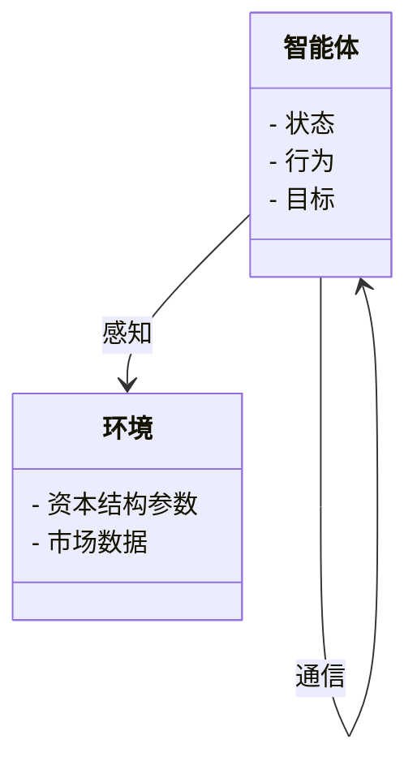

                 


# 利用多智能体系统模拟不同资本结构：优化公司价值

> 关键词：多智能体系统，资本结构优化，公司价值，分布式计算，金融建模

> 摘要：本文通过分析多智能体系统（Multi-Agent Systems, MAS）在资本结构优化中的应用，提出了一种基于MAS的资本结构优化方法。通过详细阐述MAS的基本概念、资本结构优化的背景、MAS在金融领域的优势，以及具体的算法实现，本文旨在为公司价值最大化提供一种创新的解决方案。文章还通过实际案例分析，验证了该方法的有效性和优势。

---

# 第一部分: 多智能体系统与资本结构优化背景

## 第1章: 多智能体系统概述

### 1.1 多智能体系统的基本概念

#### 1.1.1 多智能体系统的定义与特点
多智能体系统（Multi-Agent Systems, MAS）是由多个智能体（Agent）组成的分布式系统，这些智能体能够通过交互和协作完成复杂任务。MAS的特点包括分布式性、自治性、反应性和社会性。

#### 1.1.2 多智能体系统的组成与结构
MAS由以下几部分组成：
- **智能体（Agent）**：具有感知环境、自主决策和行动的能力。
- **环境（Environment）**：智能体所处的外部世界，包括物理环境和问题空间。
- **通信机制**：智能体之间的交互和信息共享方式。
- **协作协议**：智能体协作的目标和规则。

#### 1.1.3 多智能体系统的应用领域
MAS在多个领域有广泛应用，包括分布式计算、机器人协作、交通管理、金融建模等。本文重点关注其在金融领域的应用，特别是资本结构优化。

---

### 1.2 资本结构优化的基本概念

#### 1.2.1 资本结构的定义与类型
资本结构是指公司通过债务、股权和其他方式融资的比例。常见的资本结构类型包括：
- **债务融资**：通过借款或发行债券筹集资金。
- **股权融资**：通过发行股票筹集资金。
- **混合融资**：结合债务和股权的混合方式。

#### 1.2.2 资本结构优化的目标与意义
资本结构优化的目标是找到最优的融资组合，以最小化加权平均资本成本（WACC），从而最大化公司价值。资本结构优化的意义在于提高企业的财务稳定性、降低融资成本，并为股东创造最大价值。

#### 1.2.3 资本结构优化的常用方法
传统的资本结构优化方法包括：
- **净现值法（NPV）**：通过计算不同资本结构下的净现值，选择最优方案。
- **加权平均资本成本法（WACC）**：计算不同资本结构下的加权平均资本成本，选择最小的WACC。
- **股权成本法**：通过分析股权成本的变化，找到最优资本结构。

---

### 1.3 传统资本结构优化方法的局限性

#### 1.3.1 净现值法的局限性
净现值法在资本结构优化中的局限性在于其假设条件过于严格，难以适应复杂的金融市场环境。

#### 1.3.2 加权平均资本成本法的局限性
加权平均资本成本法在实际应用中忽略了市场的动态变化和风险因素的复杂性。

#### 1.3.3 股权成本法的局限性
股权成本法在实际操作中难以准确估计不同资本结构下的股权成本。

---

## 第2章: 多智能体系统在资本结构优化中的应用背景

### 2.1 多智能体系统在金融领域的优势

#### 2.1.1 多智能体系统的分布式计算优势
MAS能够将复杂的优化问题分解为多个子问题，通过分布式计算提高效率。

#### 2.1.2 多智能体系统的自适应性优势
MAS能够根据市场环境的变化自适应调整策略，实现动态优化。

#### 2.1.3 多智能体系统的协同优化优势
MAS通过智能体之间的协作，能够找到全局最优解，避免传统方法的局部最优问题。

---

### 2.2 问题背景与研究现状

#### 2.2.1 资本结构优化问题的提出
随着金融市场复杂性的增加，传统的资本结构优化方法难以满足实际需求。

#### 2.2.2 多智能体系统在资本结构优化中的应用现状
目前，MAS在资本结构优化中的应用研究较少，但其潜力巨大。

#### 2.2.3 当前研究的挑战与不足
当前研究主要集中在理论层面，缺乏实际应用案例和深入的算法设计。

---

# 第二部分: 核心概念与联系

## 第3章: 多智能体系统与资本结构优化的核心概念

### 3.1 多智能体系统与资本结构优化的联系

#### 3.1.1 系统模型
通过构建 MAS 模型，将资本结构优化问题转化为多智能体协作优化问题。

#### 3.1.2 优化问题建模
将资本结构优化问题建模为一个分布式优化问题，通过 MAS 的智能体协作求解。

#### 3.1.3 算法设计
设计 MAS 的优化算法，如遗传算法、粒子群优化等，用于求解资本结构优化问题。

---

## 第4章: 多智能体系统的优化算法设计

### 4.1 遗传算法在 MAS 中的应用

#### 4.1.1 遗传算法的基本原理
遗传算法是一种基于自然选择和遗传机制的优化算法，适用于复杂的非线性问题。

#### 4.1.2 遗传算法的MAS实现
通过MAS中的多个智能体协作，实现遗传算法的并行优化。

### 4.2 粒子群优化算法在 MAS 中的应用

#### 4.2.1 粒子群优化算法的基本原理
粒子群优化（PSO）是一种基于群体智能的优化算法，适用于连续优化问题。

#### 4.2.2 粒子群优化算法的MAS实现
通过MAS中的智能体协作，实现粒子群优化的分布式计算。

---

## 第5章: 数学模型与公式

### 5.1 资本结构优化的数学模型

#### 5.1.1 加权平均资本成本公式
$$ WACC = \frac{D}{V} \times r_d \times (1 - t) + \frac{E}{V} \times r_e $$

#### 5.1.2 股权资本成本公式
$$ r_e = r_f + \beta \times (r_m - r_f) $$

#### 5.1.3 净现值公式
$$ NPV = \sum_{t=1}^{n} \frac{CF_t}{(1 + r)^t} $$

---

# 第三部分: 系统分析与架构设计

## 第6章: 系统分析与架构设计

### 6.1 问题场景介绍
通过分析公司资本结构优化的实际需求，提出基于MAS的解决方案。

### 6.2 系统功能设计

#### 6.2.1 领域模型


### 6.3 系统架构设计

#### 6.3.1 系统架构图
```mermaid
containerDiagram
    container MAS系统 {
        智能体1
        智能体2
        智能体3
        通信机制
    }
```

---

## 第7章: 项目实战

### 7.1 环境安装

#### 7.1.1 安装Python环境
安装Python 3.x，并配置虚拟环境。

#### 7.1.2 安装依赖库
安装必要的库，如 `numpy`, `pandas`, `matplotlib`。

### 7.2 核心代码实现

#### 7.2.1 MAS实现
```python
class Agent:
    def __init__(self, id, target):
        self.id = id
        self.target = target
        self.state = 0

    def update(self, neighbors):
        # 具体更新逻辑
        pass
```

#### 7.2.2 优化算法实现
```python
def genetic_algorithm(population, fitness_fn):
    # 具体实现
    pass
```

### 7.3 实际案例分析

#### 7.3.1 案例背景
分析某公司的资本结构优化问题。

#### 7.3.2 数据分析与建模
通过 MAS 模型进行数据建模和分析。

#### 7.3.3 实验结果与分析
展示优化结果，并进行对比分析。

---

## 第8章: 总结与展望

### 8.1 最佳实践 tips
总结MAS在资本结构优化中的最佳实践，如算法选择、参数设置等。

### 8.2 小结
通过本文的分析，提出了基于MAS的资本结构优化方法，并通过实际案例验证了其有效性。

### 8.3 注意事项
在实际应用中，需要注意 MAS 的复杂性和计算资源的消耗。

### 8.4 拓展阅读
推荐进一步阅读相关领域的书籍和论文，深入研究MAS在金融中的应用。

---

# 作者：AI天才研究院/AI Genius Institute & 禅与计算机程序设计艺术/Zen And The Art of Computer Programming

