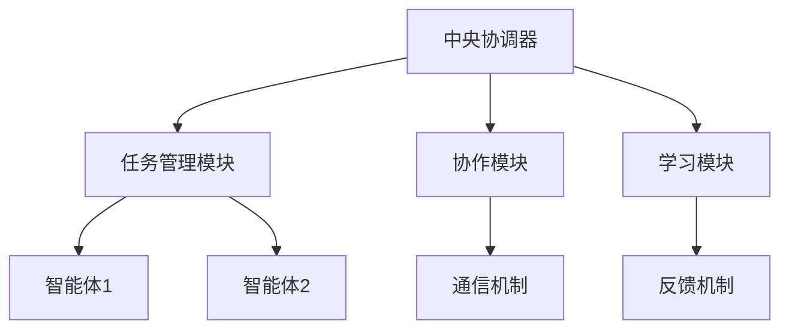

                 


# 利用多智能体系统评估公司的创新生态系统

## 关键词：多智能体系统、创新生态系统、企业创新管理、分布式计算、协作机制、自适应学习

## 摘要：  
在现代企业环境中，创新是维持竞争优势的关键因素。为了有效评估和优化公司的创新生态系统，多智能体系统（Multi-Agent Systems, MAS）提供了一种强大的工具。通过将企业中的创新主体（如员工、团队、部门）建模为智能体，我们可以模拟和分析它们之间的协作与竞争，从而更好地理解创新过程，并制定有效的管理策略。本文将详细探讨多智能体系统在创新生态系统评估中的应用，从核心概念到算法原理，再到实际案例，全面解析如何利用MAS提升企业的创新能力。

---

# 第一部分: 引言

## 第1章: 创新生态系统与多智能体系统的背景介绍

### 1.1 创新生态系统的核心概念  
创新生态系统是指支持企业创新的各种要素的有机组合，包括：  
- **创新主体**：如员工、团队、部门、合作伙伴等。  
- **创新资源**：如资金、技术、信息、知识等。  
- **创新环境**：包括企业内部文化、制度，以及外部市场、政策等。  

创新生态系统的健康程度直接影响企业的创新能力。  

### 1.2 多智能体系统的基本概念  
多智能体系统（MAS）是由多个智能体组成的分布式系统，每个智能体具备以下特点：  
- **自主性**：智能体能够自主决策。  
- **反应性**：能够感知环境并实时调整行为。  
- **协作性**：能够与其他智能体协作以实现共同目标。  
- **学习能力**：能够通过经验改进自身行为。  

### 1.3 多智能体系统在创新管理中的应用  
多智能体系统可以模拟企业的创新生态系统，帮助管理者：  
- 分析创新主体之间的协作与竞争关系。  
- 优化资源配置，提升创新效率。  
- 预测创新趋势，制定前瞻性战略。  

---

# 第二部分: 多智能体系统的核心概念与联系

## 第2章: 多智能体系统的组成与功能

### 2.1 多智能体系统的组成要素  
多智能体系统由以下要素构成：  
- **智能体**：具备自主性、反应性和协作性的个体。  
- **环境**：智能体所处的物理或虚拟空间。  
- **通信机制**：智能体之间交换信息的渠道。  
- **协作协议**：定义智能体之间协作的规则。  

### 2.2 多智能体系统的核心功能  
- **分布式计算**：通过多个智能体协同完成复杂任务。  
- **协作与竞争**：智能体之间既协作又竞争，推动系统优化。  
- **自适应学习**：智能体通过经验改进行为。  

### 2.3 多智能体系统与创新生态系统的联系  
创新生态系统可以被视为一个多智能体系统，其中：  
- 创新主体是智能体。  
- 创新资源是环境中的关键要素。  
- 协作协议是创新主体之间的互动规则。  

---

## 第3章: 多智能体系统的协作机制

### 3.1 分布式协作原理  
多智能体系统的协作基于以下原则：  
- **局部最优**：每个智能体追求局部最优，整体形成全局最优。  
- **信息共享**：智能体通过通信机制共享信息，减少信息孤岛。  
- **动态调整**：根据环境变化实时调整协作策略。  

### 3.2 协作协议与规则  
- **任务分配**：智能体根据自身能力和环境需求分配任务。  
- **冲突解决**：通过协商或仲裁机制解决协作中的冲突。  
- **激励机制**：通过奖励或惩罚激励智能体的协作行为。  

### 3.3 协作中的数学模型  
我们可以用以下公式描述多智能体协作的效率：  
$$ C = \frac{\sum_{i=1}^{n} a_i}{n} $$  
其中，$C$ 表示协作效率，$a_i$ 表示第 $i$ 个智能体的贡献，$n$ 为智能体总数。  

---

# 第三部分: 多智能体系统的算法原理与数学模型

## 第4章: 多智能体系统的算法原理

### 4.1 分布式计算算法  
分布式计算是多智能体系统的核心算法之一。以下是一个简单的分布式任务分配算法：  
1. 每个智能体根据自身能力和资源需求提出任务请求。  
2. 中央协调器根据任务优先级和资源分配规则分配任务。  
3. 智能体执行任务并反馈结果。  
4. 系统根据反馈调整任务分配策略。  

### 4.2 协作与学习算法  
以下是一个基于强化学习的协作算法：  
1. 每个智能体通过与环境互动获得奖励。  
2. 智能体通过Q-learning算法优化自身策略。  
3. 协作机制确保智能体之间的策略协调。  

### 4.3 数学模型  
我们可以通过以下公式描述多智能体系统的协作效率：  
$$ E = \sum_{i=1}^{n} \alpha_i \cdot x_i $$  
其中，$E$ 表示总效率，$\alpha_i$ 表示第 $i$ 个智能体的协作系数，$x_i$ 表示第 $i$ 个智能体的贡献。  

---

## 第5章: 创新生态系统评估的数学模型

### 5.1 创新生态系统评估指标  
创新生态系统评估的关键指标包括：  
- 创新成果（如专利数量、新产品数量）。  
- 创新效率（如单位时间内的创新产出）。  
- 创新资源利用率（如资金、人力资源的使用效率）。  

### 5.2 数学模型  
我们可以构建以下评估模型：  
$$ I = \beta \cdot \left( \sum_{i=1}^{n} w_i \cdot x_i \right) $$  
其中，$I$ 表示创新指数，$\beta$ 表示权重系数，$w_i$ 表示第 $i$ 个指标的权重，$x_i$ 表示第 $i$ 个指标的评估值。  

---

# 第四部分: 多智能体系统的系统架构与实现

## 第6章: 多智能体系统的系统架构

### 6.1 系统功能设计  
- **任务管理模块**：负责任务分配与监控。  
- **协作模块**：负责智能体之间的协作与通信。  
- **学习模块**：负责智能体的自适应学习。  

### 6.2 系统架构设计  
以下是系统的架构图：  



### 6.3 系统接口设计  
- **输入接口**：接收创新主体的任务请求。  
- **输出接口**：输出创新生态系统的评估结果。  
- **通信接口**：实现智能体之间的信息共享。  

---

## 第7章: 项目实战与案例分析

### 7.1 环境安装与配置  
- 安装Python和相关库（如`numpy`, `scipy`, `matplotlib`）。  
- 安装多智能体系统模拟工具（如`Multi-Agent Simulation Framework`）。  

### 7.2 核心代码实现  
以下是一个简单的多智能体协作算法的Python代码示例：  

```python
import numpy as np

class Agent:
    def __init__(self, id):
        self.id = id
        self.performance = 0

    def collaborate(self, task):
        self.performance += task
        return self.performance

# 初始化智能体
agents = [Agent(i) for i in range(5)]

# 分配任务
tasks = np.random.randint(1, 10, 5)
for i in range(5):
    agents[i].collaborate(tasks[i])

# 输出结果
for agent in agents:
    print(f"Agent {agent.id} performance: {agent.performance}")
```

### 7.3 案例分析  
以某科技公司为例，通过多智能体系统模拟其创新生态系统，分析协作效率和创新产出。  

---

## 第8章: 最佳实践与小结

### 8.1 小结  
本文详细介绍了多智能体系统在创新生态系统评估中的应用，从核心概念到算法实现，再到实际案例，为读者提供了全面的视角。  

### 8.2 注意事项  
- 确保智能体之间的通信机制高效可靠。  
- 定期优化协作协议和学习算法。  
- 注意数据隐私和安全问题。  

### 8.3 拓展阅读  
- 推荐阅读《Multi-Agent Systems: Complexity and Intelligence》。  
- 关注学术期刊中的相关研究。  

---

# 作者：AI天才研究院/AI Genius Institute & 禅与计算机程序设计艺术 /Zen And The Art of Computer Programming

