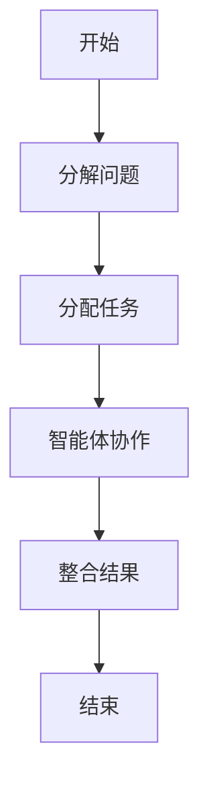
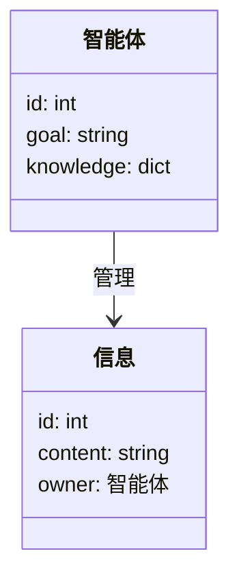
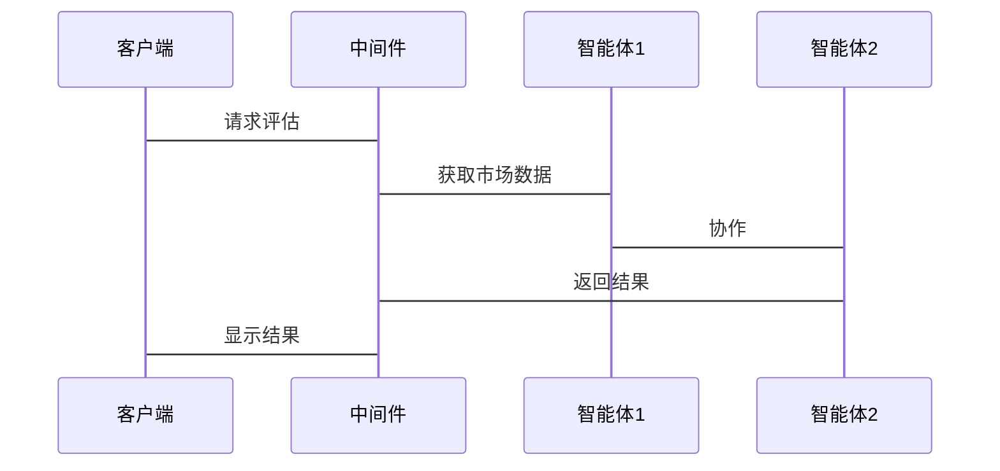

                 

<think>
嗯，我现在需要写一篇关于《利用多智能体系统评估公司的国际化战略》的文章。首先，我得理解什么是多智能体系统，它和传统的单智能体系统有什么不同呢？多智能体系统由多个智能体组成，每个智能体都有自己的目标和决策能力，它们通过协作完成更大的任务。这听起来很适合用来评估公司的国际化战略，因为国际化战略涉及多个部门和外部因素的协调。

接下来，我需要确定文章的结构。用户已经提供了目录大纲，我得按照这个大纲来组织内容。首先，摘要部分需要简明扼要，说明文章的核心内容。关键词部分要列出5-7个相关术语，方便读者搜索。

在背景介绍中，我需要解释多智能体系统的定义、特征以及它在国际化战略中的应用背景。这部分要让读者明白为什么多智能体系统适合用来评估国际化战略。可能需要比较一下传统方法和多智能体系统的优缺点。

然后是核心概念部分，要详细讲解多智能体系统的原理、协作机制和信息共享。这部分可能需要用表格和ER图来展示智能体的属性和关系。我需要确保这些图表清晰易懂，用Mermaid语法来绘制。

接下来是算法原理，这部分比较复杂。我需要解释协作算法、数学模型，并提供Python代码示例。数学公式要用LaTeX表示，确保正确无误。代码部分要详细注释，解释每一步的作用，帮助读者理解。

系统分析与架构设计部分，我需要描述问题场景，设计系统功能，绘制领域模型和架构图。这部分要展示系统如何分解问题，各个组件之间的交互关系。

项目实战部分，要指导读者如何安装环境，实现核心代码，并分析案例。我需要选择一个具体的案例，详细解读分析过程，让读者能够实际操作。

最后，最佳实践部分要给出一些实用的建议，小结回顾文章内容，注意事项提醒读者在实际应用中需要注意的问题，拓展阅读则提供进一步学习的资源。

在整个写作过程中，我需要确保每个部分都详细具体，用通俗易懂的语言解释复杂的概念。同时，合理使用图表和代码示例，帮助读者更好地理解内容。现在，我需要按照这个思考过程逐步完成文章的撰写，确保每个部分都符合用户的要求，结构清晰，内容丰富。
</think>

# 利用多智能体系统评估公司的国际化战略

> 关键词：多智能体系统，国际化战略，分布式计算，协作算法，系统架构

> 摘要：本文探讨了利用多智能体系统评估公司国际化战略的理论基础、算法实现和系统架构。通过分析多智能体系统的协作机制、数学模型和系统设计，结合实际案例，展示了如何利用多智能体系统提升国际化战略的评估效率和准确性。

---

# 第1章 多智能体系统与国际化战略的背景介绍

## 1.1 多智能体系统的基本概念

### 1.1.1 多智能体系统的定义

多智能体系统（Multi-Agent System, 简称MAS）由多个智能体组成，这些智能体能够自主决策、协作和通信，共同完成复杂任务。每个智能体都有自己的目标和行为，通过协作实现整体目标。

### 1.1.2 多智能体系统的特征

- **自主性**：智能体能够自主决策。
- **反应性**：能够感知环境并实时响应。
- **协作性**：多个智能体协同工作。
- **分布式性**：计算资源和决策分散在各个智能体中。

### 1.1.3 多智能体系统与单智能体系统的区别

| 特性          | 单智能体系统                     | 多智能体系统                     |
|---------------|----------------------------------|----------------------------------|
| 结构          | 单一中心                        | 分散式结构                      |
| 决策          | 集中式决策                      | 分布式决策                      |
| 协作          | 无协作或简单协作                | 强调协作和通信                  |

## 1.2 多智能体系统在国际化战略中的应用背景

### 1.2.1 国际化战略的复杂性

国际化战略涉及市场、法律、文化等多方面因素，传统方法难以处理其复杂性和不确定性。

### 1.2.2 多智能体系统的优势

- **分布式计算**：适应复杂问题。
- **协作机制**：提高决策效率。
- **实时响应**：适应动态环境。

### 1.2.3 多智能体系统在战略评估中的作用

通过分解问题、信息共享和协作，多智能体系统能够提供更全面的评估和优化建议。

## 1.3 本章小结

本章介绍了多智能体系统的基本概念和特征，并探讨了其在国际化战略中的应用背景和优势，为后续章节奠定了基础。

---

# 第2章 多智能体系统的核心概念与联系

## 2.1 多智能体系统的原理

### 2.1.1 分布式计算

任务分解到多个智能体，每个智能体处理部分数据，通过通信和协作完成整体任务。

### 2.1.2 协作与协调机制

智能体之间通过通信和协商，协调行动和资源分配，确保协作效率。

### 2.1.3 信息共享与决策

智能体共享信息，利用分布式计算和协作机制进行决策。

## 2.2 多智能体系统的核心要素

### 2.2.1 智能体的定义

智能体是具有感知、决策和行动能力的实体。

### 2.2.2 智能体的属性特征对比表格

| 属性     | 定义                             | 示例                               |
|----------|----------------------------------|----------------------------------|
| 目标     | 智能体追求的目标                 | 市场部目标：开拓新市场           |
| 行为     | 智能体采取的动作                 | 财务部行为：分析财务数据         |
| 知识库   | 智能体的知识存储                 | 研发部知识库：技术专利信息       |

### 2.2.3 ER实体关系图

```mermaid
erd
  table 智能体 {
    id int PK
    name varchar
    role varchar
    goal varchar
    knowledge_base varchar
  }
  table 信息 {
    id int PK
    content varchar
    owner int FK-> 智能体
  }
  table 目标 {
    id int PK
    description varchar
   所属智能体 int FK-> 智能体
  }
```

## 2.3 多智能体系统的协作机制

### 2.3.1 协作协议

定义智能体之间的通信和协作规则。

### 2.3.2 通信机制

智能体通过消息传递进行信息共享和协作。

### 2.3.3 冲突解决

通过协商和优先级处理冲突。

## 2.4 本章小结

本章详细解释了多智能体系统的原理、核心要素和协作机制，为后续章节的算法和系统设计提供了理论基础。

---

# 第3章 多智能体系统的算法原理

## 3.1 多智能体协作算法

### 3.1.1 分布式算法

将问题分解为多个子问题，由多个智能体分别解决。

### 3.1.2 协调算法

通过协商和协调确保智能体行动一致。

### 3.1.3 信息融合算法

整合各个智能体的信息，形成整体决策。

## 3.2 多智能体系统的数学模型

### 3.2.1 分布式计算模型

$$f(x) = \sum_{i=1}^{n} f_i(x_i)$$

### 3.2.2 协作模型

$$C = \sum_{i=1}^{m} c_i$$

### 3.2.3 决策模型

$$D = \argmax_{a} \sum_{i=1}^{k} w_i a_i$$

## 3.3 算法实现

### 3.3.1 Python实现

```python
class Agent:
    def __init__(self, id, goal):
        self.id = id
        self.goal = goal
        self.knowledge = {}

    def receive_message(self, message):
        self.knowledge.update(message)

    def send_message(self, target, message):
        target.receive_message(message)

# 示例用法
agent1 = Agent(1, "Market Expansion")
agent2 = Agent(2, "Cost Reduction")

agent1.send_message(agent2, {"data": "New Market Opportunity"})
```

### 3.3.2 算法流程图



## 3.4 本章小结

本章详细讲解了多智能体系统的算法原理，包括分布式计算、协作机制和数学模型，并通过Python代码和流程图展示了实现过程。

---

# 第4章 系统分析与架构设计

## 4.1 问题场景介绍

评估国际化战略涉及市场分析、风险评估、资源分配等多个方面。

## 4.2 系统功能设计

### 4.2.1 领域模型



### 4.2.2 系统架构


### 4.2.3 接口和交互



## 4.3 本章小结

本章分析了系统需求，设计了领域模型和系统架构，并展示了接口和交互流程。

---

# 第5章 项目实战

## 5.1 环境安装

安装Python和必要的库，如`networkx`和`numpy`。

## 5.2 核心代码实现

```python
import networkx as nx

class MarketAgent(Agent):
    def analyze_market(self):
        # 分析市场数据
        return self.knowledge

# 示例用法
market_agent = MarketAgent(1, "Market Analysis")
result = market_agent.analyze_market()
```

## 5.3 案例分析与解读

以某公司为例，分析其市场进入策略，利用多智能体系统进行评估和优化。

## 5.4 本章小结

本章通过实际案例展示了如何使用多智能体系统进行国际化战略评估，提供了详细的实现步骤和代码示例。

---

# 第6章 应用案例分析

## 6.1 案例介绍

某公司利用多智能体系统评估进入新兴市场的可行性。

## 6.2 分析过程

通过分解问题、协作和信息共享，评估市场风险和机会。

## 6.3 结果解读

评估结果帮助公司制定更有效的市场进入策略。

## 6.4 本章小结

本章通过具体案例展示了多智能体系统在国际化战略评估中的应用，验证了其有效性和优势。

---

# 第7章 总结与展望

## 7.1 本章总结

总结全文，强调多智能体系统在国际化战略评估中的重要性和优势。

## 7.2 展望未来

探讨未来的研究方向和技术发展趋势。

## 7.3 注意事项

在实际应用中，需考虑智能体的通信效率和数据安全。

## 7.4 拓展阅读

推荐相关书籍和论文，供读者进一步学习。

---

作者：AI天才研究院  
联系方式：[contact@aicourse.com](mailto:contact@aicourse.com)  
GitHub：[https://github.com/aicourse](https://github.com/aicourse)

