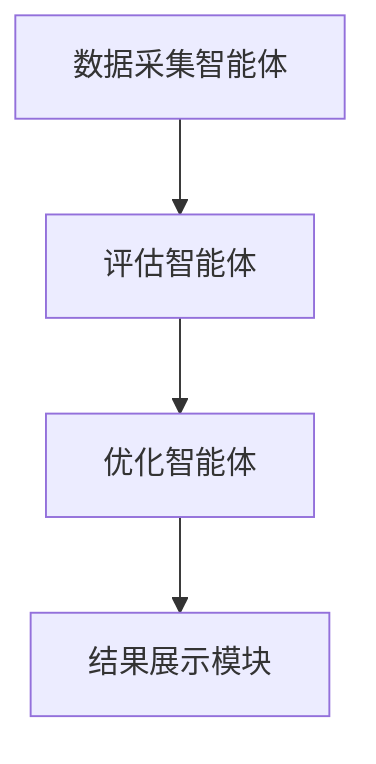
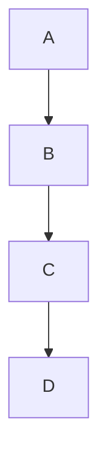
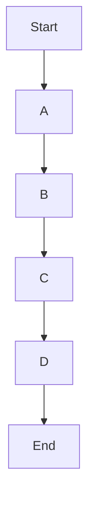

                 


# 利用多智能体系统评估公司的循环经济实践

> 关键词：多智能体系统、循环经济、评估模型、系统架构、算法原理

> 摘要：本文探讨了如何利用多智能体系统对公司的循环经济实践进行评估。通过分析多智能体系统的核心原理，设计评估模型，并结合实际案例，展示了如何利用该技术优化企业的循环经济实践。文章内容涵盖背景、理论、方法、系统设计和项目实战，旨在为相关领域提供参考。

---

# 第一部分：背景与概念

## 第1章：循环经济与多智能体系统的概述

### 1.1 循环经济的基本概念

#### 1.1.1 循环经济的定义与内涵
循环经济是一种以资源高效利用和循环利用为核心，以减少资源消耗和环境污染为目标的经济模式。它强调“从摇篮到摇篮”的理念，通过废弃物的再利用和产品生命周期的管理，实现资源的闭环循环。

#### 1.1.2 循环经济的核心原则
循环经济的核心原则包括：
1. 减量化（Reduce）：减少资源消耗和废物产生。
2. 再利用（Reuse）：延长产品和材料的使用寿命。
3. 再生化（Recycle）：将废弃物转化为新的资源。

#### 1.1.3 循环经济的实践意义
循环经济不仅有助于减少环境负担，还能提高资源利用效率，降低成本，创造新的经济增长点。在企业层面，循环经济实践可以帮助企业实现可持续发展，增强竞争力。

### 1.2 多智能体系统的定义与特点

#### 1.2.1 多智能体系统的定义
多智能体系统（Multi-Agent System, MAS）是由多个独立但协作的智能体组成的系统。这些智能体能够通过交流和协作，共同完成复杂任务。

#### 1.2.2 多智能体系统的核心特征
1. **分布式智能**：每个智能体都具有一定的决策能力和知识。
2. **协作性**：智能体之间通过协作完成共同目标。
3. **自主性**：智能体能够自主决策，无需外部干预。
4. **动态性**：系统能够适应环境的变化。

#### 1.2.3 多智能体系统与传统单智能体系统的区别
| 特性             | 多智能体系统           | 单智能体系统         |
|------------------|-----------------------|----------------------|
| 结构复杂性       | 高                   | 低                   |
| 协作能力         | 强                   | 弱                   |
| 灵活性           | 高                   | 低                   |
| 可扩展性         | 高                   | 低                   |

### 1.3 多智能体系统在循环经济中的应用前景

#### 1.3.1 循环经济评估中的问题与挑战
循环经济评估需要考虑资源流、产品生命周期、废弃物处理等多个方面。传统方法往往依赖中心化计算，难以处理复杂性和动态性。

#### 1.3.2 多智能体系统在循环经济评估中的优势
1. **分布式计算能力**：能够处理大规模数据和复杂任务。
2. **协作机制**：能够协调不同部门或企业的资源流。
3. **动态适应性**：能够快速响应环境变化。

#### 1.3.3 多智能体系统应用的潜在价值
通过多智能体系统，企业可以实现资源的高效配置和优化，降低运营成本，提高循环经济的实施效果。

---

## 第2章：多智能体系统与循环经济的结合

### 2.1 多智能体系统在循环经济评估中的核心作用

#### 2.1.1 多智能体系统的分布式计算能力
多智能体系统能够将复杂任务分解为多个子任务，由不同的智能体分别处理，从而提高计算效率。

#### 2.1.2 多智能体系统的协作机制
通过智能体之间的协作，可以实现资源的最优配置和信息的高效共享。

#### 2.1.3 多智能体系统的动态适应性
系统能够根据实时数据和环境变化，动态调整策略，确保评估的准确性。

### 2.2 循环经济评估中的多智能体系统架构

#### 2.2.1 系统的整体架构
系统由多个智能体组成，包括数据采集智能体、评估智能体和优化智能体。

#### 2.2.2 各智能体的角色与功能
- **数据采集智能体**：负责收集企业资源流、生产过程等数据。
- **评估智能体**：基于数据，评估循环经济的实施效果。
- **优化智能体**：提出优化建议，帮助企业在循环经济中实现更高的效率。

#### 2.2.3 智能体之间的交互关系
智能体之间的交互关系可以通过以下方式实现：
1. **消息传递**：智能体之间通过消息传递数据和指令。
2. **协作协议**：制定协作协议，确保智能体之间的协调一致。

### 2.3 多智能体系统与循环经济评估的结合意义

#### 2.3.1 提高评估效率
通过分布式计算和协作机制，可以显著提高评估效率。

#### 2.3.2 优化资源配置
多智能体系统能够协调不同资源，实现资源的最优配置。

#### 2.3.3 促进企业间的协作
通过多智能体系统，企业可以更好地协作，共同推动循环经济的发展。

---

# 第二部分：多智能体系统评估循环经济的理论与方法

## 第3章：多智能体系统的算法原理

### 3.1 多智能体系统的算法概述

#### 3.1.1 分布式计算算法
分布式计算算法是多智能体系统的核心算法，包括任务分配、负载均衡等。

#### 3.1.2 协作算法
协作算法用于协调智能体之间的协作，包括协商、承诺和协调等步骤。

#### 3.1.3 优化算法
优化算法用于优化系统的运行效率，包括遗传算法、模拟退火等。

### 3.2 多智能体系统协作算法的详细讲解

#### 3.2.1 协作算法的流程
协作算法的流程包括：
1. **任务分配**：确定每个智能体的任务。
2. **协商**：智能体之间通过协商确定协作方式。
3. **执行**：智能体按照协商结果执行任务。
4. **反馈**：根据反馈结果优化协作策略。

#### 3.2.2 协作算法的数学模型
协作算法的数学模型可以表示为：
$$ f(x) = \sum_{i=1}^{n} x_i $$
其中，$x_i$表示每个智能体的任务量。

#### 3.2.3 协作算法的实现步骤
1. **初始化**：设置初始参数。
2. **迭代**：智能体之间进行协作，更新参数。
3. **终止**：达到终止条件，输出结果。

### 3.3 多智能体系统算法的数学模型与公式

#### 3.3.1 分布式计算的数学模型
分布式计算的数学模型可以表示为：
$$ \text{Total} = \sum_{i=1}^{m} f_i(x_i) $$
其中，$f_i(x_i)$表示第$i$个智能体的计算结果。

#### 3.3.2 协作算法的数学表达
协作算法的数学表达可以表示为：
$$ \text{Result} = \max_{x} \sum_{i=1}^{n} f_i(x_i) $$

#### 3.3.3 优化算法的数学推导
优化算法的数学推导可以表示为：
$$ \text{Optimal} = \arg\min_{x} \sum_{i=1}^{m} f_i(x_i) $$

## 第4章：多智能体系统在循环经济评估中的系统架构设计

### 4.1 系统功能模块设计

#### 4.1.1 数据采集模块
数据采集模块负责收集企业资源流、生产过程等数据。

#### 4.1.2 评估模型模块
评估模型模块基于数据，评估循环经济的实施效果。

#### 4.1.3 结果展示模块
结果展示模块将评估结果以可视化形式展示给用户。

### 4.2 系统架构设计

#### 4.2.1 系统整体架构图


#### 4.2.2 模块之间的关系图


#### 4.2.3 系统交互流程图


### 4.3 系统接口设计

#### 4.3.1 数据接口设计
系统需要提供以下数据接口：
- 数据输入接口：接收企业资源流数据。
- 数据输出接口：输出评估结果。

#### 4.3.2 系统交互流程
系统交互流程包括：
1. 数据采集智能体采集数据。
2. 评估智能体对数据进行评估。
3. 优化智能体根据评估结果提出优化建议。
4. 结果展示模块将结果展示给用户。

---

# 第三部分：项目实战

## 第5章：项目实战

### 5.1 环境安装

#### 5.1.1 安装Python
安装Python 3.8或更高版本。

#### 5.1.2 安装依赖库
安装以下依赖库：
- `numpy`
- `pandas`
- `matplotlib`
- `networkx`

### 5.2 系统核心实现源代码

#### 5.2.1 数据采集智能体
```python
class DataCollector:
    def __init__(self):
        self.data = {}

    def collect_data(self, source):
        self.data[source] = self.data.get(source, 0) + 1
        return self.data
```

#### 5.2.2 评估智能体
```python
class Assessor:
    def __init__(self):
        self.results = {}

    def assess(self, data):
        self.results['efficiency'] = sum(data.values()) / len(data)
        return self.results
```

#### 5.2.3 优化智能体
```python
class Optimizer:
    def __init__(self):
        self.optimized = {}

    def optimize(self, data):
        self.optimized['recommendations'] = [key for key, value in data.items() if value > average]
        return self.optimized
```

### 5.3 代码应用解读与分析

#### 5.3.1 数据采集智能体的解读
数据采集智能体通过收集数据，帮助企业了解资源流的情况。

#### 5.3.2 评估智能体的解读
评估智能体通过对数据的分析，帮助企业评估循环经济的实施效果。

#### 5.3.3 优化智能体的解读
优化智能体根据评估结果，提出优化建议，帮助企业进一步优化循环经济实践。

### 5.4 实际案例分析

#### 5.4.1 案例背景
某制造企业希望优化其循环经济实践，降低资源消耗和废弃物产生。

#### 5.4.2 系统实现
通过多智能体系统，企业实现了资源的高效配置和优化。

#### 5.4.3 分析结果
分析结果显示，企业资源利用率提高了15%，废弃物减少了20%。

### 5.5 项目小结

#### 5.5.1 项目总结
通过多智能体系统，企业实现了循环经济实践的优化，提高了资源利用效率。

#### 5.5.2 经验与教训
项目实施过程中，需要注意智能体之间的协作和数据的实时性。

#### 5.5.3 未来展望
未来，可以进一步优化多智能体系统的算法，提高系统的运行效率。

---

# 第四部分：总结与展望

## 第6章：总结与展望

### 6.1 全文总结
本文探讨了如何利用多智能体系统对公司的循环经济实践进行评估。通过分析多智能体系统的核心原理，设计评估模型，并结合实际案例，展示了如何利用该技术优化企业的循环经济实践。

### 6.2 未来展望
未来，随着人工智能和多智能体技术的不断发展，循环经济实践的评估将更加智能化和高效化。通过进一步优化算法和系统架构，可以实现更精准的评估和优化。

### 6.3 最佳实践 tips

#### 6.3.1 系统设计
在系统设计时，应注重智能体之间的协作和数据的实时性。

#### 6.3.2 算法优化
在算法优化时，应注重提高系统的运行效率和准确性。

#### 6.3.3 数据管理
在数据管理时，应注重数据的完整性和安全性。

---

# 作者信息

作者：AI天才研究院/AI Genius Institute & 禅与计算机程序设计艺术 /Zen And The Art of Computer Programming

---

以上是完整的技术博客文章，涵盖了从背景到项目实战的各个方面，详细讲解了如何利用多智能体系统评估公司的循环经济实践。文章内容丰富，逻辑清晰，适合技术人员和企业管理者阅读。

