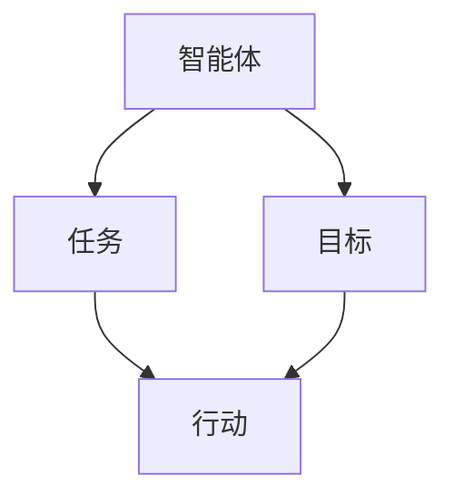
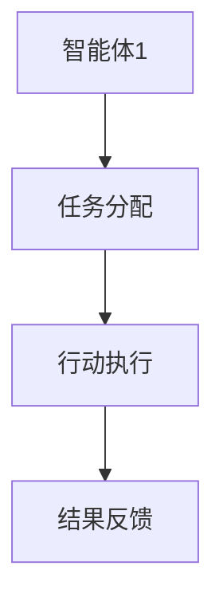

                 

# 利用多智能体系统评估公司的数字化转型进程

## 关键词：多智能体系统、数字化转型、评估方法、系统架构、协作机制、技术实现

## 摘要：  
数字化转型是现代企业实现业务创新和竞争力提升的关键路径，而多智能体系统（Multi-Agent System, MAS）作为一种分布式智能计算范式，为企业数字化转型的评估提供了新的技术手段。本文从多智能体系统的原理出发，结合实际应用场景，详细阐述了如何利用多智能体系统评估企业的数字化转型进程。文章首先介绍了数字化转型的背景与意义，然后深入探讨了多智能体系统的定义、特点及其在评估中的作用。接着，从算法原理、系统架构、功能设计等多个维度，详细分析了多智能体系统在数字化转型评估中的实现路径。最后，通过具体案例展示了系统的实际应用，并总结了相关经验与未来发展方向。

---

# 第一部分: 多智能体系统与数字化转型概述

## 第1章: 数字化转型与多智能体系统背景

### 1.1 数字化转型的背景与意义

#### 1.1.1 数字化转型的定义与内涵  
数字化转型（Digital Transformation）是指利用数字技术（如人工智能、大数据、云计算等）对业务模式、流程、文化、战略等进行全面改造和创新的过程。其核心目标是通过技术手段提升企业的运营效率、决策能力和市场竞争力。数字化转型不仅涉及技术的引入，还包括组织结构、文化变革等多个方面。

#### 1.1.2 数字化转型的核心目标  
1. 提升企业运营效率  
2. 优化业务流程，降低运营成本  
3. 增强数据驱动的决策能力  
4. 提供更好的客户体验  
5. 推动业务模式创新  

#### 1.1.3 多智能体系统在数字化转型中的作用  
多智能体系统通过分布式智能和协作机制，能够有效支持企业的数字化转型。具体表现在以下几个方面：  
1. **分布式计算能力**：多智能体系统能够将复杂的任务分解为多个子任务，通过协作完成整体目标，适用于分布式计算场景。  
2. **自主决策能力**：智能体能够自主感知环境并做出决策，适用于动态变化的业务场景。  
3. **协作与通信能力**：多智能体系统通过智能体之间的协作与通信，能够实现复杂业务流程的优化与管理。

---

### 1.2 多智能体系统的基本概念

#### 1.2.1 多智能体系统的定义  
多智能体系统（Multi-Agent System, MAS）是由多个智能体（Agent）组成的分布式计算系统，这些智能体能够通过协作完成特定任务。每个智能体都是一个独立的实体，具有自主性、反应性、目标导向性和协作性。

#### 1.2.2 多智能体系统的特点  
1. **自主性**：智能体能够自主决策，无需外部干预。  
2. **反应性**：智能体能够感知环境并实时调整行为。  
3. **协作性**：多个智能体通过协作完成共同目标。  
4. **分布式性**：系统由多个智能体组成，分布在不同的物理或逻辑位置。  

#### 1.2.3 多智能体系统与传统单智能体系统的对比  

| 特性               | 单智能体系统          | 多智能体系统          |
|--------------------|-----------------------|-----------------------|
| 系统结构           | 单点集中控制         | 分布式协作           |
| 可扩展性           | 有限                 | 较高                 |
| 复杂任务处理能力   | 有限                 | 强大                 |
| 应用场景           | 简单任务             | 复杂协作任务           |

#### 1.2.4 多智能体系统的ER实体关系图  

---

### 1.3 数字化转型评估的必要性

#### 1.3.1 企业数字化转型的挑战  
1. **技术复杂性**：数字化转型涉及多种技术的集成与应用，技术复杂性高。  
2. **组织变革难度**：数字化转型不仅需要技术变革，还需要组织结构和文化的调整，这对企业来说是巨大的挑战。  
3. **数据孤岛问题**：企业内部可能存在数据孤岛，导致信息无法有效共享和利用。  

#### 1.3.2 多智能体系统在评估中的优势  
1. **分布式协作能力**：多智能体系统能够通过协作完成复杂任务，适用于跨部门、跨系统的数字化转型评估。  
2. **实时感知与反馈**：智能体能够实时感知环境并提供反馈，有助于评估过程中的动态调整。  
3. **灵活扩展性**：多智能体系统可以根据评估需求灵活扩展，适用于不同规模和复杂度的企业。  

#### 1.3.3 数字化转型评估的核心要素  
1. **业务目标评估**：评估数字化转型是否实现了预期的业务目标。  
2. **技术实现评估**：评估技术实现是否符合设计要求，是否存在技术瓶颈。  
3. **组织变革评估**：评估组织结构和文化是否适应数字化转型的需求。  

---

## 第2章: 多智能体系统的核心概念与联系

### 2.1 多智能体系统的原理

#### 2.1.1 智能体的定义与分类  
**智能体**（Agent）是指具有自主性、反应性、目标导向性的实体，能够感知环境并采取行动以实现目标。智能体可以分为以下几类：  
1. **简单反射型智能体**：基于当前感知做出反应，没有内部状态。  
2. **基于模型的反射型智能体**：具有内部状态和目标，能够基于模型做出决策。  
3. **目标驱动型智能体**：以目标为导向，采取行动以实现目标。  
4. **效用驱动型智能体**：基于效用函数进行决策，以最大化效用为目标。  

#### 2.1.2 多智能体系统的协作机制  
多智能体系统的协作机制是实现复杂任务的关键。常见的协作机制包括：  
1. **分布式计算**：将任务分解为多个子任务，由多个智能体协作完成。  
2. **共识算法**：通过智能体之间的协商达成一致，例如一致性算法（Consensus）。  
3. **任务分配与调度**：智能体之间通过任务分配算法实现任务的高效分配与调度。  

#### 2.1.3 智能体之间的通信与协调  
智能体之间的通信与协调是多智能体系统的核心。通信可以通过以下方式实现：  
1. **直接通信**：智能体之间直接交换信息。  
2. **间接通信**：通过中间媒介（如消息队列）进行通信。  
3. **广播通信**：智能体将信息广播给所有相关智能体。  

---

#### 2.1.4 多智能体系统的协作流程  

---

### 2.2 多智能体系统的属性特征对比  

| 特性               | 单智能体系统          | 多智能体系统          |
|--------------------|-----------------------|-----------------------|
| 系统复杂性         | 低                   | 高                   |
| 资源利用率         | 低                   | 高                   |
| 可扩展性           | 有限                 | 较高                 |
| 处理效率           | 高                   | 中                   |

---

## 总结：  
通过以上分析，我们可以看到，多智能体系统在数字化转型评估中具有重要的作用。它不仅能够通过协作完成复杂任务，还能够实时感知环境并提供反馈，为企业数字化转型提供有力支持。接下来，我们将从算法原理、系统架构等角度，进一步探讨如何利用多智能体系统评估公司的数字化转型进程。

---

**作者：AI天才研究院/AI Genius Institute & 禅与计算机程序设计艺术 /Zen And The Art of Computer Programming**

