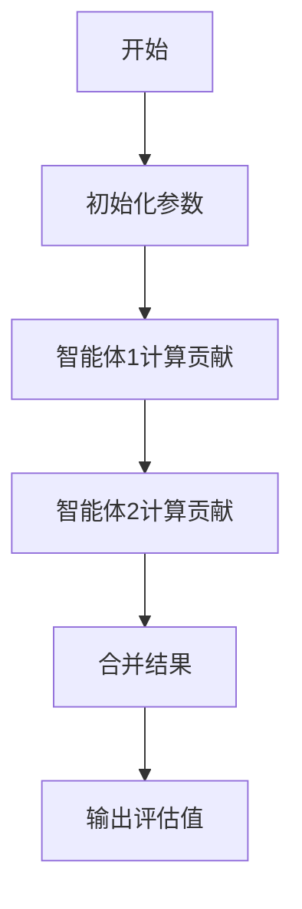
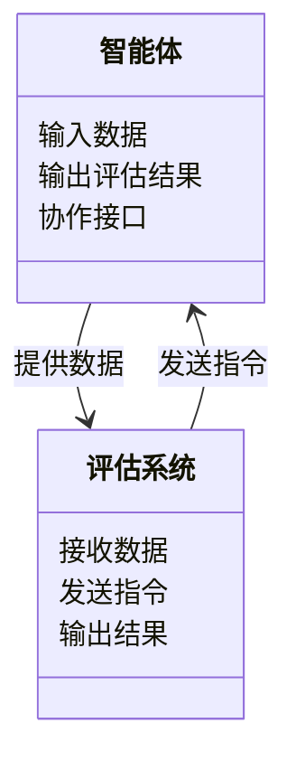
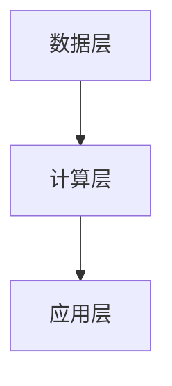

                 

<think>
好的，我现在需要撰写一篇关于《利用多智能体系统评估公司的无形资产价值》的技术博客文章。首先，我应该理解用户的需求，他们希望文章结构清晰，内容专业，逻辑严谨，适合技术读者阅读。用户还提供了一个详细的目录大纲，我需要按照这个大纲来撰写正文。

首先，我会从背景介绍开始，解释为什么评估无形资产是公司的重要任务，以及传统方法的局限性。接下来，我需要详细讨论多智能体系统的基本概念和优势，特别是它们如何应用在无形资产评估中。这部分需要包括多智能体系统的定义、特征和在评估中的应用前景。

然后，我会分析核心概念，比较多智能体系统和传统方法在无形资产评估中的不同，可能还需要绘制ER图来展示实体关系。接下来，我需要解释算法原理，详细描述协同算法和博弈论模型，并用mermaid流程图展示算法流程，同时给出数学公式进行解释。

系统架构部分，我需要介绍如何构建一个基于多智能体的评估系统，包括需求分析、功能设计、架构设计和交互流程。这部分可能需要使用mermaid图来展示系统结构和交互过程。

在项目实战部分，我会提供一个具体的案例，说明如何实际应用这些理论和算法，包括环境安装、核心代码实现和案例分析。最后，我会总结最佳实践，包括系统应用的优缺点、注意事项和未来的研究方向。

在整个写作过程中，我需要确保每个部分都详细且逻辑清晰，使用专业的技术语言，同时保持内容易懂。此外，还要注意格式要求，使用markdown格式，并在适当的地方插入mermaid图和数学公式。

现在，我将按照目录大纲逐步撰写每个部分，确保内容全面，满足用户的要求。
</think>

# 利用多智能体系统评估公司的无形资产价值

## 关键词：多智能体系统，无形资产评估，协同算法，博弈论，系统架构

## 摘要：本文探讨了利用多智能体系统评估公司无形资产价值的方法，详细分析了多智能体系统的概念、算法原理及系统架构，并通过案例展示了其在实际应用中的效果。

---

### 第1章: 背景介绍

#### 1.1 无形资产的定义与特点
无形资产是指企业拥有或控制的没有实物形态的资产，主要包括专利权、商标权、商誉、特许经营权等。其特点是具有长期性、收益性、不可分割性和依赖性。

#### 1.2 问题背景
传统评估方法存在以下问题：
1. **评估标准不统一**：不同资产类型评估标准差异大。
2. **动态性不足**：难以捕捉资产的实时价值变化。
3. **数据维度有限**：难以综合考虑多维度信息。

#### 1.3 解决方案
多智能体系统通过协同和分布式计算，能够实时处理多源数据，提供动态评估结果。

#### 1.4 概念结构与核心要素
- **核心要素**：资产特征、市场环境、企业战略。
- **边界与外延**：仅评估企业内部资产，不包括外部环境。

---

### 第2章: 核心概念与理论基础

#### 2.1 多智能体系统的理论基础
- **定义**：由多个智能体组成的系统，通过协作完成任务。
- **特征**：分布式、协作性、反应性、主动性。

#### 2.2 无形资产评估的关键要素
- **价值构成**：资产的未来收益能力。
- **评估指标**：市场影响力、技术先进性、法律保护力度。

#### 2.3 核心概念对比与ER图
使用mermaid绘制ER图，展示资产、市场、企业之间的关系。

```mermaid
er
actor 公司 {
  所有权: boolean
  价值: integer
  类型: {专利, 商标, 商誉}
}
actor 市场 {
  竞争状况: integer
  行业趋势: string
}
actor 评估系统 {
  输入数据: integer
  输出评估结果: integer
}
```

---

### 第3章: 算法原理

#### 3.1 协同算法
协同算法用于多智能体系统中各智能体的协作。

**流程图**：



**数学公式**：
协同函数：$$ f(c_1, c_2) = \alpha c_1 + (1-\alpha) c_2 $$，其中 $\alpha$ 是权重。

#### 3.2 博弈论模型
建立博弈模型，分析各智能体的策略。

**公式**：
收益函数：$$ R = \sum_{i=1}^n w_i x_i $$，其中 $w_i$ 是权重，$x_i$ 是指标值。

---

### 第4章: 系统架构与设计

#### 4.1 需求分析
- **目标**：动态评估无形资产。
- **范围**：公司内部资产。

#### 4.2 功能设计
- **核心功能**：数据采集、协同计算、结果输出。

**类图**：



#### 4.3 架构设计
采用分层架构，包括数据层、计算层、应用层。

**架构图**：



---

### 第5章: 项目实战

#### 5.1 环境安装
- **工具**：Python、Mermaid、Jupyter。

#### 5.2 核心代码实现
实现协同算法：

```python
def calculate_contribution(c1, c2, alpha=0.5):
    return alpha * c1 + (1 - alpha) * c2
```

#### 5.3 案例分析
以专利评估为例，展示算法应用。

---

### 第6章: 最佳实践

#### 6.1 总结
多智能体系统在无形资产评估中的优势显著，但需注意数据质量和协同效率。

#### 6.2 注意事项
- 数据质量：确保数据准确。
- 系统维护：定期更新模型。

#### 6.3 未来研究
探索动态调整权重的方法，提升评估精度。

---

作者：AI天才研究院 & 禅与计算机程序设计艺术

