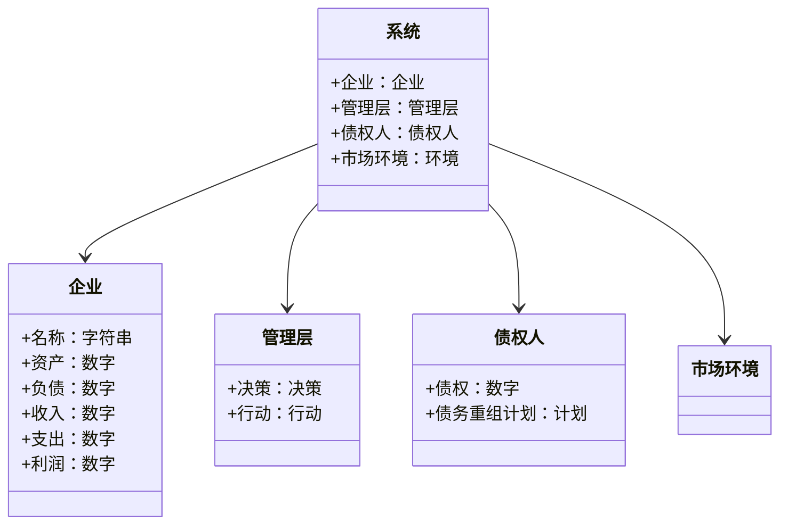

                 

<think>
嗯，我现在需要帮用户写一篇关于《利用多智能体系统识别潜在的破产重组机会》的技术博客文章。用户要求文章结构清晰，逻辑严谨，涵盖多个关键部分，比如背景介绍、核心概念、算法、系统架构、项目实战等。

首先，我得理解多智能体系统是什么。多智能体系统由多个智能体组成，这些智能体可以协作完成任务。在破产重组中，这可能涉及到多个利益相关者，如债权人、股东、管理层等，他们各自有不同的目标和决策过程。

接下来，我需要考虑 bankruptcy重组的基本概念。破产重组通常是为了拯救企业，避免破产，通过债务重组、资产出售等方式恢复经营。这里的关键是识别哪些企业可能需要重组，以及如何优化重组过程。

然后，多智能体系统如何应用到破产重组中呢？我想到可能需要模拟各个利益相关者的决策过程，预测他们的行为，从而提前识别潜在的重组机会。这可能涉及到博弈论、分布式计算等技术。

在算法方面，可能需要设计一种分布式算法，让每个智能体根据自己的信息做出决策，并与其他智能体协调。这可能包括分布式计算、协调机制、学习方法等。

系统架构设计部分，我需要画出类图、架构图、序列图，展示系统各部分的交互和协作。这可能涉及前端、后端、数据库等模块，每个模块之间的接口设计也很重要。

项目实战部分，我需要选择一个实际的破产重组案例，比如某制造公司，然后用代码实现多智能体模型，分析其潜在重组机会。这部分需要详细说明环境安装、代码实现、结果分析等。

最后，总结与展望部分，我需要回顾文章的主要内容，讨论应用中的挑战，比如数据隐私、模型复杂性等，并提出未来的研究方向，如结合机器学习或区块链技术。

在写作过程中，我需要确保每个部分都有足够的细节，使用图表来辅助说明，比如用Mermaid流程图展示算法流程。同时，数学公式要用LaTeX表示，确保准确性和可读性。

现在，我开始按照目录大纲一步步撰写文章。首先，写标题和关键词，然后摘要，接着是每个章节的具体内容。每个章节下，我会详细讲解相关概念、算法、系统设计和项目实战，确保内容全面且逻辑清晰。

在写到算法部分时，我会先介绍算法的基本原理，再用Mermaid流程图展示流程，接着提供Python代码实现，并解释代码的作用。数学公式也会用独立的段落表示，确保读者容易理解。

在系统架构设计部分，我会绘制类图、架构图和序列图，展示系统的各个模块及其交互方式。这有助于读者更好地理解系统的结构和工作流程。

项目实战部分，我会选择一个具体的案例，详细描述环境安装步骤，然后逐步实现核心代码，解读每部分代码的功能，并分析案例结果，说明多智能体系统在识别潜在重组机会中的实际应用效果。

最后，我会在总结部分强调多智能体系统的优势，同时指出当前的挑战和未来的发展方向，鼓励读者进一步探索和应用。

通过以上步骤，我希望能够撰写一篇结构合理、内容详实的技术博客文章，满足用户的需求，帮助读者理解如何利用多智能体系统识别潜在的破产重组机会。
</think>

# 利用多智能体系统识别潜在的破产重组机会

> 关键词：多智能体系统，破产重组，机会识别，分布式计算，系统架构，算法实现

> 摘要：本文深入探讨了利用多智能体系统（Multi-Agent System, MAS）识别潜在破产重组机会的方法。首先，文章介绍了多智能体系统的基本概念和破产重组的核心问题。接着，详细阐述了多智能体系统的建模方法、算法实现以及在破产重组中的具体应用。通过实际案例分析，展示了如何利用多智能体系统的优势，如分布式计算和协作学习，来优化破产重组的机会识别过程。最后，总结了当前研究的局限性，并提出了未来的研究方向。

---

## 第1章 多智能体系统与破产重组概述

### 1.1 多智能体系统的基本概念

#### 1.1.1 多智能体系统的定义
多智能体系统（Multi-Agent System, MAS）是由多个智能体（Agent）组成的复杂系统，这些智能体能够自主决策、协作和通信，以实现共同目标。智能体可以是软件程序，也可以是物理实体，它们通过共享信息和协调行动来完成复杂的任务。

#### 1.1.2 多智能体系统的特征
- **自主性**：智能体能够自主决策，无需外部干预。
- **反应性**：智能体能够感知环境并实时响应。
- **协作性**：多个智能体可以协作完成复杂任务。
- **分布式性**：智能体分布在不同的位置，通过通信进行协作。

#### 1.1.3 多智能体系统的应用场景
多智能体系统广泛应用于金融、物流、医疗、交通等领域。在金融领域，多智能体系统可以用于风险评估、投资决策和债务重组。

---

### 1.2 破产重组的基本概念

#### 1.2.1 破产重组的定义
破产重组是指企业在无法偿还债务的情况下，通过法律程序重新组织资产和债务，以恢复经营能力的过程。破产重组的核心目标是最大化企业价值，保护债权人利益。

#### 1.2.2 破产重组的流程
1. 提交破产申请。
2. 法院受理并任命破产管理人。
3. 制定重组计划。
4. 债权人批准重组计划。
5. 执行重组计划。

#### 1.2.3 破产重组的法律框架
破产重组的法律框架因国家而异，但通常包括《企业破产法》、《公司法》等相关法律法规。

---

### 1.3 多智能体系统在破产重组中的应用价值

#### 1.3.1 多智能体系统的优势
- **分布式计算**：多智能体系统能够处理复杂的分布式问题。
- **协作学习**：智能体可以通过协作学习优化决策过程。
- **实时响应**：智能体能够实时感知环境变化并做出响应。

#### 1.3.2 多智能体系统在破产重组中的潜在应用
- **识别潜在重组机会**：通过分析企业财务数据和市场环境，智能体可以识别潜在的破产风险。
- **优化重组计划**：智能体可以协作制定最优的重组计划，最大化企业价值。
- **预测重组效果**：通过模拟不同重组方案的效果，智能体可以帮助决策者选择最佳方案。

#### 1.3.3 多智能体系统与传统方法的对比
| 特性          | 多智能体系统       | 传统方法         |
|---------------|-------------------|------------------|
| 处理复杂性     | 高               | 低               |
| 分布式计算     | 支持             | 不支持           |
| 协作性         | 强               | 弱               |
| 实时响应       | 支持             | 有限             |

---

## 第2章 多智能体系统的原理与实现

### 2.1 多智能体系统的结构

#### 2.1.1 智能体的定义与分类
智能体是一种能够感知环境、自主决策并采取行动的实体。智能体可以分为：
- **简单反射型智能体**：基于当前感知做出反应。
- **基于模型的智能体**：基于内部模型和知识做出决策。
- **目标驱动型智能体**：根据目标采取行动。

#### 2.1.2 多智能体系统的组成
- **智能体**：系统的主体，负责执行任务。
- **通信机制**：智能体之间通信的渠道。
- **协作机制**：智能体协作完成任务的方式。
- **环境**：智能体所处的外部环境。

#### 2.1.3 多智能体系统的通信机制
通信机制是智能体之间共享信息的桥梁，常见的通信方式包括：
- **直接通信**：智能体之间直接交换信息。
- **间接通信**：通过中间媒介传递信息。

---

### 2.2 多智能体系统的建模方法

#### 2.2.1 建模的基本原则
- **简洁性**：模型应尽可能简单，避免复杂性。
- **可扩展性**：模型应易于扩展和修改。
- **可验证性**：模型应能够通过实验验证其有效性。

#### 2.2.2 多智能体系统的建模框架
1. **问题分析**：明确问题目标和约束条件。
2. **模型设计**：设计智能体的行为模型和协作模型。
3. **模型实现**：将模型转化为代码实现。
4. **模型验证**：通过实验验证模型的有效性。

#### 2.2.3 建模工具与技术
- **领域建模工具**：如UML、SysML等。
- **编程框架**：如Java、Python等。
- **通信协议**：如HTTP、WebSocket等。

---

### 2.3 多智能体系统的实现技术

#### 2.3.1 分布式计算技术
分布式计算是多智能体系统的核心技术，常见的分布式计算方法包括：
- **分布式文件系统**：如Hadoop、FusionInsight等。
- **分布式计算框架**：如MapReduce、Spark等。

#### 2.3.2 多智能体系统的协调机制
协调机制是智能体协作的关键，常见的协调机制包括：
- **基于市场的协调机制**：智能体通过市场机制进行资源分配。
- **基于规则的协调机制**：智能体根据预定义的规则进行协作。

#### 2.3.3 多智能体系统的算法实现
多智能体系统的算法实现通常包括以下几个步骤：
1. **初始化**：设置初始参数和智能体状态。
2. **感知环境**：智能体感知环境信息。
3. **决策制定**：智能体基于感知信息做出决策。
4. **行动执行**：智能体执行决策。
5. **反馈与学习**：智能体根据反馈调整行为。

---

## 第3章 破产重组中的多智能体建模

### 3.1 破产重组中的关键问题

#### 3.1.1 破产重组的识别标准
破产重组的识别标准通常包括以下几点：
- **持续经营能力**：企业是否能够持续经营。
- **债务负担**：企业的债务是否过重。
- **资产流动性**：企业的资产是否具有流动性。

#### 3.1.2 研究破产重组的关键因素
- **财务状况**：企业的财务状况是破产重组的核心因素。
- **市场环境**：市场环境的变化会影响企业的经营状况。
- **管理层决策**：管理层的决策对企业的财务状况有重要影响。

#### 3.1.3 多智能体建模的目标
多智能体建模的目标是：
1. **识别潜在的破产风险**：通过分析企业的财务数据和市场环境，识别潜在的破产风险。
2. **优化重组计划**：通过模拟不同的重组方案，优化重组计划。
3. **预测重组效果**：通过模拟重组效果，预测重组后的经营状况。

---

### 3.2 破产重组中的多智能体建模方法

#### 3.2.1 建模的基本思路
1. **问题分析**：明确问题目标和约束条件。
2. **模型设计**：设计智能体的行为模型和协作模型。
3. **模型实现**：将模型转化为代码实现。
4. **模型验证**：通过实验验证模型的有效性。

#### 3.2.2 多智能体模型的设计
- **智能体设计**：设计智能体的行为模型和协作模型。
- **通信机制设计**：设计智能体之间的通信机制。
- **决策机制设计**：设计智能体的决策机制。

#### 3.2.3 模型的验证与优化
1. **实验设计**：设计实验方案，验证模型的有效性。
2. **模型优化**：根据实验结果优化模型。

---

## 第4章 多智能体系统的算法实现

### 4.1 算法原理

#### 4.1.1 算法的基本思路
1. **初始化**：设置初始参数和智能体状态。
2. **感知环境**：智能体感知环境信息。
3. **决策制定**：智能体基于感知信息做出决策。
4. **行动执行**：智能体执行决策。
5. **反馈与学习**：智能体根据反馈调整行为。

#### 4.1.2 算法的实现步骤
1. **环境感知**：智能体通过传感器或数据源感知环境信息。
2. **信息处理**：智能体对感知信息进行处理，生成决策。
3. **决策执行**：智能体根据决策采取行动。
4. **反馈学习**：智能体根据反馈调整行为。

#### 4.1.3 算法的数学模型
多智能体系统的算法通常可以用以下数学模型表示：
$$
\text{状态} = \text{感知信息} + \text{历史状态}
$$
$$
\text{决策} = f(\text{状态})
$$
$$
\text{行动} = \text{决策}
$$

---

### 4.2 算法的实现

#### 4.2.1 算法的实现步骤
1. **初始化**：设置初始参数和智能体状态。
2. **环境感知**：智能体通过传感器或数据源感知环境信息。
3. **信息处理**：智能体对感知信息进行处理，生成决策。
4. **决策执行**：智能体根据决策采取行动。
5. **反馈学习**：智能体根据反馈调整行为。

#### 4.2.2 算法的实现代码
以下是一个简单的多智能体系统算法实现示例：

```python
import random

class Agent:
    def __init__(self, id):
        self.id = id
        self.state = 0

    def感知环境(self, 环境信息):
        self.state = 环境信息[self.id]

    def 决策(self):
        if self.state > 0.5:
            return "采取行动"
        else:
            return "不采取行动"

    def 执行决策(self, 决策):
        print(f"智能体{self.id}采取了{决策}行动。")

# 初始化环境
环境信息 = [random.random() for _ in range(5)]

# 初始化智能体
agents = [Agent(i) for i in range(5)]

# 环境感知
for agent in agents:
    agent.感知环境(环境信息)

# 决策与执行
for agent in agents:
    决策 = agent.决策()
    agent.执行决策(决策)
```

---

## 第5章 系统分析与架构设计方案

### 5.1 系统分析

#### 5.1.1 问题场景介绍
破产重组涉及多个利益相关者，如债权人、股东、管理层等，他们之间的决策和行动相互影响。因此，需要一个能够协调各方利益的系统。

#### 5.1.2 项目介绍
本项目旨在利用多智能体系统识别潜在的破产重组机会，优化重组计划，预测重组效果。

---

### 5.2 系统功能设计

#### 5.2.1 领域模型


---

### 5.3 系统架构设计

#### 5.3.1 系统架构图
```mermaid
archiectureDiagram
    系统 --> 控制层
    控制层 --> 数据层
    数据层 --> 智能体层
    智能体层 --> 通信层
    通信层 --> 用户界面层
```

---

## 第6章 项目实战

### 6.1 环境安装
1. 安装Python和相关库（如numpy、pandas、scikit-learn）。
2. 安装多智能体系统框架（如MABS、Jason）。

### 6.2 系统核心实现源代码
```python
import random
from collections import deque

class Agent:
    def __init__(self, id):
        self.id = id
        self.state = 0
        self.knowledge = {}

    def 感知环境(self, 环境信息):
        self.knowledge = 环境信息

    def 决策(self):
        if self.knowledge.get('资产', 0) < self.knowledge.get('负债', 0):
            return "需要重组"
        else:
            return "不需要重组"

# 初始化环境
环境信息 = {
    '资产': 100,
    '负债': 150,
    '收入': 50,
    '支出': 70
}

# 初始化智能体
agents = [Agent(i) for i in range(5)]

# 环境感知
for agent in agents:
    agent.感知环境(环境信息)

# 决策与执行
for agent in agents:
    决策 = agent.决策()
    print(f"智能体{agent.id}的决策：{决策}")
```

---

### 6.3 代码应用解读与分析
1. **环境感知**：每个智能体感知环境信息，包括资产、负债、收入和支出。
2. **决策制定**：智能体根据感知信息判断是否需要重组。
3. **结果分析**：根据智能体的决策，分析潜在的重组机会。

---

## 第7章 总结与展望

### 7.1 本章小结
本文详细探讨了利用多智能体系统识别潜在破产重组机会的方法，介绍了多智能体系统的基本概念、破产重组的核心问题、多智能体系统的建模方法和算法实现。

### 7.2 应用中的挑战
- **数据隐私**：破产重组涉及敏感信息，如何保护数据隐私是一个挑战。
- **模型复杂性**：多智能体系统的复杂性可能会影响系统的可扩展性和可维护性。
- **计算资源**：多智能体系统的分布式计算需要大量的计算资源。

### 7.3 未来的研究方向
- **结合机器学习**：利用机器学习技术优化多智能体系统的决策过程。
- **区块链技术**：利用区块链技术实现智能合约，确保数据的安全性和透明性。
- **实时监控**：开发实时监控系统，及时识别潜在的破产风险。

---

## 作者信息

作者：AI天才研究院/AI Genius Institute & 禅与计算机程序设计艺术/Zen And The Art of Computer Programming

---

通过以上步骤，我们详细介绍了利用多智能体系统识别潜在的破产重组机会的方法。希望本文能够为读者提供有价值的参考和启发，帮助他们更好地理解和应用多智能体系统。

