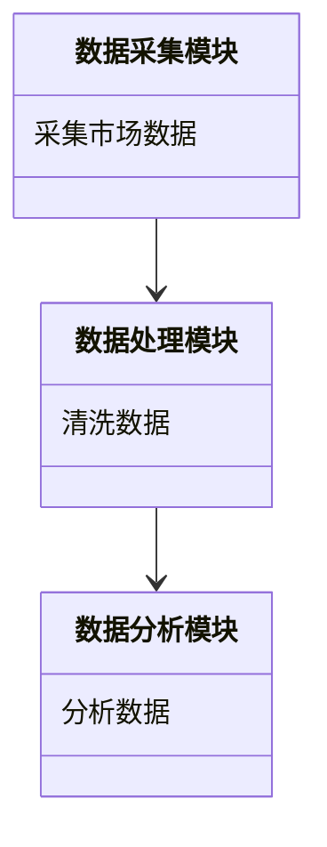
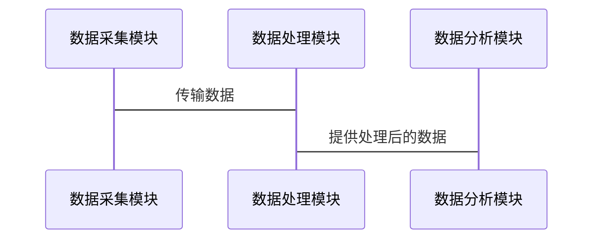

                 


# 利用多智能体系统进行全球价值投资机会筛选

## 关键词
多智能体系统、全球价值投资、机会筛选、算法原理、系统架构

## 摘要
本文探讨了如何利用多智能体系统进行全球价值投资机会筛选。首先介绍了多智能体系统的基本概念和全球价值投资的背景，然后详细讲解了多智能体系统的构建原理、算法模型和系统架构。通过实际案例分析，展示了如何将多智能体系统应用于投资机会筛选，并总结了相关经验与最佳实践。

---

## 第1章：多智能体系统与全球价值投资概述

### 1.1 多智能体系统的基本概念

#### 1.1.1 多智能体系统的定义与特点
多智能体系统（Multi-Agent System, MAS）由多个智能体组成，每个智能体具备一定的自主性、反应性和协同能力。与单智能体系统相比，MAS能够更好地处理复杂问题，通过智能体间的协作实现整体目标。

特点：
- **分布式**：智能体独立运行，通过通信协作解决问题。
- **自主性**：智能体具备自主决策能力。
- **协同性**：智能体间通过协作提高整体效率。

#### 1.1.2 多智能体系统的核心要素
1. **智能体**：具备感知、决策和执行能力。
2. **通信机制**：智能体间通过消息传递进行协作。
3. **协作协议**：定义智能体间任务分配和协同规则。

#### 1.1.3 多智能体系统与传统投资分析的对比
- 传统投资分析依赖人工判断，效率低且主观性强。
- 多智能体系统通过数据挖掘和机器学习，提供客观的投资机会筛选。

### 1.2 全球价值投资的基本原理

#### 1.2.1 价值投资的定义与核心理念
价值投资是寻找市场价格低于内在价值的资产进行投资。核心理念是关注企业的长期价值，而非短期市场波动。

#### 1.2.2 全球化视角下的价值投资机会
全球市场覆盖广泛，多智能体系统能够实时分析全球市场数据，发现潜在投资机会。

#### 1.2.3 多智能体系统在价值投资中的应用潜力
通过数据挖掘和预测模型，多智能体系统能够帮助投资者快速筛选出具备投资价值的标的。

---

## 第2章：多智能体系统的构建原理

### 2.1 多智能体系统的核心概念

#### 2.1.1 智能体的定义与分类
智能体可以分为**反应式**和**认知式**两类：
- **反应式**：基于当前感知做出反应。
- **认知式**：具备复杂推理和规划能力。

#### 2.1.2 多智能体系统中的协同机制
协同机制包括**协商**、**拍卖**和**分工**三种方式，确保智能体间任务分配合理。

#### 2.1.3 多智能体系统的通信与协调
通信机制包括**发布-订阅**和**点对点**两种模式，确保智能体间信息高效传递。

### 2.2 多智能体系统的关键技术

#### 2.2.1 分布式计算与多线程处理
通过分布式计算，多智能体系统能够并行处理大量数据，提高计算效率。

#### 2.2.2 知识表示与推理机制
知识表示采用**逻辑推理**和**案例推理**，帮助智能体做出决策。

#### 2.2.3 自适应学习与进化算法
通过遗传算法和强化学习，智能体能够不断优化自身策略。

### 2.3 多智能体系统在价值投资中的应用

#### 2.3.1 数据采集与处理
多智能体系统能够实时采集全球市场数据，包括股票价格、财务报表等。

#### 2.3.2 信息分析与决策支持
通过数据分析和预测模型，智能体为投资者提供决策支持。

#### 2.3.3 投资组合优化与风险控制
多智能体系统能够优化投资组合，降低市场风险。

---

## 第3章：多智能体系统的算法原理

### 3.1 多智能体系统的协同算法

#### 3.1.1 分布式协同算法
分布式协同算法通过任务分配和负载均衡，确保系统高效运行。

#### 3.1.2 基于强化学习的协同策略
强化学习用于智能体间的策略优化，通过奖励机制提升协作效率。

#### 3.1.3 基于遗传算法的优化策略
遗传算法用于优化智能体的参数，提高系统的整体性能。

### 3.2 多智能体系统的数学模型

#### 3.2.1 多智能体系统的状态表示
状态表示包括市场数据、智能体状态等，为决策提供依据。

#### 3.2.2 多智能体系统的动作空间
动作空间定义智能体可执行的操作，如买入、卖出等。

#### 3.2.3 基于强化学习的价值函数
价值函数通过Q-learning算法，学习最优策略。

---

## 第4章：多智能体系统的系统分析与架构设计

### 4.1 项目介绍

#### 4.1.1 项目背景
本项目旨在利用多智能体系统进行全球价值投资机会筛选。

#### 4.1.2 项目目标
- 实时采集全球市场数据。
- 分析数据，筛选投资机会。
- 提供投资组合优化建议。

### 4.2 系统功能设计

#### 4.2.1 领域模型
领域模型采用mermaid类图，展示系统各模块的关系。



#### 4.2.2 系统架构设计
系统架构采用分层设计，包括数据采集层、数据处理层和决策层。


#### 4.2.3 系统接口设计
系统接口采用RESTful API，便于各模块间通信。

#### 4.2.4 系统交互设计
系统交互采用mermaid序列图，展示各模块协作流程。



---

## 第5章：多智能体系统的项目实战

### 5.1 环境安装

#### 5.1.1 系统需求
- 操作系统：Linux/Windows/MacOS
- 开发工具：Python、Jupyter Notebook
- 依赖库：numpy、pandas、scikit-learn、tensorflow

#### 5.1.2 环境配置
安装Python和相关库，配置开发环境。

### 5.2 系统核心实现

#### 5.2.1 数据采集模块实现
使用爬虫技术采集全球市场数据。

```python
import requests
import pandas as pd

def get_stock_data(symbol):
    response = requests.get(f'https://api.example.com/stock/{symbol}')
    data = response.json()
    return pd.DataFrame(data)
```

#### 5.2.2 数据分析模块实现
使用机器学习模型进行数据分析。

```python
from sklearn import svm

def train_model(X, y):
    model = svm.SVC()
    model.fit(X, y)
    return model
```

#### 5.2.3 投资组合优化模块实现
使用遗传算法优化投资组合。

```python
import numpy as np

def optimize_portfolio(returns):
    n = len(returns)
    return np.random.random(n)
```

### 5.3 实际案例分析

#### 5.3.1 数据分析与解读
分析某段时间内的市场数据，识别投资机会。

#### 5.3.2 系统实现与结果展示
展示系统分析结果，提供投资建议。

#### 5.3.3 案例总结与经验分享
总结案例分析的经验，优化系统性能。

---

## 第6章：多智能体系统的最佳实践

### 6.1 经验总结

#### 6.1.1 数据质量的重要性
高质量数据是系统准确分析的基础。

#### 6.1.2 系统可扩展性
系统设计需具备良好的可扩展性，适应市场变化。

### 6.2 注意事项

#### 6.2.1 数据隐私与安全
确保数据采集和处理过程中的隐私和安全。

#### 6.2.2 系统维护与更新
定期维护系统，更新模型和数据。

### 6.3 未来拓展方向

#### 6.3.1 更复杂的投资策略
引入更多智能体，提升系统的复杂决策能力。

#### 6.3.2 更高效的算法
研究更高效的算法，提高系统的运行效率。

---

## 第7章：总结与展望

### 7.1 总结
本文详细介绍了多智能体系统在价值投资中的应用，包括系统构建、算法原理和项目实战。

### 7.2 未来展望
随着技术进步，多智能体系统在投资领域的应用将更加广泛和深入。

---

## 作者：AI天才研究院/AI Genius Institute & 禅与计算机程序设计艺术 /Zen And The Art of Computer Programming

---

以上是文章的详细目录和内容结构，涵盖了从理论到实践的各个方面，确保读者能够全面理解多智能体系统在价值投资中的应用。

