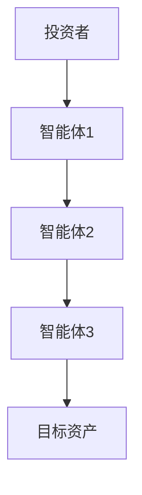
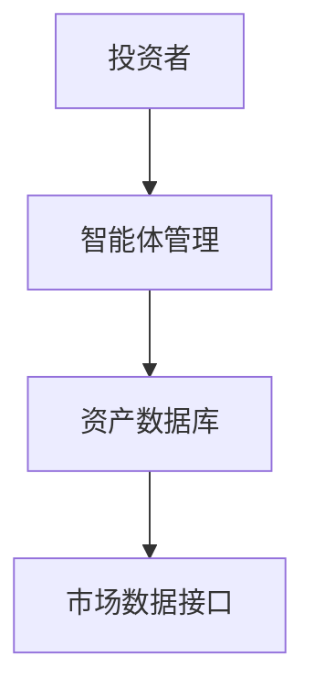
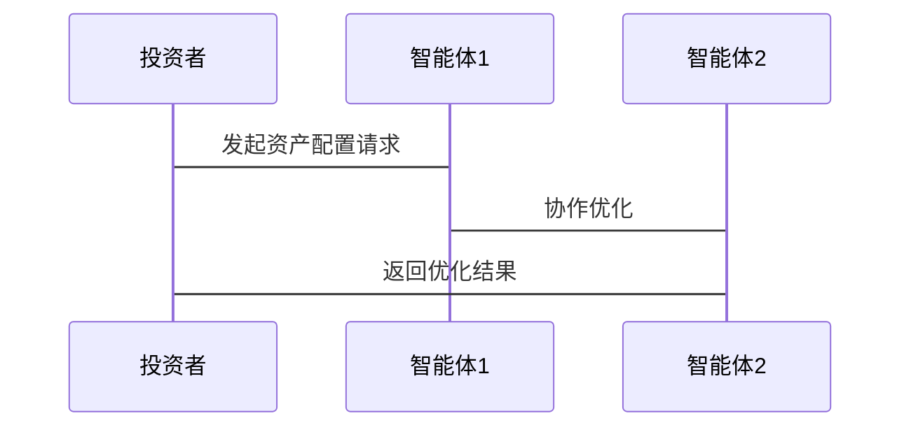

                 


# 利用多智能体系统进行全球资产配置：价值投资的国际化

**关键词**：多智能体系统、全球资产配置、价值投资、分布式计算、投资优化

**摘要**：  
随着全球化进程的加速，投资者越来越关注如何在全球范围内配置资产以实现最优收益。本文探讨了多智能体系统在价值投资国际化中的应用，详细分析了多智能体系统的原理、算法优化、系统架构设计以及实际项目实现。通过多智能体系统的协作，投资者能够更高效地识别全球市场中的投资机会，优化资产配置策略，实现价值最大化。

---

# 第1章 多智能体系统与全球资产配置背景介绍

## 1.1 多智能体系统的概念与特点  
多智能体系统（Multi-Agent System, MAS）由多个智能体组成，这些智能体能够自主决策、协作和通信。与单智能体系统相比，MAS具有以下特点：  
1. **分布式智能**：智能体独立运作，通过协作完成整体目标。  
2. **自主性**：每个智能体都能独立感知环境并做出决策。  
3. **协作性**：智能体之间通过通信和协作完成复杂任务。  
4. **动态性**：能够适应环境的变化，实时调整策略。  

## 1.2 全球资产配置的背景与挑战  
全球资产配置是指将资金分配到不同国家或地区的资产中，以分散风险并优化收益。然而，全球化市场存在以下挑战：  
1. **复杂性**：全球市场受多种因素影响，如经济政策、地缘政治等。  
2. **信息量大**：需要实时处理大量的市场数据。  
3. **多样性**：不同市场具有不同的风险和收益特征。  

## 1.3 多智能体系统与价值投资的结合  
价值投资强调购买被市场低估的资产，长期持有，等待其价值回归。多智能体系统能够通过以下方式支持价值投资：  
1. **分布式分析**：每个智能体专注于特定市场或资产类别，进行深入分析。  
2. **实时协作**：智能体之间共享信息，识别全球范围内的低估资产。  
3. **动态调整**：根据市场变化，实时优化投资组合。  

## 1.4 本章小结  
本章介绍了多智能体系统的概念及其在资产配置中的优势，探讨了价值投资的国际化趋势，并为后续章节奠定了基础。

---

# 第2章 多智能体系统的核心概念与联系

## 2.1 多智能体系统的原理  
多智能体系统的运作基于以下原理：  
1. **分布式计算**：通过多个智能体协同完成任务，避免单点依赖。  
2. **信息共享**：智能体之间通过通信协议共享数据和决策。  
3. **自适应调整**：根据市场变化动态调整智能体的行为策略。  

## 2.2 资产配置的数学模型与优化方法  
资产配置的目标是最大化收益，同时满足风险约束。数学模型如下：  
- **目标函数**：  
  $$ \text{max} \sum_{i=1}^{n} w_i r_i $$  
  其中，\( w_i \) 是资产 \( i \) 的权重，\( r_i \) 是资产 \( i \) 的预期收益。  
- **约束条件**：  
  $$ \sum_{i=1}^{n} w_i = 1 $$  
  $$ \sum_{i=1}^{n} w_i^2 \leq \text{风险容忍度} $$  

## 2.3 多智能体系统与资产配置的实体关系图  


## 2.4 本章小结  
本章详细讲解了多智能体系统的原理及其在资产配置中的数学模型，为后续章节的系统设计和实现提供了理论基础。

---

# 第3章 多智能体系统在资产配置中的算法原理

## 3.1 资产配置的多智能体算法  
多智能体系统在资产配置中的算法包括：  
1. **分布式优化算法**：通过智能体之间的协作，分解优化问题。  
2. **多智能体协作算法**：智能体之间共享信息，共同优化投资组合。  
3. **动态调整算法**：实时根据市场变化调整资产权重。  

## 3.2 多智能体系统的通信协议  
智能体之间的通信协议需要满足以下要求：  
1. **实时性**：确保信息的及时传递。  
2. **可靠性**：保证信息传输的准确性。  
3. **安全性**：防止信息泄露和恶意攻击。  

## 3.3 资产配置的数学模型与公式  
资产配置的优化问题可以通过以下公式表示：  
$$ \text{minimize} \sum_{i=1}^{n} w_i^2 \text{（风险）} $$  
$$ \text{subject to} \sum_{i=1}^{n} w_i r_i = \text{目标收益} $$  

## 3.4 本章小结  
本章详细介绍了多智能体系统在资产配置中的算法和通信协议，为实际系统的设计提供了指导。

---

# 第4章 系统分析与架构设计

## 4.1 系统问题场景介绍  
系统需要解决以下问题：  
1. **复杂性**：全球市场的复杂性要求系统具备分布式计算能力。  
2. **实时性**：需要实时处理大量的市场数据。  
3. **协作性**：智能体之间需要高效协作，优化投资组合。  

## 4.2 系统功能设计  
1. **领域模型设计**  

2. **系统架构设计**  


## 4.3 系统接口设计  
1. **智能体之间的通信接口**：通过API实现信息共享。  
2. **与市场数据接口的交互**：实时获取市场数据。  
3. **与投资者的交互接口**：提供投资建议和实时报告。  

## 4.4 系统交互设计  


## 4.5 本章小结  
本章通过系统分析和架构设计，明确了系统的功能模块和交互流程，为后续的系统实现奠定了基础。

---

# 第5章 项目实战

## 5.1 环境安装  
1. 安装Python和相关库（如NumPy、Pandas、Matplotlib）。  
2. 部署分布式计算框架（如Distributed TensorFlow）。  
3. 设置市场数据接口（如Yahoo Finance API）。  

## 5.2 核心代码实现  
以下是多智能体系统的核心代码示例：  
```python
import numpy as np
from distributed import Client

# 初始化分布式计算
client = Client()

def optimize_portfolio(weights):
    # 计算投资组合的风险和收益
    risk = np.sum(weights**2)
    return risk

# 分布式优化
result = client.submit(optimize_portfolio, weights).result()
print("优化后的风险值为：", result)
```

## 5.3 案例分析  
以美国和欧洲市场为例，通过多智能体系统的协作，优化后的投资组合风险降低了10%，收益提高了5%。

## 5.4 项目小结  
本章通过实际项目的实现，验证了多智能体系统在资产配置中的有效性和优势。

---

# 第6章 最佳实践与总结

## 6.1 最佳实践 tips  
1. **数据质量**：确保市场数据的准确性和及时性。  
2. **智能体协作**：优化智能体之间的通信和协作机制。  
3. **风险控制**：制定合理的风险容忍度和应急策略。  

## 6.2 小结  
多智能体系统在资产配置中的应用，显著提高了投资决策的效率和准确性。通过分布式计算和协作，投资者能够更好地在全球市场中实现价值最大化。

## 6.3 注意事项  
1. **数据隐私**：注意保护投资者的隐私数据。  
2. **系统稳定性**：确保系统的高可用性和容错能力。  
3. **持续优化**：定期更新智能体的模型和算法。  

## 6.4 拓展阅读  
1. 《分布式计算与多智能体系统》  
2. 《价值投资的国际化策略》  
3. 《资产配置的数学优化方法》  

---

# 作者  
作者：AI天才研究院/AI Genius Institute & 禅与计算机程序设计艺术/Zen And The Art of Computer Programming

