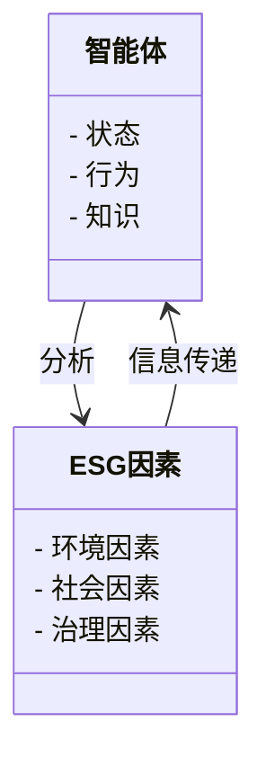
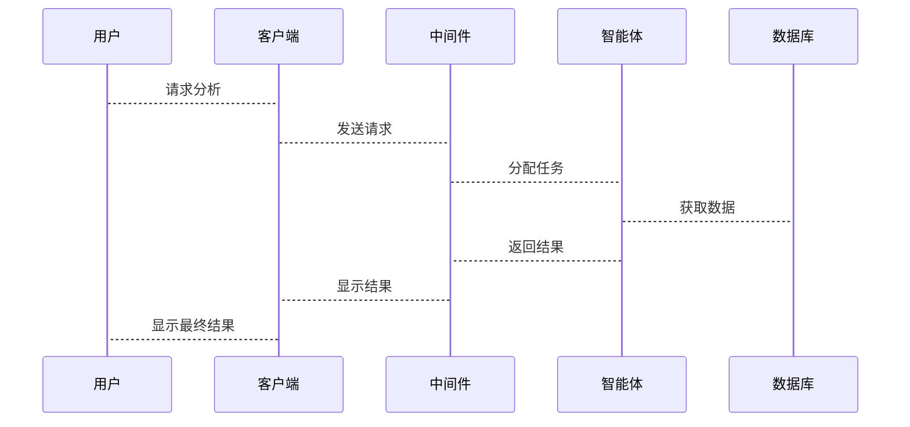

                 


# 利用多智能体系统进行全面的ESG因素分析

> 关键词：多智能体系统，ESG分析，环境、社会、治理，分布式计算，协作机制

> 摘要：本文探讨了利用多智能体系统进行ESG因素分析的方法，分析了多智能体系统的特性与ESG分析的需求之间的联系，并详细阐述了多智能体系统在ESG分析中的应用场景、算法原理和系统架构设计。通过实际案例分析和项目实战，展示了多智能体系统如何提升ESG分析的效率和准确性。

---

## 第一部分: 多智能体系统与ESG分析的背景介绍

### 第1章: 多智能体系统与ESG分析的背景介绍

#### 1.1 多智能体系统的基本概念
##### 1.1.1 多智能体系统的定义
多智能体系统（Multi-Agent System, MAS）是由多个智能体（Agent）组成的分布式系统，这些智能体能够通过自主决策、协作和通信完成特定任务。每个智能体都有自己的目标、知识和行为规则，能够在动态环境中感知环境并做出反应。

##### 1.1.2 多智能体系统的特性
- **自主性**：智能体能够自主决策，无需外部干预。
- **反应性**：智能体能够感知环境并实时调整行为。
- **协作性**：多个智能体能够通过协作完成复杂任务。
- **分布式性**：智能体分布在不同的位置，通过通信和协调完成任务。
- **学习能力**：智能体能够通过经验优化行为。

##### 1.1.3 多智能体系统的应用场景
- 智能交通管理
- 分布式计算
- 智能供应链管理
- 社交网络分析

#### 1.2 ESG分析的核心概念
##### 1.2.1 ESG的定义与内涵
ESG（Environmental, Social, Governance）分析是一种评估企业环境、社会和治理表现的方法，旨在衡量企业在可持续发展方面的表现。环境因素关注企业的碳排放、资源利用等；社会因素关注企业对员工、社区和社会的影响；治理因素关注企业的管理和透明度。

##### 1.2.2 ESG分析的重要性
ESG分析不仅帮助企业实现可持续发展目标，还能为投资者提供重要的决策依据，帮助他们评估企业的长期风险和价值。

##### 1.2.3 ESG分析的挑战与机遇
- 挑战：数据来源多样、复杂，难以整合；企业行为的动态性；数据的实时性和准确性。
- 机遇：多智能体系统能够通过分布式计算和协作机制，高效处理复杂问题。

#### 1.3 多智能体系统与ESG分析的结合
##### 1.3.1 多智能体系统在ESG分析中的优势
多智能体系统能够通过分布式计算和协作机制，高效处理大规模数据，并实时调整分析策略。

##### 1.3.2 ESG分析对多智能体系统的应用需求
ESG分析需要处理复杂、动态的数据，多智能体系统能够通过自主决策和协作，满足这一需求。

##### 1.3.3 多智能体系统与ESG分析的结合目标
通过多智能体系统的分布式计算和协作机制，提升ESG分析的效率和准确性。

#### 1.4 本章小结
多智能体系统是一种由多个智能体组成的分布式系统，具有自主性、反应性、协作性和分布式性等特点。ESG分析是一种评估企业环境、社会和治理表现的方法，具有数据复杂、动态性强的特点。多智能体系统与ESG分析的结合，能够提升ESG分析的效率和准确性，为企业和投资者提供更好的决策支持。

---

## 第二部分: 多智能体系统与ESG分析的核心概念与联系

### 第2章: 多智能体系统与ESG分析的核心概念与联系

#### 2.1 多智能体系统的原理
##### 2.1.1 多智能体系统的组成
多智能体系统由多个智能体、通信机制、协作机制和环境组成。

##### 2.1.2 多智能体系统的通信机制
智能体之间通过消息传递进行通信，消息内容包括数据、请求和响应。

##### 2.1.3 多智能体系统的协作机制
协作机制包括任务分配、协商和协调，确保智能体能够协同完成任务。

#### 2.2 ESG分析的原理
##### 2.2.1 环境因素的分析方法
环境因素包括碳排放、资源利用等，分析方法包括数据采集、指标计算和评估。

##### 2.2.2 社会因素的分析方法
社会因素包括员工福利、社区影响等，分析方法包括数据采集、指标计算和评估。

##### 2.2.3 治理因素的分析方法
治理因素包括企业管理和透明度，分析方法包括数据采集、指标计算和评估。

#### 2.3 多智能体系统与ESG分析的联系
##### 2.3.1 多智能体系统在ESG分析中的角色
多智能体系统可以作为数据采集、分析和决策支持的工具。

##### 2.3.2 多智能体系统如何提升ESG分析的效率
通过分布式计算和协作机制，多智能体系统能够高效处理大规模数据。

##### 2.3.3 多智能体系统与ESG分析的协同效应
多智能体系统的分布式计算和协作机制，能够提升ESG分析的效率和准确性。

#### 2.4 核心概念对比与ER实体关系图
##### 2.4.1 多智能体系统与ESG分析的核心概念对比
| 概念 | 多智能体系统 | ESG分析 |
|------|--------------|----------|
| 组成 | 智能体、通信机制、协作机制、环境 | 环境、社会、治理因素 |
| 目标 | 协作完成任务 | 评估企业可持续性表现 |

##### 2.4.2 多智能体系统与ESG分析的ER实体关系图
```mermaid
er
actor(多智能体系统) --> ESG因素: 分析
actor(ESG因素) --> 智能体: 信息传递
```

---

## 第三部分: 多智能体系统的算法原理

### 第3章: 多智能体系统的算法原理

#### 3.1 多智能体系统的算法
##### 3.1.1 分布式计算算法
多智能体系统通过分布式计算算法实现任务分配和协作。

##### 3.1.2 协商与协作机制
智能体之间通过协商和协作机制，确保任务的高效完成。

#### 3.2 多智能体系统的通信与协调
##### 3.2.1 通信协议
智能体之间的通信协议，包括数据格式和消息传递规则。

##### 3.2.2 协调算法
通过协调算法，确保智能体之间的协作和一致性。

#### 3.3 多智能体系统的实现
##### 3.3.1 分布式计算的实现
通过分布式计算，智能体能够高效处理大规模数据。

##### 3.3.2 协作机制的实现
通过协作机制，智能体能够协同完成任务。

---

## 第四部分: 系统分析与架构设计方案

### 第4章: 系统分析与架构设计方案

#### 4.1 问题场景介绍
##### 4.1.1 企业ESG评估的场景
企业需要对环境、社会和治理因素进行全面分析。

##### 4.1.2 分析目标与范围
分析目标是提升企业ESG表现，分析范围包括环境、社会和治理三个维度。

#### 4.2 系统功能设计
##### 4.2.1 领域模型设计
通过领域模型，明确系统的功能模块和数据流。

##### 4.2.2 领域模型的Mermaid类图


#### 4.3 系统架构设计
##### 4.3.1 系统架构的Mermaid架构图


#### 4.4 系统接口设计
##### 4.4.1 接口设计
系统接口包括数据接口、智能体接口和用户接口。

##### 4.4.2 接口交互流程
数据接口接收数据，智能体接口处理数据，用户接口显示结果。

#### 4.5 系统交互的Mermaid序列图


---

## 第五部分: 项目实战

### 第5章: 项目实战

#### 5.1 环境安装
##### 5.1.1 系统依赖
安装Python、Mermaid和相关库。

##### 5.1.2 安装命令
```bash
pip install python-mermaid
```

#### 5.2 系统核心实现
##### 5.2.1 智能体代码实现
```python
class Agent:
    def __init__(self, id):
        self.id = id
        self.knowledge = {}
    
    def perceive(self, environment):
        # 获取环境数据
        self.knowledge = environment
    
    def act(self):
        # 根据知识采取行动
        pass
```

##### 5.2.2 ESG分析代码实现
```python
class ESGAnalyzer:
    def __init__(self, agents):
        self.agents = agents
    
    def analyze(self, environment):
        # 分配任务
        for agent in self.agents:
            agent.perceive(environment)
        
        # 收集结果
        results = []
        for agent in self.agents:
            results.append(agent.act())
        
        return results
```

#### 5.3 代码应用解读与分析
##### 5.3.1 智能体的感知与行动
智能体通过感知环境数据，采取相应的行动。

##### 5.3.2 分析结果的整合与展示
分析结果通过整合和展示，提供给用户参考。

#### 5.4 实际案例分析
##### 5.4.1 案例背景
某企业需要进行ESG分析，评估其环境、社会和治理表现。

##### 5.4.2 数据采集与处理
采集环境、社会和治理数据，进行预处理和标准化。

##### 5.4.3 分析与结果展示
通过多智能体系统进行分析，展示分析结果。

#### 5.5 项目小结
通过实际案例分析，展示了多智能体系统在ESG分析中的应用价值。

---

## 第六部分: 最佳实践与总结

### 第6章: 最佳实践与总结

#### 6.1 项目成果总结
通过多智能体系统，提升了ESG分析的效率和准确性。

#### 6.2 注意事项
- 数据质量和实时性
- 智能体协作的有效性
- 系统的可扩展性

#### 6.3 未来展望
随着多智能体技术的发展，其在ESG分析中的应用将更加广泛和深入。

#### 6.4 小结
多智能体系统与ESG分析的结合，为企业和投资者提供了更好的决策支持。

#### 6.5 拓展阅读
推荐相关书籍和论文，供读者进一步学习。

---

## 作者信息

作者：AI天才研究院/AI Genius Institute & 禅与计算机程序设计艺术/Zen And The Art of Computer Programming

