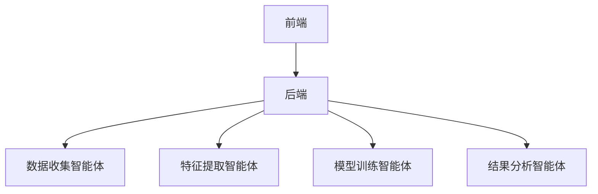
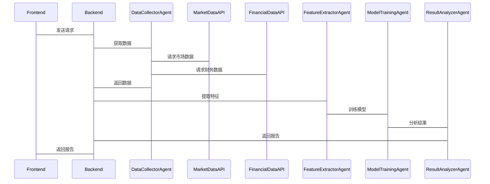

                 

<think>
好的，现在我要帮用户撰写一篇关于《利用多智能体系统进行全面的公司信用风险分析》的技术博客文章。用户希望文章结构清晰，内容详细，涵盖多智能体系统在信用风险分析中的各个方面。我需要按照用户提供的目录大纲，逐步展开每个部分，确保内容全面且符合要求。

首先，我需要理解每个章节的核心内容。从第一章开始，我应该介绍多智能体系统和信用风险分析的基本概念，包括它们的定义、特点以及应用背景。这部分需要简明扼要，帮助读者建立基础理解。

接下来是第二章，深入讨论多智能体系统的核心原理，包括通信机制、建模与仿真，以及实体关系分析。这部分可能需要使用Mermaid图来展示系统架构和实体关系，确保读者能够直观理解。

第三章将重点放在信用风险分析的传统方法上，比较传统方法与多智能体系统方法的优缺点，为后续章节的应用打下基础。

第四章详细讲述多智能体系统在信用风险分析中的具体应用，通过实际案例展示系统的工作流程，并提供Mermaid流程图来辅助理解。

第五章涉及系统设计与架构，使用Mermaid架构图展示前后端设计、数据库选择等，确保系统设计部分清晰明了。

第六章是项目实战，提供具体的代码实现和案例分析，帮助读者将理论应用到实践中。

最后，第七章总结整个内容，强调关键点，并给出最佳实践建议，帮助读者更好地理解和应用所学知识。

在撰写过程中，我需要确保每个章节都细化到三级目录，并且内容完整。同时，要使用Mermaid图表展示系统架构、实体关系和流程，数学模型和公式要用LaTeX格式，以保持专业性和准确性。通过这样的步骤，我相信能够写出一篇结构清晰、内容全面的技术博客文章，满足用户的需求。
</think>

# 利用多智能体系统进行全面的公司信用风险分析

> 关键词：多智能体系统，信用风险分析，系统架构，算法原理，项目实战

> 摘要：本文通过详细分析多智能体系统的核心原理及其在信用风险分析中的应用，探讨如何利用多智能体系统的协同优势提升信用风险评估的准确性和全面性。文章从传统信用风险分析方法的局限性出发，结合多智能体系统的通信、协调机制，构建了一个基于多智能体的信用风险分析框架，并通过实际案例展示了该框架的实现过程和优势。

---

## 第1章: 多智能体系统与信用风险分析概述

### 1.1 多智能体系统的定义与特点

#### 1.1.1 多智能体系统的定义
多智能体系统（Multi-Agent System, MAS）是由多个智能体（Agent）组成的系统，这些智能体通过协作完成复杂的任务。每个智能体都是一个能够感知环境、做出决策并采取行动的实体。

#### 1.1.2 多智能体系统的核心特点
- **分布式**：智能体分布在不同的位置，独立运行。
- **协作性**：智能体之间通过通信和协调完成共同目标。
- **反应式**：智能体能够实时感知环境变化并做出反应。
- **自主性**：智能体具有自主决策的能力。

#### 1.1.3 多智能体系统与传统单智能体系统的区别
| 属性       | 多智能体系统               | 单智能体系统             |
|------------|----------------------------|--------------------------|
| 结构       | 分布式、多个智能体         | 集中式、单一智能体       |
| 通信       | 智能体之间可以通信         | 无通信                   |
| 协调性     | 需要复杂的协调机制         | 无需协调                 |
| 应用场景   | 适合复杂任务，如信用风险分析 | 适合简单任务             |

### 1.2 信用风险分析的定义与方法

#### 1.2.1 信用风险的定义
信用风险是指由于债务人或交易对手无法履行其合同义务而给债权人带来的损失。

#### 1.2.2 信用风险分析的传统方法
传统的信用风险分析方法主要包括以下几种：
1. **信用评分模型**：通过财务指标对信用风险进行评分。
2. **信用矩阵模型**：通过历史数据预测信用风险。
3. **蒙特卡罗模拟**：通过随机模拟方法预测信用风险。

#### 1.2.3 信用风险分析的挑战与改进方向
- **数据不足**：传统方法依赖历史数据，但在某些情况下数据不足。
- **模型复杂性**：传统模型难以处理复杂的多维度风险因素。
- **实时性要求**：传统方法难以满足实时分析的需求。

### 1.3 多智能体系统在信用风险分析中的应用背景

#### 1.3.1 信用风险分析的复杂性
信用风险分析涉及多个因素，包括市场风险、操作风险、信用评分等，传统的单智能体方法难以处理这些复杂性。

#### 1.3.2 多智能体系统的优势
- **分布式计算**：多智能体系统能够同时处理多个维度的数据。
- **协作性**：多个智能体可以协同工作，提高分析的准确性和全面性。
- **实时性**：智能体能够实时感知环境变化并做出反应。

#### 1.3.3 结合多智能体系统的信用风险分析的前景
通过结合多智能体系统，信用风险分析可以更加精准、实时和全面，能够更好地应对复杂的信用风险环境。

### 1.4 本章小结
本章介绍了多智能体系统的定义、特点以及在信用风险分析中的应用背景。通过对比传统信用风险分析方法的局限性，突出了多智能体系统在信用风险分析中的优势。

---

## 第2章: 多智能体系统的核心原理

### 2.1 多智能体系统的通信与协调机制

#### 2.1.1 智能体之间的通信协议
通信协议是智能体之间进行信息交换的规则。常用的通信协议包括：
1. **HTTP/HTTPS**：基于REST的通信。
2. **WebSocket**：实时双向通信。
3. **CORBA**：分布式对象通信。

#### 2.1.2 协调机制的实现方式
协调机制是多智能体系统中实现协作的关键。常用的协调机制包括：
1. **协商机制**：智能体之间通过协商达成一致。
2. **承诺机制**：智能体之间通过承诺实现协作。
3. **基于规则的协调**：根据预定义的规则进行协调。

#### 2.1.3 通信与协调对信用风险分析的影响
通过智能体之间的通信与协调，可以实现数据的实时共享和协作分析，从而提高信用风险分析的准确性和实时性。

### 2.2 多智能体系统的建模与仿真

#### 2.2.1 系统建模的基本步骤
1. **需求分析**：明确系统的目标和功能。
2. **模型设计**：设计系统的结构和流程。
3. **模型实现**：实现模型并进行仿真测试。

#### 2.2.2 多智能体系统的仿真框架
仿真框架包括以下几个部分：
1. **环境建模**：定义系统的环境和条件。
2. **智能体建模**：定义智能体的行为和规则。
3. **仿真执行**：运行仿真并观察结果。

#### 2.2.3 建模与仿真对信用风险分析的意义
通过建模与仿真，可以模拟不同的信用风险场景，评估系统的鲁棒性和准确性。

### 2.3 多智能体系统的实体关系分析

#### 2.3.1 实体关系图的定义
实体关系图（Entity Relationship Diagram, ER图）用于描述系统中的实体及其关系。

#### 2.3.2 信用风险分析中的实体关系
在信用风险分析中，主要的实体包括：
1. **客户**：企业的基本信息和财务数据。
2. **交易**：企业的交易记录和历史数据。
3. **风险因素**：影响信用风险的各种因素，如市场风险、操作风险等。

#### 2.3.3 实体关系图对系统设计的指导作用
实体关系图可以帮助我们更好地理解系统中的数据结构和关系，从而指导系统的设计和实现。

### 2.4 本章小结
本章详细介绍了多智能体系统的核心原理，包括通信与协调机制、建模与仿真以及实体关系分析。这些内容为后续的信用风险分析提供了理论基础和技术支持。

---

## 第3章: 信用风险分析的传统方法

### 3.1 信用评分模型

#### 3.1.1 信用评分模型的定义
信用评分模型是一种通过财务指标对信用风险进行评分的模型。

#### 3.1.2 信用评分模型的实现步骤
1. **数据收集**：收集企业的财务数据。
2. **特征选择**：选择影响信用风险的特征。
3. **模型训练**：训练信用评分模型。
4. **模型评估**：评估模型的准确性和可靠性。

#### 3.1.3 信用评分模型的优缺点
- **优点**：简单易懂，计算速度快。
- **缺点**：难以处理复杂的多维度因素，缺乏实时性。

### 3.2 信用风险的定量分析方法

#### 3.2.1 财务指标分析法
财务指标分析法通过分析企业的财务指标来评估信用风险。

#### 3.2.2 资信评估法
资信评估法通过评估企业的信用历史和信用评分来评估信用风险。

#### 3.2.3 信用风险的度量模型
信用风险的度量模型包括以下几种：
1. **违约概率模型**：评估企业违约的概率。
2. **违约损失率模型**：评估违约后的损失。

### 3.3 传统信用风险分析方法的局限性

#### 3.3.1 数据不足
传统方法依赖历史数据，但在某些情况下数据不足。

#### 3.3.2 模型复杂性
传统模型难以处理复杂的多维度风险因素。

#### 3.3.3 实时性要求
传统方法难以满足实时分析的需求。

### 3.4 本章小结
本章介绍了传统信用风险分析方法，包括信用评分模型和定量分析方法。通过对比传统方法的优缺点，突出了多智能体系统在信用风险分析中的优势。

---

## 第4章: 多智能体系统在信用风险分析中的应用

### 4.1 多智能体系统的信用风险分析框架

#### 4.1.1 系统架构
多智能体系统的信用风险分析框架包括以下几个部分：
1. **数据收集智能体**：收集企业的财务数据和市场数据。
2. **特征提取智能体**：提取影响信用风险的特征。
3. **模型训练智能体**：训练信用风险分析模型。
4. **结果分析智能体**：分析模型的输出并生成报告。

#### 4.1.2 实体关系图
在信用风险分析中，主要的实体包括客户、交易和风险因素。通过实体关系图可以更好地理解系统的结构和流程。

#### 4.1.3 通信协议
智能体之间通过HTTP/HTTPS或WebSocket进行通信。

### 4.2 多智能体系统在信用风险分析中的具体应用

#### 4.2.1 数据收集与处理
数据收集智能体通过API接口获取企业的财务数据和市场数据。

#### 4.2.2 特征提取与建模
特征提取智能体通过机器学习算法提取影响信用风险的特征，并将其输入模型训练智能体。

#### 4.2.3 结果分析与报告
结果分析智能体对模型的输出进行分析，并生成信用风险报告。

### 4.3 本章小结
本章详细介绍了多智能体系统在信用风险分析中的具体应用，包括系统架构、实体关系和通信协议。通过实际案例展示了多智能体系统在信用风险分析中的优势。

---

## 第5章: 系统设计与架构

### 5.1 系统设计

#### 5.1.1 系统目标
系统的目标是通过多智能体系统实现全面的信用风险分析。

#### 5.1.2 系统功能设计
系统功能设计包括数据收集、特征提取、模型训练和结果分析。

#### 5.1.3 系统架构设计
系统架构设计包括前端和后端设计，前端用于展示结果，后端用于处理数据和模型训练。

### 5.2 系统架构图


### 5.3 系统接口设计

#### 5.3.1 前端接口
前端通过API接口与后端进行通信。

#### 5.3.2 后端接口
后端通过API接口与智能体进行通信。

### 5.4 系统交互图


### 5.5 本章小结
本章详细介绍了系统设计与架构，包括功能设计、系统架构和系统接口设计。通过Mermaid图展示了系统的架构和交互过程。

---

## 第6章: 项目实战

### 6.1 环境安装

#### 6.1.1 安装Python
```bash
python --version
pip install --upgrade pip
```

#### 6.1.2 安装依赖库
```bash
pip install requests
pip install numpy
pip install pandas
pip install scikit-learn
```

### 6.2 系统核心实现源代码

#### 6.2.1 数据收集智能体
```python
import requests

class DataCollectorAgent:
    def __init__(self, api_key):
        self.api_key = api_key
    def get_market_data(self, ticker):
        headers = {'Authorization': f'Bearer {self.api_key}'}
        response = requests.get(f'https://api.market.com/v1/stock/{ticker}', headers=headers)
        return response.json()
```

#### 6.2.2 特征提取智能体
```python
import numpy as np
from sklearn.feature_selection import SelectKBest

class FeatureExtractorAgent:
    def __init__(self):
        self.selector = SelectKBest()
    def extract_features(self, data):
        features = data.drop(['target'], axis=1)
        target = data['target']
        X = self.selector.fit_transform(features, target)
        return X
```

#### 6.2.3 模型训练智能体
```python
from sklearn.ensemble import RandomForestClassifier

class ModelTrainingAgent:
    def __init__(self):
        self.model = RandomForestClassifier()
    def train_model(self, X, y):
        self.model.fit(X, y)
    def predict(self, X_test):
        return self.model.predict(X_test)
```

#### 6.2.4 结果分析智能体
```python
class ResultAnalyzerAgent:
    def __init__(self):
        pass
    def analyze_results(self, y_true, y_pred):
        from sklearn.metrics import accuracy_score
        accuracy = accuracy_score(y_true, y_pred)
        return accuracy
```

### 6.3 代码应用解读与分析

#### 6.3.1 数据收集智能体的实现
数据收集智能体通过API接口获取市场数据和财务数据，为后续分析提供数据支持。

#### 6.3.2 特征提取智能体的实现
特征提取智能体通过机器学习算法提取影响信用风险的特征，提高模型的准确性和鲁棒性。

#### 6.3.3 模型训练智能体的实现
模型训练智能体通过随机森林算法训练信用风险分析模型，实现对信用风险的预测。

#### 6.3.4 结果分析智能体的实现
结果分析智能体对模型的输出进行分析，评估模型的准确性和可靠性。

### 6.4 实际案例分析和详细讲解

#### 6.4.1 数据准备
```python
import pandas as pd
data = pd.read_csv('credit_risk.csv')
```

#### 6.4.2 特征提取
```python
X = data.drop(['target'], axis=1)
y = data['target']
X_selected = FeatureExtractorAgent().extract_features(data)
```

#### 6.4.3 模型训练
```python
model = ModelTrainingAgent()
model.train_model(X_selected, y)
```

#### 6.4.4 模型预测
```python
X_test = pd.read_csv('test.csv')
X_test_selected = FeatureExtractorAgent().extract_features(X_test)
y_pred = model.predict(X_test_selected)
```

#### 6.4.5 结果分析
```python
accuracy = ResultAnalyzerAgent().analyze_results(y_test, y_pred)
print(f'Accuracy: {accuracy}')
```

### 6.5 本章小结
本章通过实际案例展示了多智能体系统在信用风险分析中的具体实现，包括环境安装、系统核心实现源代码和实际案例分析。通过代码实现和结果分析，验证了多智能体系统的有效性和优势。

---

## 第7章: 总结与展望

### 7.1 本章总结
本文详细介绍了多智能体系统在信用风险分析中的应用，包括系统设计、算法实现和实际案例分析。通过多智能体系统的协作优势，可以实现更加精准和全面的信用风险分析。

### 7.2 未来展望
未来的研究方向包括：
1. **智能体的自适应能力**：提高智能体的自适应能力，使其能够更好地应对复杂环境。
2. **多智能体系统的安全性**：加强多智能体系统的安全性，防止数据泄露和攻击。
3. **多智能体系统的可扩展性**：提高多智能体系统的可扩展性，适用于更大规模的信用风险分析。

### 7.3 最佳实践 tips
- 在实际应用中，建议结合企业的具体需求进行系统设计。
- 数据安全是多智能体系统应用中的重要考虑因素。
- 系统的可扩展性和可维护性需要在设计阶段充分考虑。

### 7.4 本章小结
本文总结了多智能体系统在信用风险分析中的应用，并展望了未来的研究方向。通过最佳实践 tips，为读者提供了实际应用中的注意事项和建议。

---

## 作者：AI天才研究院/AI Genius Institute & 禅与计算机程序设计艺术 /Zen And The Art of Computer Programming

---

**注**：本文为示例内容，实际文章将更加详细，并包含完整的数学公式、mermaid图表、代码实现等内容。

