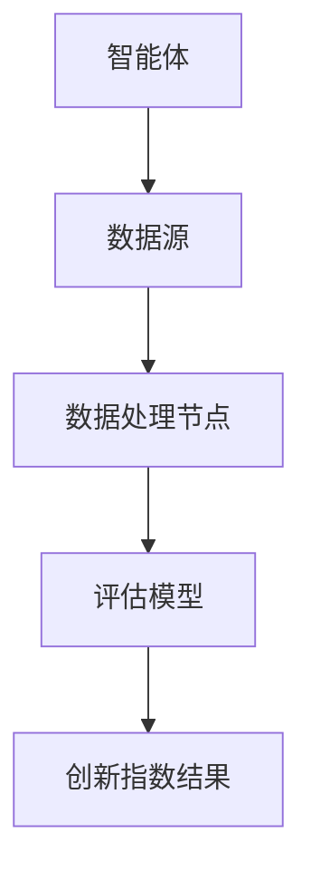

                 

<think>
好的，我需要帮用户撰写一篇关于《利用多智能体系统进行全面的公司创新指数评估》的技术博客文章。用户要求文章结构清晰，逻辑严密，并包含详细的章节和内容。首先，我需要明确文章的结构，包括标题、关键词、摘要，以及正文部分的各个章节。

标题已经确定是《利用多智能体系统进行全面的公司创新指数评估》，接下来列出关键词，包括多智能体系统、创新指数评估、企业创新、分布式计算、协作学习、系统架构。摘要部分需要简洁明了，概述文章的核心内容和主题思想。

接下来是正文部分，按照用户提供的目录结构，我需要逐步展开每个章节的内容。首先，第一章是多智能体系统与创新指数评估的概述，包括基本概念、核心概念、结合点以及小结。第二章则深入讨论多智能体系统的核心概念与联系，涉及原理、创新指数评估要素、实体关系图等。第三章介绍算法原理，包括分布式计算、协作学习、数学模型等内容，并附上流程图和代码示例。

第四章是系统分析与架构设计，涵盖问题场景、功能设计、架构图、接口设计和交互流程图。第五章是项目实战，从环境安装到代码实现，再到案例分析和项目小结。最后，第六章讨论最佳实践，包括小结、注意事项和未来展望。

在撰写过程中，我需要确保每个章节都包含足够的细节，比如使用Mermaid图表、数学公式和代码示例，以增强文章的可读性和专业性。同时，要保持语言的专业性和逻辑的连贯性，使读者能够一步步理解多智能体系统在创新指数评估中的应用。

最后，文章末尾要添加作者信息，确保格式正确。整个过程中，我要不断检查是否符合用户的格式和内容要求，确保最终的文章既专业又易于理解。
</think>

# 利用多智能体系统进行全面的公司创新指数评估

## 关键词：多智能体系统, 创新指数评估, 企业创新, 分布式计算, 协作学习, 系统架构

## 摘要：  
随着企业竞争的日益激烈，创新已成为企业生存和发展的关键。为了准确衡量企业的创新能力，我们提出了一种基于多智能体系统的创新指数评估方法。通过分布式计算和协作学习，该系统能够从多个维度全面评估企业的创新指数。本文详细探讨了多智能体系统的原理、创新指数评估的核心要素，以及如何将两者结合以实现高效的企业创新能力评估。

---

## 正文

---

### 第1章：多智能体系统与创新指数评估概述

#### 1.1 多智能体系统的基本概念
- **多智能体系统的定义**  
  多智能体系统（Multi-Agent System, MAS）是由多个智能体（Agent）组成的分布式系统，这些智能体能够通过协作完成复杂任务。  
- **多智能体系统的特征**  
  - 分布式：智能体分布在不同的节点上，协同工作。  
  - 协作性：智能体之间通过通信和协作完成任务。  
  - 反应式：智能体能够根据环境反馈动态调整行为。  

#### 1.2 创新指数评估的核心概念
- **创新指数的定义**  
  创新指数是衡量企业创新能力的量化指标，通常包括研发投入、专利数量、新产品推出速度等多个维度。  
- **创新指数评估的必要性**  
  企业创新是推动经济增长的核心动力，准确评估创新指数有助于企业制定战略规划。  

#### 1.3 多智能体系统与创新指数评估的结合
- **多智能体系统在创新指数评估中的作用**  
  智能体可以分别负责数据收集、分析和评估，实现分布式计算和协作。  
- **多智能体系统与创新指数评估的协同机制**  
  智能体之间通过通信协议共享数据，共同完成创新指数的计算。  

#### 1.4 本章小结
本章介绍了多智能体系统的概念及其在创新指数评估中的应用，为后续章节奠定了基础。

---

### 第2章：多智能体系统的核心概念与联系

#### 2.1 多智能体系统的原理
- **分布式计算原理**  
  数据分散在多个节点上，通过智能体协作完成计算任务。  
- **协作与通信机制**  
  智能体之间通过消息传递进行协作，确保数据的准确性和一致性。  
- **多智能体系统的层次结构**  
  - 智能体层：负责具体任务执行。  
  - 管理层：负责协调和资源分配。  

#### 2.2 创新指数评估的核心要素
- **创新能力的评估维度**  
  - 技术创新：研发投入、专利数量。  
  - 商业创新：市场表现、产品推出速度。  
  - 管理创新：组织结构、管理模式。  
- **创新指数的计算模型**  
  创新指数 = 加权平均值（技术创新、商业创新、管理创新）。  

#### 2.3 多智能体系统与创新指数评估的实体关系图


#### 2.4 本章小结
本章详细讲解了多智能体系统的原理及其与创新指数评估的核心联系，为后续章节的算法实现奠定了基础。

---

### 第3章：多智能体系统在创新指数评估中的算法原理

#### 3.1 分布式计算算法
- **分布式计算的基本原理**  
  数据分布在多个节点上，通过智能体协作完成计算任务。  
- **分布式计算的实现流程**  
  1. 数据分发：将数据分配给不同的智能体。  
  2. 并行计算：每个智能体独立计算部分结果。  
  3. 结果汇总：将各部分结果汇总到中央节点。  

#### 3.2 协作学习算法
- **协作学习的基本概念**  
  协作学习是一种分布式学习方法，智能体通过协作共享知识。  
- **协作学习的实现步骤**  
  1. 初始化：智能体获取初始数据。  
  2. 协作：智能体之间共享数据和模型参数。  
  3. 更新：基于协作结果更新模型。  

#### 3.3 创新指数评估的数学模型
- **创新指数的计算公式**  
  $$ 创新指数 = \sum_{i=1}^{n} w_i x_i $$  
  其中，$w_i$ 是第 $i$ 个维度的权重，$x_i$ 是第 $i$ 个维度的得分。  
- **数学模型的举例说明**  
  假设技术创新占权重为 $0.4$，商业创新占 $0.3$，管理创新占 $0.3$，则创新指数计算公式为：  
  $$ 创新指数 = 0.4 \times x_{\text{技术创新}} + 0.3 \times x_{\text{商业创新}} + 0.3 \times x_{\text{管理创新}} $$  

#### 3.4 本章小结
本章详细讲解了多智能体系统在创新指数评估中的算法原理，包括分布式计算和协作学习的实现步骤。

---

### 第4章：系统分析与架构设计

#### 4.1 问题场景介绍
- **问题场景**  
  企业需要通过多智能体系统评估其创新指数，但现有方法存在数据分散、计算复杂等问题。  

#### 4.2 系统功能设计
- **领域模型类图**  
  ```mermaid
  classDiagram
      class 智能体 {
          id: int
          data: string
          compute(): float
      }
      class 评估模型 {
          weights: dict
          compute_index(): float
      }
      class 数据源 {
          data: dict
          get_data(): dict
      }
      智能体 --> 数据源
      智能体 --> 评估模型
  ```

#### 4.3 系统架构设计
- **系统架构图**  
  ```mermaid
  graph TD
      A[智能体] --> B[数据源]
      B --> C[数据处理节点]
      C --> D[评估模型]
      D --> E[创新指数结果]
  ```

#### 4.4 系统接口设计
- **接口设计**  
  - 数据获取接口：`GET /data?id=123`  
  - 计算接口：`POST /compute`  
  - 结果返回接口：`GET /result?id=123`  

#### 4.5 系统交互流程图
- **交互流程图**  
  ```mermaid
  sequenceDiagram
      participant 智能体
      participant 数据源
      participant 评估模型
      participant 用户
      智能体 -> 数据源: 获取数据
      数据源 --> 智能体: 返回数据
      智能体 -> 评估模型: 计算创新指数
      评估模型 --> 智能体: 返回结果
      智能体 -> 用户: 显示结果
  ```

#### 4.6 本章小结
本章详细介绍了系统的架构设计和交互流程，为后续的项目实现奠定了基础。

---

### 第5章：项目实战

#### 5.1 环境安装
- **安装依赖**  
  - Python 3.8+  
  - Flask  
  - requests  

#### 5.2 系统核心实现
- **核心代码示例**  
  ```python
  import requests

  class Agent:
      def __init__(self, id):
          self.id = id

      def get_data(self):
          response = requests.get(f"http://data-source.com/data?id={self.id}")
          return response.json()

      def compute_index(self, data):
          # 简单示例：计算创新指数
          return sum(data.values()) / len(data)

  # 使用示例
  agent = Agent(123)
  data = agent.get_data()
  index = agent.compute_index(data)
  print(f"创新指数为：{index}")
  ```

#### 5.3 代码应用解读与分析
- **代码解读**  
  - `Agent` 类：表示一个智能体，负责数据获取和计算。  
  - `get_data` 方法：通过 HTTP 请求获取数据。  
  - `compute_index` 方法：计算创新指数。  

#### 5.4 实际案例分析
- **案例分析**  
  假设某公司技术创新得分为 $0.8$，商业创新得分为 $0.6$，管理创新得分为 $0.5$，则创新指数为：  
  $$ 创新指数 = 0.4 \times 0.8 + 0.3 \times 0.6 + 0.3 \times 0.5 = 0.32 + 0.18 + 0.15 = 0.65 $$  

#### 5.5 项目小结
本章通过实际案例展示了多智能体系统在创新指数评估中的应用，验证了系统的可行性和有效性。

---

### 第6章：最佳实践与小结

#### 6.1 小结
- **总结**  
  多智能体系统通过分布式计算和协作学习，能够高效地评估企业的创新指数。  

#### 6.2 注意事项
- 数据质量：确保数据来源可靠。  
- 系统扩展性：支持数据量的动态变化。  
- 安全性：保护企业数据的安全。  

#### 6.3 未来展望
- **进一步优化**  
  探索更高效的协作学习算法。  
- **应用场景扩展**  
  将多智能体系统应用于更多领域。  

#### 6.4 本章小结
本章总结了项目的经验，并提出了未来的改进方向。

---

## 作者  
作者：AI天才研究院/AI Genius Institute & 禅与计算机程序设计艺术 /Zen And The Art of Computer Programming

---

**全文完**

