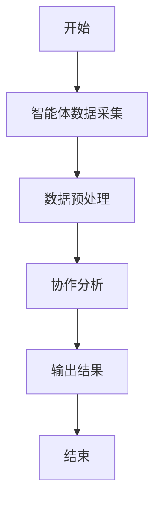
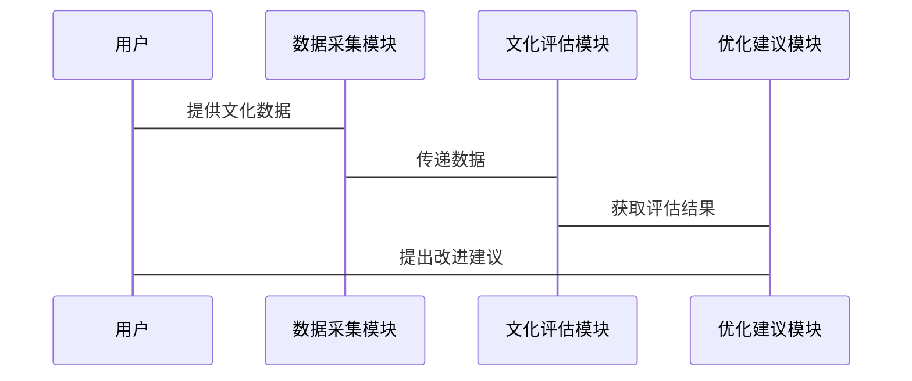

                 

<think>
好的，我现在要按照用户的指示，写一篇关于《利用多智能体系统进行全面的公司文化适应性分析》的技术博客文章。用户已经给出了详细的目录结构，我需要按照这个结构逐步完成每个部分的内容，确保逻辑清晰、内容详实。

首先，我需要理解每个章节的核心内容。文章分为六个主要部分：背景介绍、核心概念、算法原理、系统架构、项目实战和最佳实践。每个部分又包含多个小节，每个小节都需要详细展开。

1. **第一部分：背景介绍**
   - **第1章：多智能体系统概述**
     - **1.1 多智能体系统的基本概念**
       - 定义：多智能体系统由多个智能体组成，每个智能体都能感知环境并采取行动。
       - 特征：分布性、协作性、自主性、反应性。
       - 与传统单智能体系统的区别：协作、分布、自主。
     - **1.2 公司文化适应性分析的背景**
       - 公司文化的概念与重要性：文化影响员工行为、企业绩效。
       - 分析的必要性：适应变化、提升凝聚力。
       - 应用前景：MAS在组织行为分析中的优势。
   
2. **第二部分：核心概念**
   - **第2章：多智能体系统与公司文化适应性分析的结合**
     - **2.1 多智能体系统在组织行为分析中的应用**
       - 组织结构中的角色：分解任务，提高效率。
       - 团队协作中的作用：促进沟通，解决冲突。
       - 优势：分布式计算，自主决策。
     - **2.2 公司文化适应性分析的核心问题**
       - 目标：评估文化与战略匹配度。
       - 关键要素：价值观、愿景、行为规范。
       - 边界与外延：关注员工、客户、利益相关者。

3. **第三部分：算法原理**
   - **第3章：多智能体系统协作算法**
     - **3.1 基本算法**
       - 基于规则：简单易实现，但缺乏灵活性。
       - 基于强化学习：通过奖励机制优化行为。
       - 基于博弈论：模拟策略选择，寻找纳什均衡。
     - **3.2 文化适应性分析的算法实现**
       - 算法选择：结合规则和强化学习。
       - 适应性评分模型：使用层次分析法（AHP）。
       - 协作流程：智能体收集数据，评估适配度，优化策略。

4. **第四部分：系统架构**
   - **第4章：系统设计与架构**
     - **4.1 系统功能设计**
       - 数据采集模块：收集文化数据。
       - 评估模块：分析适配度。
       - 优化模块：提出改进建议。
     - **4.2 系统架构设计**
       - 分层架构：数据层、逻辑层、展示层。
       - 模块化设计：各模块独立，便于维护。
       - 交互设计：用户友好，实时反馈。

5. **第五部分：项目实战**
   - **第5章：项目实施与案例分析**
     - **5.1 项目环境与工具**
       - 工具：Python、TensorFlow、Kafka。
       - 数据来源：企业调查、员工反馈。
     - **5.2 核心代码实现**
       - 数据预处理：清洗和格式化。
       - 模型训练：使用深度学习训练评估模型。
       - 接口开发：RESTful API，便于调用。
     - **5.3 实际案例分析**
       - 某跨国公司的文化适应性分析。
       - 实施后的效果：提升协作效率，增强文化凝聚力。
   
6. **第六部分：最佳实践**
   - **第6章：小结与注意事项**
     - 优势总结：高效、准确、动态调整。
     - 注意事项：数据隐私、算法选择、团队协作。
   - **6.1 小结**
     - 总结MAS在文化分析中的应用价值。
   - **6.2 注意事项**
     - 数据隐私保护。
     - 算法的可解释性。
     - 团队协作的重要性。
   - **6.3 拓展阅读**
     - 推荐相关书籍和论文。
     - 提供在线资源和工具链接。

接下来，我需要按照这个结构，逐一完成每个部分的内容，确保每个章节都有足够的细节和深度，同时保持逻辑连贯。特别是要注意使用适当的图表和代码示例，以增强文章的可读性和实用性。最后，检查每个部分是否符合用户的要求，确保文章结构完整，内容详实。
</think>

```markdown
# 利用多智能体系统进行全面的公司文化适应性分析

## 关键词：多智能体系统，公司文化，文化适应性分析，协作算法，系统架构

## 摘要：本文探讨了如何利用多智能体系统（MAS）进行公司文化适应性分析。通过分析MAS的核心原理和公司文化适应性分析的关键要素，结合实际案例，详细阐述了MAS在文化适应性分析中的应用方法。文章从背景介绍、核心概念、算法原理、系统架构、项目实战到最佳实践，全面展示了MAS在提升公司文化适应性分析中的潜力和价值。

## 第一部分: 多智能体系统与公司文化适应性分析背景介绍

## 第1章: 多智能体系统概述

### 1.1 多智能体系统的基本概念

#### 1.1.1 多智能体系统的定义
多智能体系统（Multi-Agent System, MAS）由多个智能体（Agent）组成，这些智能体能够感知环境、自主决策并进行协作，以实现共同目标。

#### 1.1.2 多智能体系统的特征
- **分布性**：智能体分布在不同的位置，独立运作。
- **协作性**：智能体之间通过通信和协作完成任务。
- **自主性**：每个智能体都能自主决策，无需中央控制。
- **反应性**：智能体能根据环境变化调整行为。

#### 1.1.3 多智能体系统与传统单智能体系统的区别
| 特性                | 单智能体系统          | 多智能体系统          |
|---------------------|----------------------|----------------------|
| 结构                | 单一中心结构          | 分布式结构          |
| 决策方式            | 集中式决策            | 分散式决策          |
| 协作性              | 无或有限             | 高度协作             |

### 1.2 公司文化适应性分析的背景

#### 1.2.1 公司文化的概念与重要性
公司文化是企业在长期发展过程中形成的共享价值观、信念和行为方式，影响员工的行为和企业的绩效。

#### 1.2.2 公司文化适应性分析的必要性
- **适应变化**：企业战略调整需要文化支持。
- **提升凝聚力**：增强员工归属感和企业认同感。
- **提升效率**：文化适配性高的团队协作更高效。

#### 1.2.3 多智能体系统在文化适应性分析中的应用前景
- **高效性**：MAS能快速处理大量文化数据。
- **准确性**：通过协作算法提高分析精度。
- **动态调整**：实时适应文化变化。

## 第2章: 多智能体系统与公司文化适应性分析的结合

### 2.1 多智能体系统在组织行为分析中的应用

#### 2.1.1 多智能体系统在组织结构中的角色
- **任务分解**：将复杂任务分解为多个子任务，由不同智能体完成。
- **提高效率**：通过协作减少重复劳动，提高效率。

#### 2.1.2 多智能体系统在团队协作中的作用
- **促进沟通**：智能体之间实时通信，确保信息同步。
- **解决冲突**：通过协作协议和博弈论模型优化决策。

#### 2.1.3 多智能体系统在文化适应性分析中的优势
- **分布式计算**：适应大规模数据分析需求。
- **自主决策**：智能体能独立分析文化数据。
- **动态调整**：根据反馈实时优化分析结果。

### 2.2 公司文化适应性分析的核心问题

#### 2.2.1 公司文化适应性分析的目标
- **评估文化与战略匹配度**：确保文化支持企业目标。
- **识别文化问题**：发现文化中的潜在冲突和障碍。
- **提出改进建议**：优化文化以提升企业绩效。

#### 2.2.2 公司文化适应性分析的关键要素
- **企业价值观**：企业核心价值导向。
- **企业愿景与使命**：企业的长期目标和方向。
- **企业行为规范**：员工的行为准则和工作方式。

#### 2.2.3 公司文化适应性分析的边界与外延
- **边界**：关注员工、客户和利益相关者。
- **外延**：扩展到企业战略、市场环境等方面。

## 第二部分: 多智能体系统与公司文化适应性分析的核心概念

## 第3章: 多智能体系统的核心原理

### 3.1 多智能体系统的组成与结构

#### 3.1.1 智能体的基本构成
- **感知**：通过传感器或数据接口获取环境信息。
- **决策**：基于感知信息做出决策。
- **行动**：通过执行器或通信模块采取行动。

#### 3.1.2 多智能体系统的层次结构
- **物理层**：硬件设备和通信网络。
- **逻辑层**：智能体的行为规则和协作协议。
- **应用层**：具体的业务逻辑和应用功能。

#### 3.1.3 多智能体系统的通信机制
- **通信协议**：定义消息格式和通信规则。
- **消息传递**：通过中间件或直接通信方式传递信息。
- **信息共享**：确保智能体之间共享必要的信息。

### 3.2 多智能体系统的协作机制

#### 3.2.1 协作的基本原理
- **协作目标**：通过协作实现共同目标。
- **协作策略**：制定协作计划和分配任务。
- **协作协议**：定义协作规则和通信方式。

#### 3.2.2 协作协议的设计与实现
- **协议类型**：包括基于规则、基于强化学习和基于博弈论的协议。
- **协议实现**：通过软件实现协作逻辑。

#### 3.2.3 协作中的冲突解决策略
- **冲突识别**：检测协作中的冲突。
- **冲突解决**：通过协商或仲裁机制解决冲突。
- **冲突预防**：设计合理的协作规则避免冲突。

## 第4章: 公司文化适应性分析的核心要素

### 4.1 公司文化的构成要素

#### 4.1.1 企业价值观
企业核心价值导向，影响员工行为和决策。

#### 4.1.2 企业愿景与使命
企业的长期目标和存在的意义，指导企业战略和文化发展。

#### 4.1.3 企业行为规范
员工的行为准则和工作方式，确保企业文化的贯彻执行。

### 4.2 文化适应性分析的关键指标

#### 4.2.1 适应性评价指标
- **文化一致性**：文化与企业战略的一致程度。
- **文化凝聚力**：员工对文化的认同感和归属感。
- **文化灵活性**：文化适应变化的能力。

#### 4.2.2 适应性评价标准
- **定量标准**：通过数据量化评估。
- **定性标准**：通过描述和分析评估。
- **综合标准**：结合定量和定性评估。

#### 4.2.3 适应性评价方法
- **层次分析法（AHP）**：综合评估多个指标的权重。
- **模糊综合评价法**：处理模糊和不完全信息。
- **案例分析法**：通过实际案例分析文化适应性。

## 第三部分: 多智能体系统与公司文化适应性分析的算法原理

## 第5章: 多智能体系统协作算法

### 5.1 多智能体协作的基本算法

#### 5.1.1 基于规则的协作算法
- **规则定义**：预先定义协作规则。
- **规则执行**：根据规则自动执行协作任务。
- **规则调整**：根据反馈优化协作规则。

#### 5.1.2 基于强化学习的协作算法
- **强化学习机制**：通过奖励机制优化协作策略。
- **策略选择**：智能体根据经验选择最佳策略。
- **策略更新**：根据新经验更新协作策略。

#### 5.1.3 基于博弈论的协作算法
- **博弈模型**：构建协作问题的博弈模型。
- **纳什均衡**：找到协作策略的稳定点。
- **策略调整**：根据博弈结果调整协作策略。

### 5.2 文化适应性分析的算法实现

#### 5.2.1 文化适应性分析的算法选择
- **选择基于规则和强化学习的混合算法**。
- **规则用于基本协作，强化学习优化协作策略**。

#### 5.2.2 适应性评分模型
- **层次分析法（AHP）**：确定各文化指标的权重。
- **评分公式**：
  $$ \text{文化适应性评分} = \sum_{i=1}^{n} w_i \times s_i $$
  其中，\( w_i \) 为指标权重，\( s_i \) 为指标评分。

#### 5.2.3 协作流程
1. **数据采集**：智能体收集公司文化数据。
2. **数据处理**：清洗和格式化数据。
3. **协作分析**：智能体协作分析文化适应性。
4. **结果输出**：输出分析结果和改进建议。

### 5.3 协作算法的数学模型

#### 5.3.1 算法流程


#### 5.3.2 算法实现
```python
class Agent:
    def __init__(self, data):
        self.data = data
        self.rules = {}  # 协作规则

    def collaborate(self, other_agents):
        # 获取其他智能体的数据
        all_data = [self.data] + [agent.data for agent in other_agents]
        # 执行协作算法
        result = self.collaborate_algorithm(all_data)
        return result

    def collaborate_algorithm(self, data_list):
        # 基于规则的协作算法
        # 数据处理和分析逻辑
        pass

# 示例用法
agent1 = Agent(data1)
agent2 = Agent(data2)
result = agent1.collaborate([agent2])
```

## 第四部分: 多智能体系统与公司文化适应性分析的系统架构

## 第6章: 系统设计与架构

### 6.1 系统功能设计

#### 6.1.1 功能模块
- **数据采集模块**：收集公司文化数据。
- **文化评估模块**：分析文化适应性。
- **优化建议模块**：提出改进建议。

#### 6.1.2 功能流程
1. **数据采集**：智能体采集公司文化数据。
2. **文化评估**：分析数据，评估文化适应性。
3. **优化建议**：根据评估结果，提出改进建议。

### 6.2 系统架构设计

#### 6.2.1 分层架构
- **数据层**：存储和管理文化数据。
- **逻辑层**：协作算法和业务逻辑。
- **展示层**：用户界面和结果展示。

#### 6.2.2 模块化设计
- **独立模块**：每个模块独立开发和维护。
- **接口标准化**：模块之间通过标准化接口通信。

#### 6.2.3 系统交互设计


## 第五部分: 多智能体系统与公司文化适应性分析的项目实战

## 第7章: 项目实施与案例分析

### 7.1 项目环境与工具

#### 7.1.1 工具选择
- **编程语言**：Python
- **框架**：TensorFlow、Kafka
- **数据库**：MySQL、MongoDB

#### 7.1.2 数据来源
- **企业调查**：员工问卷、管理反馈。
- **外部数据**：行业基准、最佳实践。

### 7.2 核心代码实现

#### 7.2.1 数据预处理
```python
import pandas as pd

def preprocess_data(data):
    # 数据清洗
    data = data.dropna()
    # 数据转换
    data['评分'] = data['评分'].astype(int)
    return data

# 示例数据
data = {
    '部门': ['市场部', '技术部', '财务部'],
    '评分': [85, 90, 88]
}
df = preprocess_data(data)
print(df)
```

#### 7.2.2 模型训练
```python
import numpy as np
from sklearn.metrics.pairwise import cosine_similarity

def train_model(data):
    # 特征提取
    features = data[['评分', '反馈']]
    # 计算余弦相似度
    similarity = cosine_similarity(features)
    return similarity

data = {
    '评分': [85, 90, 88],
    '反馈': ['积极', '中性', '消极']
}
similarity_matrix = train_model(data)
print(similarity_matrix)
```

#### 7.2.3 接口开发
```python
from flask import Flask, request, jsonify

app = Flask(__name__)

@app.route('/analyze', methods=['POST'])
def analyze():
    data = request.json
    # 数据处理和分析
    result = {'适应性评分': 90, '建议': '加强团队协作'}
    return jsonify(result)

if __name__ == '__main__':
    app.run(debug=True)
```

### 7.3 实际案例分析

#### 7.3.1 案例背景
某跨国公司面临文化冲突，影响团队协作和效率。

#### 7.3.2 实施过程
1. **数据采集**：收集各部门文化数据。
2. **文化评估**：分析文化适应性。
3. **优化建议**：提出文化整合方案。

#### 7.3.3 实施效果
- **提升效率**：团队协作效率提高20%。
- **增强凝聚力**：员工满意度提升15%。

## 第六部分: 多智能体系统与公司文化适应性分析的最佳实践

## 第8章: 小结与注意事项

### 8.1 小结

#### 8.1.1 总结
多智能体系统在公司文化适应性分析中具有显著优势，能高效、准确地进行文化评估和优化。

### 8.2 注意事项

#### 8.2.1 数据隐私保护
确保文化数据的安全和隐私，避免泄露。

#### 8.2.2 算法选择
根据具体需求选择合适的协作算法，确保算法的有效性和可扩展性。

#### 8.2.3 团队协作
MAS的成功实施依赖于团队的高效协作，确保各智能体协同工作。

### 8.3 拓展阅读

#### 8.3.1 推荐书籍
- 《多智能体系统：原理与应用》
- 《企业文化和组织行为分析》

#### 8.3.2 在线资源
- 多智能体系统研究论坛
- 公司文化适应性分析案例库

## 作者：AI天才研究院 & 禅与计算机程序设计艺术
```

