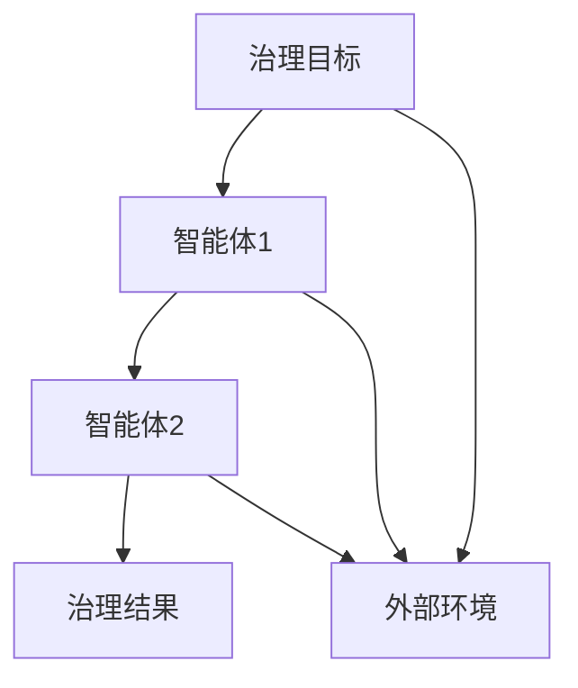
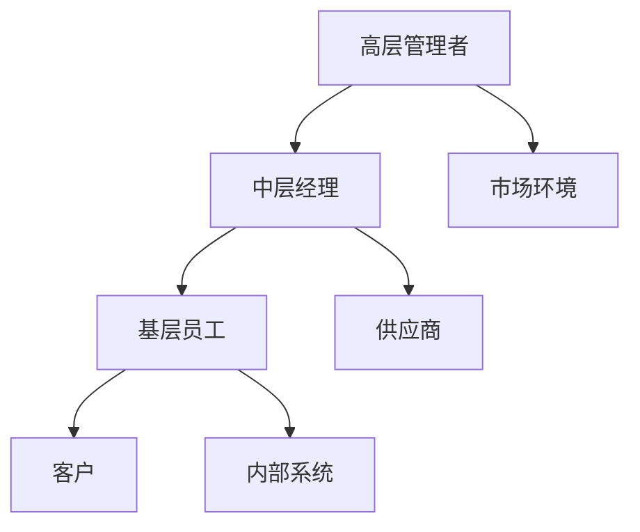
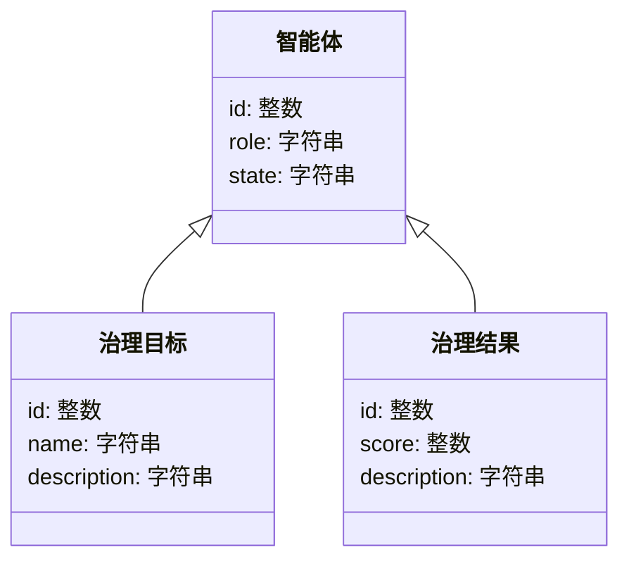
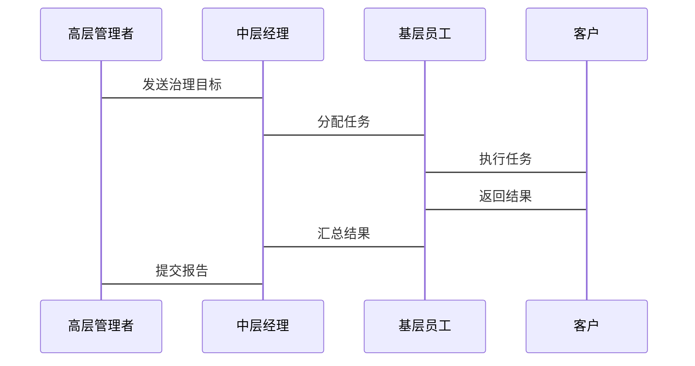

                 


# 利用多智能体系统进行全面的公司治理评估

> 关键词：多智能体系统, 公司治理评估, 分布式协作, 博弈论, 系统架构设计, 企业决策优化

> 摘要：  
公司治理评估是企业管理中的核心任务之一，传统的评估方法往往依赖于简单的财务指标分析，难以全面反映企业的实际运营状况。随着人工智能技术的快速发展，多智能体系统（Multi-Agent System, MAS）因其分布式协作、自适应性和高效率的特点，逐渐成为企业治理评估的重要工具。本文将详细探讨如何利用多智能体系统进行公司治理评估，包括系统架构设计、算法原理、项目实战以及最佳实践等内容，为企业的现代化治理提供新的思路和解决方案。

---

## 第一部分：多智能体系统与公司治理评估的背景

### 第1章：问题背景与挑战

#### 1.1 问题背景与挑战
- **传统公司治理评估的局限性**  
  传统的公司治理评估主要依赖于财务数据和简单的指标分析，难以全面反映企业的实际运营状况。例如，财务报表只能提供企业的盈利能力和财务健康状况，而无法反映企业在市场变化、员工行为、客户反馈等多方面的动态信息。

- **现代企业治理的复杂性**  
  现代企业面临的环境更加复杂多变，企业内部的各个部门和个体之间的交互日益频繁。如何在复杂的环境中快速做出决策，并优化企业治理效果，成为企业面临的重要挑战。

- **多智能体系统的优势**  
  多智能体系统通过模拟企业内部的多个智能体（如高层管理者、中层经理、基层员工等）之间的交互，能够全面反映企业的实际运营情况，并为企业提供更加精准的治理评估。

#### 1.2 多智能体系统的定义与特点
- **多智能体系统的定义**  
  多智能体系统是指由多个智能体组成的分布式系统，每个智能体能够独立决策并与其他智能体协作，共同完成特定的目标。

- **多智能体系统的特点**  
  - **分布式性**：智能体分布在不同的位置，能够独立决策。  
  - **协作性**：智能体之间可以通过通信机制进行协作，共同完成复杂任务。  
  - **适应性**：系统能够根据环境的变化自适应调整。  
  - **自主性**：每个智能体都有一定的自主性，能够独立完成任务。

#### 1.3 多智能体系统在公司治理中的应用前景
- **公司治理评估的复杂性与多智能体系统的优势**  
  公司治理涉及多个方面的内容，包括战略制定、风险管理、资源配置等。多智能体系统能够通过模拟企业内部的各个智能体之间的交互，全面反映企业的实际运营情况，从而为公司治理评估提供更全面的信息。

- **多智能体系统在企业决策中的潜在价值**  
  多智能体系统可以通过模拟不同决策的后果，帮助企业做出更加科学的决策。例如，可以通过模拟不同市场环境下的企业行为，帮助企业制定更加有效的战略。

- **应用中的挑战与解决方案**  
  - **挑战**：多智能体系统的设计和实现复杂，需要考虑智能体之间的通信、协作和决策等问题。  
  - **解决方案**：通过采用分布式协作算法、博弈论等方法，优化多智能体系统的协作效率和决策能力。

---

## 第二部分：多智能体系统的核心概念与联系

### 第2章：多智能体系统的原理

#### 2.1 多智能体系统的结构与组成
- **智能体**  
  智能体是多智能体系统的基本组成单位，能够感知环境、做出决策并采取行动。

- **通信机制**  
  智能体之间的通信是通过消息传递完成的。例如，智能体A可以通过发送消息通知智能体B某个事件的发生。

- **协作策略**  
  协作策略是指智能体之间如何协作完成特定任务的策略。例如，可以通过协商机制决定由哪个智能体负责某个任务。

#### 2.2 多智能体系统与公司治理评估的关系
- **公司治理评估的多维度特性**  
  公司治理评估需要考虑多个维度，包括财务状况、市场表现、内部管理等。多智能体系统可以通过模拟企业内部的各个智能体之间的交互，全面反映企业的实际运营情况。

- **多智能体系统在公司治理中的角色**  
  多智能体系统可以作为公司治理评估的工具，帮助企业识别潜在的风险和机会，并制定更加科学的治理策略。

- **多智能体系统如何提升公司治理评估的效率与准确性**  
  通过模拟不同场景下的企业行为，多智能体系统可以帮助企业更好地理解复杂的治理问题，并提供更加准确的评估结果。

#### 2.3 实体关系图与系统架构

##### 2.3.1 实体关系图（ER图）
以下是一个简单的ER图，展示了多智能体系统在公司治理评估中的实体关系：



##### 2.3.2 多智能体系统架构的 Mermaid 流程图


---

## 第三部分：多智能体系统的算法原理

### 第3章：多智能体协作算法

#### 3.1 分布式协作算法
- **分布式协作算法**  
  分布式协作算法是一种基于分布式计算的协作算法，适用于多智能体系统中的协作任务。例如，可以通过分布式计算将任务分解为多个子任务，分别由不同的智能体完成。

- **实现步骤**  
  1. 将任务分解为多个子任务。  
  2. 通过消息传递将子任务分配给不同的智能体。  
  3. 每个智能体完成自己的子任务，并将结果发送给协调器。  
  4. 协调器将所有子任务的结果汇总，得到最终的解决方案。

#### 3.2 联合学习算法
- **联合学习算法**  
  联合学习是一种分布式机器学习算法，适用于多智能体系统中的协作学习任务。例如，可以通过联合学习算法，让多个智能体共享数据，共同训练一个模型。

- **实现步骤**  
  1. 每个智能体根据自己的数据训练一个局部模型。  
  2. 通过消息传递将局部模型发送给其他智能体。  
  3. 其他智能体根据接收到的局部模型更新自己的模型。  
  4. 重复步骤2和步骤3，直到模型收敛。

#### 3.3 基于博弈论的协作策略
- **博弈论**  
  博弈论是一种研究决策制定的理论，适用于多智能体系统中的协作策略设计。例如，可以通过博弈论设计智能体之间的协作策略，确保每个智能体都能做出最优决策。

- **实现步骤**  
  1. 定义博弈的规则和目标。  
  2. 设计智能体的决策策略。  
  3. 通过模拟不同的博弈场景，验证策略的有效性。  
  4. 根据模拟结果优化策略。

### 第4章：多智能体系统中的数学模型

#### 4.1 多智能体协作的数学模型
- **协作模型**  
  多智能体协作的数学模型可以通过以下公式表示：

  $$ f(i) = \sum_{j=1}^{n} w_{ij}x_j $$

  其中，$f(i)$ 表示智能体i的协作结果，$w_{ij}$ 表示智能体i与智能体j之间的权重，$x_j$ 表示智能体j的决策变量。

#### 4.2 基于博弈论的决策模型
- **博弈论模型**  
  基于博弈论的决策模型可以通过以下公式表示：

  $$ V(i) = \max_{a_i} \min_{a_{-i}} V(a_i, a_{-i}) $$

  其中，$V(i)$ 表示智能体i的决策价值，$a_i$ 表示智能体i的决策，$a_{-i}$ 表示其他智能体的决策。

---

## 第四部分：系统分析与架构设计

### 第5章：系统分析

#### 5.1 项目场景介绍
- **项目背景**  
  本项目旨在利用多智能体系统对企业内部的各个部门和个体进行模拟，从而全面评估企业的治理状况。

- **项目目标**  
  通过多智能体系统的模拟，帮助企业识别潜在的风险和机会，并制定更加科学的治理策略。

- **项目范围**  
  本项目将模拟企业的高层管理者、中层经理、基层员工等多个智能体，分析他们在不同场景下的行为，并评估企业的治理效果。

### 第6章：系统架构设计

#### 6.1 领域模型类图
以下是领域模型类图，展示了多智能体系统在公司治理评估中的各个角色和关系：



#### 6.2 系统架构设计
以下是系统架构设计的 Mermaid 图：


#### 6.3 系统接口与交互
以下是系统接口和交互的 Mermaid 序列图：



---

## 第五部分：项目实战

### 第7章：环境安装与系统核心实现

#### 7.1 环境安装
- **Python 环境**  
  安装 Python 3.8 或更高版本。

- **依赖库安装**  
  使用以下命令安装所需的依赖库：

  ```bash
  pip install python-multiprocessing
  pip install pymermaid
  ```

#### 7.2 核心代码实现
以下是多智能体协作算法的 Python 实现代码：

```python
import multiprocessing

class Agent:
    def __init__(self, id, role):
        self.id = id
        self.role = role
        self.state = "idle"

    def collaborate(self, target):
        # 模拟协作过程
        pass

def main():
    # 创建智能体实例
    agents = [
        Agent(1, "高层管理者"),
        Agent(2, "中层经理"),
        Agent(3, "基层员工")
    ]

    # 启动协作过程
    for agent in agents:
        agent.collaborate("优化公司治理")

if __name__ == "__main__":
    main()
```

#### 7.3 代码解读与分析
- **Agent 类**  
  Agent 类表示一个多智能体系统中的智能体，包含 id、role 和 state 属性。每个智能体可以独立协作，完成特定的任务。

- **collaborate 方法**  
  collaborate 方法是智能体的核心方法，用于与其他智能体协作完成特定任务。在本例中，collaborate 方法用于优化公司治理。

- **main 函数**  
  main 函数是程序的入口，创建多个智能体实例，并启动协作过程。通过协作，智能体可以优化公司治理。

### 第8章：案例分析与详细解读

#### 8.1 案例分析
以下是一个具体的案例分析，展示多智能体系统在公司治理评估中的应用：

**背景**  
某制造企业希望通过多智能体系统优化其公司治理。企业的高层管理者、中层经理和基层员工分别作为不同的智能体，共同完成治理任务。

**实施步骤**  
1. 创建智能体实例，包括高层管理者、中层经理和基层员工。  
2. 通过协作算法，优化公司的治理策略。  
3. 通过模拟不同场景，评估治理效果。

#### 8.2 详细解读
- **协作过程**  
  高层管理者首先制定治理目标，然后将目标分解为多个子任务，分配给中层经理和基层员工。每个智能体完成自己的子任务，并将结果汇总到高层管理者。通过协作，企业可以优化治理策略，提高治理效果。

- **模拟结果**  
  通过模拟不同场景，企业可以发现潜在的风险和机会，并制定更加科学的治理策略。例如，通过模拟市场环境的变化，企业可以提前制定应对策略，降低风险。

---

## 第六部分：最佳实践与小结

### 第9章：最佳实践 tips

#### 9.1 小结
- 多智能体系统是一种 powerful 的工具，可以帮助企业优化公司治理。  
- 通过模拟企业内部的各个智能体之间的交互，可以全面反映企业的实际运营情况。  
- 通过协作算法和博弈论模型，可以优化治理策略，提高治理效果。

#### 9.2 注意事项
- 在实际应用中，需要注意数据隐私和系统安全问题。  
- 需要根据具体需求选择合适的算法和模型。  
- 需要定期优化系统，以适应环境的变化。

#### 9.3 拓展阅读
- 推荐阅读《Multi-Agent Systems: Algorithmic, Complexity Theoretic, and Logical Foundations》。  
- 推荐阅读《Game Theory and Multi-Agent Systems》。

---

## 作者信息

作者：AI天才研究院/AI Genius Institute & 禅与计算机程序设计艺术 /Zen And The Art of Computer Programming

---

通过以上步骤，我们可以全面了解如何利用多智能体系统进行全面的公司治理评估。从背景介绍到算法实现，再到项目实战，每一步都详细解读，帮助读者更好地理解和应用多智能体系统。希望本文能够为企业的现代化治理提供新的思路和解决方案。

