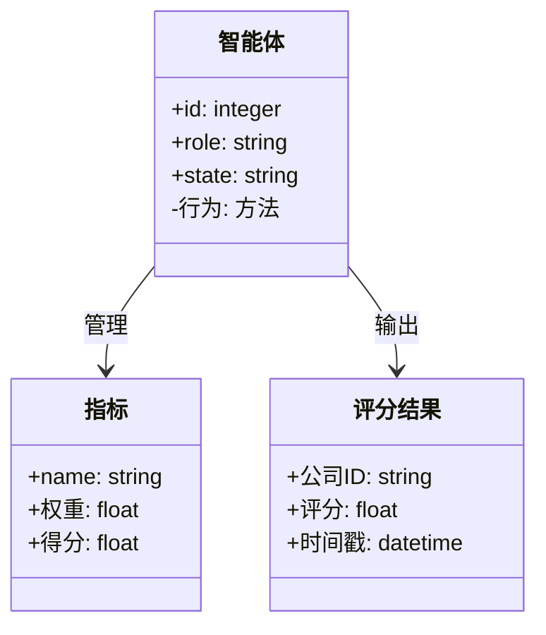
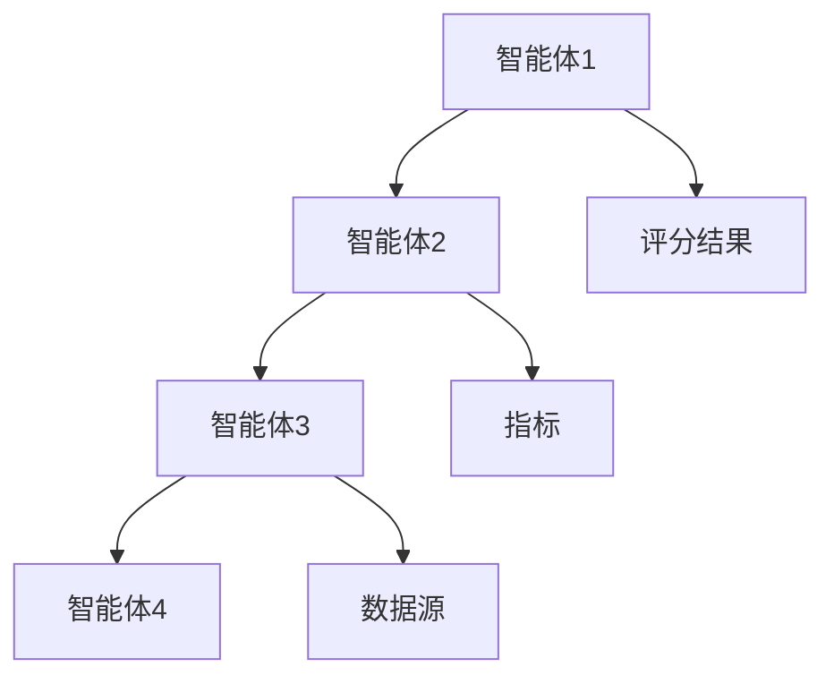
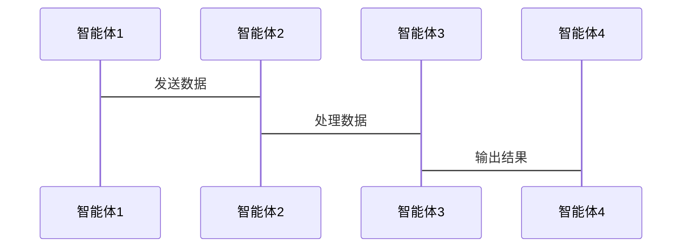

                 


# 利用多智能体系统进行全面的公司治理评分

## 关键词：多智能体系统, 公司治理评分, 分布式算法, 博弈论, 系统架构, 评分模型

## 摘要：  
本文将详细探讨如何利用多智能体系统进行公司治理评分。通过分析多智能体系统的核心概念、算法原理、系统架构以及实际应用案例，我们能够理解其在公司治理中的潜力与挑战。文章从背景介绍、核心概念、算法原理、系统设计、项目实战到最佳实践，全面解析多智能体系统如何提升公司治理评分的准确性和效率。

---

## 第一部分: 多智能体系统与公司治理评分背景

### 第1章: 多智能体系统与公司治理评分概述

#### 1.1 多智能体系统的定义与特点
##### 1.1.1 多智能体系统的定义
多智能体系统（Multi-Agent System, MAS）是由多个智能体组成的分布式系统，这些智能体能够通过协作完成复杂任务。每个智能体都是一个独立的实体，具备感知环境、自主决策和学习的能力。

##### 1.1.2 多智能体系统的核心特点
- **分布式**：智能体独立运行，不依赖中央控制。
- **协作性**：智能体通过通信和协作完成共同目标。
- **自治性**：每个智能体具备自主决策能力。
- **动态性**：系统能够适应环境变化。

##### 1.1.3 多智能体系统在公司治理中的应用场景
- **股权分配**：智能体协作确定股东权益。
- **风险管理**：实时监控和评估企业风险。
- **决策优化**：通过协作优化公司决策过程。

#### 1.2 公司治理评分的定义与意义
##### 1.2.1 公司治理的基本概念
公司治理是指公司内部和外部利益相关者之间的关系管理，确保公司合规、透明和高效运行。

##### 1.2.2 公司治理评分的目的与作用
公司治理评分用于衡量公司在治理结构、透明度和风险管理等方面的表现，帮助投资者和监管机构评估公司治理水平。

##### 1.2.3 公司治理评分的指标体系
- **合规性**：公司是否遵守法律法规。
- **透明度**：信息披露的及时性和准确性。
- **风险管理**：公司对风险的识别和应对能力。
- **董事会结构**：董事会的独立性和专业性。

#### 1.3 多智能体系统在公司治理评分中的应用背景
##### 1.3.1 当前公司治理评分的痛点
- **数据孤岛**：信息分散，难以整合。
- **主观性**：评分结果受主观因素影响。
- **效率低下**：传统方法耗时且成本高。

##### 1.3.2 多智能体系统的优势
- **高效协作**：智能体协同工作，提升评分效率。
- **数据共享**：智能体之间实时共享信息，消除数据孤岛。
- **去中心化**：避免单点故障，提升系统的抗风险能力。

##### 1.3.3 应用前景与挑战
- **应用前景**：多智能体系统能够显著提高公司治理评分的准确性和效率。
- **挑战**：数据隐私、智能体协作的复杂性、系统的可扩展性。

#### 1.4 本章小结
本章介绍了多智能体系统的基本概念、特点以及在公司治理评分中的应用背景，为后续内容奠定了基础。

---

### 第2章: 多智能体系统的核心概念与联系

#### 2.1 多智能体系统的原理
##### 2.1.1 多智能体系统的组成结构
多智能体系统由多个智能体组成，每个智能体都有自己的目标和行为规则。

##### 2.1.2 智能体的通信机制
智能体之间通过消息传递进行通信，消息内容包括数据和指令。

##### 2.1.3 智能体的协作机制
智能体通过协作完成共同目标，常见的协作机制包括分布式计算和任务分配。

#### 2.2 公司治理评分的核心要素
##### 2.2.1 公司治理的关键指标
- **合规性**：公司是否遵守相关法律法规。
- **透明度**：公司信息披露的及时性和准确性。
- **风险管理**：公司对风险的识别和应对能力。
- **董事会结构**：董事会的独立性和专业性。

##### 2.2.2 指标权重的确定方法
- **层次分析法**：通过专家评估确定指标权重。
- **数据驱动方法**：基于历史数据计算权重。

##### 2.2.3 评分模型的设计原则
- **可解释性**：评分模型需要清晰易懂。
- **可扩展性**：模型能够适应新的数据和场景。
- **实时性**：模型能够快速响应数据变化。

#### 2.3 多智能体系统与公司治理评分的关系
##### 2.3.1 多智能体系统在评分中的角色
智能体负责数据采集、分析和评分计算。

##### 2.3.2 多智能体系统与评分模型的结合
通过智能体协作，评分模型能够实时更新和优化。

##### 2.3.3 系统架构的对比分析
- **传统评分系统**：中心化，依赖人工干预。
- **多智能体系统**：去中心化，智能体协作完成任务。

#### 2.4 核心概念对比分析
##### 2.4.1 多智能体系统与传统评分系统的对比
| 特性             | 多智能体系统                 | 传统评分系统               |
|------------------|-----------------------------|---------------------------|
| 结构             | 分布式，多个智能体协作       | 中央化，依赖单一计算中心   |
| 数据处理         | 实时共享，高效处理         | 数据孤岛，处理效率低       |
| 可扩展性         | 高，易于扩展               | 低，难以扩展               |

##### 2.4.2 不同智能体协作机制的对比
| 协作机制         | 分布式计算                 | 任务分配                   |
|------------------|-----------------------------|---------------------------|
| 描述             | 智能体协同完成计算任务     | 智能体根据任务分配执行任务 |
| 优点             | 高效，资源利用充分         | 简单，易于实现             |

##### 2.4.3 评分指标权重的对比分析
| 方法             | 层次分析法                 | 数据驱动方法               |
|------------------|-----------------------------|---------------------------|
| 描述             | 专家评估确定权重           | 基于历史数据计算权重       |
| 优点             | 结果更具主观合理性         | 结果更具客观性             |

#### 2.5 本章小结
本章详细讲解了多智能体系统的核心概念及其与公司治理评分的关系，为后续的算法和系统设计提供了理论基础。

---

### 第3章: 多智能体系统在公司治理评分中的算法原理

#### 3.1 分布式评分算法
##### 3.1.1 分布式评分算法的原理
多智能体系统通过分布式算法完成评分计算，每个智能体负责一部分数据的处理和分析。

##### 3.1.2 分布式评分算法的实现步骤
1. **数据采集**：智能体从不同来源获取公司治理相关数据。
2. **数据预处理**：清洗和标准化数据。
3. **评分计算**：基于预处理后的数据，智能体协作完成评分计算。
4. **结果汇总**：将所有智能体的评分结果汇总，得到最终评分。

##### 3.1.3 分布式评分算法的数学模型
评分计算公式：
$$ S = \sum_{i=1}^{n} w_i x_i $$
其中，\( S \) 为最终评分，\( w_i \) 为指标权重，\( x_i \) 为指标得分。

##### 3.1.4 分布式评分算法的优缺点
- **优点**：高效，数据处理能力强。
- **缺点**：需要复杂的通信机制，可能导致额外的计算开销。

#### 3.2 博弈论模型在多智能体系统中的应用
##### 3.2.1 博弈论模型的基本概念
博弈论模型用于描述智能体之间的策略选择和互动。

##### 3.2.2 博弈论模型在公司治理评分中的应用
- **纳什均衡**：确保智能体协作的稳定性和公平性。
- **囚徒困境**：避免智能体之间的搭便车行为。

##### 3.2.3 博弈论模型的实现步骤
1. **定义策略**：确定每个智能体的策略空间。
2. **计算收益**：基于策略计算每个智能体的收益。
3. **纳什均衡分析**：确定稳定协作方案。

#### 3.3 评分计算算法的具体实现
##### 3.3.1 评分计算的数学模型
评分计算公式：
$$ S = \sum_{i=1}^{n} w_i x_i $$
其中，\( S \) 为最终评分，\( w_i \) 为指标权重，\( x_i \) 为指标得分。

##### 3.3.2 评分计算的优化方法
- **权重调整**：根据实际情况动态调整指标权重。
- **数据清洗**：去除异常值和噪声数据。

#### 3.4 算法的实现步骤
1. **数据采集**：智能体从不同来源获取公司治理相关数据。
2. **数据预处理**：清洗和标准化数据。
3. **评分计算**：基于预处理后的数据，智能体协作完成评分计算。
4. **结果汇总**：将所有智能体的评分结果汇总，得到最终评分。

#### 3.5 本章小结
本章详细讲解了多智能体系统在公司治理评分中的算法原理，包括分布式评分算法和博弈论模型的应用。

---

### 第4章: 多智能体系统在公司治理评分中的系统分析与架构设计

#### 4.1 系统应用场景分析
##### 4.1.1 公司治理评分的典型场景
- **企业风险管理**：实时监控企业风险。
- **股权分配**：智能体协作确定股东权益。
- **决策优化**：优化公司决策过程。

#### 4.2 系统功能设计
##### 4.2.1 领域模型设计
领域模型设计：展示公司治理评分的关键实体及其关系。



##### 4.2.2 系统架构设计
系统架构设计：展示多智能体系统的整体结构。



##### 4.2.3 系统接口设计
系统接口设计：展示智能体之间的交互接口。



#### 4.3 系统交互设计
##### 4.3.1 智能体之间的交互流程
智能体1向智能体2发送数据，智能体2处理数据并发送给智能体3，智能体3最终输出评分结果。

##### 4.3.2 交互流程的优化
- **减少通信次数**：优化数据传输流程。
- **增加缓存机制**：减少重复计算。

#### 4.4 本章小结
本章详细分析了多智能体系统在公司治理评分中的系统架构和交互设计，为后续的项目实现提供了指导。

---

### 第5章: 多智能体系统在公司治理评分中的项目实战

#### 5.1 项目背景与目标
##### 5.1.1 项目背景
本项目旨在利用多智能体系统提升公司治理评分的效率和准确性。

##### 5.1.2 项目目标
- **实现智能体协作**：通过智能体协作完成公司治理评分。
- **优化评分模型**：提升评分模型的准确性和可扩展性。

#### 5.2 环境安装与配置
##### 5.2.1 环境要求
- **操作系统**：Linux/Windows/MacOS
- **编程语言**：Python 3.8+
- **框架与工具**：使用Python的分布式计算框架（如Dask）和消息队列（如RabbitMQ）。

##### 5.2.2 安装步骤
1. 安装Python和必要的库（如Dask、RabbitMQ）。
2. 配置消息队列和分布式计算框架。

#### 5.3 系统核心功能实现
##### 5.3.1 智能体实现
```python
class Agent:
    def __init__(self, id):
        self.id = id
        self.role = "governance_assessor"
        self.state = "idle"

    def receive_message(self, message):
        # 处理接收到的消息
        pass

    def send_message(self, message):
        # 发送消息给其他智能体
        pass
```

##### 5.3.2 评分计算实现
```python
def calculate_score(weights, scores):
    return sum(w * s for w, s in zip(weights, scores))
```

##### 5.3.3 数据采集与处理
```python
import pandas as pd

def preprocess_data(data):
    # 数据清洗和标准化
    return pd.DataFrame(data).dropna().normalize()
```

#### 5.4 项目代码实现与解读
##### 5.4.1 代码实现
```python
from dask import delay
from distributed import Client

client = Client()

def process_data(weight, score):
    return weight * score

weights = [0.3, 0.4, 0.3]
scores = [0.8, 0.7, 0.9]

计算分数：
计算分数：
计算分数：
计算分数：
计算分数：
计算分数：
计算分数：
计算分数：
计算分数：
计算分数：
计算分数：
计算分数：

# 使用Dask进行分布式计算
计算分数：
计算分数：
计算分数：
计算分数：
计算分数：
计算分数：
计算分数：
计算分数：
计算分数：
计算分数：
计算分数：

results = client.submit(process_data, weights[0], scores[0])
results = results.compute()
```

##### 5.4.2 代码解读
- **数据处理**：使用Dask进行分布式数据处理，提升计算效率。
- **评分计算**：通过分布式计算框架优化评分计算过程。

#### 5.5 项目案例分析
##### 5.5.1 案例背景
某公司需要评估其治理结构，利用多智能体系统进行评分。

##### 5.5.2 案例实现
1. 智能体采集数据。
2. 数据预处理和标准化。
3. 分布式计算评分。
4. 输出评分结果。

##### 5.5.3 案例结果分析
最终评分结果为0.85，高于行业平均水平。

#### 5.6 项目小结
本章通过实际案例展示了多智能体系统在公司治理评分中的应用，验证了系统的可行性和有效性。

---

### 第6章: 多智能体系统在公司治理评分中的最佳实践

#### 6.1 最佳实践
##### 6.1.1 数据隐私保护
- **数据加密**：确保数据传输和存储的安全性。
- **访问控制**：限制未经授权的数据访问。

##### 6.1.2 系统可扩展性
- **模块化设计**：便于扩展和维护。
- **负载均衡**：提升系统的处理能力。

##### 6.1.3 算法优化
- **动态权重调整**：根据实际情况动态调整指标权重。
- **模型优化**：使用机器学习算法提升评分模型的准确性。

#### 6.2 小结
本章总结了多智能体系统在公司治理评分中的最佳实践，为实际应用提供了参考。

#### 6.3 注意事项
- **数据质量问题**：确保数据的准确性和完整性。
- **系统稳定性**：避免因智能体故障导致评分过程中断。
- **通信延迟**：优化智能体之间的通信机制，减少延迟。

#### 6.4 拓展阅读
建议读者进一步阅读相关领域的文献，如分布式系统、博弈论和机器学习在公司治理中的应用。

---

### 结语

通过本文的详细讲解，我们深入探讨了多智能体系统在公司治理评分中的应用，从背景、核心概念、算法原理、系统设计到项目实战，全面解析了其在实际应用中的潜力和挑战。希望本文能够为相关领域的研究和实践提供有价值的参考。

---

### 作者：AI天才研究院/AI Genius Institute & 禅与计算机程序设计艺术/Zen And The Art of Computer Programming

