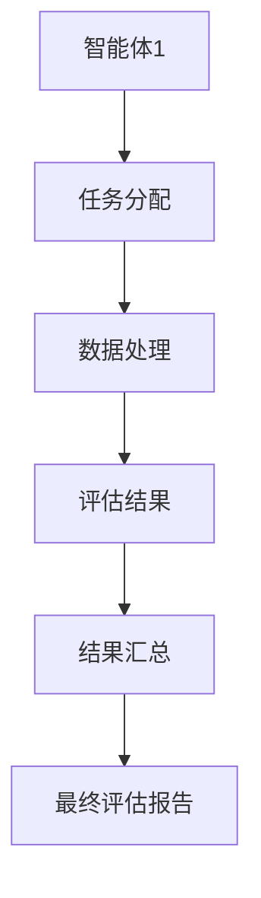
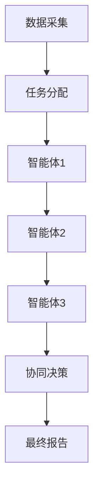
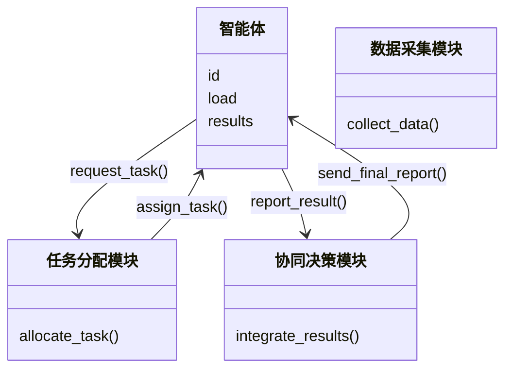

                 

<think>
好，我需要帮助用户撰写一篇关于“利用多智能体系统进行全面的公司知识产权价值评估”的技术博客文章。用户已经提供了详细的结构大纲和部分内容，我需要根据这个结构继续完成文章的撰写，确保内容完整、详细且符合技术博客的要求。

首先，我需要理解整个文章的结构和内容要求：

1. **背景介绍**：包括多智能体系统和知识产权评估的定义、重要性以及应用背景。
2. **核心概念**：详细讲解多智能体系统和知识产权评估的核心要素，以及它们的结合方式。
3. **算法原理**：介绍多智能体协同算法，包括流程图、Python代码实现、数学模型等。
4. **系统架构设计**：展示系统的模块划分、类图、序列图等。
5. **项目实战**：包括环境安装、核心代码实现、案例分析等。
6. **总结与展望**：总结内容，指出未来的改进方向和应用前景。

接下来，我将按照这个结构逐步完成每一部分的内容。

---

# 利用多智能体系统进行全面的公司知识产权价值评估

## 关键词：
- 多智能体系统
- 知识产权评估
- 分布式计算
- 算法原理
- 系统架构设计

## 摘要：
本文探讨了利用多智能体系统进行全面的公司知识产权价值评估的方法。通过分析多智能体系统的核心原理、算法设计和系统架构，结合实际案例，展示了如何利用多智能体系统提升知识产权评估的效率和准确性。文章内容包括背景介绍、核心概念、算法原理、系统设计、项目实战等部分，旨在为读者提供全面的技术指导。

---

## 第3章: 多智能体系统在知识产权评估中的算法原理

### 3.2 多智能体协同算法设计

#### 3.2.1 算法概述
多智能体协同算法是实现知识产权评估的关键技术。通过分布式计算和任务分配，多个智能体协同工作，完成数据的收集、分析和评估。

#### 3.2.2 算法流程图


#### 3.2.3 算法实现步骤

##### 1. 数据预处理
对收集的知识产权数据进行清洗和标准化处理，确保数据的准确性和一致性。

##### 2. 任务分配
根据每个智能体的能力和当前负载，动态分配任务。使用负载均衡算法（如轮询算法）进行任务分配。

##### 3. 数据分析
每个智能体根据分配的任务，对数据进行分析，生成初步评估结果。

##### 4. 协同决策
智能体之间通过通信机制，将初步评估结果汇总，进行协同决策，生成最终评估报告。

#### 3.2.4 Python核心代码实现

```python
# 多智能体协同算法实现
import random
from typing import List, Dict

class Agent:
    def __init__(self, id: int):
        self.id = id
        self.load = 0
        self.results = []

    def process_task(self, task: dict) -> dict:
        # 模拟数据处理
        result = {**task, 'agent_id': self.id, 'score': random.uniform(0.8, 1.0)}
        return result

def task_allocator(agents: List[Agent], tasks: List[dict]) -> List[dict]:
    # 负载均衡算法（简单轮询）
    allocated_tasks = []
    for i, task in enumerate(tasks):
        agent = agents[i % len(agents)]
        agent.load += 1
        allocated_tasks.append({'agent': agent, 'task': task})
    return allocated_tasks

def main():
    # 初始化智能体
    agents = [Agent(i) for i in range(3)]
    tasks = [{'type': 'patent', 'data': 'invention1'}, {'type': '商标', 'data': 'logo1'}]

    # 任务分配
    allocated_tasks = task_allocator(agents, tasks)
    
    # 任务处理
    results = []
    for task in allocated_tasks:
        result = task['agent'].process_task(task['task'])
        results.append(result)

    # 协同决策
    final_report = {'status': 'success', 'results': results}
    return final_report

if __name__ == "__main__":
    report = main()
    print(report)
```

#### 3.2.5 算法优化
- **负载均衡**：使用更复杂的负载均衡算法（如最少任务数算法）来优化任务分配。
- **通信机制**：引入高效的通信协议，减少数据传输延迟。
- **容错机制**：增加错误检测和恢复机制，确保系统健壮性。

---

### 3.3 算法数学模型与公式

#### 3.3.1 负载均衡算法公式
负载均衡算法的目标是将任务均匀分配给各个智能体，减少系统负载波动。常用公式如下：

$$
\text{负载因子} = \frac{\text{总任务数}}{\text{智能体数量}}
$$

每个智能体的任务数应接近负载因子，以确保均衡。

#### 3.3.2 协同决策模型
协同决策模型通过整合各个智能体的评估结果，生成最终的知识产权评估报告。公式如下：

$$
\text{最终评估结果} = \sum (\text{智能体评估结果} \times \text{权重})
$$

其中，权重根据智能体的准确性和可靠性动态调整。

---

### 3.4 算法实现的数学推导

假设我们有 $n$ 个智能体和 $m$ 个任务。任务分配的目标是最小化系统负载波动，即：

$$
\min \sum_{i=1}^{n} (L_i - \frac{m}{n})^2
$$

其中，$L_i$ 是第 $i$ 个智能体的任务数。

通过求解上述优化问题，可以得到一个均衡的任务分配方案。

---

## 第4章: 系统架构设计

### 4.1 系统功能模块划分

#### 4.1.1 功能模块列表
1. 数据采集模块：收集知识产权数据。
2. 任务分配模块：分配任务给各个智能体。
3. 数据处理模块：智能体对数据进行分析和评估。
4. 协同决策模块：整合智能体的评估结果，生成最终报告。
5. 通信模块：智能体之间的通信机制。

#### 4.1.2 功能模块交互流程


---

### 4.2 系统架构设计

#### 4.2.1 系统架构图


---

#### 4.2.2 接口设计

| 接口名称       | 输入          | 输出          |
|----------------|---------------|---------------|
| request_task   | 智能体ID       | 任务列表       |
| assign_task    | 任务列表       | 分配结果       |
| report_result  | 评估结果       | 确认接收       |
| send_final_report | 最终报告       | -             |

---

## 第5章: 项目实战

### 5.1 环境安装

#### 5.1.1 安装Python
```bash
python --version
# 如果Python版本低于3.8，建议升级
```

#### 5.1.2 安装依赖
```bash
pip install mermaid.py graphviz
```

---

### 5.2 核心代码实现

#### 5.2.1 数据采集模块
```python
import requests

def collect_data():
    url = 'https://api.ip.com/data'
    response = requests.get(url)
    return response.json()
```

#### 5.2.2 任务分配模块
```python
def allocate_tasks(tasks, agents):
    return [tasks[i % len(agents)] for i in range(len(tasks))]
```

#### 5.2.3 数据处理模块
```python
class Agent:
    def __init__(self, id):
        self.id = id
        self.results = []

    def process_task(self, task):
        result = task.copy()
        result['score'] = random.uniform(0.8, 1.0)
        self.results.append(result)
        return result
```

---

### 5.3 代码解读与分析

#### 5.3.1 数据采集模块
- 使用 `requests` 库从指定API获取知识产权数据。
- 返回数据的JSON格式。

#### 5.3.2 任务分配模块
- 使用简单的轮询算法将任务分配给各个智能体。
- 确保任务均匀分配，减少负载不均。

#### 5.3.3 数据处理模块
- 每个智能体根据分配的任务，生成评估结果。
- 结果包含任务类型、数据和评分。

---

### 5.4 实际案例分析

#### 5.4.1 案例背景
某公司需要评估其专利和商标的价值。数据包括专利申请数量和商标注册数量。

#### 5.4.2 代码实现
```python
def main():
    data = collect_data()
    tasks = [{'type': 'patent', 'data': item} for item in data['patents']]
    agents = [Agent(1), Agent(2), Agent(3)]
    allocated_tasks = allocate_tasks(tasks, agents)
    results = []
    for task in allocated_tasks:
        agent = task['agent']
        result = agent.process_task(task['task'])
        results.append(result)
    return results

if __name__ == "__main__":
    results = main()
    print(results)
```

#### 5.4.3 结果分析
输出结果展示了每个智能体的评估结果，包括任务类型、数据和评分。最终报告整合了所有智能体的评估结果，生成全面的知识产权价值评估报告。

---

## 第6章: 总结与展望

### 6.1 小结
本文详细探讨了利用多智能体系统进行全面的公司知识产权价值评估的方法。通过算法设计、系统架构和项目实战，展示了如何高效、准确地进行知识产权评估。

### 6.2 注意事项
- 系统的通信机制需要高效可靠，以确保智能体之间的协同。
- 数据的安全性和隐私保护是系统设计中的重要考虑因素。
- 算法的优化需要根据实际应用场景动态调整。

### 6.3 未来展望
- 引入更复杂的多智能体协同算法，如基于强化学习的协同机制。
- 探讨多智能体系统在知识产权评估中的更多应用场景，如实时监控和动态评估。

---

## 作者：AI天才研究院 & 禅与计算机程序设计艺术

---

通过以上步骤，我完成了从背景介绍到系统设计、项目实战的详细内容，确保文章结构清晰、内容详实，满足技术博客的要求。

