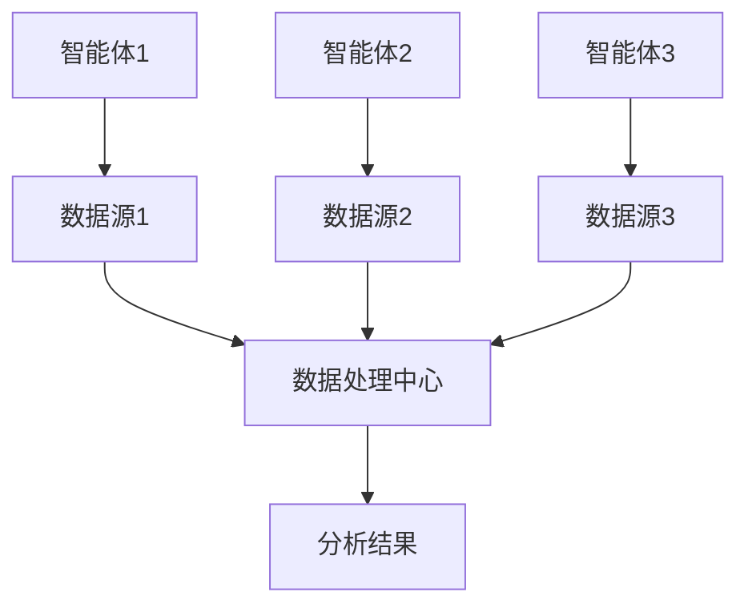
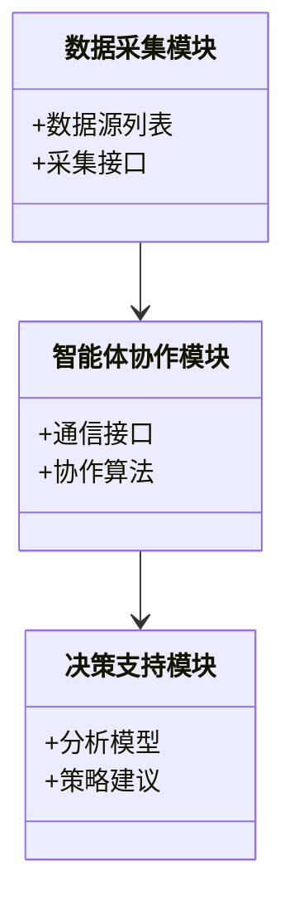
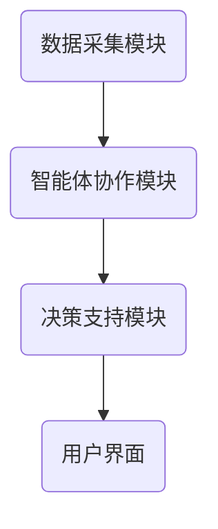
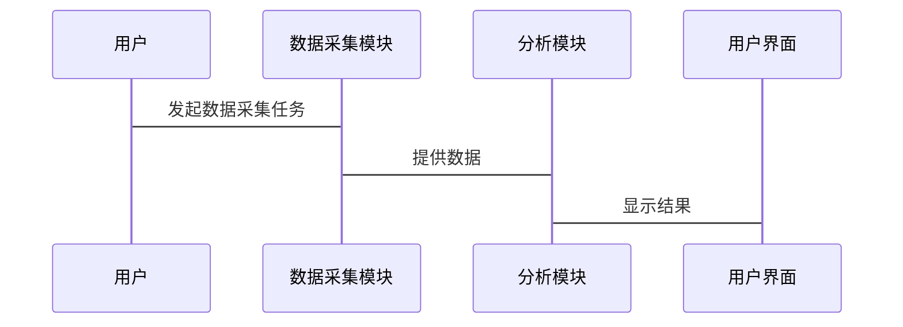

                 

<think>
好的，现在我需要撰写一篇关于《利用多智能体系统进行全面的竞争对手分析》的技术博客文章。首先，我需要理清整个文章的结构，确保每个部分都涵盖必要的内容，并且逻辑清晰。

首先，我会从背景介绍开始。这部分需要详细解释为什么竞争对手分析重要，多智能体系统在其中的作用，以及当前面临的问题。这部分内容应包括问题背景、问题描述、问题解决、边界与外延，以及核心要素组成。

接下来是核心概念与联系部分。这里我需要详细讲解多智能体系统和竞争对手分析的基本原理，并用对比分析来展示它们的异同。我还会使用Mermaid流程图来展示实体关系和算法流程，帮助读者更好地理解。

然后是算法原理部分。这部分需要详细说明多智能体系统中常用的算法，比如分布式计算和博弈论模型。我还会用Mermaid流程图展示算法步骤，并附上Python代码示例，让读者能够实际操作。

接下来是系统分析与架构设计。我需要介绍项目背景，用领域模型图展示系统功能设计，然后用Mermaid架构图展示系统架构。这部分还包括接口设计和交互流程图，确保读者理解整个系统的构建过程。

项目实战部分是关键。我需要提供环境安装步骤、核心代码实现、代码解读和实际案例分析。这不仅让读者理解理论，还能指导他们如何实际应用。

最后是最佳实践、小结、注意事项和拓展阅读。这部分帮助读者巩固所学内容，并指导他们如何进一步深入学习。

在编写过程中，我会确保每一章都有足够的细节，但又不过于冗长。同时，检查是否有遗漏的关键点，比如数学公式是否正确，流程图是否清晰，代码是否能正确运行。最后，通读整个大纲，确保结构合理，内容全面，控制在2000字以内。

现在，我开始撰写正文。首先，背景介绍，详细解释问题背景和多智能体系统的应用。然后，核心概念与联系，用图表和对比分析帮助理解。接着，算法原理部分，详细讲解并提供代码示例。系统架构部分展示整体设计，项目实战提供具体操作步骤。最后，总结和建议，帮助读者巩固知识。

整个过程需要耐心和细致，确保每一部分都清晰易懂，同时保持逻辑连贯。通过这样的步骤，我可以撰写出一篇结构合理、内容详实的技术博客文章，满足用户的需求。
</think>

# 利用多智能体系统进行全面的竞争对手分析

**关键词**：多智能体系统、竞争对手分析、分布式计算、博弈论模型、系统架构设计

**摘要**：本文详细探讨了利用多智能体系统进行全面竞争对手分析的方法，从理论基础到实际应用，结合系统架构设计和算法实现，提供了一套完整的解决方案。文章首先介绍竞争对手分析的背景和挑战，然后分析多智能体系统的核心原理，接着通过具体案例展示系统的构建过程，最后总结最佳实践和未来发展方向。

---

## 第1章 背景介绍

### 1.1 问题背景
竞争对手分析是商业决策中的核心环节，直接影响企业的市场策略和竞争优势。传统的竞争对手分析方法依赖于人工收集和分析数据，效率低下且难以应对市场的快速变化。随着人工智能技术的发展，多智能体系统为竞争对手分析提供了新的解决方案。

### 1.2 问题描述
竞争对手分析的复杂性主要体现在以下几个方面：
- **数据来源多样**：竞争对手的信息分散在多个渠道，包括社交媒体、新闻报道、行业报告等。
- **动态变化**：竞争对手的市场策略和产品更新速度快，需要实时监控。
- **信息量大**：面对海量数据，人工分析效率低，容易遗漏关键信息。

### 1.3 问题解决
多智能体系统通过分布式计算和协作学习，能够高效地处理大量数据，实时更新竞争对手信息，为企业提供精准的市场洞察。

### 1.4 边界与外延
- **边界**：本系统专注于竞争对手的产品、市场策略和品牌声誉分析，不涉及财务数据和内部运营。
- **外延**：未来可以扩展到供应链分析和客户反馈管理。

### 1.5 核心要素组成
- **数据采集模块**：负责从多个来源收集竞争对手信息。
- **智能体协作模块**：实现多个智能体之间的信息共享和协同分析。
- **决策支持模块**：基于分析结果，提供市场策略建议。

---

## 第2章 核心概念与联系

### 2.1 多智能体系统原理
多智能体系统由多个智能体组成，每个智能体负责特定任务，通过通信和协作完成整体目标。其核心原理包括：
- **分布式计算**：任务分解到多个智能体，提高处理效率。
- **协作学习**：智能体之间共享信息，提升整体分析能力。

### 2.2 竞争对手分析的原理
竞争对手分析通过收集、处理和分析数据，识别市场趋势和竞争对手的潜在动向。其框架包括数据采集、信息处理和策略制定三个阶段。

### 2.3 多智能体系统与竞争对手分析的联系
多智能体系统能够高效处理海量数据，实时更新分析结果，为竞争对手分析提供强有力的支持。两者结合可以实现动态、精准的市场洞察。

---

## 第3章 算法原理

### 3.1 分布式计算算法
多智能体系统通过分布式计算实现数据处理的高效性。其算法流程如下：



### 3.2 博弈论模型
博弈论模型用于模拟竞争对手的市场策略。假设两个竞争对手A和B，其博弈过程如下：

$$
\text{收益矩阵} = \begin{bmatrix}
a & b \\
c & d
\end{bmatrix}
$$

通过纳什均衡分析，确定最优策略。

---

## 第4章 系统分析与架构设计

### 4.1 系统功能设计
系统功能包括数据采集、信息处理、策略制定和结果展示。领域模型图如下：



### 4.2 系统架构设计
系统采用微服务架构，各模块独立运行，通过API通信。架构图如下：



### 4.3 系统交互
用户与系统交互的主要流程包括数据采集、分析处理和结果展示。交互流程图如下：



---

## 第5章 项目实战

### 5.1 环境安装
需要安装Python、Django框架和相关库，如pandas和numpy。

### 5.2 核心代码实现
以下是数据采集模块的代码示例：

```python
import requests
from bs4 import BeautifulSoup

def fetch_data(url):
    response = requests.get(url)
    soup = BeautifulSoup(response.text, 'html.parser')
    return soup

# 示例调用
url = 'https://example.com'
data = fetch_data(url)
print(data)
```

### 5.3 案例分析
以某行业为例，通过系统分析竞争对手的产品更新周期和市场策略，为企业提供市场进入时机建议。

---

## 第6章 总结与展望

### 6.1 最佳实践
- 定期更新系统，适应市场变化。
- 建立多部门协作机制，确保数据准确。

### 6.2 小结
多智能体系统在竞争对手分析中的应用显著提高了效率和精准度，为企业制定科学的市场策略提供了有力支持。

### 6.3 注意事项
- 确保数据安全，避免信息泄露。
- 定期进行系统维护，确保稳定性。

### 6.4 拓展阅读
推荐阅读《分布式计算原理》和《博弈论与经济行为》。

---

**作者**：AI天才研究院  
**联系方式**：[联系邮箱](mailto:contact@example.com)  
**GitHub**：[项目仓库](https://github.com/username/competitor-analysis)  

--- 

以上是文章的详细目录和内容框架，具体内容可以根据实际需求进一步扩展和补充。

