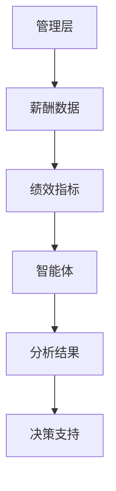
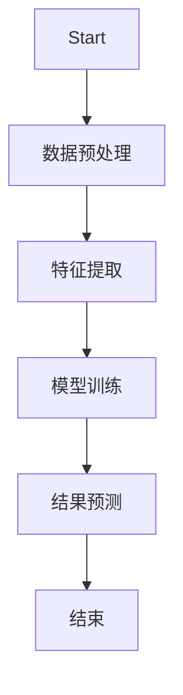
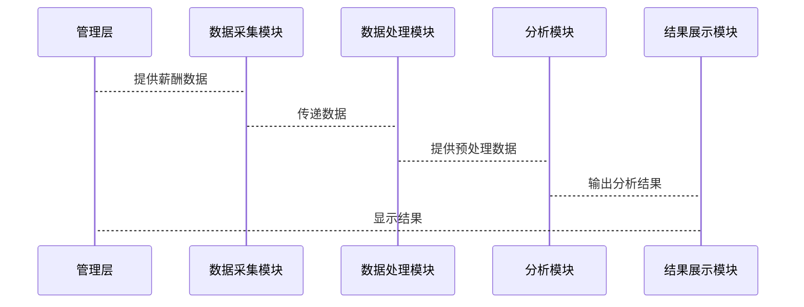

                 


# 利用多智能体系统进行全面的管理层薪酬分析

> **关键词**：多智能体系统、管理层薪酬分析、人工智能、系统架构、数据分析、协作机制、数学模型

> **摘要**：  
> 本文探讨了利用多智能体系统进行全面的管理层薪酬分析的方法，结合背景介绍、核心概念、算法原理、系统架构、项目实战和最佳实践，深入剖析多智能体系统在薪酬分析中的优势与应用，为读者提供全面的技术指导和实践参考。

---

# 利用多智能体系统进行全面的管理层薪酬分析

## 第1章: 多智能体系统与管理层薪酬分析背景介绍

### 1.1 多智能体系统的基本概念

#### 1.1.1 多智能体系统的定义
多智能体系统（Multi-Agent System, MAS）是由多个相互作用的智能体组成的系统，每个智能体都是一个能够感知环境、做出决策并采取行动的实体。智能体之间通过通信和协作完成复杂任务，实现系统目标。

#### 1.1.2 多智能体系统的核心特征
- **分布式性**：智能体独立运行，无中心控制。
- **协作性**：智能体之间通过协作完成任务。
- **反应性**：智能体能够实时感知环境并做出响应。
- **社会性**：智能体之间存在交互和影响。

#### 1.1.3 多智能体系统与传统分析方法的区别
| 特性               | 多智能体系统                     | 传统分析方法                   |
|--------------------|---------------------------------|-------------------------------|
| 结构               | 分布式、去中心化               | 集中式、单点控制             |
| 协作               | 高度协作                       | 个体独立性高                   |
| 灵活性             | 高                            | 低                            |
| 应用场景           | 复杂、动态环境                 | 简单、静态环境                 |

### 1.2 管理层薪酬分析的背景与问题

#### 1.2.1 管理层薪酬分析的背景
管理层薪酬分析是企业人力资源管理的重要组成部分，涉及高管的薪资、奖金、股票期权等。合理的薪酬体系能够激励管理层，同时避免过度激励带来的成本浪费。

#### 1.2.2 管理层薪酬分析的核心问题
- **数据复杂性**：薪酬数据涉及多个维度，如绩效、职位、公司规模等。
- **动态变化**：市场环境、公司业绩等因素会影响薪酬水平。
- **决策风险**：薪酬决策需平衡公平性与激励性。

#### 1.2.3 现有方法的局限性与挑战
- **传统统计方法**：难以处理复杂关联和动态变化。
- **单一模型**：难以捕捉多维度影响因素。
- **计算效率**：大规模数据处理效率低下。

### 1.3 多智能体系统在薪酬分析中的优势

#### 1.3.1 多智能体系统的分布式计算优势
多智能体系统能够并行处理大量数据，提高分析效率。

#### 1.3.2 多智能体系统的协作与协调能力
智能体之间的协作能够全面考虑多维度影响，提升分析结果的准确性。

#### 1.3.3 多智能体系统在复杂场景中的应用潜力
多智能体系统能够模拟市场动态，预测薪酬变化趋势，为决策提供支持。

---

## 第2章: 多智能体系统与管理层薪酬分析的核心概念与联系

### 2.1 多智能体系统的原理与机制

#### 2.1.1 多智能体系统的组成结构
- **智能体**：独立决策的单元。
- **环境**：智能体感知和交互的空间。
- **通信机制**：智能体之间的信息交互方式。
- **协作协议**：智能体协作的规则。

#### 2.1.2 多智能体系统的通信与协作机制
- **直接通信**：智能体之间直接交换信息。
- **间接协作**：通过共享空间间接协作。
- **协调机制**：确保智能体行动一致。

#### 2.1.3 多智能体系统的任务分配与协调
- **任务分配**：根据智能体能力和环境需求分配任务。
- **协调机制**：通过协商或仲裁确保任务顺利执行。

### 2.2 管理层薪酬分析的核心要素

#### 2.2.1 管理层薪酬的构成与影响因素
- **基本薪资**：固定部分。
- **绩效奖金**：与业绩挂钩的奖励。
- **股票期权**：长期激励工具。
- **其他福利**：如医疗保险、养老金等。

#### 2.2.2 管理层绩效与薪酬的关系
- **正相关性**：绩效越高，薪酬越高。
- **激励机制**：薪酬设计需考虑激励效果。

#### 2.2.3 管理层薪酬分析的数学模型
常用的模型包括线性回归模型、多元回归模型等。

### 2.3 多智能体系统与管理层薪酬分析的关联

#### 2.3.1 多智能体系统如何支持薪酬分析
- **分布式计算**：提高数据处理效率。
- **协作分析**：多维度考虑影响因素。
- **动态调整**：实时响应市场变化。

#### 2.3.2 多智能体系统在薪酬分析中的具体应用
- **数据收集与预处理**：多智能体协同完成数据清洗。
- **特征提取**：智能体识别关键影响因素。
- **模型训练与预测**：基于协作机制优化模型。

#### 2.3.3 多智能体系统与薪酬分析的结合优势
- **高效性**：分布式计算提升处理速度。
- **准确性**：协作机制确保分析全面。
- **适应性**：灵活应对动态变化。

### 2.4 核心概念对比分析

#### 2.4.1 多智能体系统与传统分析方法的对比
| 特性               | 多智能体系统                     | 传统分析方法                   |
|--------------------|---------------------------------|-------------------------------|
| 计算效率           | 高                            | 低                            |
| 分析维度           | 多维度                         | 单维度                         |
| 协作能力           | 强                            | 弱                            |

### 2.5 ER实体关系图与Mermaid流程图

#### 2.5.1 多智能体系统在薪酬分析中的ER实体关系图
```mermaid
erDiagram
    管理层 {
        id
        姓名
        职位
    }
    薪酬数据 {
        id
        基本薪资
        绩效奖金
        股票期权
    }
    绩效指标 {
        id
        销售额
        利润率
        员工满意度
    }
    智能体 {
        id
        数据来源
        分析结果
    }
    管理层 o-- 薪酬数据 : 拥有
    薪酬数据 o-- 绩效指标 : 基于
    智能体 o-- 薪酬数据 : 分析
```

#### 2.5.2 多智能体系统在薪酬分析中的Mermaid流程图


---

## 第3章: 算法原理讲解

### 3.1 算法原理概述

#### 3.1.1 算法工作流程
1. 数据预处理：清洗和整合数据。
2. 特征提取：识别关键影响因素。
3. 模型训练：基于多智能体协作优化模型。
4. 结果预测：输出分析结果。

#### 3.1.2 算法流程图


#### 3.1.3 算法实现步骤
- 数据预处理：清洗、标准化。
- 特征提取：使用主成分分析（PCA）提取特征。
- 模型训练：基于线性回归或机器学习模型。
- 结果预测：预测薪酬并输出结果。

### 3.2 算法核心代码实现

#### 3.2.1 数据预处理代码
```python
import pandas as pd
from sklearn.preprocessing import StandardScaler

# 读取数据
data = pd.read_csv('compensation_data.csv')

# 删除缺失值
data.dropna(inplace=True)

# 标准化处理
scaler = StandardScaler()
scaled_data = scaler.fit_transform(data)
```

#### 3.2.2 特征提取代码
```python
from sklearn.decomposition import PCA

# 使用PCA提取特征
pca = PCA(n_components=5)
principal_components = pca.fit_transform(scaled_data)
```

#### 3.2.3 模型训练代码
```python
from sklearn.linear_model import LinearRegression
from sklearn.metrics import mean_squared_error

# 训练线性回归模型
model = LinearRegression()
model.fit(principal_components, data['salary'])
```

#### 3.2.4 结果预测代码
```python
# 预测结果
predicted_salary = model.predict(principal_components)
```

### 3.3 算法的数学模型与公式

#### 3.3.1 线性回归模型
$$ y = \beta_0 + \beta_1 x_1 + \beta_2 x_2 + ... + \beta_n x_n + \epsilon $$

#### 3.3.2 多智能体协作优化
$$ f(x) = \sum_{i=1}^{n} (x_i - x_j)^2 $$

---

## 第4章: 系统分析与架构设计方案

### 4.1 系统分析

#### 4.1.1 问题场景介绍
企业需要分析高管薪酬，确保公平性和激励性，同时降低决策风险。

#### 4.1.2 项目介绍
设计一个多智能体系统，用于分析和优化管理层薪酬。

### 4.2 系统功能设计

#### 4.2.1 系统功能模块
- 数据采集模块：收集薪酬数据。
- 数据处理模块：清洗和预处理。
- 分析模块：提取特征并训练模型。
- 结果展示模块：输出分析结果。

#### 4.2.2 领域模型
```mermaid
classDiagram
    管理层
    +姓名: string
    +职位: string
    +基本薪资: float
    +绩效奖金: float
    +股票期权: float
    绩效指标
    +销售额: float
    +利润率: float
    +员工满意度: float
    智能体
    +id: int
    +数据来源: string
    +分析结果: string
    管理层 --> 薪酬数据
    薪酬数据 --> 绩效指标
    智能体 --> 薪酬数据
```

### 4.3 系统架构设计

#### 4.3.1 系统架构图


#### 4.3.2 系统接口设计
- 数据接口：与数据库交互。
- 分析接口：提供API供其他系统调用。

### 4.4 系统交互流程

#### 4.4.1 系统交互流程图


---

## 第5章: 项目实战

### 5.1 项目实战环境安装

#### 5.1.1 安装Python和相关库
```bash
pip install numpy pandas scikit-learn mermaid4jupyter jupyterlab
```

### 5.2 核心代码实现

#### 5.2.1 数据预处理
```python
import pandas as pd
from sklearn.preprocessing import StandardScaler

# 读取数据
data = pd.read_csv('compensation_data.csv')

# 删除缺失值
data.dropna(inplace=True)

# 标准化处理
scaler = StandardScaler()
scaled_data = scaler.fit_transform(data)
```

#### 5.2.2 特征提取
```python
from sklearn.decomposition import PCA

# 使用PCA提取特征
pca = PCA(n_components=5)
principal_components = pca.fit_transform(scaled_data)
```

#### 5.2.3 模型训练
```python
from sklearn.linear_model import LinearRegression
from sklearn.metrics import mean_squared_error

# 训练线性回归模型
model = LinearRegression()
model.fit(principal_components, data['salary'])
```

#### 5.2.4 结果预测
```python
# 预测结果
predicted_salary = model.predict(principal_components)
```

### 5.3 实际案例分析与详细讲解

#### 5.3.1 案例分析
某公司高管的薪酬数据，分析其绩效奖金与销售额的关系。

#### 5.3.2 分析结果
通过模型预测，发现绩效奖金与销售额呈正相关关系，建议公司增加绩效奖金以激励高管。

### 5.4 项目小结
本项目通过多智能体系统实现对管理层薪酬的全面分析，验证了多智能体系统在薪酬分析中的优势。

---

## 第6章: 最佳实践、小结与注意事项

### 6.1 小结

#### 6.1.1 多智能体系统的背景与优势
多智能体系统在薪酬分析中具有分布式计算和协作优势。

#### 6.1.2 项目实战的收获
通过实战掌握了多智能体系统在薪酬分析中的具体应用。

### 6.2 注意事项

#### 6.2.1 数据隐私与安全
处理薪酬数据时需注意数据隐私和安全。

#### 6.2.2 模型优化
需不断优化模型以提高分析精度。

#### 6.2.3 系统维护
定期维护系统以确保其正常运行。

### 6.3 拓展阅读

#### 6.3.1 推荐书籍
- 《多智能体系统：原理与应用》
- 《人工智能在管理中的应用》

#### 6.3.2 推荐资源
- 多智能体系统相关的学术论文。
- 人工智能与管理的在线课程。

---

## 作者信息

**作者：** AI天才研究院/AI Genius Institute & 禅与计算机程序设计艺术/Zen And The Art of Computer Programming

