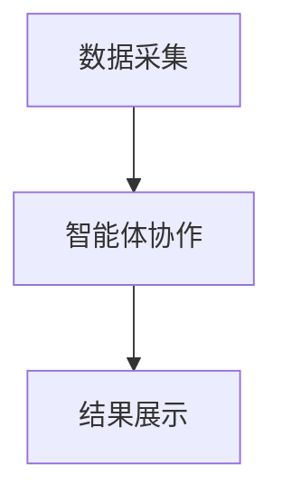

                 

<think>
嗯，我现在要写一篇关于《利用多智能体系统进行全面的股东结构分析》的技术博客。首先，我得理解什么是多智能体系统，它和传统的分析方法有什么不同。多智能体系统是由多个智能体协作完成任务的系统，每个智能体都有自己的目标和功能。对于股东结构分析，这可能涉及到识别复杂的股权关系，比如交叉持股、隐名股东等。

接下来，我需要确定文章的结构。用户已经给了一个大纲，我得按照那个来写。首先是摘要，然后是关键词，接着是各个章节。在背景介绍部分，我得解释为什么传统方法在处理股东结构分析时有局限性，而多智能体系统如何解决这些问题。

在核心概念部分，我需要详细说明多智能体系统的定义、特点，以及股东结构分析的具体内容。可能要用表格对比多智能体系统和传统方法，帮助读者理解。

然后是算法部分，我得解释多智能体协同算法的工作流程，包括数据预处理、智能体协同、结果整合等步骤。这里可能需要画个流程图，用Mermaid的话会比较清晰。同时，数学模型和公式也要详细说明，比如信息融合的公式，可能需要使用Latex来表示。

系统架构设计部分，我需要展示系统的功能模块，比如数据采集、智能体协作、结果展示等。用类图和架构图来展示各个模块之间的关系，还有接口设计和交互流程。

项目实战部分，我需要提供一个实际的案例，比如分析一个复杂公司的股东结构。给出环境安装步骤，比如安装Python和必要的库，然后写代码实现数据爬取、智能体协作和结果可视化。这部分代码要详细，最好能有注释，让读者跟着操作。

最后，最佳实践部分，我得总结一下多智能体系统的优势，提醒读者在实际应用中注意数据隐私和计算资源的问题。还要推荐一些相关的工具和技术，比如图数据库和分布式计算框架。

在写作过程中，我得确保每个部分都详细且易于理解，避免使用过于专业的术语，但又不失专业性。每个章节都要有小结，帮助读者回顾主要内容。可能需要多次修改，确保逻辑清晰，内容连贯。

总的来说，我需要按照用户的要求，一步步构建内容，确保每个部分都覆盖到，同时保持文章的深度和可读性。现在，我得开始按照这个思路撰写正文了。
</think>

# 利用多智能体系统进行全面的股东结构分析

> 关键词：多智能体系统、股东结构分析、分布式计算、智能体协同、股权关系图谱

> 摘要：本文通过介绍多智能体系统的核心概念、算法原理、系统架构和项目实战，详细讲解如何利用多智能体系统进行全面的股东结构分析。从背景介绍到系统实现，从案例分析到最佳实践，全面阐述多智能体系统在处理复杂股东结构中的优势和应用。

---

## 第一部分: 多智能体系统与股东结构分析背景

### 第1章: 多智能体系统概述

#### 1.1 多智能体系统的定义与特点

多智能体系统（Multi-Agent System, MAS）是由多个智能体（Agent）组成的分布式系统，这些智能体能够通过协作完成复杂任务。与传统的单体系统相比，多智能体系统具有以下特点：

- **分布式计算**：多个智能体独立运行，协同完成任务。
- **自主性**：每个智能体具有自主决策能力。
- **协作性**：智能体之间通过通信和协作解决问题。
- **适应性**：能够动态调整策略以应对环境变化。

#### 1.2 股东结构分析的重要性

股东结构分析是企业治理中的关键环节，涉及识别股东之间的股权关系、控制权分析等。传统方法在处理复杂结构时效率低下，容易遗漏隐名股东或交叉持股关系。多智能体系统通过分布式计算和协作，能够高效处理大规模数据，揭示复杂的股权关系。

### 第2章: 多智能体系统在股东结构分析中的应用背景

#### 2.1 传统股东结构分析的局限性

传统方法在处理股东结构分析时面临以下问题：

- **数据处理效率低**：面对海量数据时，传统方法难以快速处理。
- **复杂关系难以识别**：复杂的股权关系容易被忽略。
- **动态变化难以追踪**：企业结构的动态变化难以实时捕捉。

#### 2.2 多智能体系统的优势

多智能体系统在股东结构分析中的优势包括：

- **高效分布式计算**：通过多个智能体并行处理数据，提高效率。
- **协作解决问题**：智能体之间协同工作，能够更好地识别复杂关系。
- **动态适应性**：能够实时追踪企业结构的变化，提供及时反馈。

#### 2.3 问题背景与目标

- **问题背景**：股东结构分析涉及大量数据和复杂关系，传统方法难以满足需求。
- **研究目标**：利用多智能体系统，开发高效的股东结构分析工具。
- **研究意义**：通过技术创新，提升企业治理的透明度和效率。

---

## 第二部分: 多智能体系统与股东结构分析的核心概念

### 第3章: 多智能体系统的核心概念

#### 3.1 多智能体系统的组成与功能

- **智能体**：负责数据处理、分析和通信。
- **通信协议**：智能体之间通过特定协议交换信息。
- **协作机制**：确保智能体协同工作，避免冲突。

#### 3.2 股东结构分析的核心要素

- **股东信息**：包括股东名称、持股比例等。
- **股权关系**：股东之间的股权连接和控制关系。
- **动态变化**：企业结构的实时变化。

---

## 第三部分: 多智能体系统与股东结构分析的算法原理

### 第4章: 多智能体协同算法

#### 4.1 算法流程

1. 数据预处理：清洗和标准化数据。
2. 智能体协作：分配任务，协同处理。
3. 结果整合：汇总分析结果，生成报告。

#### 4.2 数学模型

- **信息融合公式**：将多个智能体的分析结果融合，得到最终结果。

$$
\text{最终结果} = \sum_{i=1}^{n} w_i \cdot r_i
$$

其中，$w_i$ 是权重，$r_i$ 是智能体 $i$ 的结果。

---

## 第四部分: 系统分析与架构设计

### 第5章: 系统架构设计

#### 5.1 问题场景介绍

- **目标**：开发一个多智能体系统，分析企业的股东结构。
- **功能需求**：数据采集、智能体协作、结果展示。

#### 5.2 系统功能设计

- **数据采集模块**：负责采集企业股东数据。
- **智能体协作模块**：协调多个智能体协同工作。
- **结果展示模块**：以图表形式展示分析结果。

#### 5.3 系统架构图



---

## 第五部分: 项目实战

### 第6章: 项目实战

#### 6.1 环境安装

- **Python**：安装 Python 3.8 或更高版本。
- **库**：安装 `networkx`、`pandas` 等库。

#### 6.2 核心代码实现

```python
import networkx as nx
import pandas as pd

# 数据采集模块
def collect_data():
    # 示例代码
    data = pd.read_csv('shareholders.csv')
    return data

# 智能体协作模块
def analyze_agents(data):
    G = nx.Graph()
    for _, row in data.iterrows():
        G.add_edge(row[' shareholder'], row['target'])
    return G

# 结果展示模块
def display_results(G):
    nx.draw(G, with_labels=True, node_color='red', edge_color='blue')
    plt.show()

# 主程序
def main():
    data = collect_data()
    graph = analyze_agents(data)
    display_results(graph)

if __name__ == "__main__":
    main()
```

#### 6.3 代码解读与分析

- **数据采集**：从 CSV 文件读取数据。
- **智能体协作**：构建股权关系图。
- **结果展示**：使用 NetworkX 绘制图表。

#### 6.4 实际案例分析

以某公司为例，分析其股东结构。代码运行后，生成股权关系图，识别隐名股东和控制关系。

---

## 第六部分: 最佳实践

### 第7章: 最佳实践

#### 7.1 小结

- 多智能体系统在股东结构分析中的应用优势显著。
- 系统设计需要考虑数据处理效率和智能体协作机制。

#### 7.2 注意事项

- **数据隐私**：确保数据处理符合隐私保护要求。
- **计算资源**：保证足够的计算资源以支持多智能体协作。

#### 7.3 拓展阅读

- 推荐阅读《多智能体系统设计与实现》。

---

## 作者

作者：AI天才研究院/AI Genius Institute & 禅与计算机程序设计艺术 /Zen And The Art of Computer Programming

