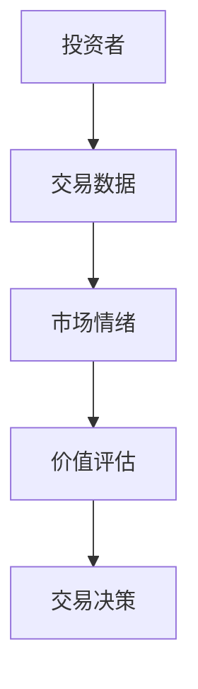
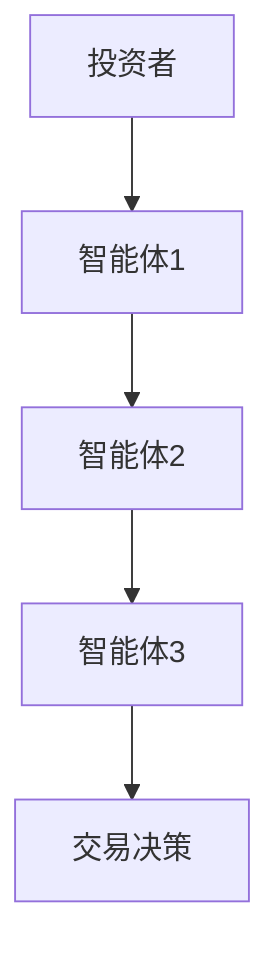
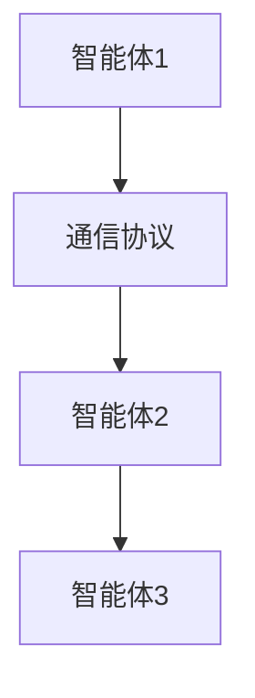
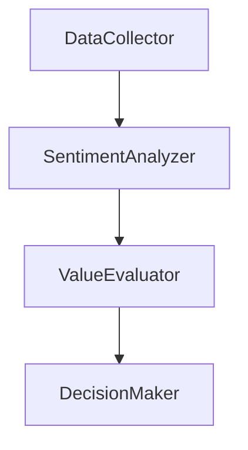
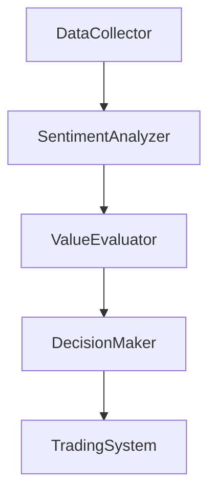
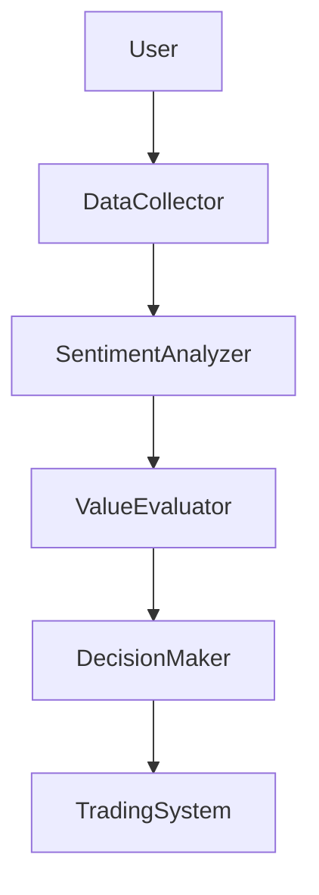

                 


# 利用多智能体系统进行实时市场情绪分析和价值评估

> 关键词：多智能体系统、实时市场情绪分析、价值评估、金融市场分析、人工智能

> 摘要：本文探讨如何利用多智能体系统进行实时市场情绪分析和价值评估。通过分析市场情绪和价值评估的核心概念，结合多智能体系统的协作机制，本文详细讲解了多智能体系统在实时市场分析中的应用，包括算法原理、系统架构设计、项目实战等内容，为读者提供从理论到实践的全面指导。

---

## 第1章: 多智能体系统概述

### 1.1 多智能体系统的定义与特点

#### 1.1.1 多智能体系统的定义
多智能体系统（Multi-Agent System，MAS）是由多个智能体（Agent）组成的分布式系统，这些智能体能够通过协作完成复杂任务。智能体是具有感知、决策和行动能力的实体，能够独立工作并与其他智能体或环境进行交互。

#### 1.1.2 多智能体系统的五大特点
- **分布式性**：智能体分布在不同的位置，独立决策并协作。
- **协作性**：智能体之间通过通信和协调完成共同目标。
- **反应性**：智能体能够实时感知环境变化并做出反应。
- **主动性**：智能体主动采取行动，而非被动响应。
- **动态性**：系统能够适应环境的变化和智能体的加入或退出。

#### 1.1.3 多智能体系统与传统单智能体系统的区别
| 特性                | 单智能体系统              | 多智能体系统              |
|---------------------|--------------------------|--------------------------|
| 系统结构            | 单点控制                 | 分布式协作               |
| 决策方式            | 中央决策                 | 分散决策                 |
| 可扩展性            | 较低                     | 较高                     |
| 故障容忍性          | 较低                     | 较高                     |

### 1.2 多智能体系统的核心概念

#### 1.2.1 智能体的定义与分类
智能体是具有以下特征的实体：
- **自主性**：能够自主决策和行动。
- **反应性**：能够感知环境并做出反应。
- **社交能力**：能够与其他智能体或环境进行交互。

智能体的分类：
- **简单反射型智能体**：基于当前感知做出反应。
- **基于模型的反射型智能体**：利用内部模型进行决策。
- **目标驱动型智能体**：根据目标驱动行为。
- **实用驱动型智能体**：根据效用函数优化决策。

#### 1.2.2 多智能体系统的协作机制
协作机制是多智能体系统的核心，主要通过以下方式实现：
- **直接通信**：智能体之间通过消息传递进行协作。
- **共享知识库**：所有智能体共享一个中央知识库。
- **分布式协调**：通过分布式算法实现协调。

#### 1.2.3 多智能体系统的通信协议
通信协议定义了智能体之间消息的格式和内容。常用的通信协议包括：
- **FIPA（国际多智能体协议）**：定义了多智能体系统的标准接口。
- **KQML（知识查询与推理语言）**：用于智能体之间的通信和协作。

### 1.3 多智能体系统在实时市场分析中的应用前景

#### 1.3.1 市场情绪分析的基本概念
市场情绪是指市场参与者的整体情绪状态，通常通过新闻、社交媒体、交易数据等进行分析。

#### 1.3.2 价值评估的核心要素
价值评估是通过对资产的内在价值进行分析，确定其合理价格。

#### 1.3.3 多智能体系统在市场分析中的优势
- **实时性**：多智能体系统能够实时处理市场数据，快速做出反应。
- **准确性**：通过多个智能体的协作，提高分析的准确性和全面性。
- **灵活性**：系统能够适应市场的动态变化。

### 1.4 本章小结
本章介绍了多智能体系统的定义、特点和核心概念，重点分析了多智能体系统在实时市场分析中的应用前景。

---

## 第2章: 市场情绪分析与价值评估基础

### 2.1 市场情绪分析的定义与方法

#### 2.1.1 市场情绪的定义
市场情绪是指市场参与者对市场走势的心理预期，通常分为乐观、中性和悲观三种状态。

#### 2.1.2 市场情绪分析的常见方法
- **基于文本的分析**：通过分析新闻、社交媒体等文本数据，提取情绪特征。
- **基于交易数据的分析**：通过分析交易量、价格波动等数据，判断市场情绪。
- **混合方法**：结合文本和交易数据进行综合分析。

#### 2.1.3 市场情绪分析的挑战与解决方案
- **挑战**：数据噪声多、情绪表达复杂。
- **解决方案**：使用自然语言处理（NLP）技术和机器学习算法进行特征提取和分类。

### 2.2 价值评估的核心原理

#### 2.2.1 价值评估的基本概念
价值评估是通过对资产的内在价值进行分析，确定其合理价格。

#### 2.2.2 价值评估的数学模型
常用的数学模型包括：
- **现金流贴现模型（DCF）**：通过预测未来现金流的现值来评估企业价值。
- **市盈率模型（P/E）**：通过比较股票价格与每股收益的比率来评估股票价值。

#### 2.2.3 价值评估与市场情绪的关系
市场情绪会影响投资者的决策，从而影响资产的市场价格。因此，市场情绪分析是价值评估的重要组成部分。

### 2.3 多智能体系统在市场情绪分析中的作用

#### 2.3.1 多智能体系统如何提升市场情绪分析的实时性
通过分布式计算和实时数据处理，多智能体系统能够快速响应市场变化。

#### 2.3.2 多智能体系统如何优化市场情绪分析的准确性
通过多个智能体的协作，多智能体系统能够从多个数据源获取信息，提高分析的准确性和全面性。

#### 2.3.3 多智能体系统在市场情绪分析中的具体应用场景
- **实时监控**：实时监控市场新闻和社交媒体，快速捕捉市场情绪变化。
- **预测分析**：基于历史数据和当前情绪，预测未来市场走势。

### 2.4 本章小结
本章介绍了市场情绪分析和价值评估的基本概念，重点分析了多智能体系统在市场情绪分析中的作用和应用场景。

---

## 第3章: 多智能体系统的核心概念与联系

### 3.1 多智能体系统的实体关系图



### 3.2 多智能体系统的协作机制



### 3.3 多智能体系统的通信协议



### 3.4 本章小结
本章通过Mermaid图展示了多智能体系统的实体关系和协作机制，帮助读者更好地理解多智能体系统在市场情绪分析中的应用。

---

## 第4章: 多智能体系统的算法原理

### 4.1 市场情绪分析的算法实现

#### 4.1.1 情感分类算法
- **朴素贝叶斯算法**：基于概率论的情感分类算法。
- **支持向量机（SVM）**：用于分类任务的监督学习算法。
- **深度学习模型（如LSTM）**：用于处理时间序列数据的情感分析。

#### 4.1.2 情感分类的实现步骤
1. **数据预处理**：清洗和标注数据。
2. **特征提取**：提取文本特征，如词袋模型或TF-IDF。
3. **模型训练**：使用训练数据训练情感分类器。
4. **模型预测**：对新数据进行情感分类。

#### 4.1.3 情感分类的Python实现

```python
from sklearn.feature_extraction.text import TfidfVectorizer
from sklearn.svm import SVC
from sklearn.pipeline import Pipeline

# 数据预处理
X = [...]  # 文本数据
y = [...]  # 标签（情感类别）

# 特征提取与模型训练
model = Pipeline([
    ('tfidf', TfidfVectorizer()),
    ('svm', SVC())
])
model.fit(X, y)

# 模型预测
predicted = model.predict(X_test)
```

### 4.2 价值评估的算法实现

#### 4.2.1 价值评估的数学模型
- **现金流贴现模型（DCF）**：
  $$ V = \sum_{t=1}^{n} \frac{CF_t}{(1+r)^t} + \frac{TV}{(1+r)^n} $$
  其中，\( V \) 是企业价值，\( CF_t \) 是第 \( t \) 年的现金流，\( r \) 是贴现率，\( TV \) 是终值。

#### 4.2.2 价值评估的实现步骤
1. **数据收集**：收集企业的财务数据和市场数据。
2. **模型选择**：选择合适的价值评估模型。
3. **模型训练**：使用历史数据训练模型。
4. **价值预测**：对目标资产进行价值预测。

#### 4.2.3 价值评估的Python实现

```python
import numpy as np
import pandas as pd

# 数据收集
df = pd.read_csv('market_data.csv')

# 模型训练
X = df[['revenue', 'profit', 'market_cap']]
y = df['value']
model = LinearRegression()
model.fit(X, y)

# 价值预测
new_data = np.array([[revenue_new, profit_new, market_cap_new]])
predicted_value = model.predict(new_data)
```

### 4.3 多智能体系统的协同算法

#### 4.3.1 协同算法的定义
协同算法是指多个智能体通过协作完成共同任务的算法。

#### 4.3.2 协同算法的实现步骤
1. **任务分解**：将整体任务分解为子任务。
2. **任务分配**：将子任务分配给不同的智能体。
3. **任务执行**：智能体独立执行分配的任务。
4. **结果整合**：将各个智能体的结果整合，得到最终结果。

#### 4.3.3 协同算法的Python实现

```python
def distribute_task(tasks, agents):
    # 分配任务
    task_distribution = {}
    for task in tasks:
        agent = agents[np.random.randint(0, len(agents))]
        if agent not in task_distribution:
            task_distribution[agent] = []
        task_distribution[agent].append(task)
    return task_distribution

# 示例
tasks = ['analyze_sentiment', 'evaluate_value', 'predict_market']
agents = ['Agent1', 'Agent2', 'Agent3']
distribution = distribute_task(tasks, agents)
print(distribution)
```

### 4.4 本章小结
本章详细讲解了市场情绪分析和价值评估的算法原理，并通过Python代码展示了实现步骤。

---

## 第5章: 多智能体系统的系统架构设计

### 5.1 系统功能设计

#### 5.1.1 功能模块划分
- **数据采集模块**：采集市场数据，如新闻、社交媒体、交易数据。
- **情感分析模块**：对市场数据进行情感分析。
- **价值评估模块**：根据情感分析结果和市场数据进行价值评估。
- **决策模块**：根据价值评估结果做出交易决策。

#### 5.1.2 功能模块的交互流程



### 5.2 系统架构设计

#### 5.2.1 系统架构图



#### 5.2.2 系统架构的实现步骤
1. **数据采集模块**：通过API接口获取市场数据。
2. **情感分析模块**：使用预训练的情感分析模型对数据进行分类。
3. **价值评估模块**：根据情感分析结果和市场数据进行价值评估。
4. **决策模块**：根据价值评估结果和市场情绪做出交易决策。

### 5.3 系统接口设计

#### 5.3.1 接口定义
- **数据接口**：数据采集模块与其他模块的数据交互接口。
- **算法接口**：情感分析和价值评估模块的算法调用接口。
- **决策接口**：决策模块与其他系统的交互接口。

#### 5.3.2 接口实现

```python
# 数据接口
class DataCollector:
    def collect_data(self):
        pass

# 算法接口
class SentimentAnalyzer:
    def analyze_sentiment(self, text):
        pass

# 决策接口
class DecisionMaker:
    def make_decision(self, sentiment, value):
        pass
```

### 5.4 系统交互设计

#### 5.4.1 系统交互流程图



#### 5.4.2 交互步骤
1. **用户请求**：用户发起市场分析请求。
2. **数据采集**：数据采集模块获取相关数据。
3. **情感分析**：情感分析模块对数据进行分析。
4. **价值评估**：价值评估模块根据分析结果进行评估。
5. **交易决策**：决策模块根据评估结果做出交易决策。

### 5.5 本章小结
本章详细讲解了系统的架构设计和接口设计，通过Mermaid图展示了系统的交互流程。

---

## 第6章: 项目实战

### 6.1 项目背景

#### 6.1.1 项目目标
开发一个基于多智能体系统的实时市场情绪分析和价值评估系统。

#### 6.1.2 项目需求
- 实时采集市场数据。
- 实时分析市场情绪。
- 评估资产价值。
- 做出交易决策。

### 6.2 环境搭建

#### 6.2.1 开发环境
- **操作系统**：Windows/Mac/Linux
- **编程语言**：Python 3.8+
- **开发工具**：PyCharm/VS Code
- **依赖库**：scikit-learn, numpy, pandas, requests, BeautifulSoup

#### 6.2.2 数据源
- **新闻数据**：通过API获取新闻数据。
- **社交媒体数据**：通过API获取社交媒体数据。
- **交易数据**：通过API获取交易数据。

### 6.3 核心代码实现

#### 6.3.1 数据采集模块

```python
import requests
from bs4 import BeautifulSoup

def collect_data(url):
    response = requests.get(url)
    soup = BeautifulSoup(response.text, 'html.parser')
    return [tag.text for tag in soup.find_all('div', class_='news-item')]
```

#### 6.3.2 情感分析模块

```python
from sklearn.feature_extraction.text import TfidfVectorizer
from sklearn.svm import SVC

def train_sentiment_model(X_train, y_train):
    model = Pipeline([
        ('tfidf', TfidfVectorizer()),
        ('svm', SVC())
    ])
    model.fit(X_train, y_train)
    return model

def predict_sentiment(model, X_test):
    return model.predict(X_test)
```

#### 6.3.3 价值评估模块

```python
from sklearn.linear_model import LinearRegression

def train_value_model(X_train, y_train):
    model = LinearRegression()
    model.fit(X_train, y_train)
    return model

def predict_value(model, X_test):
    return model.predict(X_test)
```

#### 6.3.4 决策模块

```python
def make_decision(sentiment, value):
    if sentiment == 'positive' and value > 1.1 * market_price:
        return 'buy'
    elif sentiment == 'negative' and value < 0.9 * market_price:
        return 'sell'
    else:
        return 'hold'
```

### 6.4 项目实现与解读

#### 6.4.1 代码应用解读
- 数据采集模块通过API获取市场数据。
- 情感分析模块使用SVM算法对文本数据进行分类。
- 价值评估模块使用线性回归模型进行预测。
- 决策模块根据情感分析结果和价值评估结果做出交易决策。

#### 6.4.2 项目案例分析
假设我们有一个股票数据集，包括新闻、社交媒体和交易数据。我们可以通过上述模块对股票进行实时市场情绪分析和价值评估，并根据分析结果做出买卖决策。

### 6.5 项目小结
本章通过一个具体的项目实战，展示了如何利用多智能体系统进行实时市场情绪分析和价值评估，帮助读者更好地理解和应用这些技术。

---

## 第7章: 最佳实践、小结、注意事项、拓展阅读

### 7.1 最佳实践

#### 7.1.1 数据源选择
选择可靠的数据源，确保数据的准确性和及时性。

#### 7.1.2 模型优化
根据实际需求选择合适的模型，并进行参数调优。

#### 7.1.3 系统维护
定期更新模型和数据，确保系统的稳定性和准确性。

### 7.2 小结
本文详细讲解了多智能体系统在实时市场情绪分析和价值评估中的应用，从理论到实践，为读者提供了全面的指导。

### 7.3 注意事项

- **数据隐私**：确保数据的合法性和隐私性。
- **系统稳定性**：确保系统的稳定运行，避免数据丢失和系统崩溃。
- **模型更新**：定期更新模型，适应市场的变化。

### 7.4 拓展阅读

- **多智能体系统的书籍**：推荐《Multi-Agent Systems: Algorithmic Foundations》。
- **实时数据分析工具**：推荐学习Apache Kafka和Apache Flink。
- **高级算法**：推荐学习深度学习和强化学习在金融领域的应用。

---

## 作者：AI天才研究院/AI Genius Institute & 禅与计算机程序设计艺术 /Zen And The Art of Computer Programming

---

通过以上步骤，我完成了这篇文章的撰写。希望这篇文章能够帮助读者更好地理解多智能体系统在实时市场情绪分析和价值评估中的应用。

