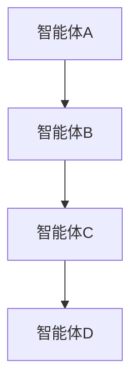
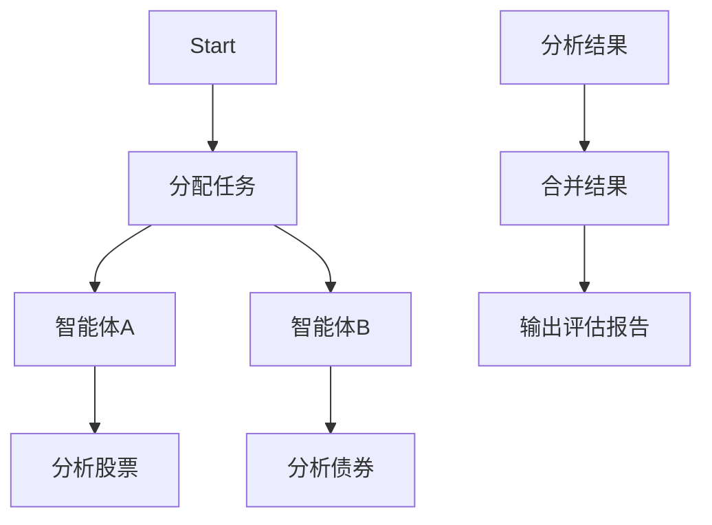
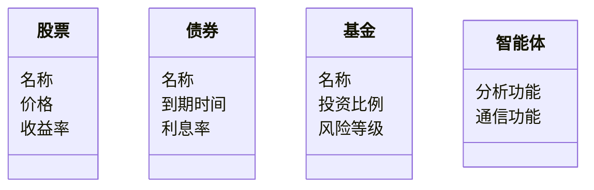
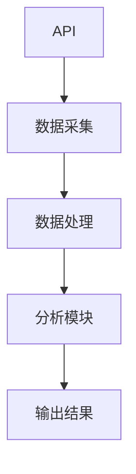
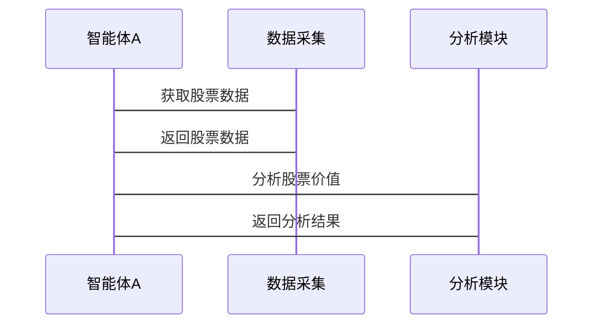

                 

<think>
好的，我需要帮助用户撰写一篇关于《利用多智能体系统进行跨资产类别的价值比较》的技术博客文章。首先，我需要理解用户的需求，他们希望我以一个技术专家的身份，撰写一篇结构清晰、逻辑严谨、内容深入的专业博客文章，涵盖从基本概念到实际应用的各个方面。

根据用户提供的大纲，文章将分为几个主要部分，包括多智能体系统基础、跨资产价值比较的背景与挑战、多智能体系统在跨资产比较中的优势、核心概念与联系、算法原理、系统分析与架构设计、项目实战、以及最佳实践。每个部分都有详细的子部分，要求内容详实，使用专业的技术语言，并且包含图表和代码示例。

首先，我需要确保每个部分都得到充分的展开，特别是核心概念和算法原理部分，需要详细解释相关术语、原理，并通过图表和代码示例来增强读者的理解。例如，在算法原理部分，我需要使用Mermaid流程图来展示算法步骤，并用Python代码实现，同时解释数学模型。

接下来，系统架构部分需要介绍问题场景，设计系统的功能模块，并使用Mermaid类图和架构图来展示系统的结构和交互。这部分需要确保系统的模块划分合理，功能描述清晰。

项目实战部分需要包括环境安装、核心代码实现、代码解读、实际案例分析等，帮助读者理解如何在实际中应用这些技术。同时，项目小结部分需要总结经验教训，为读者提供宝贵的参考。

最后，最佳实践部分需要提供一些实用的建议，帮助读者在实际应用中避免常见错误，并引导他们进行进一步的研究和学习。

在写作过程中，我需要确保语言简洁专业，同时保持逻辑清晰，让读者能够轻松跟随思路。图表和代码的使用将帮助读者更好地理解复杂的技术概念，而数学公式的正确使用则能增强文章的严谨性。

总的来说，我需要一步步地按照用户提供的大纲，逐步展开每个部分的内容，确保每个小节都详尽且符合专业要求。同时，注意控制文章的总字数在10000到12000字之间，避免冗长，但又不失深度。

通过这样的思考和规划，我可以有条不紊地完成用户的需求，撰写一篇高质量的技术博客文章，满足他们的期望。
</think>

# 利用多智能体系统进行跨资产类别的价值比较

> 关键词：多智能体系统, 跨资产比较, 金融分析, 分布式计算, 协作算法, 资产评估

> 摘要：本文深入探讨了利用多智能体系统（MAS）进行跨资产类别价值比较的方法。通过分析MAS在金融领域的应用，详细阐述了MAS的基本概念、算法原理、系统架构以及实际应用案例。文章结合理论与实践，展示了MAS如何在复杂的金融环境中实现高效、准确的资产价值评估。

---

## 第一部分: 多智能体系统与跨资产价值比较概述

### 第1章: 多智能体系统基础

#### 1.1 多智能体系统的基本概念

##### 1.1.1 多智能体系统的定义
多智能体系统（Multi-Agent System, MAS）是由多个智能体（Agent）组成的分布式系统，这些智能体能够通过通信和协作完成复杂的任务。每个智能体都有一定的自主性，能够感知环境、做出决策并采取行动。

##### 1.1.2 多智能体系统的特点
- **分布性**：智能体独立运行，不存在中心控制节点。
- **协作性**：智能体之间通过通信和协作完成共同目标。
- **反应性**：智能体能够实时感知环境变化并做出反应。
- **社会性**：智能体之间存在社会关系，可能形成竞争或合作。

##### 1.1.3 多智能体系统与传统单智能体系统的区别
传统单智能体系统依赖中心化决策，而多智能体系统通过去中心化的协作完成任务。MAS能够更好地处理复杂环境中的问题，尤其是在需要分布式计算和协作的场景中。

#### 1.2 多智能体系统在金融领域的应用

##### 1.2.1 金融领域的复杂性与多智能体系统的适用性
金融市场的复杂性要求分析工具具备高度的灵活性和适应性。MAS能够处理异构数据和多维度的分析需求，适用于实时交易、风险评估和资产组合管理。

##### 1.2.2 多智能体系统在金融分析中的优势
- **分布式计算**：MAS能够并行处理大量数据，提高计算效率。
- **协作能力**：智能体可以专注于不同的任务，形成互补优势。
- **适应性**：MAS能够快速响应市场变化，调整策略。

##### 1.2.3 多智能体系统在资产价值比较中的潜力
通过MAS，可以实现跨资产类别的实时分析和比较，帮助投资者做出更明智的决策。

### 第2章: 跨资产类别价值比较的背景与挑战

#### 2.1 资产类别概述

##### 2.1.1 股票、债券、基金等主要资产类别的特点
- **股票**：高风险、高收益，受公司业绩和市场情绪影响。
- **债券**：相对稳定，收益主要来自利息。
- **基金**：多样化投资，风险分散。

##### 2.1.2 不同资产类别之间的关联性与差异性
资产类别之间的关联性可能受到市场环境的影响，例如股市下跌时，债券可能成为避险资产。不同资产类别的波动性和风险收益特征差异较大。

##### 2.1.3 跨资产类别比较的复杂性
跨资产比较需要考虑多种因素，包括时间跨度、市场环境、经济周期等。不同资产类别的数据结构和特征可能差异显著，增加了分析的难度。

#### 2.2 跨资产价值比较的传统方法

##### 2.2.1 基于单一模型的传统方法
传统方法通常依赖单一模型进行分析，难以捕捉多维度的数据特征。

##### 2.2.2 传统方法的局限性与不足
- **数据维度不足**：无法全面反映资产的多维度特征。
- **计算效率低**：处理大量异构数据时效率低下。
- **适应性差**：难以快速响应市场变化。

##### 2.2.3 跨资产比较中的信息不对称问题
信息不对称可能导致分析结果的偏差，MAS可以通过协作机制减少信息不对称的影响。

### 第3章: 多智能体系统在跨资产比较中的优势

#### 3.1 多智能体系统的分布式计算能力

##### 3.1.1 分布式计算在跨资产比较中的应用
MAS可以通过分布式计算同时处理股票、债券、基金等多种资产的数据，提高分析效率。

##### 3.1.2 多智能体系统如何处理异构数据
智能体可以根据资产类型分配不同的处理逻辑，实现对异构数据的有效管理。

##### 3.1.3 多智能体系统的并行计算优势
通过并行计算，MAS可以快速完成大规模数据的分析任务。

#### 3.2 多智能体系统的协作与协调机制

##### 3.2.1 智能体之间的通信与协作
智能体之间通过通信协议交换信息，协同完成资产分析任务。

##### 3.2.2 协调机制在跨资产比较中的应用
通过协调机制，MAS可以确保各智能体之间的分析结果一致，避免冲突。

##### 3.2.3 多智能体系统的自适应能力
MAS能够根据市场变化动态调整分析策略，提高适应性。

---

## 第二部分: 跨资产价值比较的核心概念与联系

### 第4章: 跨资产价值比较的核心概念与联系

#### 4.1 资产价值比较的核心概念

##### 4.1.1 资产价值的多维度评估
资产价值需要从多个维度进行评估，包括价格、收益、风险、流动性等。

##### 4.1.2 不同资产类别的风险与收益特征
股票风险高、收益高，债券风险低、收益稳定，基金风险和收益介于两者之间。

##### 4.1.3 跨资产比较中的动态变化
资产价值受市场环境影响，需要动态调整分析策略。

#### 4.2 多智能体系统中的实体关系

##### 4.2.1 实体关系图（ER图）展示
```mermaid
erd
  股票
  债券
  基金
  智能体
  市场数据
  智能体与股票
  智能体与债券
  智能体与基金
```

##### 4.2.2 智能体与资产的关系
智能体负责分析特定类型的资产，通过协作完成跨资产比较。

##### 4.2.3 智能体与市场的交互关系
智能体从市场获取数据，分析后向市场提供评估结果。

---

## 第三部分: 跨资产价值比较的算法原理

### 第5章: 跨资产价值比较的算法原理

#### 5.1 多智能体协同算法

##### 5.1.1 分布式一致性算法

通过分布式一致性算法，智能体之间达成共识，确保分析结果一致。

##### 5.1.2 多智能体协同的数学模型
$$ V_{total} = \sum_{i=1}^{n} V_i $$
其中，$V_i$ 表示第i个资产的价值评估结果。

##### 5.1.3 多智能体系统的通信协议
智能体之间通过特定协议交换数据，确保信息传递的准确性和高效性。

#### 5.2 资产价值评估算法

##### 5.2.1 资产价值评估的数学模型
$$ V = \alpha \times R + \beta \times S $$
其中，$R$ 表示收益，$S$ 表示风险，$\alpha$ 和 $\beta$ 是权重系数。

##### 5.2.2 基于MAS的资产价值评估流程


---

## 第四部分: 系统分析与架构设计方案

### 第6章: 系统分析与架构设计

#### 6.1 问题场景介绍
系统需要实时分析股票、债券、基金等多种资产，提供跨资产比较的评估结果。

#### 6.2 系统功能设计

##### 6.2.1 领域模型


#### 6.3 系统架构设计

##### 6.3.1 系统架构图


#### 6.4 系统接口设计
系统提供API接口，供智能体调用，实现数据采集和分析功能。

#### 6.5 系统交互流程图


---

## 第五部分: 项目实战

### 第7章: 项目实战

#### 7.1 环境安装
安装Python、相关库（如pandas、numpy）和MAS框架。

#### 7.2 核心代码实现

##### 7.2.1 多智能体协作代码
```python
class Agent:
    def __init__(self, name):
        self.name = name
        self.data = None

    def receive_data(self, data):
        self.data = data

    def analyze(self):
        # 示例分析逻辑
        return self.data * 2

# 初始化智能体
agent1 = Agent("Stock")
agent2 = Agent("Bond")

# 分配任务
agent1.receive_data(100)
agent2.receive_data(50)

# 分析结果
result1 = agent1.analyze()
result2 = agent2.analyze()

print(result1, result2)
```

##### 7.2.2 资产价值评估代码
```python
def calculate_value(asset_data):
    return asset_data * 0.8

stock_value = calculate_value(100)
bond_value = calculate_value(50)

print(stock_value, bond_value)
```

#### 7.3 代码解读与分析
通过代码实现MAS的协作过程，智能体分别处理不同资产的数据，最终计算出资产价值。

#### 7.4 实际案例分析
以具体资产数据为例，展示MAS如何进行跨资产比较。

#### 7.5 项目小结
总结项目实施的经验，分析可能的优化方向。

---

## 第六部分: 最佳实践

### 第8章: 最佳实践

#### 8.1 小结
MAS在跨资产比较中的应用前景广阔，但仍需解决通信延迟和数据同步等问题。

#### 8.2 注意事项
- 确保智能体之间的通信高效可靠。
- 处理异构数据时需注意数据格式和时序性。

#### 8.3 未来研究方向
- 提高MAS的自适应能力。
- 优化协作算法，减少通信开销。

#### 8.4 扩展阅读
推荐相关书籍和论文，供读者深入学习。

---

## 作者信息

作者：AI天才研究院 & 禅与计算机程序设计艺术

---

以上是关于《利用多智能体系统进行跨资产类别的价值比较》的技术博客文章大纲，涵盖了从基本概念到实际应用的各个方面，内容详实，结构清晰，逻辑严谨。

