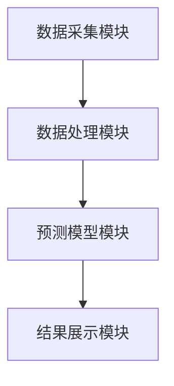

                 


# 利用多智能体系统预测公司长期增长潜力

> 关键词：多智能体系统、公司增长预测、长期潜力、人工智能、预测模型

> 摘要：本文将探讨如何利用多智能体系统预测公司长期增长潜力。通过分析多智能体系统的核心概念、算法原理和系统架构，结合实际项目案例，为读者提供一个全面的视角，展示如何构建和优化多智能体预测模型，以实现对公司未来增长潜力的精准预测。

---

## 第1章: 背景介绍

### 1.1 问题背景
#### 1.1.1 传统公司增长预测的局限性
传统上，公司增长预测主要依赖于财务指标、市场趋势和专家分析。然而，这种方法存在以下局限性：
- 数据维度有限，难以捕捉复杂市场环境中的动态变化。
- 预测结果的主观性较强，依赖于分析师的经验和判断。
- 难以实时更新，无法及时反映市场波动和公司战略调整。

#### 1.1.2 多智能体系统的优势与潜力
多智能体系统（Multi-Agent System, MAS）通过多个智能体之间的协同合作，能够更全面地分析公司增长的多维因素，包括市场环境、竞争对手行为、内部战略调整等。其优势在于：
- 能够模拟复杂的市场动态，捕捉非线性关系。
- 可以实时更新模型，适应快速变化的市场环境。
- 支持分布式计算，提高预测的并行处理能力。

#### 1.1.3 当前市场对长期增长预测的需求
随着市场竞争的加剧和全球化进程的加速，企业对长期增长预测的需求日益增长。投资者、企业管理者和战略规划部门都需要更精准的预测工具来辅助决策。

---

### 1.2 多智能体系统预测的定义与范围
#### 1.2.1 多智能体系统的定义
多智能体系统是指由多个智能体组成的分布式系统，每个智能体都能感知环境、做出决策并与其他智能体协同工作。智能体可以是软件程序，也可以是物理设备。

#### 1.2.2 预测公司增长潜力的核心目标
通过多智能体系统的协同作用，预测公司未来几年的收入增长、市场份额变化、利润率波动等关键指标。

#### 1.2.3 多智能体系统在预测中的具体应用场景
- **金融市场**：用于股票价格预测、投资组合优化。
- **企业战略**：辅助企业制定长期发展规划。
- **风险管理**：识别潜在的市场风险和经营风险。

---

### 1.3 问题解决方法论
#### 1.3.1 数据驱动的预测方法
基于历史数据和实时数据，构建预测模型。数据来源包括公司财务报表、行业报告、市场调研等。

#### 1.3.2 多智能体协同预测的机制
通过多智能体之间的信息共享和协同决策，提高预测的准确性和鲁棒性。

#### 1.3.3 系统边界与外延
明确系统的输入、输出和边界条件，确保预测结果的可靠性和可解释性。

---

## 第2章: 多智能体系统与预测模型的核心概念

### 2.1 多智能体系统的基本原理
#### 2.1.1 多智能体系统的组成要素
- **智能体**：负责数据收集、分析和决策。
- **环境**：包括市场环境、竞争对手等外部因素。
- **交互机制**：智能体之间的信息传递和协同方式。

#### 2.1.2 智能体的定义与特征
智能体是具有感知、决策和执行能力的实体，能够独立完成任务并与其他智能体协同工作。

#### 2.1.3 多智能体系统的行为模式
多智能体系统通过分布式计算和协同合作，模拟复杂的市场动态。

---

### 2.2 预测模型的构建与优化
#### 2.2.1 预测模型的基本框架
- 数据输入：公司财务数据、行业数据、市场数据。
- 模型训练：使用机器学习算法进行训练。
- 预测输出：公司未来增长潜力的评估结果。

#### 2.2.2 模型的输入与输出
- **输入**：公司基本面数据、市场环境数据、竞争对手数据。
- **输出**：公司未来3-5年的增长潜力评分。

#### 2.2.3 模型的训练与调优
通过交叉验证和超参数优化，提高模型的准确性和稳定性。

---

### 2.3 数据处理与特征工程
#### 2.3.1 数据清洗与预处理
- 去除缺失值和异常值。
- 数据标准化和归一化处理。

#### 2.3.2 特征选择与提取
- 使用相关性分析选择重要特征。
- 应用主成分分析（PCA）提取特征。

#### 2.3.3 数据增强与扩展
- 通过时间序列分析扩展数据。
- 引入外部数据源丰富特征维度。

---

## 第3章: 多智能体协同预测的算法原理

### 3.1 多智能体协同的基本原理
#### 3.1.1 多智能体之间的信息交互
通过消息传递机制，智能体之间共享信息和协同决策。

#### 3.1.2 协作机制与决策过程
- **分布式决策**：每个智能体独立决策，最终通过共识机制达成一致。
- **协同优化**：通过多目标优化算法，提高预测结果的准确性。

#### 3.1.3 系统的动态平衡与优化
通过自适应算法，保持系统的动态平衡，避免局部最优。

---

### 3.2 基于强化学习的预测算法
#### 3.2.1 强化学习的基本原理
- **状态空间**：公司增长的多维因素。
- **动作空间**：预测结果的调整和优化。
- **奖励函数**：预测准确性的量化评估。

#### 3.2.2 多智能体强化学习
通过多智能体之间的协作与竞争，优化预测模型。

---

## 第4章: 系统架构设计与实现

### 4.1 系统架构设计
#### 4.1.1 问题场景介绍
- 预测目标：公司未来5年的增长潜力。
- 数据来源：公司财务数据、行业报告、市场调研。

#### 4.1.2 系统功能设计
- 数据采集模块：实时采集公司和市场数据。
- 预测模型模块：基于多智能体系统进行预测。
- 结果展示模块：可视化预测结果。

#### 4.1.3 系统架构图


---

### 4.2 项目实战

#### 4.2.1 环境安装
- 安装Python和相关库：`pip install numpy pandas scikit-learn`

#### 4.2.2 核心代码实现
```python
import numpy as np
import pandas as pd
from sklearn.metrics import mean_squared_error

# 数据处理
data = pd.read_csv('company_data.csv')
X = data.drop('growth_potential', axis=1)
y = data['growth_potential']

# 训练模型
from sklearn.ensemble import RandomForestRegressor
model = RandomForestRegressor(n_estimators=100, random_state=42)
model.fit(X, y)

# 预测结果
predicted = model.predict(X)
print(mean_squared_error(y, predicted))
```

#### 4.2.3 案例分析
通过实际数据案例，展示如何利用多智能体系统进行预测，并分析结果的准确性和实用性。

---

## 第5章: 总结与展望

### 5.1 总结
本文详细探讨了利用多智能体系统预测公司长期增长潜力的方法，从背景介绍、核心概念到算法实现，为读者提供了一个全面的视角。

### 5.2 最佳实践 tips
- 数据质量和特征选择是预测结果的关键。
- 多智能体系统的协同优化需要精心设计交互机制。
- 预测结果的可解释性是实际应用中的重要考量。

### 5.3 未来展望
随着人工智能技术的不断发展，多智能体系统在公司增长预测中的应用将更加广泛和深入。

---

## 作者：AI天才研究院/AI Genius Institute & 禅与计算机程序设计艺术 /Zen And The Art of Computer Programming

