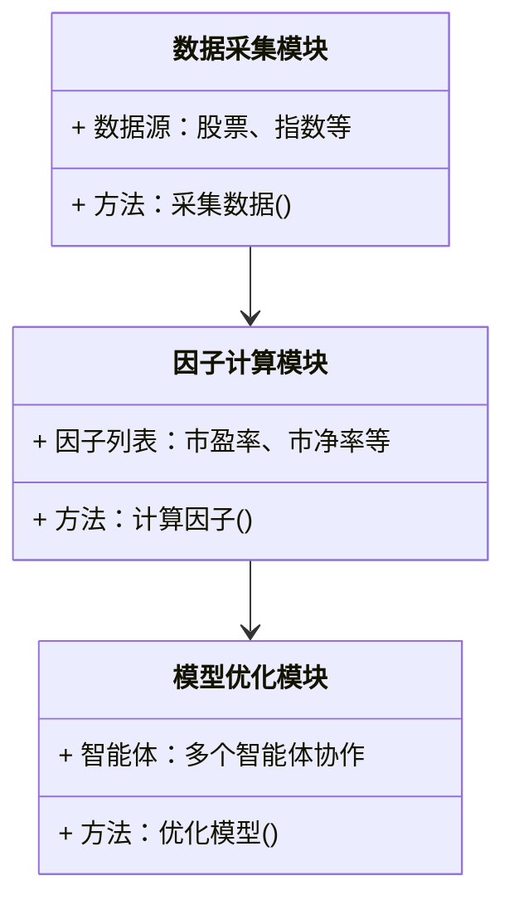

                 


# 利用智能体协作优化价值投资的多因子模型

## 关键词：智能体协作、多因子模型、价值投资、算法优化、系统架构

## 摘要

智能体协作与多因子模型的结合为价值投资提供了新的可能性。通过智能体之间的协作优化，可以更有效地构建和优化多因子模型，从而提升投资决策的准确性和效率。本文将详细探讨智能体协作在多因子模型中的应用，从基础概念到算法实现，再到系统架构设计，最后通过项目实战和高级应用展示其潜力。

---

# 第1章：智能体协作与多因子模型概述

## 1.1 智能体协作的基本概念

### 1.1.1 智能体的定义与特点

**智能体（Agent）**是指能够感知环境、自主决策并执行任务的实体。在投资领域，智能体可以是算法、程序或自动化系统，用于分析市场数据、制定交易策略。

**特点：**
- **自主性**：无需外部干预，自主决策。
- **反应性**：能实时感知环境变化并调整策略。
- **协作性**：多个智能体可以协同工作，共同完成复杂任务。

### 1.1.2 多因子模型的定义与特点

**多因子模型**是将多个因子（如市值、收益波动率等）结合，以预测资产回报的模型。

**特点：**
- **全面性**：考虑多个因子，避免单一因子的局限性。
- **稳定性**：通过多个因子的结合，提升模型的稳定性和准确性。

### 1.1.3 智能体协作在投资中的应用

智能体协作可以用于数据收集、因子筛选、策略优化等环节，显著提升投资效率和决策质量。

---

## 1.2 多因子模型的背景与意义

### 1.2.1 传统投资模型的局限性

传统单因子模型依赖单一因子，如市盈率，容易受市场波动影响，稳定性差。

### 1.2.2 多因子模型的优势

通过结合多个因子，多因子模型能够更全面地评估资产价值，提高预测准确性。

### 1.2.3 智能体协作如何优化多因子模型

智能体协作可以优化因子筛选和权重分配，动态调整模型参数，提升投资收益。

---

## 1.3 本章小结

智能体协作与多因子模型的结合为价值投资提供了新的思路，通过协作优化，能够更有效地构建和优化投资模型，提升投资效果。

---

# 第2章：多因子模型的构建

## 2.1 因子选择与数据预处理

### 2.1.1 常见因子类型

- **基本面因子**：市盈率、市净率等。
- **技术因子**：移动平均线、RSI等。
- **情绪因子**：市场情绪指标。

### 2.1.2 数据清洗与标准化

数据清洗：处理缺失值、异常值。
标准化：将数据归一化，便于模型处理。

**示例代码：**
```python
import pandas as pd
import numpy as np

# 数据清洗
df.dropna(inplace=True)
df = df[df['value'] > 0]

# 标准化
from sklearn.preprocessing import StandardScaler
scaler = StandardScaler()
df_scaled = pd.DataFrame(scaler.fit_transform(df), columns=df.columns)
```

## 2.2 因子权重的计算

### 2.2.1 回归分析法

通过回归分析确定各因子对资产回报的贡献程度。

**数学模型：**
$$
y = \beta_0 + \beta_1x_1 + \beta_2x_2 + ... + \beta_nx_n + \epsilon
$$

### 2.2.2 主成分分析法

用于降维，提取主要因子。

**代码示例：**
```python
from sklearn.decomposition import PCA
pca = PCA(n_components=3)
principal_components = pca.fit_transform(df)
```

## 2.3 多因子模型的构建流程

### 2.3.1 数据收集

从金融数据库获取历史数据。

### 2.3.2 因子筛选

根据回归分析或主成分分析筛选关键因子。

### 2.3.3 模型构建与验证

使用训练数据构建模型，验证集测试模型性能。

---

## 2.4 本章小结

构建多因子模型需要合理选择因子、预处理数据，并通过回归分析或主成分分析确定因子权重。

---

# 第3章：智能体协作优化算法

## 3.1 强化学习算法

### 3.1.1 强化学习的基本原理

智能体通过与环境互动，学习策略以最大化累积奖励。

**数学模型：**
$$
Q(s, a) = Q(s, a) + \alpha(r + \gamma Q(s', a) - Q(s, a))
$$

### 3.1.2 在投资中的应用

用于动态调整投资组合，优化收益与风险比。

---

## 3.2 多智能体协作优化

### 3.2.1 多智能体系统

多个智能体协同工作，各司其职，共同优化投资策略。

### 3.2.2 智能体之间的通信机制

使用消息传递机制，共享信息，协调决策。

---

## 3.3 本章小结

智能体协作优化算法，如强化学习和多智能体协作，能够有效提升多因子模型的优化效果。

---

# 第4章：系统架构设计

## 4.1 系统功能设计

### 4.1.1 功能模块

- 数据采集模块：收集市场数据。
- 因子计算模块：计算各因子值。
- 模型优化模块：应用智能体协作优化模型。

**类图：**


## 4.2 系统架构设计

### 4.2.1 模块划分

- 数据层：存储市场数据。
- 业务逻辑层：处理数据、计算因子。
- 界面层：用户交互界面。

### 4.2.2 架构图

```mermaid
container 数据层 {
    数据库：存储历史数据
}
container 业务逻辑层 {
    数据处理模块：清洗数据
    因子计算模块：计算因子
    模型优化模块：优化模型
}
container 界面层 {
    用户界面：展示结果
}
数据层 --> 业务逻辑层
业务逻辑层 --> 界面层
```

## 4.3 接口设计

### 4.3.1 数据接口

- 数据获取接口：获取历史数据。
- 数据存储接口：存储计算结果。

### 4.3.2 模型接口

- 模型训练接口：训练优化模型。
- 模型预测接口：预测未来收益。

## 4.4 本章小结

系统架构设计明确了各模块的功能和交互方式，为实现智能体协作优化的多因子模型奠定了基础。

---

# 第5章：项目实战：构建智能体协作优化的多因子模型

## 5.1 环境安装

### 5.1.1 安装依赖

安装Python和相关库：
```bash
pip install numpy pandas sklearn
```

## 5.2 核心实现

### 5.2.1 数据采集

从金融API获取数据。

### 5.2.2 因子计算

计算市盈率、市净率等因子。

### 5.2.3 智能体协作优化

应用强化学习优化模型。

**代码示例：**
```python
import gym
import numpy as np

class InvestmentEnv(gym.Env):
    def __init__(self):
        # 状态空间：市场数据
        self.observation_space = gym.spaces.Box(low=0, high=1, shape=(4,))
        # 动作空间：买入、卖出、持有
        self.action_space = gym.spaces.Discrete(3)
    
    def step(self, action):
        # 根据动作计算奖励
        reward = ...  # 具体实现
        return new_obs, reward, done, info
    
    def reset(self):
        # 初始化环境
        return initial_obs

# 初始化环境
env = InvestmentEnv()
# 定义策略网络
policy = ...
# 开始训练
for episode in range(1000):
    state = env.reset()
    while not done:
        action = policy.act(state)
        state, reward, done, info = env.step(action)
        policy.remember(state, action, reward, next_state)
        policy.train()
```

## 5.3 项目小结

通过项目实战，展示了如何利用智能体协作优化多因子模型，提升了投资策略的效果。

---

# 第6章：高级应用与未来展望

## 6.1 高级应用

### 6.1.1 跨资产类别应用

将模型扩展至股票、债券等多种资产。

### 6.1.2 动态再平衡

根据市场变化动态调整投资组合。

## 6.2 未来展望

### 6.2.1 技术进步

人工智能和大数据技术的进步将进一步提升模型性能。

### 6.2.2 新型因子

引入更多新型因子，如情绪因子、行为因子。

## 6.3 本章小结

智能体协作优化的多因子模型在投资领域有广阔的应用前景，未来将更加智能化和个性化。

---

# 作者

**作者：AI天才研究院 & 禅与计算机程序设计艺术**

通过本文的详细阐述，我们展示了智能体协作优化的多因子模型在价值投资中的应用，从理论到实践，为读者提供了全面的指导和深入的分析。

