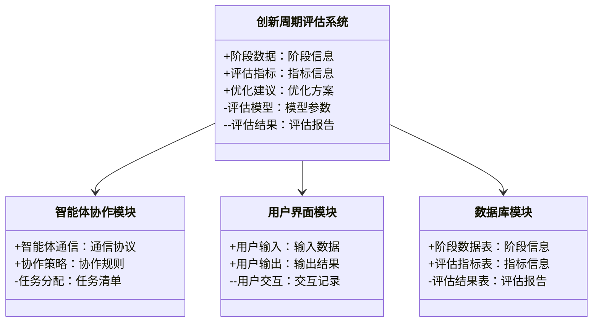
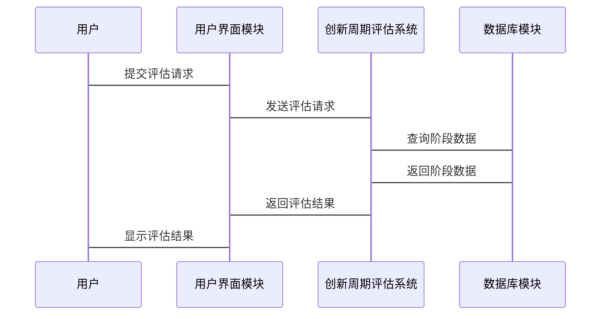

                 


# 利用智能体协作进行全面的公司创新周期评估

> 关键词：智能体协作，创新周期评估，公司创新，人工智能，协作机制

> 摘要：本文探讨了如何利用智能体协作技术进行全面的公司创新周期评估。通过分析智能体协作的核心概念、创新周期评估的方法，以及两者结合的应用场景，本文旨在为公司提供一种高效、智能的创新周期评估方法。文章结合理论与实践，详细讲解了智能体协作在创新周期评估中的实现原理、系统架构设计、项目实战案例以及最佳实践建议。

---

## 第1章: 智能体协作与公司创新周期概述

### 1.1 智能体协作的定义与特点

#### 1.1.1 智能体协作的基本概念
智能体协作（Collaborative Agents）是指多个智能体（Agent）通过共享信息、协同决策和共同行动，以实现共同目标的过程。智能体可以是软件程序、算法或实体设备，具备感知环境、自主决策和学习优化的能力。

#### 1.1.2 智能体协作的核心特点
- **自主性**：每个智能体都能独立决策，无需外部干预。
- **协作性**：智能体之间通过通信和协调，共同完成复杂任务。
- **分布式**：协作过程分布在多个智能体之间，避免单点依赖。
- **动态性**：环境和任务需求可能动态变化，智能体需实时调整协作策略。

#### 1.1.3 智能体协作与传统协作方式的对比

| 特性               | 智能体协作          | 传统协作方式        |
|--------------------|--------------------|--------------------|
| 决策主体           | 分散在多个智能体    | 集中在单一个人或团队 |
| 信息处理方式       | 基于算法和数据     | 基于人工判断和经验  |
| 协作效率           | 高，实时响应       | 低，依赖人工协调     |
| 适应性             | 强，能动态调整      | 弱，灵活性有限       |

---

### 1.2 公司创新周期的定义与重要性

#### 1.2.1 创新周期的定义
创新周期（Innovation Cycle）是指从创意产生到最终产品或服务市场化的过程。它通常包括以下几个阶段：创意产生、研发、测试、量产和市场推广。

#### 1.2.2 创新周期在公司战略中的作用
- **加速产品迭代**：通过优化创新周期，公司可以更快地将创意转化为市场产品。
- **提高竞争力**：缩短创新周期有助于公司更快响应市场需求，增强竞争力。
- **降低风险**：通过持续评估和优化创新周期，公司可以降低创新过程中的不确定性风险。

#### 1.2.3 创新周期评估的意义
创新周期评估是通过分析每个阶段的时间、成本和效率，找出瓶颈并提出优化建议。它帮助企业更好地规划资源，提高创新效率。

---

### 1.3 智能体协作在创新周期评估中的应用前景

#### 1.3.1 智能体协作的优势
- **高效协同**：智能体协作能够快速响应需求，减少人工协调的时间和成本。
- **数据驱动**：通过智能体协作，可以实时收集和分析大量数据，为创新周期评估提供支持。
- **动态调整**：智能体协作能够根据环境变化实时调整协作策略，提高评估的灵活性。

#### 1.3.2 智能体协作在创新周期评估中的潜在价值
- **实时监控**：智能体可以实时监控创新周期中的各个阶段，提供实时数据支持。
- **智能优化**：通过分析历史数据，智能体可以提出优化建议，帮助公司缩短创新周期。
- **预测风险**：智能体可以通过预测模型，提前识别创新周期中的潜在风险。

#### 1.3.3 智能体协作面临的挑战与机遇
- **挑战**：智能体协作需要依赖先进的技术，如人工智能、大数据处理和分布式系统，技术实现难度较大。同时，智能体之间的通信和协调需要解决复杂的同步问题。
- **机遇**：随着人工智能和分布式系统技术的快速发展，智能体协作在创新周期评估中的应用前景广阔。

---

## 第2章: 智能体协作的核心概念与原理

### 2.1 智能体协作的理论基础

#### 2.1.1 多智能体系统（MAS）概述
多智能体系统（Multi-Agent System, MAS）是由多个智能体组成的系统，这些智能体能够通过通信和协作完成复杂的任务。MAS的核心在于智能体之间的协作和协调。

#### 2.1.2 智能体协作的基本原理
智能体协作的基本原理包括以下几个方面：
- **通信**：智能体之间通过消息传递进行信息共享。
- **协调**：智能体通过协商达成一致的行动方案。
- **决策**：每个智能体根据自身信息和全局目标做出决策。
- **学习**：智能体通过学习优化协作策略。

#### 2.1.3 智能体协作的分类与特点

| 分类                | 特点                           |
|---------------------|--------------------------------|
| 基于规则的协作      | 基于预定义规则进行协作         |
| 基于目标的协作      | 根据目标动态调整协作策略       |
| 基于学习的协作      | 通过机器学习优化协作策略       |
| 基于任务的协作      | 根据任务需求进行动态协作       |

---

### 2.2 智能体协作的关键技术

#### 2.2.1 智能体通信与协调机制
智能体通信与协调机制是智能体协作的核心技术之一，主要包括以下几种方式：
- **同步通信**：所有智能体同时进行通信和协作。
- **异步通信**：智能体之间可以异步进行通信，减少等待时间。

#### 2.2.2 智能体决策与规划算法
智能体决策与规划算法是智能体协作的关键技术，常用的算法包括：
- **强化学习（Reinforcement Learning）**：通过奖励机制优化决策策略。
- **分层规划（Hierarchical Planning）**：将任务分解为多个子任务，分层进行规划。

#### 2.2.3 智能体协作的实现方法
智能体协作的实现方法包括以下几种：
- **基于规则的方法**：通过预定义规则进行协作。
- **基于市场的方法**：智能体通过市场机制进行资源分配和协作。
- **基于拍卖的方法**：通过拍卖机制决定协作任务的分配。

---

### 2.3 智能体协作与创新周期评估的关联

#### 2.3.1 智能体协作在创新周期评估中的作用
智能体协作可以实时监控创新周期中的各个阶段，提供实时数据支持，并通过分析历史数据提出优化建议。

#### 2.3.2 智能体协作与创新周期评估的协同机制
智能体协作与创新周期评估的协同机制包括以下几个方面：
- **数据共享**：智能体之间共享创新周期评估的数据。
- **协同决策**：智能体根据共享数据共同制定优化策略。
- **实时反馈**：智能体根据实时数据动态调整协作策略。

#### 2.3.3 智能体协作在创新周期评估中的应用案例
一个典型的案例是某科技公司利用智能体协作技术优化其产品的创新周期。通过智能体协作，该公司能够实时监控产品开发的各个阶段，快速识别问题并提出优化建议，从而缩短了产品开发周期。

---

## 第3章: 创新周期评估的方法与模型

### 3.1 创新周期评估的基本方法

#### 3.1.1 基于指标的评估方法
基于指标的评估方法是通过设定一系列指标来评估创新周期的效率和效果。常用的指标包括时间、成本、质量等。

#### 3.1.2 基于过程的评估方法
基于过程的评估方法是通过分析创新周期的各个阶段，找出瓶颈并提出优化建议。

#### 3.1.3 基于数据挖掘的评估方法
基于数据挖掘的评估方法是通过分析大量的历史数据，挖掘出创新周期中的潜在规律和模式。

---

### 3.2 创新周期评估模型的构建

#### 3.2.1 创新周期评估模型的框架设计
创新周期评估模型的框架设计包括以下几个步骤：
1. **需求分析**：明确评估的目标和范围。
2. **数据收集**：收集与创新周期相关的数据。
3. **模型构建**：根据数据构建评估模型。
4. **模型验证**：通过实际数据验证模型的准确性。
5. **模型优化**：根据验证结果优化模型。

#### 3.2.2 创新周期评估模型的输入与输出
创新周期评估模型的输入包括创新周期的各个阶段数据，如时间、成本、质量等。输出是评估结果，包括各个阶段的效率、效果以及优化建议。

#### 3.2.3 创新周期评估模型的验证与优化
模型验证可以通过对比实际数据和模型预测结果来完成。模型优化可以通过调整参数或引入新的数据来提高模型的准确性。

---

### 3.3 创新周期评估的关键指标

#### 3.3.1 创新周期的阶段划分
创新周期通常包括以下几个阶段：
1. **创意产生**：从市场调研到创意提出。
2. **研发**：从原型开发到产品测试。
3. **量产**：从小批量生产到大规模生产。
4. **市场推广**：从上市推广到市场反馈收集。

#### 3.3.2 创新周期的关键绩效指标（KPI）
创新周期的关键绩效指标包括：
- **时间**：每个阶段所需的时间。
- **成本**：每个阶段所需的成本。
- **质量**：产品的质量指标。
- **效率**：资源利用效率。

#### 3.3.3 创新周期评估指标的权重分配
权重分配可以根据各个指标对创新周期的影响程度来确定。例如，时间可能比成本更重要，因此时间指标的权重可以设置得更高。

---

## 第4章: 智能体协作与创新周期评估的结合

### 4.1 智能体协作在创新周期评估中的应用场景

#### 4.1.1 智能体协作在创新周期评估中的优势
智能体协作可以通过实时数据共享和动态调整协作策略，显著提高创新周期评估的效率和准确性。

#### 4.1.2 智能体协作在创新周期评估中的具体应用
智能体协作可以应用于创新周期的各个阶段，例如：
- 在创意产生阶段，智能体可以协助进行市场调研和数据分析。
- 在研发阶段，智能体可以协助进行原型开发和测试。
- 在量产阶段，智能体可以协助进行生产过程监控和优化。

#### 4.1.3 智能体协作在创新周期评估中的案例分析
以某科技公司为例，该公司利用智能体协作技术优化了其产品的创新周期。通过智能体协作，该公司能够实时监控产品开发的各个阶段，快速识别问题并提出优化建议，从而缩短了产品开发周期。

---

### 4.2 智能体协作与创新周期评估的协同机制

#### 4.2.1 智能体协作与创新周期评估的协同目标
智能体协作与创新周期评估的协同目标是通过智能体协作优化创新周期评估的过程和结果。

#### 4.2.2 智能体协作与创新周期评估的协同过程
智能体协作与创新周期评估的协同过程包括以下几个步骤：
1. **数据共享**：智能体之间共享创新周期评估的数据。
2. **协同决策**：智能体根据共享数据共同制定优化策略。
3. **实时反馈**：智能体根据实时数据动态调整协作策略。

#### 4.2.3 智能体协作与创新周期评估的协同效果
通过智能体协作与创新周期评估的协同，可以显著提高创新周期评估的效率和准确性，缩短创新周期，降低创新成本。

---

### 4.3 智能体协作对创新周期评估的优化策略

#### 4.3.1 智能体协作对创新周期评估的优化方向
智能体协作可以优化创新周期评估的以下方面：
- **数据采集**：通过智能体协作实时采集创新周期中的数据。
- **数据分析**：通过智能体协作快速分析数据，提出优化建议。

#### 4.3.2 智能体协作对创新周期评估的优化方法
智能体协作可以通过以下方法优化创新周期评估：
- **动态调整**：根据实时数据动态调整评估策略。
- **智能优化**：通过机器学习算法优化评估模型。

#### 4.3.3 智能体协作对创新周期评估的优化效果
通过智能体协作优化创新周期评估，可以显著提高评估的效率和准确性，缩短创新周期，降低创新成本。

---

## 第5章: 创新周期评估的系统架构设计

### 5.1 系统功能设计

#### 5.1.1 领域模型类图
以下是创新周期评估系统的领域模型类图：



---

#### 5.1.2 系统架构设计
以下是创新周期评估系统的系统架构图：

```mermaid
archi
    节点 创新周期评估系统 {
        组件 智能体协作模块 {
            组件 智能体通信
            组件 协作策略
        }
        组件 用户界面模块 {
            组件 用户输入
            组件 用户输出
        }
        组件 数据库模块 {
            组件 阶段数据表
            组件 评估指标表
            组件 评估结果表
        }
    }
```

---

### 5.2 系统接口设计

#### 5.2.1 系统接口设计
以下是创新周期评估系统的接口设计：



---

## 第6章: 创新周期评估的项目实战

### 6.1 环境安装

#### 6.1.1 环境要求
- 操作系统：Linux/Windows/MacOS
- Python版本：3.6及以上
- 需要安装的库：numpy, pandas, scikit-learn, matplotlib

#### 6.1.2 环境安装步骤
1. 安装Python：
   ```bash
   # 在终端中运行以下命令
   python --version
   ```
2. 安装所需的库：
   ```bash
   pip install numpy pandas scikit-learn matplotlib
   ```

---

### 6.2 系统核心实现

#### 6.2.1 创新周期评估系统的实现代码

```python
import numpy as np
import pandas as pd
from sklearn.metrics import mean_squared_error

# 定义创新周期评估模型
class InnovationCycleEvaluator:
    def __init__(self):
        self.model = None

    def train(self, features, labels):
        # 使用机器学习算法训练模型
        from sklearn.linear

