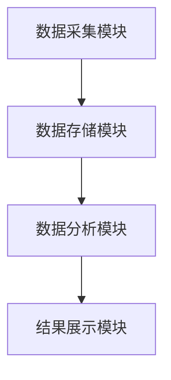

                 


# 利用智能体协作进行全面的公司创新网络影响力评估

## 关键词：智能体协作、创新网络、影响力评估、算法原理、系统设计、项目实战

## 摘要：  
随着全球竞争的加剧，企业创新网络的影响力评估变得越来越重要。传统的评估方法往往依赖于主观判断和静态数据，难以捕捉动态变化的创新网络。智能体协作作为一种新兴的技术手段，能够通过多智能体之间的协同工作，实时分析和评估创新网络的动态变化，从而提供更全面、更精准的影响力评估。本文将从背景介绍、核心概念、算法原理、系统设计、项目实战等多个维度，详细探讨如何利用智能体协作进行全面的公司创新网络影响力评估。

---

# 第1章: 背景介绍

## 1.1 创新网络的定义与重要性  
创新网络是指由企业、研究机构、合作伙伴、客户等多方参与者构成的一个动态交互网络。它通过知识共享、资源整合和协同创新，推动企业的技术进步和市场竞争力。创新网络的重要性在于，它能够帮助企业突破传统边界，充分利用外部资源，形成竞争优势。  

### 1.1.1 创新网络的核心要素  
- **参与者**：包括企业、供应商、客户、合作伙伴、研究机构等。  
- **关系**：参与者之间的合作、竞争、资源共享等关系。  
- **知识流**：知识在参与者之间的流动和共享。  
- **影响力**：参与者在创新网络中的影响力，包括技术影响力、市场影响力、资源影响力等。  

## 1.2 问题描述  
传统的企业创新网络影响力评估方法通常依赖于静态数据和主观判断，难以捕捉创新网络的动态变化。例如，传统的影响力评估可能基于企业的市场份额、研发投入等指标，但这些指标无法反映创新网络中参与者之间的协同效应和动态变化。  

### 1.2.1 传统评估方法的局限性  
- 数据采集困难：创新网络涉及多方参与者，数据分散且难以整合。  
- 动态性不足：传统评估方法通常基于静态数据，无法反映实时变化。  
- 协同效应难以量化：创新网络的核心在于协同创新，但传统方法难以量化协同效应。  

## 1.3 智能体协作的优势与潜力  
智能体协作是一种基于多智能体系统的协作方式，通过智能体之间的协同工作，实时分析和评估创新网络的动态变化。智能体协作的优势在于：  
- **实时性**：智能体能够实时感知创新网络的变化，并快速做出响应。  
- **分布式计算**：通过分布式计算，智能体可以高效处理大规模数据。  
- **自适应性**：智能体可以根据环境变化自适应调整协作策略。  

---

# 第2章: 智能体协作与创新网络的核心概念

## 2.1 智能体协作的原理  
智能体协作是指多个智能体通过协同工作，完成复杂任务的过程。智能体之间通过通信和协调，实现信息共享、任务分配和决策优化。  

### 2.1.1 智能体的基本定义  
智能体（Agent）是指能够感知环境、自主决策并采取行动的实体。智能体可以是软件程序、机器人或其他具备智能行为的实体。  

### 2.1.2 协作机制的数学模型  
协作机制可以通过数学模型描述，例如基于博弈论的协作模型，其中每个智能体的目标函数是协作收益的函数。  

$$ \text{协作收益} = \sum_{i=1}^{n} \alpha_i x_i $$  
其中，$\alpha_i$是智能体$i$的权重，$x_i$是智能体$i$的贡献。  

## 2.2 创新网络影响力评估的原理  
创新网络影响力评估的核心是通过分析参与者之间的关系和知识流，量化每个参与者的影响力。  

### 2.2.1 影响力的定义与度量  
影响力是指参与者在创新网络中的重要性，通常通过参与者之间的连接强度、知识贡献和资源控制能力来度量。  

### 2.2.2 网络分析的基本方法  
- **社会网络分析**：通过分析参与者之间的关系，构建社会网络图。  
- **影响力传播模型**：通过影响力传播模型（如PageRank）量化参与者的影响力。  

## 2.3 智能体协作与创新网络的联系  
智能体协作与创新网络密切相关。智能体协作可以看作是创新网络的一种动态表现形式，而创新网络则是智能体协作的背景和环境。  

### 2.3.1 协作机制与网络结构的关系  
- 智能体协作的机制决定了创新网络的结构。  
- 创新网络的结构反过来影响智能体协作的效果。  

### 2.3.2 智能体行为对网络影响力的影响  
智能体的行为（如知识共享、资源分配）直接影响创新网络中各参与者的影响力。  

## 2.4 概念属性特征对比  

| 概念 | 属性 | 特征 |
|------|------|------|
| 智能体协作 | 分布式计算 | 多智能体协同工作 |
| 创新网络 | 网络结构 | 参与者之间的关系 |
| 协作机制 | 协同收益 | 智能体之间的协作收益 |

---

# 第3章: 算法原理讲解

## 3.1 协同过滤算法  
协同过滤是一种常用的影响评估算法，通过分析参与者之间的相似性，推荐高影响力的参与者。  

### 3.1.1 算法步骤  
1. 构建参与者关系矩阵。  
2. 计算参与者之间的相似性。  
3. 推荐高影响力的参与者。  

### 3.1.2 算法实现  
```python
def collaborative_filtering(matrix):
    # 计算相似性
    similarity = cosine_similarity(matrix)
    # 推荐高影响力的参与者
    top_influencers = similarity.argsort()[:, -5:]
    return top_influencers
```

### 3.1.3 算法优势  
- 计算效率高。  
- 适用于大规模数据。  

## 3.2 影响力传播算法  
影响力传播算法通过模拟影响力在创新网络中的传播，量化每个参与者的影响力。  

### 3.2.1 算法步骤  
1. 初始化影响力值。  
2. 迭代传播影响力。  
3. 输出影响力排序。  

### 3.2.2 算法实现  
```python
def influence_spread(matrix):
    # 初始化影响力值
    influence = np.ones(matrix.shape[0])
    # 迭代传播影响力
    for _ in range(10):
        influence = matrix.dot(influence)
    # 输出影响力排序
    return influence.argsort()
```

## 3.3 算法的数学模型  
影响力传播模型的数学模型可以表示为：  

$$ I^{(t+1)} = \alpha I^{(t)} + (1-\alpha) A I^{(t)} $$  

其中，$I^{(t)}$表示第$t$次迭代的影响力向量，$A$是创新网络的邻接矩阵，$\alpha$是衰减系数。  

---

# 第4章: 系统分析与架构设计方案

## 4.1 系统功能设计  
系统功能设计包括数据采集、数据分析、结果展示等模块。  

### 4.1.1 数据采集模块  
- 采集创新网络中的参与者数据。  
- 采集参与者之间的关系数据。  

### 4.1.2 数据分析模块  
- 应用协同过滤和影响力传播算法进行分析。  
- 生成影响力排序结果。  

### 4.1.3 结果展示模块  
- 可视化展示创新网络结构。  
- 展示参与者影响力排序。  

## 4.2 系统架构设计  



---

# 第5章: 项目实战

## 5.1 环境安装  
- 安装Python和相关库（如NumPy、scikit-learn）。  
- 安装可视化工具（如Matplotlib）。  

## 5.2 系统核心实现  
```python
import numpy as np
from sklearn.metrics.pairwise import cosine_similarity

def collaborative_filtering(matrix):
    similarity = cosine_similarity(matrix)
    top_influencers = similarity.argsort()[:, -5:]
    return top_influencers

def influence_spread(matrix):
    influence = np.ones(matrix.shape[0])
    for _ in range(10):
        influence = matrix.dot(influence)
    return influence.argsort()
```

## 5.3 实际案例分析  
以某科技公司为例，分析其创新网络中的参与者影响力。  

---

# 第6章: 总结与展望

## 6.1 最佳实践 tips  
- 数据质量是影响评估结果的关键。  
- 算法选择应根据具体场景灵活调整。  

## 6.2 小结  
智能体协作是一种强大的工具，能够全面评估公司创新网络的影响力。通过协同过滤和影响力传播算法，可以量化参与者的影响，为企业决策提供支持。  

## 6.3 注意事项  
- 数据隐私问题需要重视。  
- 算法的可解释性需要进一步优化。  

## 6.4 拓展阅读  
- 多智能体系统相关书籍。  
- 网络影响力评估的最新研究。  

---

# 作者：AI天才研究院 & 禅与计算机程序设计艺术

