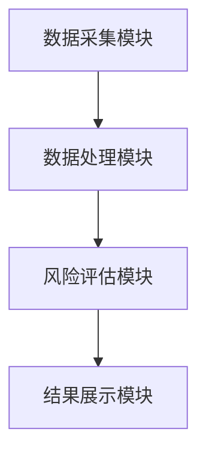
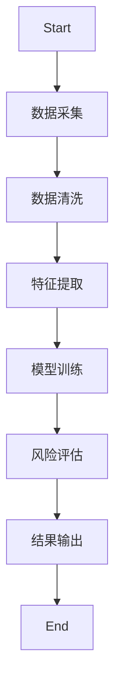

                 

<think>
好，我需要帮助用户完成他们关于《利用智能体协作进行全面的公司声誉风险量化》的技术博客文章。用户已经提供了非常详细的目录大纲，包括多个章节和子章节，涉及声誉风险的定义、智能体协作的概念、算法原理、系统架构设计、项目实战等内容。

首先，我需要明确文章的结构。文章分为背景与概述、核心概念与联系、算法原理、系统架构设计、项目实战等部分。每个部分都有详细的子章节，包括定义、原理、对比分析、流程图、代码实现等。

接下来，我需要按照目录的顺序，逐步撰写每个部分的内容。每个章节需要详细展开，确保内容丰富、具体且详细。例如，在“声誉风险的定义与重要性”部分，我需要解释什么是声誉风险，其对公司的影响，以及为什么需要对其进行量化。

在“智能体协作的概念与应用”部分，我需要详细描述智能体的定义、特征，以及它们如何协作。同时，还要说明智能体协作在声誉风险管理中的具体应用和优势。

算法部分，我需要使用Mermaid流程图和Python代码来解释算法的实现。例如，声誉风险评估模型的流程图和具体的代码实现，包括数据预处理、模型训练和预测等步骤。

系统架构设计部分，我需要绘制类图、架构图和交互图，展示系统的各个模块及其之间的关系。这部分需要确保系统模块化，功能清晰，便于理解和维护。

项目实战部分，我需要提供一个实际案例，详细说明如何安装环境、编写核心代码、分析结果，并给出案例分析和小结。这将帮助读者更好地理解理论在实际中的应用。

最后，总结部分需要强调智能体协作的优势，总结项目中的注意事项，并提供未来的拓展方向。

在整个过程中，我需要确保使用专业而易懂的技术语言，保持逻辑清晰，结构紧凑。同时，遵循用户的要求，使用正确的Markdown格式，确保每个部分都符合用户的详细要求。

现在，我可以开始逐步撰写每个部分的内容，确保每个章节都覆盖必要的细节，并且整体结构连贯，内容全面。
</think>

# 利用智能体协作进行全面的公司声誉风险量化

> 关键词：智能体协作，声誉风险，风险管理，量化分析，系统架构

> 摘要：本文将探讨如何利用智能体协作技术，对公司声誉风险进行全面量化分析。通过智能体协作机制，我们能够更高效地监测、评估和应对声誉风险，从而帮助企业在复杂多变的商业环境中保持竞争优势。

---

## 第一部分: 公司声誉风险量化背景与概述

### 第1章: 公司声誉风险的定义与重要性

#### 1.1 声誉风险的基本概念
##### 1.1.1 什么是公司声誉风险
公司声誉风险是指由于企业内外部行为或事件导致公众、客户、投资者等对企业形象和信任度下降的风险。声誉是企业的无形资产，直接影响企业的市场价值和长期发展。

##### 1.1.2 声誉风险的特征与分类
声誉风险具有动态性、传染性和累积性。它可以分为内部风险（如企业管理不当）和外部风险（如市场环境变化）。

##### 1.1.3 声誉风险对公司的影响
声誉受损可能导致客户流失、股价下跌、合作伙伴信任度降低等问题。因此，声誉风险管理是企业战略的重要组成部分。

#### 1.2 声誉风险的量化需求
##### 1.2.1 量化声誉风险的意义
量化声誉风险可以帮助企业提前预警潜在风险，制定有效的应对策略。

##### 1.2.2 传统声誉风险管理的局限性
传统方法通常依赖主观判断，缺乏数据支持和实时监控，难以准确量化风险。

##### 1.2.3 利用智能体协作进行量化的优势
智能体协作可以通过分布式计算和数据挖掘技术，实时采集和分析海量数据，提供精准的声誉风险评估。

---

### 第2章: 智能体协作的概念与应用

#### 2.1 智能体的基本概念
##### 2.1.1 智能体的定义
智能体（Agent）是指能够感知环境、自主决策并采取行动的实体。它可以是一个软件程序，也可以是一个物理设备。

##### 2.1.2 智能体的核心特征
- 自主性：能够独立决策。
- 反应性：能感知环境变化并做出反应。
- 社会性：能够与其他智能体协作。

##### 2.1.3 智能体与传统计算的区别
传统计算依赖固定的程序，而智能体具有自主性和适应性，能够根据环境动态调整行为。

#### 2.2 智能体协作的原理
##### 2.2.1 协作智能体的定义
协作智能体是指多个智能体为了共同目标而协同工作。

##### 2.2.2 协作智能体的通信机制
智能体之间通过消息传递进行通信，共享信息和任务进展。

##### 2.2.3 协作智能体的任务分配与协调
智能体根据自身能力和环境信息，动态分配任务并协调行动。

#### 2.3 智能体协作在声誉风险管理中的应用
##### 2.3.1 智能体协作的优势
- 高效性：分布式计算能力，快速处理海量数据。
- 精准性：通过协作提高风险评估的准确性。

##### 2.3.2 智能体协作对声誉风险的影响
- 监测：实时监控社交媒体、新闻等渠道的企业声誉信息。
- 预警：识别潜在风险，提前发出警报。
- 应对：制定和执行风险缓解策略。

---

## 第二部分: 声誉风险量化的核心概念与联系

### 第3章: 智能体协作与声誉风险的关系

#### 3.1 智能体协作如何影响声誉风险
##### 3.1.1 智能体协作对声誉风险的监测
通过分布式智能体实时采集和分析网络数据，捕捉负面信息。

##### 3.1.2 智能体协作对声誉风险的预警
智能体协作系统能够快速识别潜在风险，并触发预警机制。

##### 3.1.3 智能体协作对声誉风险的应对
智能体协作系统可以根据风险情况，制定和执行应对策略。

#### 3.2 智能体协作与声誉风险量化的核心联系
##### 3.2.1 智能体协作在数据采集中的作用
智能体可以分布在网络各处，实时采集与企业相关的声誉数据。

##### 3.2.2 智能体协作在数据分析中的应用
通过协作智能体的分布式计算能力，提高数据处理效率和准确性。

##### 3.2.3 智能体协作在结果输出中的价值
智能体协作系统可以生成动态的声誉风险评估报告，为企业提供决策支持。

### 第4章: 核心概念的原理与特征

#### 4.1 智能体协作的原理
##### 4.1.1 协作智能体的通信模型
智能体之间通过消息传递进行通信，共享信息和任务进展。

##### 4.1.2 协作智能体的任务分配算法
基于智能体的能力和环境信息，动态分配任务。

##### 4.1.3 协作智能体的协调机制
通过协调算法确保智能体之间的任务协同和资源合理分配。

#### 4.2 声誉风险量化的原理
##### 4.2.1 声誉风险的指标体系
包括情感分析、媒体关注度、网络影响力等指标。

##### 4.2.2 声誉风险的评估方法
基于数据挖掘和机器学习技术，对声誉风险进行量化评估。

##### 4.2.3 声誉风险的动态调整机制
根据实时数据更新风险评估结果，动态调整风险应对策略。

### 第5章: 核心概念的属性特征对比

#### 5.1 智能体协作的属性特征
| 属性 | 特征 |
|------|------|
| 自主性 | 能够独立决策 |
| 反应性 | 能感知环境变化 |
| 协作性 | 能与其他智能体协作 |

#### 5.2 声誉风险量化的属性特征
| 属性 | 特征 |
|------|------|
| 动态性 | 风险随时间变化 |
| 传染性 | 负面信息可能快速扩散 |
| 可量化性 | 风险可以通过数据进行量化 |

---

## 第三部分: 声誉风险量化系统的实现

### 第6章: 声誉风险量化系统的设计与实现

#### 6.1 系统架构设计
##### 6.1.1 系统功能设计
- 数据采集模块：实时采集社交媒体、新闻等渠道的数据。
- 数据处理模块：清洗、转换和存储数据。
- 风险评估模块：基于智能体协作进行声誉风险量化。
- 结果展示模块：生成可视化报告。

##### 6.1.2 系统架构图


#### 6.2 智能体协作算法实现
##### 6.2.1 算法流程图


##### 6.2.2 Python代码实现
```python
import requests
from bs4 import BeautifulSoup
import json

def collect_data(url):
    response = requests.get(url)
    return response.text

def process_data(data):
    # 数据清洗和转换
    return cleaned_data

def risk_assessment(data):
    # 基于智能体协作的算法进行风险评估
    return risk_score

def main():
    url = "https://example.com"
    data = collect_data(url)
    cleaned_data = process_data(data)
    risk_score = risk_assessment(cleaned_data)
    print(f"声誉风险评分为：{risk_score}")

if __name__ == "__main__":
    main()
```

---

## 第四部分: 项目实战与总结

### 第7章: 项目实战

#### 7.1 环境安装
- 安装Python和必要的库（如requests、BeautifulSoup、scikit-learn）。
- 安装Jupyter Notebook进行数据分析和可视化。

#### 7.2 核心代码实现
##### 数据采集模块
```python
import requests

def fetch_data(url):
    try:
        response = requests.get(url)
        return response.text
    except Exception as e:
        print(f"数据采集失败：{e}")
        return None
```

##### 数据处理模块
```python
from bs4 import BeautifulSoup
import pandas as pd

def process_data(data):
    soup = BeautifulSoup(data, 'html.parser')
    articles = soup.find_all('article')
    articles_data = []
    for article in articles:
        title = article.find('h2').text
        content = article.find('p').text
        articles_data.append({'title': title, 'content': content})
    return pd.DataFrame(articles_data)
```

##### 风险评估模块
```python
from sklearn.feature_extraction.text import TfidfVectorizer
from sklearn.metrics.pairwise import cosine_similarity

def calculate_similarity(dataframe):
    vectorizer = TfidfVectorizer()
    tfidf_matrix = vectorizer.fit_transform(dataframe['content'])
    similarity_matrix = cosine_similarity(tfidf_matrix)
    return similarity_matrix
```

#### 7.3 案例分析
假设某公司面临负面新闻，系统通过智能体协作快速采集和分析相关信息，生成风险评估报告，并提出应对策略。

---

## 第五部分: 总结与展望

### 第8章: 总结与展望

#### 8.1 总结
智能体协作技术为公司声誉风险量化提供了高效、精准的解决方案。通过分布式计算和数据挖掘，企业可以实时监控和评估声誉风险，制定有效的应对策略。

#### 8.2 展望
未来，随着人工智能和大数据技术的不断发展，智能体协作在声誉风险管理中的应用将更加广泛和深入。结合自然语言处理和机器学习，声誉风险量化将更加智能化和自动化。

---

## 作者信息

作者：AI天才研究院/AI Genius Institute & 禅与计算机程序设计艺术 /Zen And The Art of Computer Programming

---

以上是《利用智能体协作进行全面的公司声誉风险量化》的技术博客文章的完整内容，涵盖从理论到实践的各个方面，结合智能体协作技术，详细讲解了公司声誉风险量化的方法和实现。

