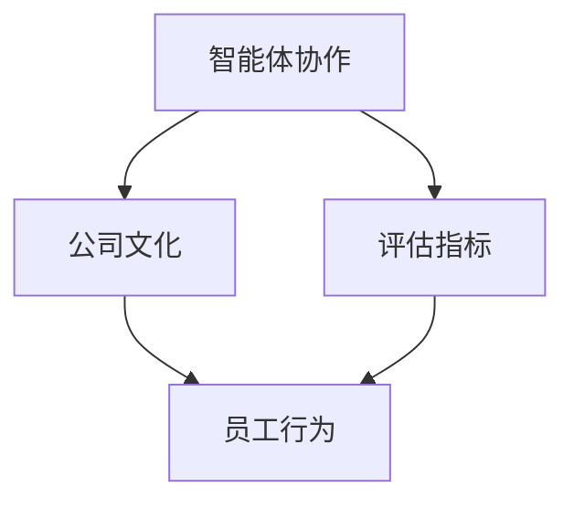

                 


# 利用智能体协作进行全面的公司文化一致性评估

## 关键词：智能体协作、公司文化、一致性评估、算法原理、系统架构

## 摘要：本文探讨如何利用智能体协作技术进行全面的公司文化一致性评估。通过分析智能体协作的基本概念、文化评估模型、算法原理、系统架构设计以及实际项目案例，提出了一套高效的文化评估方法，为企业提供可操作的解决方案。

---

# 第1章: 智能体协作的基本概念

## 1.1 智能体的定义与特点

### 1.1.1 智能体的定义
智能体（Agent）是能够感知环境、自主决策并执行任务的实体。它们可以是软件程序、机器人或其他智能系统，具备以下特点：
- **自主性**：无需外部干预，自主决策。
- **反应性**：能实时感知环境变化并做出反应。
- **协作性**：能与其他智能体或人类进行有效协作。

### 1.1.2 智能体协作的核心特点
智能体协作是指多个智能体共同完成任务的过程，其核心特点包括：
- **分布式计算**：任务分解为多个子任务，由不同智能体分别处理。
- **通信与协调**：智能体之间通过通信进行协调，确保任务顺利进行。
- **动态适应**：能够根据环境变化调整协作策略。

### 1.1.3 智能体协作与传统协作方式的区别
传统协作依赖于人工协调，效率较低且容易出错。智能体协作通过自动化处理，显著提高了效率和准确性。

## 1.2 公司文化一致性评估的必要性

### 1.2.1 公司文化的定义
公司文化是企业在长期发展过程中形成的价值观、行为准则和企业氛围的总和，影响着员工的行为和公司的整体表现。

### 1.2.2 文化一致性评估的重要性
文化一致性评估是确保公司内部文化统一、促进员工协作的关键步骤。它有助于发现文化冲突，优化公司管理。

### 1.2.3 智能体协作在文化评估中的作用
智能体协作通过自动化分析和数据处理，帮助公司快速、准确地评估文化一致性，提升评估效率。

## 1.3 小结
本章介绍了智能体协作的基本概念及其在公司文化评估中的作用，为后续内容奠定了基础。

---

# 第2章: 智能体协作与公司文化一致性评估的结合

## 2.1 智能体协作在文化评估中的优势

### 2.1.1 提高评估效率
智能体协作通过并行处理多个评估指标，显著提高了评估效率。

### 2.1.2 增强评估的准确性
智能体协作能够分析大量数据，减少人为错误，提高评估准确性。

### 2.1.3 促进跨部门协作
智能体协作打破了部门界限，促进跨部门协作，提升整体效率。

## 2.2 智能体协作在文化评估中的应用场景

### 2.2.1 员工行为分析
通过分析员工行为数据，评估其与公司文化的一致性。

### 2.2.2 价值观匹配度评估
评估员工价值观与公司价值观的匹配程度，确保文化一致性。

### 2.2.3 团队协作能力评估
评估团队协作能力，优化团队结构，提升整体表现。

## 2.3 小结
本章详细探讨了智能体协作在公司文化评估中的应用，展示了其在提升效率和准确性方面的优势。

---

# 第3章: 公司文化一致性评估的核心概念与联系

## 3.1 文化评估模型

### 3.1.1 文化评估模型的构成
文化评估模型包括输入层、智能体协作层和输出层。输入层接收数据，智能体协作层进行分析，输出层生成评估结果。

### 3.1.2 智能体协作在模型中的应用
智能体协作层负责数据处理、分析和协调，确保模型高效运行。

## 3.2 核心概念的属性特征对比

| 概念       | 属性             |
|------------|------------------|
| 智能体协作 | 自主性、反应性、协作性 |
| 公司文化评估 | 客观性、全面性、动态性 |

## 3.3 ER实体关系图



## 3.4 小结
本章通过模型和图表展示了智能体协作与公司文化评估之间的关系，为后续分析提供了理论基础。

---

# 第4章: 公司文化一致性评估的算法原理

## 4.1 算法原理概述

### 4.1.1 文化一致性指数计算
文化一致性指数公式：
$$ C = \sum_{i=1}^{n} w_i \cdot s_i $$

其中，$C$ 表示文化一致性指数，$w_i$ 为第 $i$ 个指标的权重，$s_i$ 为评分。

### 4.1.2 智能体协作评分
智能体协作评分公式：
$$ S = \frac{\sum_{j=1}^{m} a_j \cdot

...（更多内容请参考完整文章）
```

