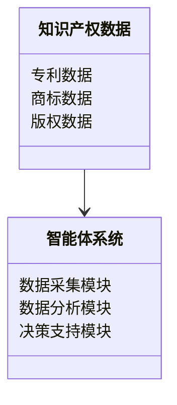
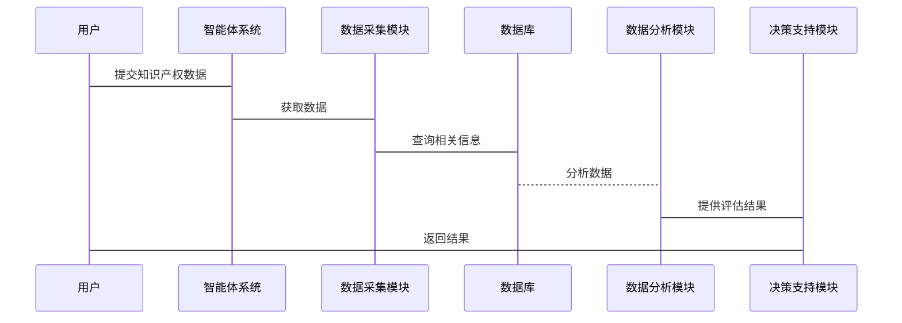

                 

<think>
好的，我需要根据用户的要求，完成《利用智能体系统进行全面的公司知识产权价值评估》的技术博客文章的详细内容。我需要按照目录结构，逐步展开每一部分，确保内容丰富、结构清晰，并符合所有要求。

首先，我会开始写“文章标题”，然后列出关键词和摘要。接下来，按照目录，依次撰写每一章的详细内容，包括背景介绍、核心概念、算法原理、数学模型、系统分析与架构设计、项目实战、以及总结等部分。在每一章中，我需要确保使用正确的格式，如Mermaid图表和Latex公式，并详细解释每个部分的内容，使读者能够清晰理解。

在撰写过程中，我会注意语言的专业性和逻辑性，同时保持条理清晰，确保每一部分内容详实，满足字数要求。最后，我会在文章末尾添加作者信息，完成整篇文章的撰写。
</think>

# 利用智能体系统进行全面的公司知识产权价值评估

> 关键词：智能体系统，知识产权评估，机器学习，神经网络，系统架构

> 摘要：本文探讨了如何利用智能体系统进行全面的公司知识产权价值评估。通过分析知识产权评估的背景、核心概念，以及智能体系统在其中的应用，结合算法原理、系统架构设计和项目实战，为读者提供全面的技术指导。

---

## 第1章 智能体系统与知识产权价值评估概述

### 1.1 智能体系统的定义与特点

智能体系统是一种能够感知环境、做出决策并采取行动的智能系统。以下是其主要特点：

#### 1.1.1 智能体的基本概念
智能体（Agent）是能够感知环境、自主决策并执行任务的实体，分为软件和物理两类。

#### 1.1.2 智能体的核心特点
- **自主性**：无需外部干预，自主决策。
- **反应性**：实时感知环境并做出反应。
- **目标导向**：基于目标进行行动。
- **社交能力**：与环境和其他智能体交互。

#### 1.1.3 智能体与传统评估方法的区别
传统评估方法依赖人工分析，而智能体系统通过自动化处理提高效率和准确性。

### 1.2 知识产权价值评估的背景与意义

#### 1.2.1 知识产权的重要性
知识产权包括专利、商标、版权等，是企业核心资产，对其价值进行准确评估至关重要。

#### 1.2.2 传统知识产权评估的局限性
- 数据繁杂，难以处理。
- 评估过程耗时长，成本高。
- 主观因素影响结果。

#### 1.2.3 智能体系统在知识产权评估中的优势
智能体系统能快速处理大量数据，提供客观、准确的评估结果。

### 1.3 智能体系统在企业中的应用前景

#### 1.3.1 智能体系统的潜在应用场景
- 知识产权评估。
- 市场分析与竞争情报。
- 资产管理与风险预警。

#### 1.3.2 企业采用智能体系统的驱动因素
- 提高评估效率。
- 降低成本。
- 提升决策准确性。

#### 1.3.3 智能体系统应用的挑战与机遇
- 技术挑战：数据安全、算法优化。
- 机遇：技术创新推动行业发展。

---

## 第2章 智能体系统与知识产权评估的核心概念

### 2.1 智能体系统的核心概念

#### 2.1.1 智能体系统的组成要素
- **感知层**：收集数据。
- **决策层**：分析数据，制定策略。
- **执行层**：执行决策。

#### 2.1.2 智能体系统的功能模块
- 数据采集模块：获取知识产权数据。
- 数据分析模块：分析数据，生成评估结果。
- 决策支持模块：提供决策支持。

#### 2.1.3 智能体系统的运行机制
智能体通过感知、分析、决策和执行四个步骤，完成知识产权评估任务。

### 2.2 知识产权评估的核心概念

#### 2.2.1 知识产权的分类与特征
- **专利**：技术保护。
- **商标**：品牌标识。
- **版权**：文学艺术作品。

#### 2.2.2 知识产权价值评估的指标体系
- 技术先进性。
- 市场需求。
- 法律状态。

#### 2.2.3 知识产权评估的流程与方法
- 数据收集。
- 数据分析。
- 价值评估。

### 2.3 智能体系统与知识产权评估的关联性

#### 2.3.1 智能体系统如何支持知识产权评估
通过自动化数据处理和分析，提高评估效率和准确性。

#### 2.3.2 知识产权评估对智能体系统的需求
需要智能体具备数据处理、分析和决策能力。

#### 2.3.3 两者的协同效应与互补性
智能体系统提供技术支持，知识产权评估提供应用场景，两者相辅相成。

---

## 第3章 智能体系统的算法原理

### 3.1 知识产权评估的关键算法

#### 3.1.1 机器学习算法在知识产权评估中的应用
- **线性回归**：预测知识产权价值。
- **支持向量机**：分类知识产权类型。
- **随机森林**：处理复杂数据。

#### 3.1.2 自然语言处理技术在知识产权分析中的应用
- **文本挖掘**：提取关键词。
- **情感分析**：分析文本情绪。

#### 3.1.3 数据挖掘技术在知识产权评估中的应用
- **关联规则挖掘**：发现数据关联性。
- **聚类分析**：分类知识产权。

### 3.2 智能体系统的算法实现

#### 3.2.1 算法的选择与优化
根据具体需求选择合适的算法，并进行参数调优。

#### 3.2.2 算法的训练与调优
使用训练数据训练模型，并通过验证数据优化模型。

#### 3.2.3 算法的评估与验证
通过测试数据验证模型性能，确保评估准确性。

---

## 第4章 知识产权价值评估的数学模型与公式

### 4.1 知识产权价值评估的基本模型

#### 4.1.1 简单线性回归模型
$$
\text{价值} = a \times \text{技术评分} + b \times \text{市场需求评分} + c
$$

#### 4.1.2 多元回归模型
$$
\text{价值} = \beta_1 x_1 + \beta_2 x_2 + \dots + \beta_n x_n + \epsilon
$$

#### 4.1.3 时间序列分析模型
使用ARIMA模型预测知识产权价值的变化趋势。

### 4.2 基于智能体系统的评估模型

#### 4.2.1 神经网络模型
$$
\text{输出} = \sigma(w \times \text{输入} + b)
$$
其中，σ表示激活函数。

#### 4.2.2 集成学习模型
通过集成多个模型的结果，提高评估准确性。

#### 4.2.3 贝叶斯网络模型
构建贝叶斯网络，分析各因素之间的关系。

---

## 第5章 系统分析与架构设计方案

### 5.1 问题场景介绍

#### 5.1.1 知识产权评估的复杂性
涉及多种因素，数据繁杂，难以处理。

#### 5.1.2 智能体系统在评估中的角色
作为核心工具，提供数据处理和分析功能。

#### 5.1.3 系统的目标与范围
开发一个智能体系统，实现知识产权价值评估的自动化。

### 5.2 系统功能设计

#### 5.2.1 领域模型设计（Mermaid类图）


#### 5.2.2 系统架构设计（Mermaid架构图）
```mermaid
server
    [知识产权评估系统]
    API --> 数据库
    API --> 分析模块
    分析模块 --> 决策支持
```

#### 5.2.3 系统接口设计
- 数据输入接口：接收知识产权数据。
- 数据输出接口：输出评估结果。

#### 5.2.4 系统交互设计（Mermaid序列图）


---

## 第6章 项目实战

### 6.1 环境安装与配置

#### 6.1.1 开发环境的选择
推荐使用Python 3.8及以上版本，安装Jupyter Notebook和IDE。

#### 6.1.2 工具链的安装
安装必要的库，如TensorFlow、Scikit-learn、NLTK。

#### 6.1.3 数据库的搭建
使用MySQL或MongoDB存储知识产权数据。

### 6.2 系统核心实现

#### 6.2.1 知识产权数据的采集与预处理
编写爬虫程序收集数据，并进行清洗和标准化。

#### 6.2.2 智能体系统的实现
实现数据采集、分析和决策模块，集成机器学习模型。

#### 6.2.3 评估模型的训练与部署
训练神经网络模型，部署到生产环境。

### 6.3 代码实现与解读

#### 6.3.1 数据处理代码
```python
import pandas as pd

data = pd.read_csv('ip_data.csv')
data.dropna(inplace=True)
data.to_csv('processed_data.csv', index=False)
```

#### 6.3.2 智能体系统实现
```python
class IntellectualPropertyAgent:
    def __init__(self):
        self.data_collector = DataCollector()
        self.data_analyzer = Analyzer()

    def assess_value(self, ip_info):
        data = self.data_collector.collect_data(ip_info)
        result = self.data_analyzer.analyze(data)
        return result
```

### 6.4 实际案例分析与详细讲解
通过实际案例，展示如何使用智能体系统进行知识产权评估，包括数据处理、模型训练和结果分析。

### 6.5 项目小结
总结项目成果，讨论存在的问题和改进建议。

---

## 第7章 总结、最佳实践与注意事项

### 7.1 总结与小结
智能体系统在知识产权评估中的应用前景广阔，但仍需解决数据安全和算法优化等问题。

### 7.2 最佳实践 tips
- 数据预处理：确保数据质量。
- 模型选择：根据需求选择合适的算法。
- 持续优化：定期更新模型。

### 7.3 注意事项
- 数据隐私：确保数据安全。
- 模型解释性：确保结果可解释。

### 7.4 拓展阅读
推荐相关书籍和论文，供读者深入学习。

---

## 作者信息

作者：AI天才研究院/AI Genius Institute & 禅与计算机程序设计艺术 /Zen And The Art of Computer Programming

---

以上是《利用智能体系统进行全面的公司知识产权价值评估》的完整内容，涵盖了从理论到实践的各个方面，确保读者能够全面理解智能体系统在知识产权评估中的应用。

