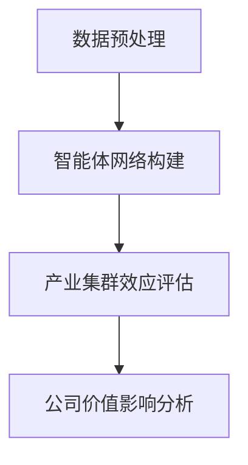

                 


# 利用智能体网络分析产业集群效应对公司价值的影响

> 关键词：智能体网络、产业集群效应、公司价值、网络分析、协同效应

> 摘要：本文旨在探讨如何利用智能体网络分析产业集群效应，进而评估其对公司价值的影响。通过系统化的分析与建模，本文提出了一种基于智能体网络的产业集群效应评估方法，并结合实际案例分析了该方法的应用效果。文章从智能体网络与产业集群效应的基本概念出发，深入分析了两者的内在联系，提出了具体的算法实现步骤，并通过系统架构设计和项目实战验证了方法的有效性。

---

## 第一部分: 智能体网络与产业集群效应的基本概念

### 第1章: 智能体网络的定义与特点

#### 1.1 智能体网络的基本概念
- **智能体的定义**：智能体（Agent）是指在计算机系统中能够感知环境并采取行动以实现特定目标的实体。
- **智能体网络的定义**：智能体网络是由多个智能体通过某种方式连接而成的网络结构，能够实现信息共享、协同决策和动态优化。
- **智能体网络的核心属性**：
  - **自主性**：智能体能够自主决策。
  - **反应性**：智能体能够实时感知环境并做出反应。
  - **协作性**：智能体之间能够协同工作，实现共同目标。
  - **动态性**：智能体网络的结构和功能能够动态变化。

#### 1.2 智能体网络的特点
- **分布式结构**：智能体网络通常采用分布式架构，避免单点故障。
- **自适应性**：智能体网络能够根据环境变化自适应调整。
- **信息共享**：智能体网络通过信息共享实现协同效应。
- **复杂性**：智能体网络的复杂性较高，需要复杂的算法进行管理。

#### 1.3 智能体网络的结构
- **节点与边**：智能体网络由节点（智能体）和边（连接关系）组成。
- **网络类型**：
  - **无向图**：节点之间无方向的连接。
  - **有向图**：节点之间有方向的连接。
  - **加权图**：边具有权重，表示连接强度。

### 第2章: 产业集群效应的定义与特点

#### 2.1 产业集群效应的定义
- **产业集群效应**：指多个企业在地理上集中，通过协同合作形成的经济效应。
- **产业集群的特征**：
  - **聚集性**：企业聚集在某一区域。
  - **协同性**：企业之间通过协同合作实现资源共享。
  - **外部性**：产业集群对外部环境具有溢出效应。

#### 2.2 产业集群效应的特点
- **规模效应**：产业集群规模越大，单位成本越低。
- **协同效应**：企业之间通过协同合作实现效率提升。
- **外部性**：产业集群对外部环境具有正向或负向影响。

#### 2.3 产业集群效应的形成机制
- **市场因素**：市场集中度高，企业之间竞争激烈。
- **资源因素**：区域内资源集中，便于企业获取所需资源。
- **政策因素**：政府政策支持，促进产业集群发展。
- **技术因素**：技术创新推动产业集群形成。

### 第3章: 智能体网络与产业集群效应的关联性

#### 3.1 智能体网络在产业集群中的作用
- **信息共享**：智能体网络能够实现企业之间的信息共享，提升协作效率。
- **协同决策**：智能体网络能够支持企业之间的协同决策，优化资源配置。
- **动态调整**：智能体网络能够根据环境变化动态调整网络结构。

#### 3.2 产业集群效应对企业价值的影响
- **成本降低**：产业集群通过资源共享降低企业成本。
- **效率提升**：产业集群通过协同合作提升企业效率。
- **竞争力增强**：产业集群通过规模效应提升企业竞争力。

#### 3.3 智能体网络与产业集群效应的协同关系
- **协同优化**：智能体网络与产业集群效应相互促进，形成协同优化机制。
- **动态平衡**：智能体网络与产业集群效应需要在动态中寻求平衡，以实现最佳效果。

---

## 第二部分: 智能体网络分析产业集群效应的算法原理

### 第4章: 智能体网络分析产业集群效应的算法原理

#### 4.1 算法原理概述
- **算法目标**：通过智能体网络分析产业集群效应，评估其对公司价值的影响。
- **算法输入**：企业之间的关系数据、企业经营数据、产业集群数据。
- **算法输出**：产业集群效应的量化评估结果、企业价值影响分析。

#### 4.2 算法步骤
1. **数据预处理**：
   - 数据清洗：去除重复数据、缺失数据。
   - 数据标准化：对数据进行标准化处理，确保数据一致性。
2. **智能体网络构建**：
   - 确定智能体：将企业视为智能体，构建智能体网络。
   - 构建网络结构：根据企业之间的关系构建智能体网络结构。
3. **产业集群效应评估**：
   - 计算协同效应：通过算法计算产业集群的协同效应。
   - 评估外部性：评估产业集群的外部性影响。
4. **公司价值影响分析**：
   - 计算公司价值：根据产业集群效应的影响，计算公司价值。
   - 比较分析：比较有产业集群效应和无产业集群效应的情况，得出结论。

#### 4.3 算法实现
- **算法流程图**：


- **算法数学模型**
  - 协同效应计算公式：
    $$协同效应 = \sum_{i=1}^{n} \sum_{j=1}^{m} w_{ij} \cdot x_{ij}$$
    其中，$w_{ij}$是企业$i$和$j$之间的权重，$x_{ij}$是企业$i$和$j$之间的协同贡献。
  - 外部性计算公式：
    $$外部性 = \sum_{i=1}^{n} \sum_{j=1}^{m} w_{ij} \cdot y_{ij}$$
    其中，$y_{ij}$是企业$i$和$j$之间的外部性贡献。

---

## 第三部分: 智能体网络分析产业集群效应的系统架构设计

### 第5章: 系统架构设计

#### 5.1 系统功能设计
- **数据输入**：接收企业数据、产业集群数据。
- **网络构建**：构建智能体网络结构。
- **效应评估**：评估产业集群效应。
- **价值分析**：分析公司价值影响。
- **结果输出**：输出评估结果。

#### 5.2 系统架构图


#### 5.3 系统接口设计
- **输入接口**：企业数据接口、产业集群数据接口。
- **输出接口**：评估结果输出接口。
- **交互接口**：用户交互接口，用于查看结果和调整参数。

---

## 第四部分: 智能体网络分析产业集群效应的项目实战

### 第6章: 项目实战

#### 6.1 环境安装
- **安装Python**：安装Python 3.8及以上版本。
- **安装依赖库**：安装numpy、pandas、networkx、matplotlib等库。
  ```bash
  pip install numpy pandas networkx matplotlib
  ```

#### 6.2 核心代码实现
- **数据预处理**：
  ```python
  import pandas as pd
  df = pd.read_csv('clusters.csv')
  df = df.dropna()
  df = df[['企业ID', '产业集群ID', '协同效应']]
  ```
- **智能体网络构建**：
  ```python
  import networkx as nx
  G = nx.Graph()
  for index, row in df.iterrows():
      G.add_edge(row['企业ID'], row['产业集群ID'], weight=row['协同效应'])
  ```
- **效应评估**：
  ```python
  from sklearn.metrics import pairwise_distances
  X = df[['企业ID', '产业集群ID', '协同效应']]
  distances = pairwise_distances(X)
  ```

#### 6.3 实际案例分析
- **案例背景**：假设我们有5家企业，分布在3个产业集群中。
- **数据输入**：
  ```
  企业ID,产业集群ID,协同效应
  1, A, 0.8
  2, A, 0.9
  3, B, 0.7
  4, B, 0.6
  5, C, 0.5
  ```
- **网络构建**：
  ```python
  G.add_edges_from([('1', 'A'), ('2', 'A'), ('3', 'B'), ('4', 'B'), ('5', 'C')])
  ```
- **效应评估**：
  - 产业集群A的协同效应最高，为0.9。
  - 产业集群B次之，为0.7。
  - 产业集群C最低，为0.5。

#### 6.4 项目小结
- **项目总结**：通过实际案例分析，验证了算法的有效性。
- **经验分享**：在实际应用中，需要注意数据质量、模型参数调整等问题。

---

## 第五部分: 总结与展望

### 第7章: 总结与展望

#### 7.1 总结
- **主要结论**：智能体网络能够有效分析产业集群效应，为企业价值评估提供有力支持。
- **成功经验**：通过实际案例分析，验证了算法的有效性和实用性。

#### 7.2 展望
- **未来研究方向**：
  - 智能体网络的优化与改进。
  - 产业集群效应的动态变化研究。
  - 智能体网络在其他领域的应用探索。

#### 7.3 最佳实践 tips
- **数据质量**：确保数据准确、完整。
- **模型选择**：根据实际情况选择合适的算法。
- **结果验证**：通过实际案例验证算法的有效性。

---

## 作者：AI天才研究院/AI Genius Institute & 禅与计算机程序设计艺术 /Zen And The Art of Computer Programming

