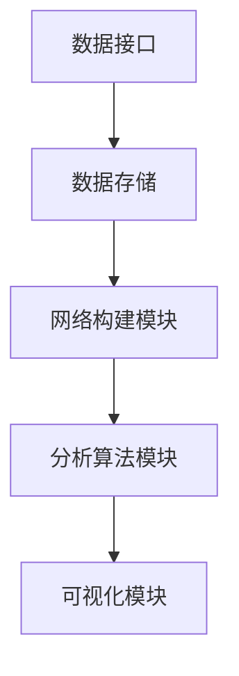

                 

# 利用智能体网络分析公司在产业链中的地位变化

## 关键词：智能体网络，产业链分析，企业地位，网络构建，算法实现

## 摘要：  
随着全球化的深入和市场竞争的加剧，分析公司在产业链中的地位变化变得尤为重要。本文通过智能体网络的构建与分析，探讨如何利用网络理论和技术手段，量化公司之间的关系，评估其在产业链中的影响力和竞争力。文章从智能体网络的基本概念、构建方法、分析算法到实际应用案例，全面阐述了利用智能体网络分析公司产业链地位变化的理论与实践。

---

# 第一章：背景介绍与核心概念

## 1.1 问题背景与意义

### 1.1.1 产业链分析的重要性  
在全球化和数字化的背景下，产业链的复杂性不断增加，公司之间的关系日益紧密。理解一家公司在产业链中的地位，有助于企业制定战略决策、优化资源配置和提升竞争力。传统的产业链分析方法依赖于定性研究，而智能体网络的引入为定量分析提供了新的工具。

### 1.1.2 智能体网络的概念与特点  
智能体网络是一种基于图论的网络模型，将产业链中的公司视为“智能体”，通过节点和边的关系描述公司之间的合作、竞争或依赖关系。智能体网络具有动态性、复杂性和可量化的特点，能够捕捉产业链的实时变化。

### 1.1.3 企业地位变化的分析价值  
通过分析智能体网络，可以量化公司在产业链中的影响力、话语权和核心地位。这种分析不仅能够帮助企业识别自身的优势和劣势，还能为政策制定者提供产业规划的依据。

---

## 1.2 智能体网络的基本原理

### 1.2.1 智能体的定义与属性  
智能体是指具有独立决策能力的主体，可以是公司、组织或个人。在产业链中，智能体通过与其他智能体的交互形成网络关系。

### 1.2.2 网络构建的核心要素  
- **节点**：代表公司或组织。  
- **边**：表示公司之间的关系，如供应链、合作关系或竞争关系。  
- **权重**：边的权重表示关系的强度或频率。  

### 1.2.3 智能体网络的数学模型  
智能体网络可以用图论中的图表示，图由节点和边组成。边的权重可以通过合作频率、交易金额等指标计算。

---

# 第二章：智能体网络的构建与分析方法

## 2.1 数据收集与预处理

### 2.1.1 数据来源与采集方法  
数据来源包括公开的公司财报、新闻报道、供应链数据和政府公告。数据采集可以通过爬虫技术、API接口或人工收集。

### 2.1.2 数据清洗与标准化  
数据清洗包括去除重复数据、处理缺失值和异常值。标准化是将不同数据源的单位统一，以便后续分析。

### 2.1.3 数据存储与管理  
常用的数据存储方式包括关系型数据库（如MySQL）和图数据库（如Neo4j）。图数据库更适合存储智能体网络的结构。

---

## 2.2 网络构建的核心算法

### 2.2.1 图论基础  
图论为智能体网络的构建提供了理论基础。图的表示方式包括邻接矩阵和邻接表。

### 2.2.2 社会网络分析方法  
社会网络分析方法用于计算节点的中心性、聚类系数等指标。中心性指标包括度中心性、接近中心性和中间中心性。

### 2.2.3 智能体网络的构建流程  
1. 数据采集与预处理。  
2. 确定节点和边的关系。  
3. 计算边的权重。  
4. 构建图模型。  

---

## 2.3 智能体网络的分析方法

### 2.3.1 网络分析的核心指标  
- **节点度数**：表示公司在网络中的连接数量。  
- **中心性**：表示公司在网络中的影响力。  
- **聚类系数**：表示公司之间合作的紧密程度。  

### 2.3.2 网络的动态分析  
通过时间序列分析，可以观察公司地位的变化趋势。动态分析方法包括滑动窗口技术和时间加权算法。

---

# 第三章：智能体网络在产业链中的应用

## 3.1 产业链分析的基本框架

### 3.1.1 产业链的结构特征  
产业链由上游、中游和下游组成，智能体网络可以清晰地展示各环节之间的关系。

### 3.1.2 智能体网络的映射关系  
将公司映射为节点，合作关系映射为边，构建产业链的网络图。

### 3.1.3 产业链地位的评价指标  
通过节点的中心性和聚类系数，量化公司在产业链中的地位。

---

## 3.2 智能体网络的动态分析

### 3.2.1 产业链地位变化的驱动因素  
市场变化、政策调整和技术进步都可能影响公司的地位。

### 3.2.2 网络的动态更新方法  
通过实时数据更新，保持网络的动态性。

### 3.2.3 产业链地位变化的预测模型  
利用机器学习算法，基于历史数据预测公司地位的变化趋势。

---

# 第四章：系统架构与项目实战

## 4.1 系统架构设计

### 4.1.1 系统功能模块划分  
- **数据接口模块**：与数据源对接。  
- **网络构建模块**：构建智能体网络。  
- **分析算法模块**：计算节点的中心性和聚类系数。  
- **可视化模块**：将分析结果以图形形式展示。  

### 4.1.2 系统架构图  

---

## 4.2 项目实战与案例分析

### 4.2.1 项目环境搭建  
- 安装Python和相关库（如NetworkX、Matplotlib）。  
- 准备数据集，如某行业的公司数据。  

### 4.2.2 核心算法实现  
- 使用NetworkX库构建智能体网络。  
- 计算节点的度中心性和聚类系数。  

### 4.2.3 实际案例分析  
以某行业为例，构建智能体网络，分析公司之间的关系和地位变化。

---

# 第五章：总结与展望

## 5.1 本章小结  
本文通过智能体网络的构建与分析，展示了如何量化公司在产业链中的地位变化。智能体网络的应用为企业的战略决策提供了有力支持。

## 5.2 展望  
未来，随着人工智能和大数据技术的发展，智能体网络在产业链分析中的应用将更加广泛和深入。

---

# 作者  
作者：AI天才研究院 & 禅与计算机程序设计艺术

